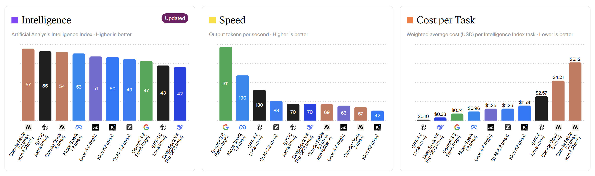
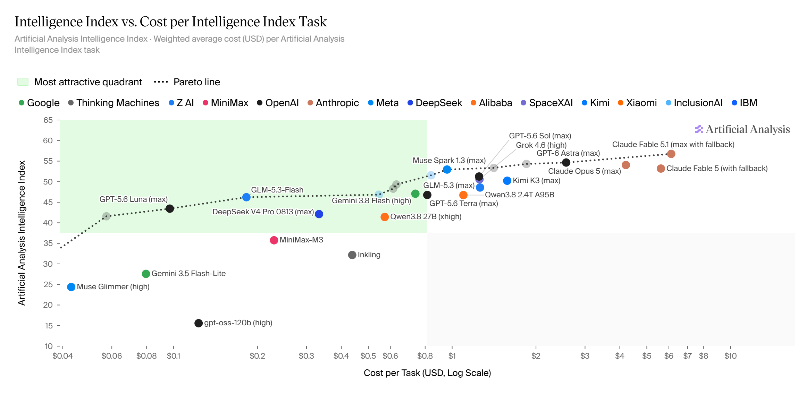
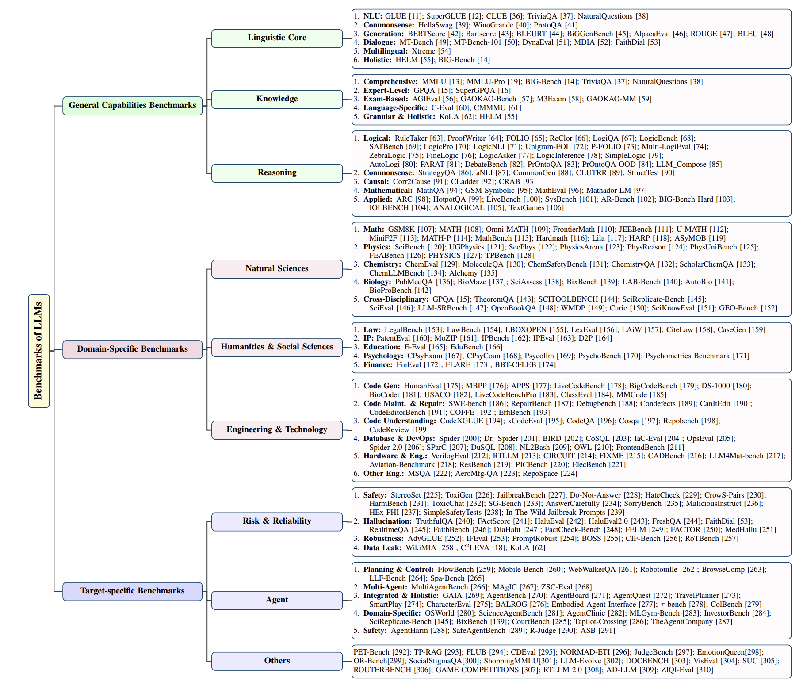
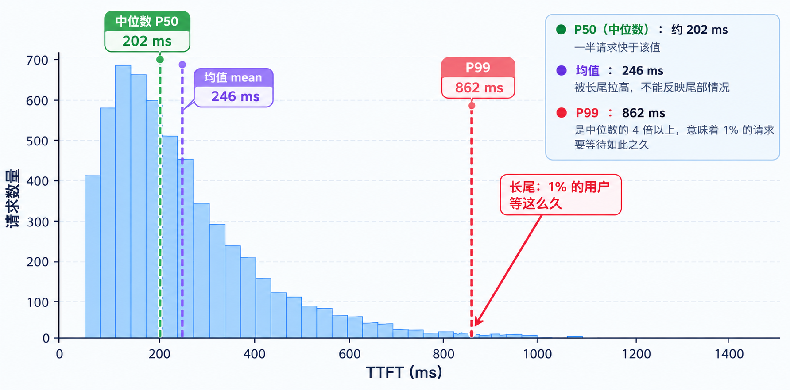

# 第 5 章 Introduction to Benchmark（Benchmark 入门）

&emsp;&emsp;前面几章分析了推理过程，区分了 Prefill 与 Decode 的计算与访存特征，指出二者分别更接近 compute-bound 与 memory-bound。但这些结论仍停留在定性层面，当要验证系统优化、对比不同引擎或规划部署容量时，还需要量化的性能数据作为依据。benchmark（基准测试）正是获得这类数据、并保证其可复现与可对比的方法。

## 1 本章学习目标

&emsp;&emsp;本课程的后续章节会从零实现 mini-sglang，并对 SGLang 进行深入分析。这一过程中，每一步改动是否有效，都需要用基准测试来量化验证。本章为此建立基础，学习目标如下：

- 明确延迟与吞吐两类指标，理解 TTFT、TPOT、ITL、吞吐、Goodput 各自的含义。
- 理解百分位数与尾延迟的意义，学会用分布而非均值来评估延迟。
- 掌握如何根据评测对象选择合适的 benchmark 数据集，以及如何设计一次可复现、可对比的测试。
- 能够使用 SGLang 提供的 benchmark 工具运行测试并解读结果。

## 2 benchmark 的简介及作用

### 2.1 简介

当你打开任何一个大语言模型（LLM）的评测网站或论文时，你首先看到的是什么？

   
   
图5.1 Deepseek-R1的基准性能

 

这是最直观、最普遍的评估形式。各大模型发布时，都会在一系列标准化基准上报告其得分。

当然，评估不能只看能力，成本和推理速度也是评价的关键维度。另外一个例子是来自于 [Artificial Analysis](https://artificialanalysis.ai/) 网站，从智能、推理速度、价格三个角度测评了不同模型：

   
   
图5.2 不同模型在 Artificial Analysis 网站上的性能排行榜

 

像 Artificial Analysis 这样的网站，就将模型的性能与每 token 的成本结合起来，绘制出帕累托前沿（Pareto Frontier）。这揭示了一个现实：一些前沿智能模型虽然强大，但价格昂贵；而一些排名稍后的模型，可能在性能和成本之间取得了更好的平衡。

   
   
图5.3 不同模型在 Artificial Analysis 网站上的性能 vs 成本对比

 

&emsp;&emsp;**评估**的核心问题是给定一个固定的模型，它到底有多“好”？ 这看似是一个简单的打分问题，实则是一个深刻且复杂的系统性工程。为了准确理解本文的讨论范围，需要先区分两类 benchmark：
- **模型能力 Benchmark（Model Capability Benchmark）**：评估模型本身的能力，通过 MMLU、GSM8K、HumanEval、SWE-bench 等标准化任务，衡量模型在知识理解、数学推理、代码生成等方面的输出质量。它关注的是模型“答得好不好”。
- **推理负载 Benchmark（Inference Workload Benchmark）**：评估已经部署的推理服务，在给定请求负载下测量 TTFT、TPOT、吞吐量、P99 延迟等工程指标。它关注的是模型“运行得快不快、稳不稳”，也常被称为 AI Infra Benchmark。

&emsp;&emsp;两类 benchmark 的评测对象、输入形式和指标都不同：前者向模型提供任务并检查答案质量，后者向推理服务发送请求并观察系统性能，不能将二者混为一谈。

> LLM 基准测试的内容不是我们关注的重点，因此在本章中，如果不特别说明， benchmark 一词指的是 `LLM 推理基准测试`，如果读者想了解更多关于 LLM 基准测试的内容，可继续阅读[评估与基准测试](https://github.com/datawhalechina/diy-llm/blob/main/docs/zh/chapter12/chapter12_%E8%AF%84%E4%BC%B0%E4%B8%8E%E5%9F%BA%E5%87%86%E6%B5%8B%E8%AF%95.md)

### 2.2 作用

&emsp;&emsp;benchmark 是一组可复现、可对比的测试，其作用体现在三个方面。

&emsp;&emsp;其一，**了解推理服务或硬件平台的性能边界和瓶颈特征**。对系统做了一处改动后，主观感受层面的变快了不足以说明问题，需要以同一份请求集在改动前后各测一次，用可量化的数据差异来判断收益。

&emsp;&emsp;其二，**量化评估推理服务优化措施的实际效果**。两个实现、两种硬件或两个版本之间孰优孰劣，只有在同等条件下运行同一份负载才有定论。

&emsp;&emsp;其三，**为生产环境的容量规划和资源配置提供数据支撑**。单张 GPU 能承载的并发数，以及在给定并发下的延迟水平，需要在部署前测得，而不是等线上反馈。

## 3 核心指标体系

&emsp;&emsp;推理服务的指标分为两类：一类描述单个请求的响应速度，称为**延迟**；另一类描述系统的总体产出能力，称为**吞吐**。二者回答不同的问题，不能相互替代。

### 3.1 延迟类指标

&emsp;&emsp;延迟指标有四个，它们在一次请求中所处的位置如下：

  
  
<em>图 5.4 一次请求的时间轴</em>

- **TTFT（Time to First Token）**：从请求发出到生成第一个 token 的时间，包含排队、Prefill 与首个 Decode 步。它体现用户从发出请求到看见首个输出之间的等待。
- **TPOT（Time Per Output Token）**：除首个 token 外，平均每个 token 的生成时间，主要由 Decode 阶段决定，反映生成速率。
- **ITL（Inter-Token Latency）**：相邻两个 token 之间的间隔。与 TPOT 描述同一现象，区别在于 TPOT 是均值，ITL 可逐次观测，更容易暴露生成过程中的抖动。
- **E2E Latency（端到端延迟）**：单个请求从发出到全部完成的总时长。

&emsp;&emsp;举例说明它们的关系。假设一个请求输入 1000 个 token，目标生成 200 个 token，测得 TTFT 为 250ms、TPOT 为 25ms，则除去首个 token 后剩余 199 个 token 的生成时间为：

$$\text{剩余生成时间} = 25 \times 199 = 4975 \text{ ms}$$

$$\text{E2E} = \text{TTFT} + \text{剩余生成时间} = 250 + 4975 = 5225 \text{ ms} \approx 5.2 \text{ s}$$

&emsp;&emsp;由上式可见，5.2s 中 Prefill 仅占 250ms，其余几乎全部来自 Decode。因此对**长输出**场景，优化 TPOT 收益更大；对**短输出、长输入**场景（如文档问答），TTFT 才是主要矛盾。这一结论与第 2 章对 compute-bound / memory-bound 的分析一致。

&emsp;&emsp;将 TPOT 换算为生成速率更直观：25ms/token 对应 40 token/s。行业内常以 100ms/token（即 10 token/s，约每分钟 450 个英文单词）作为生成速率的参考下限，低于此值阅读体验会明显下降。

### 3.2 吞吐类指标

&emsp;&emsp;吞吐指标有两个：

- **Throughput**：单位时间内的产出，以 `token/s` 或`request/s` 计，表示系统的总体效率。
- **Goodput（有效吞吐）**：在满足延迟约束前提下的吞吐。若规定 TTFT 不得超过 500ms，则超过此限的请求不计入，剩余的才计入 Goodput。单纯提高并发可以拉高 Throughput，但若延迟已全面超限，该吞吐并不具有实际价值。

&emsp;&emsp;由于并发提高会同时拉高延迟，近年业界更倾向以 Goodput 而非 Throughput 作为衡量标准。

&emsp;&emsp;延迟与吞吐存在此消彼长的关系：并发越高、batch 越大，GPU 利用率越高、吞吐越大，但每请求排队更久、TTFT 更差。因此二者必须同时观察。

  
  
<em>图 5.5 吞吐与 TTFT 随并发的变化（数据为构造示例）</em>

&emsp;&emsp;图 5.5 中蓝线为吞吐、橙线为 TTFT，横轴为并发数；图中数据为构造示例。蓝线前期上升较快、后期趋于饱和，橙线随并发数增加而上升。二者对照可见，并发并非越高越好，存在一个吞吐接近上限而 TTFT 尚未失控的区间。

&emsp;&emsp;不同场景对指标的敏感度不同，这与第 2 章讨论的场景分类对应：

| 场景 | 重点指标 |
|------|---------|
| 对话 / 聊天 | TTFT |
| 长文生成 / 写作 | TPOT |
| 离线批处理 / 评测 | 吞吐 |
| 实时语音 / Agent 多步推理 | TTFT 与尾延迟 |

## 4 如何设计 benchmark

&emsp;&emsp;设计 benchmark 的首要问题是明确你要测什么，其次才是选择对应的数据集和固定运行参数。

### 4.1 确定评测对象与数据集

&emsp;&emsp;本节讨论的是**推理负载 Benchmark**，而不是模型能力 Benchmark。模型能力 Benchmark 使用 MMLU、GSM8K、HumanEval、SWE-bench 等任务检查输出质量；推理负载 Benchmark 则使用真实或构造的请求集，向推理服务施加负载，测量延迟、吞吐与资源效率。前者回答“模型能力如何”，后者回答“推理系统性能如何”。

&emsp;&emsp;因此，数据集或请求集的选择应与评测对象对应：模型能力评测可选择综合知识、数学推理、代码生成等任务；推理服务评测则应选择与目标业务相符的请求分布，例如真实对话、固定长度请求、共享前缀请求或带工具调用的多轮 trace。两类 benchmark 的结果不能直接互相替代。

&emsp;&emsp;实际场景中，应先明确是在评测模型能力，还是在评测推理服务的工程性能，再根据评测对象选择对应的 benchmark：

  
  
<em>图 5.6 LLM 的代表性基准分类</em>

> 评测对象与数据集必须对应，用对话数据去衡量代码能力，得到的结果没有意义。

&emsp;&emsp;SGLang 官方也提供四个不同层次的 benchmark 工具，其覆盖范围对应引擎的不同层次：

  
  
<em>图 5.7 引擎分层与 benchmark 工具的覆盖范围</em>

| 工具 | 经 HTTP | 经调度器 | 用途 |
|------|--------|---------|------|
| `bench_serving` | 是 | 是 | 最接近线上场景，输出 TTFT / TPOT / ITL / 吞吐与分位数 |
| `bench_one_batch_server` | 是 | 是 | 单 batch 端到端延迟，含 HTTP 与调度开销 |
| `bench_offline_throughput` | 否 | 是 | 去除网络开销，测试最大吞吐 |
| `bench_one_batch` | 否 | 否 | 直接调用 kernel，用于 kernel 级分析 |

&emsp;&emsp;多数情况下使用 `bench_serving` 即可，其内置若干类请求集：

- **sharegpt**：真实对话数据，接近聊天场景。
- **random**：固定长度的随机请求，仅用于测试性能上限，不反映真实负载。
- **generated-shared-prefix**：带共享前缀的请求，用于度量前缀复用的收益。
- **agentic-trace**：多轮、带工具调用的 trace，对应 Agent 场景。

### 4.2 运行层面的参数固定

&emsp;&emsp;选定数据集后，运行层面的参数必须固定，否则结果不可比：
- 固定并发数或请求速率：根据场景选择固定并发（--max-concurrency）或固定速率（--request-rate）。
- 固定硬件、模型、精度与量化方式：FP16 和 INT8 的吞吐差异可能达到 2 倍以上。
- 充分预热：发送若干 dummy 请求，使 CUDA Graph、KV Cache 分配器进入稳态后再统计。
- 固定输出长度或长度分布：对比两个版本时，若输出长度分布不同，吞吐数字没有可比性。

## 5 如何解读 benchmark 结果

### 5.1 先看延迟，再看吞吐

&emsp;&emsp;benchmark 跑完之后，通常会得到一张结果表，解读 benchmark 结果只需要遵循以下原则：先看延迟是否满足要求，再看吞吐。具体可归纳为三点：

&emsp;&emsp;第一，先确定延迟目标（SLA，Service Level Agreement），即 TTFT 与 TPOT 分别需满足的上限。

&emsp;&emsp;第二，看分布而非只看均值，P50 与 P99 应同时观察。P99 代表最慢的那部分请求，是服务稳定性需要守住的线。

&emsp;&emsp;报告这些延迟指标时，均值无法反映分布的尾部。下图示意一批请求的 TTFT 分布，横轴为延迟、纵轴为请求数量：

  
  
<em>图 5.8 TTFT 分布与百分位数</em>

&emsp;&emsp;其中位数 P50 约 202ms，即一半请求快于该值；均值被长尾拉高至 246ms；而 P99 达到 862ms，为中位数的四倍以上，意味着 1% 的请求要等待如此之久。因此评估延迟应以分位数为准，尤其关注 P90、P99 这类尾延迟。SGLang 的 benchmark 工具默认输出 mean、median、P90、P95、P99。

&emsp;&emsp;第三，对比时逐项核对条件：模型、精度、硬件、并发、请求集、输出长度中任一项不一致，对比即失去意义。

### 5.2 常见误区

&emsp;&emsp;以下是在实际工作中最容易出现的解读错误：

1. 只看吞吐，不看延迟。并发 64 的吞吐可能高于并发 16，但 P99 TTFT 可能已从 300ms 恶化到 3s，无法满足实时业务的要求。
2. 只看均值，不看尾延迟。假设 100 个请求中有 99 个请求的 TTFT 都在 100～300ms，只有 1 个请求需要 2s，那么平均值可能仍然不高，但这个长尾请求已经明显影响了部分用户的体验。因此，在线服务通常需要同时关注 P50、P95、P99 等分位数。
3. 未预热或请求数过少，测得的是冷启动状态。第一次运行时可能包含 CUDA 初始化、模型加载、内存分配等额外开销。如果只发送几个请求就开始统计，结果很容易被这些一次性开销影响。通常应该先进行一段 warmup，再开始正式统计。
4. 将 `bench_one_batch` 的结果当作线上性能。 该工具绕过调度器和 HTTP 层，数值显著偏高，仅用于 kernel 级分析。例如，一个模型在 bench_one_batch 中测得 20ms，不意味着线上请求也只需要 20ms。真实服务还可能包含请求排队、调度、网络通信以及其他服务层开销。
5. 使用不同长度的负载进行吞吐对比。输入和输出长度会直接影响 Prefill 和 Decode 的计算量。如果一个测试平均输入 500 tokens、输出 100 tokens，另一个测试平均输入 4000 tokens、输出 500 tokens，那么即使两者运行在相同 GPU 上，得到的 token/s 也不能直接比较。因此，比较两个优化方案时，应尽量使用相同的请求集和相近的输入输出长度分布。
6. 跨模型比较 token/s 时忽略了分词器差异。不同模型使用的 tokenizer 不同，同一段文本可能被切分成不同数量的 token。例如，同样处理 1000 个中文字符，模型 A 可能产生 1000 tokens，而模型 B 可能产生 1500 tokens。此时直接比较两者的 token/s，不能简单理解为模型 A 或 B 的实际处理速度更快。
7. 只看 token/s 而不看 goodput。若 SLA 规定 TTFT 不得超过 500ms，而当前配置下 30% 的请求已超限，这部分请求虽贡献了吞吐，却不具备业务价值。Goodput 只统计满足延迟约束的请求，更能反映系统的真实服务能力。
8. 仅在单机测量就下结论，忽略了多卡多机时的通信开销和互联拓扑差异。单机单卡不存在通信开销，但多卡并行（Tensor Parallelism）需要 NVLink/RDMA 传输中间激活值，多机场景还涉及网络延迟。单机测得的最优并发数（如 16）直接外推到 8 卡部署，往往会导致延迟恶化。
9. 未固定随机种子，导致 kernel 执行路径不一致、结果产生波动。某些采样 kernel（如 top-p sampling）依赖随机数，不同的随机种子可能触发不同的执行分支或内存访问模式。两次测试若未固定种子，结果波动可能达到 5% 以上，无法判断差异来自优化还是噪声。

## 6 总结与测试题

### 6.1 课程总结

&emsp;&emsp;本章介绍了 benchmark 的作用、核心指标体系、设计方法与解读方式。要点有二：一是区分延迟（TTFT / TPOT / ITL / E2E）与吞吐（Throughput / Goodput）两套指标，并以分位数而非均值评估延迟；二是认识到 benchmark 的价值在于可比性。解读结果时需先确定延迟目标，再观察分布并逐项核对条件。这套方法将用于后续章节中对 mini-sglang 与 SGLang 的性能评估。

### 6.2 测试题

1. TTFT、TPOT、ITL 分别衡量什么？为何长输出场景下优化 TPOT 比优化 TTFT 收益更大？

> 提示：结合 Prefill 与 Decode 的分工思考。

2. 均值与 P99 相差一个数量级说明了什么？为何服务稳定性要关注 P99 而非均值？

3. 某聊天场景中，用户反馈「发出请求后长时间无响应，但一旦开始输出便很快」。该现象对应哪个指标异常？优化方向是什么？

4. 为何跨模型直接比较 token/s 不可信？

> 提示：考虑分词器。

5. 评测一个以数学推理为主的语言模型与一个语音合成模型，应分别选择哪类 benchmark？为何不能共用同一份数据集？

6. 列出一次可复现、可对比的 benchmark 所需的注意点。

> 提示：至少覆盖并发、硬件、预热、输出长度，以及需要报告的指标。

## 参考资料

- [SGLang Documentation](https://docs.sglang.io/docs/developer_guide/benchmark_and_profiling#benchmark)
- [diy-llm 第十二章：评估与基准测试](https://github.com/datawhalechina/diy-llm/blob/main/docs/zh/chapter12/chapter12_%E8%AF%84%E4%BC%B0%E4%B8%8E%E5%9F%BA%E5%87%86%E6%B5%8B%E8%AF%95.md)
- [Response Times: The 3 Important Limits](https://www.nngroup.com/articles/response-times-3-important-limits/)
- [GSM8K: Training Verifiers to Solve Math Word Problems](https://arxiv.org/abs/2110.14168)
- [Measuring Massive Multitask Language Understanding (MMLU)](https://arxiv.org/abs/2009.03300)
- [NVIDIA NIM LLMs Benchmarking](https://docs.nvidia.com/nim/benchmarking/llm/latest/overview.html)
- [浅谈 LLM 推理基准测试](https://rudeigerc.dev/posts/llm-inference-benchmarking/)
- [A Survey on Large Language Model Benchmarks](https://arxiv.org/abs/2508.15361v1)
- [DeepSeek-R1: Incentivizing Reasoning Capability in LLMs via Reinforcement Learning](https://arxiv.org/abs/2501.12948)
