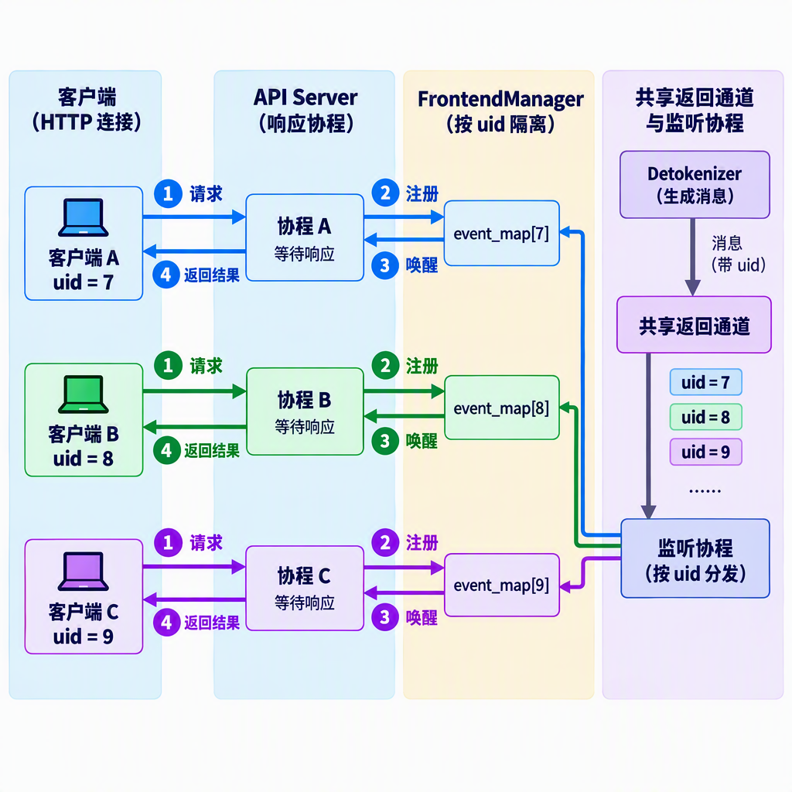
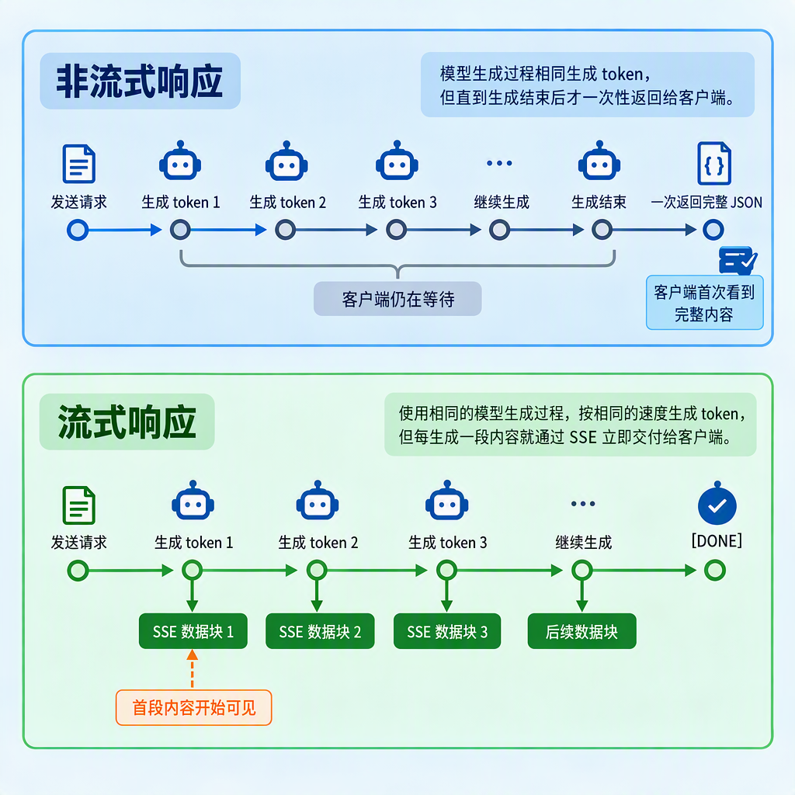
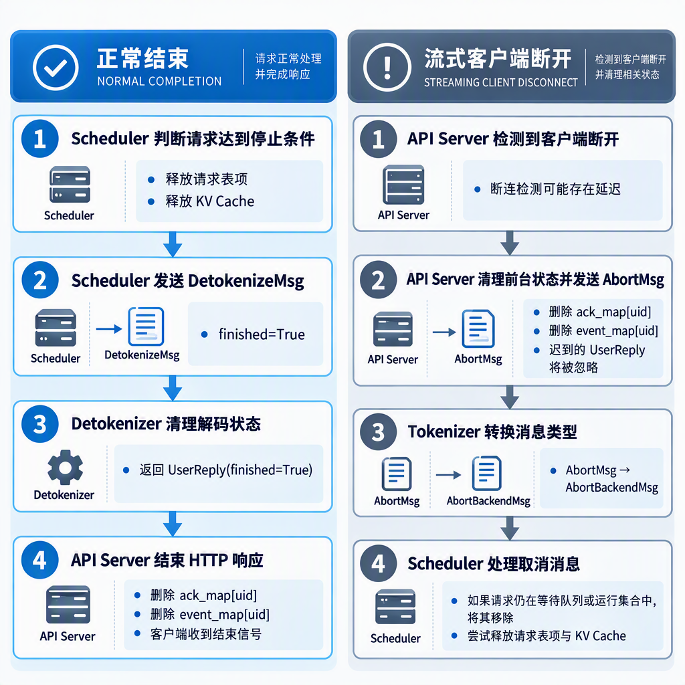

# 第 5 章 HTTP 服务与并发

前面我们为生成程序补上了模型前向、采样循环和 KV Cache。现在，我们已经可以在 Python 中输入文本并得到模型输出。但这段程序还不能作为在线服务供其他应用调用：它没有稳定的网络接口，也无法分别管理多条并发请求，更不能通过网络逐步返回生成结果。

第 2 章曾沿着一条请求走过 API Server、Tokenizer、Scheduler、Engine 和 Detokenizer。本章不再重复整条链路，而是重点分析位于请求入口的 API Server，讨论一个更具体的问题：**当多个客户端同时发起 HTTP 请求时，API Server 如何提交任务、等待结果，并把交错返回的增量文本送回正确的连接？**

我们会先明确从本地函数到在线服务还缺少哪些能力，再分析 mini-sglang 如何用异步任务、请求标识和事件通知管理并发连接。随后，我们将比较流式与非流式响应，并分析请求取消和状态清理中尚未覆盖的路径。本章关注服务层如何接收并管理多个并发请求，至于后端如何将这些请求组成 batch，以及怎样调度 GPU，将在下一章展开。

## 1 本章学习目标

读完本章后，你应该能够：

- 说明本地生成函数与 HTTP 推理服务之间还缺少哪些能力；
- 解释 API Server 为什么不应直接在事件循环中执行模型计算；
- 说明 mini-sglang 如何通过进程内唯一的 uid、结果缓冲区和事件通知隔离并发请求；
- 区分 HTTP 并发、计算并行和后端批处理；
- 比较流式与非流式响应的处理方式，说明 SSE 的作用；
- 描述请求正常结束或客户端断开时的状态清理过程，并指出当前实现尚未覆盖的路径。

完整的路由实现、消息传递和并发测试将在配套代码实践中完成，Scheduler 的组批策略则留到下一章。

## 2 从函数调用到服务接口

假设上一章已经得到一个可以完成生成的函数：

```python
def generate(prompt: str, max_tokens: int) -> str:
    ...
```

它解决了怎样得到模型输出，却没有解决怎样让其他程序稳定地使用这项能力。要把它变成在线服务，至少还需要补上四类能力。

- **接口协议**：约定访问地址、请求字段、响应结构，并检查输入是否合法；
- **请求标识**：为每条请求分配当前 API Server 进程内唯一的 uid，将返回结果与客户端连接对应起来；
- **异步等待**：后端计算期间让出执行权，使 API Server 仍能接收其他请求；
- **生命周期管理**：处理正常结束、客户端断开和状态清理。

流式输出建立在这些能力之上：后端每产生一段新增文本，API Server 就通过仍然打开的 HTTP 连接把它返回给客户端。

### 2.1 用请求模型约定输入

mini-sglang 使用 FastAPI 提供 HTTP 服务，并用 Pydantic 请求模型描述输入。FastAPI 是用于编写 HTTP 接口的 Python Web 框架；Pydantic 负责描述和校验请求数据。这里的“请求模型”不是执行推理的大语言模型，而是一个继承 Pydantic `BaseModel` 的 Python 类，用来声明 HTTP 请求包含哪些字段、字段采用什么类型以及默认值是什么。下面只保留本章关心的字段：

```python
class OpenAICompletionRequest(BaseModel):
    model: str
    prompt: str | None = None
    messages: list[Message] | None = None
    max_tokens: int = 16
    stream: bool = False
```

请求模型明确了服务可以接收什么。客户端既可以传入普通字符串 `prompt`，也可以用 `messages` 表示多轮对话；`max_tokens` 控制最大生成长度；`stream` 决定结果是逐步返回还是最后一次性返回。

JSON 是 HTTP 接口常用的文本数据格式。FastAPI 会根据请求模型解析 JSON，并在字段类型不匹配时返回校验错误。这样，网络请求先被转换成结构化的 Python 对象，后续代码不必反复从原始 JSON 中读取字段。

mini-sglang 提供 `/v1/chat/completions` 等 OpenAI 风格接口，也就是采用相近的访问路径、请求字段和响应结构，便于已有客户端接入。不过，接口形式相似不等于已经覆盖完整协议。当前教学实现返回的 token 用量仍是占位值，`model` 字段不会改变服务启动时加载的模型，`n`、`stop` 等部分参数虽然可以出现在请求中，却尚未传入后端；结束原因也没有区分长度上限与序列结束标记（EOS）。理解这一点，可以避免把“能够调用”误认为“所有行为都已完全兼容”。

请求模型定义了外部请求的形式。接下来，还需要把这些外部字段转换成推理后端能够处理的内部消息。

### 2.2 在 HTTP 与推理后端之间建立边界

收到请求后，API Server 不会直接执行模型前向，而是完成一次从外部协议到内部消息的转换：

```python
uid = state.new_user()
msg = TokenizeMsg(
    uid=uid,
    text=prompt,
    sampling_params=sampling_params,
)
await state.send_one(msg)
```

这几行代码做了三件事：

1. 为请求分配当前进程内的 uid，并在 API Server 中创建对应的结果缓冲区和通知对象；
2. 将文本和采样参数封装成内部使用的 `TokenizeMsg`；
3. 通过异步 ZMQ 通信通道把消息交给 Tokenizer Worker。

ZMQ（ZeroMQ）是用于进程间消息通信的工具。这里的异步 ZMQ 通信通道负责在 API Server 与独立 Worker 之间传递消息，不要求两端直接调用彼此的 Python 函数。Worker 指负责某一类工作的执行进程，例如 Tokenizer Worker 负责把文本转换成 token IDs。

从这里开始，HTTP 请求处理协程只需要等待返回消息。这里的“协程”是由事件循环调度的异步执行单元，执行到 `await` 时，它可以暂停并让其他任务继续运行。事件循环则持续检查哪些异步任务已经可以继续执行，并在这些任务之间切换。分词、调度和模型计算都在后端进程中完成，不会以同步函数调用的方式阻塞 API Server 的事件循环。

这个边界很重要。HTTP 层负责“请求怎样进来、结果怎样出去”，后端负责“模型怎样计算”。如果两者耦合在同一个阻塞调用中，一条生成时间较长的请求就可能拖慢其他连接；分开以后，API Server 可以在等待后端结果时继续处理新的网络事件。

## 3 API Server 如何管理并发请求

假设请求 A 已经提交，正在等待下一个 token。此时请求 B 到达，API Server 应当能够立即解析并提交 B，而不是一直等 A 生成完。这里需要同时解决两个问题：等待时怎样让出执行权，以及返回消息怎样找到各自的请求。

### 3.1 `async` 不会自动消除阻塞

先看一种有问题的写法：

```python
@app.post("/generate")
async def generate(req: GenerateRequest):
    text = blocking_generate(req.prompt)
    return {"text": text}
```

虽然路由使用了 `async def`，但 `blocking_generate` 在执行期间没有任何 `await`，仍会持续占用当前线程。事件循环无法在这段计算中切换到其他协程，新连接就可能长时间得不到处理。

因此，异步并发的关键不是给函数加上 `async`，而是把耗时工作交给独立后端，并在等待网络或消息时通过 `await` 让事件循环处理其他任务。mini-sglang 的 HTTP 协程等待的是后端消息，而不是在 API Server 中执行模型计算。

### 3.2 用 uid 隔离请求状态

多个请求共享同一个 API Server，也共享从 Detokenizer 返回结果的通道。`FrontendManager` 是 API Server 中负责请求编号、结果缓存和通知管理的对象。为了避免结果串线，它为每条请求分配在当前进程内递增且不重复的 uid，并维护两组按 uid 索引的状态：

```python
ack_map: dict[int, list[UserReply]]
event_map: dict[int, asyncio.Event]
```

`UserReply` 是 Detokenizer 返回给 API Server 的回复消息，其中包含请求 uid、本轮新增文本 `incremental_output`，以及表示请求是否结束的 `finished`。`ack_map[uid]` 保存已经到达、尚未被该请求取走的 `UserReply`；`event_map[uid]` 用来通知负责当前请求的等待协程“有新结果到了”。

两者不能简单地相互替代。`asyncio.Event` 可以理解为一个异步通知标志，`set()` 将其设为“有新结果”，`wait()` 让协程等待这个通知，`clear()` 则重置标志。它本身不携带 `UserReply`，如果只有事件，等待协程醒来后只能知道“有新结果”，却无法取得具体内容。列表能够保存数据，却不能主动通知等待者；如果只有列表，等待协程就只能不断轮询。一个负责存放消息，一个负责唤醒等待任务。

uid 用来把外部连接与内部请求对应起来，它会随消息经过 Tokenizer、Scheduler 和 Detokenizer，最终再回到 API Server。只要这条标识在各模块间保持不变，API Server 就能判断每段结果属于哪一个客户端。服务重启后，计数器会重新开始，因此这里的 uid 并不是跨进程或跨服务实例的全局标识。

### 3.3 从共享通道中分发结果

API Server 会启动一个长期运行的 `listen` 协程，统一接收 Detokenizer 返回的 `UserReply`。它不负责把内容直接写入 HTTP 连接，而是先按 uid 将消息放入对应缓冲区，再唤醒对应请求：

```python
async def listen(self):
    while True:
        reply = await self.recv_tokenizer.get()
        for reply in _unwrap_msg(reply):  # 将单条或批量回复统一展开
            if reply.uid not in self.ack_map:
                continue
            self.ack_map[reply.uid].append(reply)
            self.event_map[reply.uid].set()
```

可以把这个过程概括为：

<div align="center">
  
  <p><em>图 5.1 并发请求与返回消息分流</em></p>
</div>

每条请求对应的响应协程则等待在 `await event.wait()`。结果尚未到达时，它会暂停，让事件循环处理其他任务；`listen` 设置对应事件后，它才恢复执行并取走缓冲区中的消息。

假设返回顺序是 `A1 → B1 → B2 → A2`。这些消息虽然在共享通道中交错出现，A 和 B 的响应协程却只读取自己的缓冲区，因此两个客户端仍会看到顺序正确的内容。

### 3.4 并发、并行与批处理不是一回事

到这里，API Server 已经能够同时管理多个尚未完成的请求，但这并不等于所有请求正在并行计算。

- **并发**表示系统在同一时间段内管理多项任务。事件循环可以在不同协程之间切换，即使它只运行在一个线程上；
- **并行**表示多项工作在同一时刻真正执行，例如多个进程运行在不同 CPU 核心，或多个 GPU 工作进程协同计算；
- **批处理**表示把多条请求的数据组织到同一次模型执行中。

API Server 可以并发接收十条请求，但后端仍可能逐条处理它们。反过来，一个离线程序也可以在没有 HTTP 的情况下执行静态 batch，也就是在执行前固定一组请求，在这一批结束前不动态加入新请求。因此，服务层并发解决的是“不要让一个连接阻塞其他连接”，它不会自动提高 GPU 利用率。

下一章的 Continuous Batching 将处理另一个层次的问题：请求到达和结束的时间不同，Scheduler 怎样动态选择当前可运行的请求，并让它们共享模型执行。

## 4 流式与非流式响应

后端会逐步产生 token，Detokenizer 再把 token 转换成可直接返回给客户端的增量文本。API Server 收到这些 `UserReply` 后，可以选择两种返回方式：先收集完整结果再一次性返回，或者边收到边返回。

### 4.1 非流式：收集完整结果

非流式请求会持续等待同一 uid 的回复，将增量文本依次拼接：

```python
full_content = ""
async for reply in state.wait_for_ack(uid):
    full_content += reply.incremental_output
    if reply.finished:
        break
```

收到结束标记后，API Server 再把完整文本放进一个普通 JSON 响应。这里的“非流式”只描述客户端最后看到结果的方式，并不表示服务端使用同步阻塞调用。等待回复时，当前协程仍然会让事件循环处理其他任务。

### 4.2 流式：通过 SSE 逐步返回

如果请求设置了 `stream=true`，mini-sglang 会使用 SSE（Server-Sent Events，服务器发送事件）保持 HTTP 连接处于打开状态，并连续发送数据块。下面省略了与本节无关的字段，只展示事件结构：

```text
data: {"choices":[{"delta":{"content":"KV Cache"},"finish_reason":null}]}

data: {"choices":[{"delta":{},"finish_reason":"stop"}]}

data: [DONE]

```

每个 SSE 事件以 `data:` 开头，并用空行与下一个事件分隔。`delta` 表示本次新增内容，`finish_reason` 表示结束原因。结束时，mini-sglang 先发送 `finish_reason="stop"` 的数据块，再发送 `[DONE]`，标记流式响应的数据已经发送完毕。首个数据块还会携带 `role="assistant"`，声明后续文本来自助手角色，并可能同时包含第一段文本，不应假定角色和文本一定分成两次发送。

SSE 是从服务端到客户端的单向数据流，正好符合推理服务的交互方式：客户端提交一次请求，服务端持续返回增量文本。它仍然使用普通 HTTP，不需要额外建立双向通信协议。当前实现的数据块使用 `cmpl-{uid}` 作为 id、`text_completion.chunk` 作为 object，这也是前文将其称为“OpenAI 风格接口”而不是完整兼容实现的原因之一。

在代码中，FastAPI 的 `StreamingResponse` 是一种可以分多次写入内容的响应类型，它接收一个异步生成器。异步生成器可以多次产生结果：每执行一次 `yield`，就向客户端发送一个数据块；等待下一条后端消息时，则通过 `await` 暂停，让事件循环继续处理其他任务。

```python
return StreamingResponse(
    state.stream_with_cancellation(
        state.stream_chat_completions(uid),
        request,
        uid,
    ),
    media_type="text/event-stream",
)
```

流式返回让用户更早看到已经生成的内容，缩短了用户等待首段内容的时间，改善了交互体验。它不会减少模型前向次数，也不会直接提升后端吞吐。流式与非流式的主要区别发生在结果返回阶段，而不是模型计算阶段。

<div align="center">
  
  <p><em>图 5.2 流式与非流式响应时间线</em></p>
</div>

## 5 请求结束、取消与状态清理

服务不能只处理“成功生成并正常返回”这一条路径。客户端可能中途关闭连接，网络也可能断开。如果 API Server 停止发送数据后不再通知后端，Scheduler 仍可能继续推进这条请求，KV Cache 也会继续占用显存。

### 5.1 正常结束

Scheduler 判断请求达到停止条件后，会删除其中保存的请求记录、释放缓存资源，并发送带有 `finished=True` 的 `DetokenizeMsg`。Detokenizer 收到该标记后删除对应的解码状态，再向 API Server 发送 `UserReply(finished=True)`。API Server 最终据此结束响应，并删除 `ack_map[uid]` 和 `event_map[uid]`。

因此，一条正常请求在 API Server 中经历的过程可以写成：

```text
创建 uid 与等待状态
    → 提交内部消息
    → 接收并返回增量结果
    → 收到 finished
    → 结束响应并删除结果缓冲区与通知对象
```

状态清理不是可选优化。如果已经完成的 uid 长期留在映射表中，服务运行越久，过期状态就会积累得越多。

### 5.2 流式客户端断开与协作式取消

对于流式请求，mini-sglang 会在输出过程中检查客户端是否断开；当 Web 服务器取消正在处理该连接的异步任务时，也会进入相同的取消处理。源码中的 `abort_user` 会先固定等待 0.1 秒，再删除该 uid 在 API Server 中的结果缓冲区和通知对象，并发送 `AbortMsg`：

```text
客户端断开
    → API Server 清理结果缓冲区和通知对象，并发送 AbortMsg
    → Tokenizer 将其转换为 AbortBackendMsg
    → Scheduler 处理取消消息；如果请求仍在等待队列或运行集合中，
      则将其移除并尝试释放相应资源
```

这是协作式取消，而不是立即中断。协作式取消不会强制终止正在执行的代码，而是发送取消消息，由各组件在处理到该消息时主动停止后续工作。取消消息还要经过异步通信通道、Tokenizer 和 Scheduler；已经提交给 GPU 的计算任务也不会在收到消息的瞬间停止，因此取消后仍可能产生迟到的 token。Scheduler 如何在等待请求和运行请求中定位 uid，将在下一章展开。

取消后仍可能有已经发出的回复到达 API Server。此时 `listen` 会发现 uid 已不在 `ack_map` 中，直接忽略这条迟到消息，防止已经取消的请求继续在 API Server 中积累返回结果。

<div align="center">
  
  <p><em>图 5.3 请求正常结束与取消流程</em></p>
</div>

### 5.3 当前实现尚未完整处理的异常情况

下面几项不是理解服务主流程的前置知识，但反映了当前参考实现仍然存在的功能限制。mini-sglang 重点展示了流式请求的取消主路径，但还不能把这条路径理解成“所有组件的状态都已完整回收”。

首先，非流式 `/v1/chat/completions` 没有显式检查客户端是否断开。客户端提前离开后，后端通常仍会继续生成，API Server 中的结果缓冲区和通知对象要等请求正常完成后才有机会清理。

其次，Tokenizer Worker 收到 `AbortMsg` 后，只把它转换成 `AbortBackendMsg` 交给 Scheduler，没有同时通知 `DetokenizeManager` 删除该 uid 的解码状态。被取消的请求通常不会再收到 `finished=True`，因此 Detokenizer 中的状态可能残留。这是当前参考实现中的清理缺口。

还有一类失败发生在结果返回之前。例如，Scheduler 发现输入长度已经达到模型上限时，当前实现会记录警告并丢弃请求，却不会向 API Server 返回错误或 `finished=True`。HTTP 协程可能一直等待，对应的结果缓冲区和通知对象也无法沿正常路径清理。

这些现象说明，完整的生命周期不仅需要 `AbortMsg`，还需要统一的错误回复、所有组件都能识别的结束或错误标记，以及确保异常情况下也会执行清理的机制。指出这些缺口，是为了区分“理解服务主路径”和“能够在生产环境中稳定处理各种异常”。

### 5.4 慢客户端与结果积压

如果后端产生结果的速度长期高于客户端读取速度，`ack_map[uid]` 中尚未消费的回复可能持续增加。这就是生产者快于消费者带来的背压问题。

`StreamingResponse` 在写入 HTTP 连接时会受到客户端读取速度影响，但 Scheduler 不会因此降低生成速度：独立的 `listen` 协程仍可从 ZMQ 接收结果并追加到列表。换句话说，当前实现没有把“客户端来不及读取”这一情况反馈给 Scheduler。单条请求最终会受到 `max_tokens` 和模型最大长度限制，但并发请求很多或输出很长时，积压仍可能占用大量内存。真实服务还需要限制单连接缓冲区、设置超时，或在客户端持续落后时取消请求。

## 6 总结与测试题


### 6.1 课程总结

本章为生成程序补上了服务层。API Server 使用请求模型定义外部接口，将 HTTP 请求转换成带 uid 的内部消息，再通过异步通信通道交给后端，而不是在事件循环中直接执行模型。

API Server 依靠三项机制管理并发请求：uid 区分请求，`ack_map` 保存尚未消费的结果，`event_map` 在结果到达时唤醒对应协程。一个共享的监听协程接收所有返回消息，再根据 uid 将结果发送给对应请求。

非流式响应先收集完整文本，流式响应则通过 SSE 逐步返回新增内容。请求结束后，各组件都应该清理与 uid 关联的状态；客户端断开时，还需要把取消信号传到后端。当前 mini-sglang 已展示流式请求的协作式取消主路径，但非流式断连、Detokenizer 取消清理和部分错误回复仍未得到完整处理。

到这里，服务层已经能够同时管理多个并发请求，但它并不决定 GPU 如何共同处理这些请求。下一章将进入 Scheduler，讨论 Continuous Batching 如何动态组织模型执行。

### 6.2 测试题

1. 为什么把同步生成函数放进 `async def` 路由后，仍然可能阻塞其他连接？
2. mini-sglang 为什么让 API Server 发送内部消息，而不是直接调用模型？
3. `ack_map` 和 `event_map` 分别承担什么职责？为什么只使用其中一个不够？
4. 多条回复在共享通道中交错到达时，API Server 如何避免把结果发错客户端？
5. HTTP 并发、计算并行和后端批处理有什么区别？
6. 流式返回改善了什么指标或体验？为什么它不会直接减少模型计算量？
7. mini-sglang 当前的流式取消路径经过哪些组件？为什么收到取消消息不等于计算会立即停止？当前实现还有哪些尚未完整处理的异常情况？


## 参考资料

- [mini-sglang 官方仓库（参考提交 9a91cfa）](https://github.com/sgl-project/mini-sglang/tree/9a91cfafe754aa85daee49998176275667eb58f2)
- [mini-sglang：系统架构与请求生命周期](https://github.com/sgl-project/mini-sglang/blob/9a91cfafe754aa85daee49998176275667eb58f2/docs/structures.md)
- [mini-sglang：API Server、并发状态与流式返回](https://github.com/sgl-project/mini-sglang/blob/9a91cfafe754aa85daee49998176275667eb58f2/python/minisgl/server/api_server.py)
- [mini-sglang：前台与后端消息定义](https://github.com/sgl-project/mini-sglang/tree/9a91cfafe754aa85daee49998176275667eb58f2/python/minisgl/message)
- [mini-sglang：Tokenizer Worker 与取消消息转换](https://github.com/sgl-project/mini-sglang/blob/9a91cfafe754aa85daee49998176275667eb58f2/python/minisgl/tokenizer/server.py)
- [mini-sglang：Scheduler 中的取消与资源释放](https://github.com/sgl-project/mini-sglang/blob/9a91cfafe754aa85daee49998176275667eb58f2/python/minisgl/scheduler/scheduler.py)
- [FastAPI：StreamingResponse](https://fastapi.tiangolo.com/advanced/custom-response/#streamingresponse)
- [MDN：Server-Sent Events](https://developer.mozilla.org/en-US/docs/Web/API/Server-sent_events)

