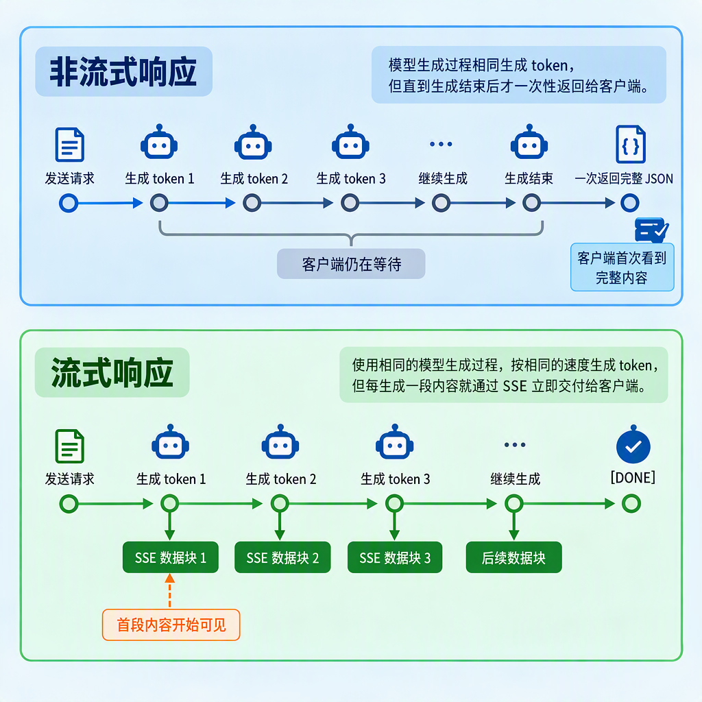

# 第 5 章 HTTP 服务与并发

前面我们为生成程序补上了模型前向、采样循环和 KV Cache，可以在 Python 中输入文本并得到模型输出。接下来，如果想让网页、手机应用或另一台机器上的程序使用这个模型，就需要把生成程序作为一个服务运行起来。

本篇先从 HTTP、客户端和服务端讲起，再跟随一次请求，看看问题怎样进入推理系统、回答怎样返回用户。随后讨论多人同时使用服务时如何区分请求，以及流式输出和取消请求分别解决什么问题。具体的 Python 实现放在配套的[代码走读](./第5章_HTTP服务与并发_代码.md)中；后端如何组 batch、调度 GPU，则留到下一章。

## 1 本章学习目标

读完本章后，你应该能够：

- 解释客户端、服务端与 HTTP 的关系，以及本地生成函数为什么需要服务化；
- 读懂一条请求的地址、方法、请求头和请求体，说明 `messages` 与 `stream` 的含义；
- 描述请求从客户端经过推理系统，再返回用户的大致流程；
- 说明并发需求、请求隔离，以及并发、并行和批处理的区别；
- 比较流式与非流式响应，解释请求结束、取消和资源清理的作用。

## 2 从本地程序到 HTTP 服务

### 2.1 客户端与服务端分别做什么

在自己的 Python 程序里调用生成函数时，调用者能够直接拿到函数和模型对象。但网页里的聊天界面通常运行在用户设备上，模型则加载在另一台有 GPU 的机器上。我们需要一种跨进程、跨机器的交互方式，让前者把问题交给后者，再拿回回答。

**客户端**是发起请求的程序，例如聊天网页、手机应用或命令行脚本。**服务端**是接收请求、执行任务并返回结果的程序。它们描述的是交互中的角色，不限定设备类型：一台服务器上的业务程序，也可以作为客户端调用推理服务。

将生成程序服务化，就是让它持续运行，加载好模型，并通过约定的网络接口接受外部调用。这样，多个应用可以共享同一套模型服务，不必在每个应用里安装模型或加载一份权重。

### 2.2 HTTP 约定怎样提出请求和返回响应

HTTP（Hypertext Transfer Protocol，超文本传输协议）是一种应用层通信协议。它约定客户端怎样发出请求，以及服务端怎样返回响应。虽然名字里有“超文本”，HTTP 同样可以传送 JSON 数据、图片和生成的文本。

一次基本交互是：客户端向某个地址发送请求，服务端处理后返回响应。HTTP 规定消息的通用结构；具体哪个路径表示“生成回答”、哪些 JSON 字段表示输入内容，则由服务接口约定。HTTP 本身不会运行模型，也不会决定 GPU 如何执行任务。

以 `http://localhost:1919/v1/chat/completions` 为例，`http` 是协议，`localhost` 是客户端当前所在机器，`1919` 是服务监听的端口，`/v1/chat/completions` 是接口路径。如果服务在另一台机器上，客户端要使用那台机器可访问的地址。

**检查一下：**调用本地函数与请求远端服务有什么区别？客户端一定是浏览器吗？HTTP 是否规定了模型如何计算？

## 3 读懂一条请求和响应

### 3.1 请求里包含哪些信息

下面用简化的 HTTP/1.1 消息展示一次聊天请求。它是帮助阅读的示意，省略了内容长度等传输细节；可运行的命令放在代码篇。

```http
POST /v1/chat/completions HTTP/1.1
Host: localhost:1919
Content-Type: application/json

{
  "model": "Qwen/Qwen3-0.6B",
  "messages": [
    {"role": "user", "content": "什么是 KV Cache？"}
  ],
  "max_tokens": 128,
  "stream": false
}
```

第一行中的 `POST` 是请求方法，在这个接口中表示提交一次生成任务；路径说明调用哪个接口。接下来的 `Host` 和 `Content-Type` 是请求头，分别说明目标主机与端口，以及请求体采用 JSON 格式。空行后的 JSON 是请求体，承载这次生成任务的输入和参数。

| 请求体字段 | 表达的含义 |
| --- | --- |
| `model` | 客户端期望使用的模型名称；服务是否能据此切换模型，取决于具体实现 |
| `messages` | 按对话顺序排列的消息列表，可以包含历史对话和本次提问 |
| `role` | 消息的角色，如用户 `user`、助手 `assistant` 或系统指令 `system` |
| `content` | 这条消息的文本内容 |
| `max_tokens` | 本次最多生成多少个 token，不是字符数，也不是保证生成这么多 |
| `stream` | 是否逐步返回结果；`false` 表示收集完再返回，`true` 表示流式返回 |

这里的 `messages` 是对话内容列表，与 HTTP 层的“请求消息”不是一个概念。多轮对话通常需要客户端把相关历史一起放进列表；不能因为上次调用过这个接口，就假定服务端会自动记住那段对话。有些接口也接受 `prompt` 字符串来表示普通文本输入。

### 3.2 响应里包含哪些信息

当 `stream` 为 `false` 时，服务端可以在生成结束后返回一个 JSON 响应。下面同样省略了不影响理解的字段：

```http
HTTP/1.1 200 OK
Content-Type: application/json

{
  "choices": [{
    "message": {
      "role": "assistant",
      "content": "KV Cache 会保存之前 token 的 Key 和 Value。"
    },
    "finish_reason": "stop"
  }]
}
```

`200` 是 HTTP 状态码，表示这次 HTTP 请求成功。响应头说明返回的是 JSON；响应体中的 `message` 给出助手回答，`finish_reason` 描述生成结束原因。请求格式不合法或服务发生错误时，服务端应返回相应的错误状态和说明。HTTP 状态码与模型回答是否正确是两回事。

**检查一下：**你能分别找到接口路径、数据格式和提问内容吗？`messages` 如何表达多轮对话？`stream` 改变的是输入内容还是结果返回方式？

## 4 跟随请求走过推理系统

知道了外部接口的样子，再回到第 2 章介绍的模块分工。一条请求从发送到展示给用户，大致经过下面这些阶段：

| 阶段 | 谁负责 | 发生什么 |
| --- | --- | --- |
| 发出请求 | 客户端 | 将问题、对话历史和生成参数放进 HTTP 请求 |
| 接收与检查 | API Server | 解析请求、检查输入、登记请求归属，并交给后端 |
| 文本编码 | Tokenizer | 将输入文本或应用聊天模板后的对话转换为 token IDs |
| 排队与调度 | Scheduler | 决定何时处理请求，以及哪些请求一起参与计算 |
| 生成 token | Engine | 执行模型前向与采样，逐步产生后续 token |
| 还原文本 | Detokenizer | 把生成的 token 转成可展示的增量文本 |
| 返回回答 | API Server 与客户端 | 将结果送回对应请求，客户端再展示给用户 |

这里按职责划分阶段，并不表示每一行都必须单独占用一个进程。生成期间，“模型产生 token → 还原文本 → 返回新增内容”可以重复多次；非流式请求则先收集这些文本，等结束后再返回完整回答。

API Server 负责网络入口与出口，后端负责分词、调度和模型计算。生成往往比解析一次 HTTP 请求耗时得多，因此前台在等待后端时，应当还能接收新请求、处理其他连接。这就引出了并发。

**检查一下：**谁负责把文本变成 token？谁决定当前计算哪些请求？产生一个 token 是否等于客户端已经收到了一段可显示文本？

## 5 多个人同时使用服务时怎么办

### 5.1 并发需求从哪里来

一个聊天应用可能同时有许多用户：A 的回答还没生成完，B 和 C 就已经提交了问题。**并发**指系统在同一时间段内管理多项尚未完成的任务。如果服务必须等 A 完全结束才能接收 B，后续用户就会被前面的长请求拖住。

这种需求也存在于大规模推理集群中。多个模型副本能够承担更多工作，但每个服务入口仍然要管理多条连接、跟踪各自的状态。扩大集群规模不能替代请求管理。

服务层的目标是：A 等待结果时，仍能处理 B 的到达；B 有结果时，也不必等 A 先结束。等待后端结果期间让出执行机会，是实现这种行为的关键。具体怎样用异步协程等待，代码篇会展开。

### 5.2 怎样保持每条请求独立

并发之后，结果不一定按请求提交顺序返回。假设 A、B 的文本片段按 `A1 → B1 → B2 → A2` 的顺序到达入口，API Server 就需要知道每段文本属于谁。否则，B 的回答可能被写到 A 的连接里。

因此，服务需要给每条请求一个可区分的标识，让它随内部任务和回复一起传递。API Server 根据这个标识，将 A 的片段依次交给 A，将 B 的片段依次交给 B。每条请求还应分别记录生成参数、已收到的结果和结束状态，避免相互覆盖。

这里的独立性指请求状态和结果归属正确，不意味着每个请求独占一份模型或一张 GPU。配套代码篇会对照 mini-sglang，讲解请求标识、共享监听协程，以及生产者把结果交给各请求消费者的具体实现。

### 5.3 并发、并行与批处理有什么区别

| 概念 | 关注的问题 | 例子 |
| --- | --- | --- |
| 并发 | 能否同时管理多项未完成任务 | A 等待生成时，API Server 接收 B |
| 并行 | 多项工作是否在同一时刻执行 | 不同 CPU 核心上的进程同时工作 |
| 批处理 | 能否将多条请求组织到同一次模型执行中 | Scheduler 把 A、B 放入一个 batch |

API Server 可以同时接收十条请求，而后端仍然逐条计算。离线程序也可以不经过 HTTP，直接把一组输入放进 batch。因此，HTTP 并发不会自动提高 GPU 利用率。下一章的 Continuous Batching 将讨论如何让不同时间到达和结束的请求共享模型执行。

**检查一下：**为什么 A 没结束时仍要接收 B？交错返回的结果靠什么找到对应客户端？同时接收十条请求是否代表 GPU 正在一起计算它们？

## 6 一次返回还是边生成边返回

### 6.1 非流式与流式的体验差别

模型逐步生成文本，服务可以选择等所有内容准备好后一次性返回，也可以把已有内容逐段送回。这就是非流式与流式响应的区别。非流式不意味着整个服务都在阻塞等待：这条请求还没拿到最终结果时，其他请求仍可以继续推进。

流式返回适合聊天界面，用户可以先读已经生成的部分。它改善的是用户看到首段内容的等待时间，不会因此减少模型前向次数，也不保证整段回答更快生成。

<div align="center">
  
  <p><em>图 5.2 流式与非流式响应时间线</em></p>
</div>

### 6.2 SSE 怎样承载新增内容

SSE（Server-Sent Events，服务器发送事件）是一种通过 HTTP 响应持续向客户端发送事件的格式。客户端提交一次请求，服务端保持响应未结束，陆续发送新增内容。它适合这种主要由服务端持续输出的单向数据流。

下面展示聊天接口常见的简化形式。包含 `data:` 的数据事件由空行分隔；`delta.content` 是新增文本，客户端可以依次拼接它们。

```text
data: {"choices":[{"delta":{"content":"KV Cache"}}]}

data: {"choices":[{"delta":{"content":" 会保存之前的 Key 和 Value。"}}]}

data: [DONE]

```

`[DONE]` 是这类接口约定的结束标记，不是 SSE 标准要求的字段。一个事件也不一定对应一个 token 或一个网络数据包：文本解码和网络缓冲都可能改变客户端一次读到的内容量。客户端应按事件边界解析，不能把每次网络读取都当成一条完整事件。

**检查一下：**非流式是否等于阻塞其他请求？流式改善的是什么等待体验？SSE 事件和模型 token 是否一定一一对应？

## 7 请求结束或用户离开后怎么办

服务在处理请求期间会保留结果缓冲、解码状态、调度记录和 KV Cache 等资源。正常结束时，各组件应当结束这条请求的工作，释放或按缓存策略管理相关资源，避免过期状态一直积累。

用户也可能中途关闭网页或点击停止。如果只关闭网络连接，推理后端未必知道用户已经离开，仍可能继续生成。因此，服务需要把取消通知从 HTTP 入口传到后端，让调度器停止继续推进该请求，并处理相关资源。已经发出的迟到结果也需要识别和丢弃。

这是协作式取消：各组件在收到取消通知后停止后续工作。通知传递需要时间，已经提交给 GPU 的工作也不会瞬间消失。因此，“用户点击停止”和“所有资源已完成回收”是两个不同的时刻。

还有一种情况是客户端仍然连接着，但读取很慢。如果生成速度长期超过发送速度，尚未交付的结果就会积压。服务需要缓冲上限、超时或取消等机制来控制资源占用；把消费速度的限制反馈给上游，称为背压。错误请求也应该有明确的结束或失败信号，避免客户端无限等待。

这些是服务需要满足的生命周期要求。mini-sglang 教学版本具体实现了哪些路径、还存在哪些清理缺口，会在代码篇对照源码说明。

**检查一下：**为什么关闭 HTTP 连接不一定停止生成？取消为什么不能瞬间完成？慢客户端会让什么资源积压？

## 8 总结与测试题

### 8.1 课程总结

HTTP 服务让不同应用能够通过约定的请求和响应使用模型。请求经过 API Server、分词、调度、模型计算和文本解码，再由 API Server 将结果交回客户端。

多人同时调用时，服务需要在等待期间继续处理其他请求，并通过请求标识保持结果归属正确。流式返回让用户更早看到已有内容；请求结束、取消和错误处理则负责收尾。这些服务层能力与 GPU 批处理各有分工。

接下来阅读[代码走读](./第5章_HTTP服务与并发_代码.md)，把这些概念对应到实际实现；然后进入第 6 章，学习 Scheduler 怎样组织并发请求的计算。

### 8.2 测试题

1. 为什么能在本地生成文本，还不等于能让其他应用使用模型？客户端、服务端和 HTTP 分别承担什么角色？
2. 在示例请求中，方法、路径、请求头和请求体分别包含哪些信息？`messages` 和 `stream` 各自表达什么？
3. 一条请求从客户端到模型再返回用户，要经过哪些阶段？为什么要将网络请求管理与模型计算分开？
4. 为什么服务需要并发？多条回复交错到达时，怎样避免把结果发错客户端？
5. HTTP 并发、计算并行和后端批处理有什么区别？
6. 流式返回改善了什么体验？为什么它不会直接减少模型计算量？
7. 客户端断开后，取消通知需要经过哪些职责层？为什么取消不等于计算立即停止？哪些资源需要清理？

## 参考资料

- [MDN：HTTP 概述](https://developer.mozilla.org/en-US/docs/Web/HTTP/Overview)
- [MDN：HTTP 消息](https://developer.mozilla.org/en-US/docs/Web/HTTP/Messages)
- [MDN：使用 Server-Sent Events](https://developer.mozilla.org/en-US/docs/Web/API/Server-sent_events/Using_server-sent_events)
- [mini-sglang：系统架构与请求生命周期（参考提交 9a91cfa）](https://github.com/sgl-project/mini-sglang/blob/9a91cfafe754aa85daee49998176275667eb58f2/docs/structures.md)
