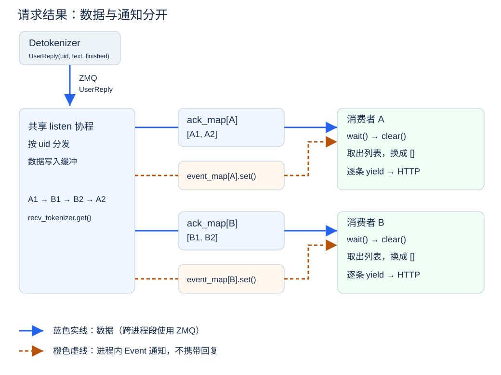

# 第 5 章 HTTP 服务与并发（代码走读）

[概念篇](./第5章_HTTP服务与并发.md)介绍了 HTTP 请求、并发、流式输出和取消。本篇对照 mini-sglang 的实际源码，看看这些能力怎样落到请求模型、内部消息、结果缓冲区和响应协程上。

本文固定使用参考提交 [9a91cfa](https://github.com/sgl-project/mini-sglang/tree/9a91cfafe754aa85daee49998176275667eb58f2)，主要阅读 `python/minisgl/server/api_server.py`。除明确标为运行命令的代码块外，Python 片段都是源码节选或标明的反例，需要结合原文件阅读，不能当作完整服务直接运行。调度器组 batch 的策略留到第 6 章。

## 1 本章学习目标

读完本章后，你应该能够：

- 找到请求模型、HTTP 路由和内部消息的转换位置；
- 对照 `new_user`、`listen` 和 `wait_for_ack`，解释 uid、数据缓冲与事件通知的配合；
- 追踪非流式结果拼接与流式 SSE 编码的代码路径；
- 找到取消消息的发送、转换和处理位置，识别当前实现的清理缺口。

## 2 从 HTTP 输入进入后端

先按 [mini-sglang 安装说明](https://github.com/sgl-project/mini-sglang/tree/9a91cfafe754aa85daee49998176275667eb58f2#2-installation)准备支持模型推理的 GPU 环境。以下命令在 mini-sglang 环境中运行：

```bash
python -m minisgl --model "Qwen/Qwen3-0.6B"
```

另开终端发送请求：

```bash
curl -N http://localhost:1919/v1/chat/completions \
  -H "Content-Type: application/json" \
  -d '{
    "model": "Qwen/Qwen3-0.6B",
    "messages": [{"role": "user", "content": "什么是 KV Cache？"}],
    "max_tokens": 128,
    "stream": true
  }'
```

`-N` 关闭 curl 的输出缓冲，便于观察 SSE 事件。将 `stream` 改成 `false` 再发送一次，比较逐段返回与完整 JSON 返回。阅读源码本身不需要运行 GPU 推理。

| 要找的职责 | 参考源码位置 |
| --- | --- |
| 请求解析、状态管理、响应生成 | `server/api_server.py` 中的 `OpenAICompletionRequest`、`v1_completions`、`FrontendManager` |
| 内部消息结构 | `message/` 中的 `TokenizeMsg`、`UserReply`、`AbortMsg`、`AbortBackendMsg` |
| 分词、解码与取消消息转换 | `tokenizer/server.py` 中的 `tokenize_worker` |
| 调度与资源回收 | `scheduler/scheduler.py` 中的 `_process_one_msg`、`_process_last_data` |

### 2.1 用请求模型约定输入

mini-sglang 使用 FastAPI 提供 HTTP 服务，并用 Pydantic 请求模型描述输入。FastAPI 是用于编写 HTTP 接口的 Python Web 框架；Pydantic 负责描述和校验请求数据。这里的“请求模型”不是执行推理的大语言模型，而是一个继承 Pydantic `BaseModel` 的 Python 类，用来声明 HTTP 请求包含哪些字段、字段采用什么类型以及默认值是什么。下面只保留本章关心的字段：

```python
class OpenAICompletionRequest(BaseModel):
    model: str
    prompt: str | None = None
    messages: list[Message] | None = None
    max_tokens: int = 16
    stream: bool = False
```

这里的 `Message` 也来自同一文件，定义了 `role` 与 `content` 两个字段。请求模型明确了服务可以接收什么。客户端既可以传入普通字符串 `prompt`，也可以用 `messages` 表示多轮对话；`max_tokens` 控制最大生成长度；`stream` 决定结果是逐步返回还是最后一次性返回。

JSON 是 HTTP 接口常用的文本数据格式。FastAPI 会根据请求模型解析 JSON，并在输入无法通过解析或校验时返回错误；部分值也可能按模型规则转换类型。这样，网络请求先被转换成结构化的 Python 对象，后续代码不必反复从原始 JSON 中读取字段。

mini-sglang 提供 `/v1/chat/completions` 等 OpenAI 风格接口，也就是采用相近的访问路径、请求字段和响应结构，便于已有客户端接入。不过，接口形式相似不等于已经覆盖完整协议。当前教学实现返回的 token 用量仍是占位值，`model` 字段不会改变服务启动时加载的模型，`n`、`stop` 等部分参数虽然可以出现在请求中，却尚未传入后端；结束原因也没有区分长度上限与序列结束标记（EOS）。理解这一点，可以避免把“能够调用”误认为“所有行为都已完全兼容”。

请求模型定义了外部请求的形式。接下来，还需要把这些外部字段转换成推理后端能够处理的内部消息。

### 2.2 在 HTTP 与推理后端之间建立边界

收到请求后，API Server 不会直接执行模型前向，而是完成一次从外部协议到内部消息的转换：

```python
state = get_global_state()
if req.messages:
    prompt = [msg.model_dump() for msg in req.messages]
else:
    assert req.prompt is not None, "Either 'messages' or 'prompt' must be provided"
    prompt = req.prompt

uid = state.new_user()
await state.send_one(
    TokenizeMsg(
        uid=uid,
        text=prompt,
        sampling_params=SamplingParams(
            ignore_eos=req.ignore_eos,
            max_tokens=req.max_tokens,
            temperature=req.temperature,
            top_k=req.top_k,
            top_p=req.top_p,
        ),
    )
)
```

这是 `v1_completions` 的输入转换与提交部分。`req` 是解析后的请求；`messages` 非空时转成字典列表，否则使用 `prompt`。除去输入选择，提交过程做了三件事：

1. 为请求分配当前进程内的 uid，并在 API Server 中创建对应的结果缓冲区和通知对象；
2. 将文本和采样参数封装成内部使用的 `TokenizeMsg`；
3. 通过异步 ZMQ 通信通道把消息交给 Tokenizer Worker。

ZMQ（ZeroMQ）是用于进程间消息通信的工具。这里的异步 ZMQ 通信通道负责在 API Server 与独立 Worker 之间传递消息，不要求两端直接调用彼此的 Python 函数。Worker 指负责某一类工作的执行进程，例如 Tokenizer Worker 负责把文本转换成 token IDs。

从这里开始，HTTP 请求处理协程只需要等待返回消息。这里的“协程”是由事件循环调度的异步执行单元，执行到 `await` 时，它可以暂停并让其他任务继续运行。事件循环则持续检查哪些异步任务已经可以继续执行，并在这些任务之间切换。分词、调度和模型计算都在后端进程中完成，不会以同步函数调用的方式阻塞 API Server 的事件循环。

这个边界很重要。HTTP 层负责“请求怎样进来、结果怎样出去”，后端负责“模型怎样计算”。如果两者耦合在同一个阻塞调用中，一条生成时间较长的请求就可能拖慢其他连接；分开以后，API Server 可以在等待后端结果时继续处理新的网络事件。

**检查一下：**你能定位 `messages` 的转换位置吗？哪些采样参数真正进入了内部消息？为什么 HTTP 路由不直接执行模型前向？

## 3 API Server 如何管理并发请求

假设请求 A 已经提交，正在等待下一个 token。此时请求 B 到达，API Server 应当能够立即解析并提交 B，而不是一直等 A 生成完。这里需要同时解决两个问题：等待时怎样让出执行权，以及返回消息怎样找到各自的请求。

### 3.1 `async` 不会自动消除阻塞

先看一种有问题的写法：

```python
@app.post("/generate")
async def generate(req: GenerateRequest):
    text = blocking_generate(req.prompt)
    return {"text": text}
```

虽然路由使用了 `async def`，但 `blocking_generate` 在执行期间没有任何 `await`，仍会持续占用当前线程。事件循环无法在这段计算中切换到其他协程，新连接就可能长时间得不到处理。

因此，异步并发的关键不是给函数加上 `async`，而是把耗时工作交给独立后端，并在等待网络或消息时通过 `await` 让事件循环处理其他任务。mini-sglang 的 HTTP 协程等待的是后端消息，而不是在 API Server 中执行模型计算。

### 3.2 用 uid 隔离请求状态

多个请求共享同一个 API Server，也共享从 Detokenizer 返回结果的通道。`FrontendManager` 是 API Server 中负责请求编号、结果缓存和通知管理的对象。为了避免结果串线，它为每条请求分配在当前进程内递增且不重复的 uid，并维护两组按 uid 索引的状态：

```python
ack_map: dict[int, list[UserReply]]
event_map: dict[int, asyncio.Event]
```

`UserReply` 是 Detokenizer 返回给 API Server 的回复消息，其中包含请求 uid、本轮新增文本 `incremental_output`，以及表示请求是否结束的 `finished`。`ack_map[uid]` 保存已经到达、尚未被该请求取走的 `UserReply`；`event_map[uid]` 用来通知负责当前请求的等待协程“有新结果到了”。

两者不能简单地相互替代。`asyncio.Event` 可以理解为一个异步通知标志，`set()` 将其设为“有新结果”，`wait()` 让协程等待这个通知，`clear()` 则重置标志。它本身不携带 `UserReply`，如果只有事件，等待协程醒来后只能知道“有新结果”，却无法取得具体内容。列表能够保存数据，却不能主动通知等待者；如果只有列表，等待协程就只能不断轮询。一个负责存放消息，一个负责唤醒等待任务。

uid 用来把外部连接与内部请求对应起来，它会随消息经过 Tokenizer、Scheduler 和 Detokenizer，最终再回到 API Server。只要这条标识在各模块间保持不变，API Server 就能判断每段结果属于哪一个客户端。服务重启后，计数器会重新开始，因此这里的 uid 并不是跨进程或跨服务实例的全局标识。

状态具体由 `new_user` 创建：

```python
def new_user(self) -> int:
    uid = self.uid_counter
    self.uid_counter += 1
    self.ack_map[uid] = []
    self.event_map[uid] = asyncio.Event()
    return uid
```

### 3.3 从共享通道中分发结果

`send_one` 通过 `_create_listener_once` 在第一次发送时启动一个长期运行的 `listen` 协程，统一接收 Detokenizer 返回的 `UserReply`。它不负责把内容直接写入 HTTP 连接，而是先按 uid 将消息放入对应缓冲区，再唤醒对应请求：

```python
async def listen(self):
    while True:
        reply = await self.recv_tokenizer.get()
        for reply in _unwrap_msg(reply):  # 将单条或批量回复统一展开
            if reply.uid not in self.ack_map:
                continue
            self.ack_map[reply.uid].append(reply)
            self.event_map[reply.uid].set()
```

可以把这个过程概括为：

<div align="center">
  
  <p><em>图 5.1 共享结果通道、请求缓冲与事件唤醒</em></p>
</div>

每条请求通过 `wait_for_ack(uid)` 消费自己的结果。下面保留参考版本的完整方法，包括末尾的清理语句：

```python
async def wait_for_ack(self, uid: int):
    event = self.event_map[uid]

    while True:
        await event.wait()
        event.clear()

        pending = self.ack_map[uid]
        self.ack_map[uid] = []
        ack = None
        for ack in pending:
            yield ack
        if ack and ack.finished:
            break

    del self.ack_map[uid]
    del self.event_map[uid]
```

顺序是 **wait → clear → 取出列表并换成空列表 → 逐条 yield**：

1. `wait()` 等待通知；没有结果时暂停，让其他任务继续运行。
2. `clear()` 重置通知标志；它不删除结果，也不表示只收到了一条回复。
3. `pending` 接住当前列表，映射中换成一个新空列表，留给后续到达的回复。
4. 逐条 `yield` 当前列表中的回复，交给非流式收集器或流式编码器。

从 `clear()` 到换成空列表之间没有 `await`；在同一事件循环中，`listen` 不会在这几行中途插入执行。交付 `pending` 期间，调用方可能因网络写入而让出执行权；此时新回复写入新列表，再次设置 Event，供下一轮读取。

Event 是通知标志，不是消息计数器。连续到达多条回复可能只形成一次唤醒，但消息都保留在列表里。图中的蓝色实线表示数据传递，其中跨进程的一段使用 ZMQ；橙色虚线表示进程内 `asyncio.Event` 的设置与唤醒，不是另一条 ZMQ 通道。

### 3.4 对照生产者与消费者检查请求隔离

在这个局部结构中，`listen` 是缓冲区的生产者，每条请求的 `wait_for_ack` 是消费者，共享状态是按 uid 分开的列表。这里是一个共享监听协程加上多个请求消费者，并不是每条请求都直接从 ZMQ 通道抢消息。

假设返回顺序是 `A1 → B1 → B2 → A2`。生产者按 uid 分开存储，A 的消费者只能取到 A 的列表，B 同理。消费者取走当前列表后，生产者仍然可以向新列表追加后续结果。

**检查一下：**为什么 Event 不能替代列表？一次唤醒能否对应多条回复？消费者处理旧列表时，新回复写在哪里？

## 4 流式与非流式响应

后端会逐步产生 token，Detokenizer 再把 token 转换成可直接返回给客户端的增量文本。API Server 收到这些 `UserReply` 后，可以选择两种返回方式：先收集完整结果再一次性返回，或者边收到边返回。

### 4.1 非流式：收集完整结果

非流式请求会持续等待同一 uid 的回复，将增量文本依次拼接：

```python
full_content = ""
async for reply in state.wait_for_ack(uid):
    full_content += reply.incremental_output
    if reply.finished:
        break
```

收到结束标记后，API Server 再把完整文本放进一个普通 JSON 响应。这里的“非流式”只描述客户端最后看到结果的方式，并不表示服务端使用同步阻塞调用。等待回复时，当前协程仍然会让事件循环处理其他任务。

### 4.2 流式：通过 SSE 逐步返回

如果请求设置了 `stream=true`，mini-sglang 会使用 SSE（Server-Sent Events，服务器发送事件）保持 HTTP 连接处于打开状态，并连续发送数据块。下面省略了与本节无关的字段，只展示事件结构：

```text
data: {"choices":[{"delta":{"content":"KV Cache"},"finish_reason":null}]}

data: {"choices":[{"delta":{},"finish_reason":"stop"}]}

data: [DONE]

```

这里每个 SSE 数据事件以 `data:` 开头，并用空行与下一个事件分隔；`[DONE]` 是接口约定，不是 SSE 标准要求的结束标记。`delta` 表示本次新增内容，`finish_reason` 表示结束原因。结束时，mini-sglang 先发送 `finish_reason="stop"` 的数据块，再发送 `[DONE]`，标记流式响应的数据已经发送完毕。首个数据块还会携带 `role="assistant"`，声明后续文本来自助手角色，并可能同时包含第一段文本，不应假定角色和文本一定分成两次发送。

SSE 是从服务端到客户端的单向数据流，正好符合推理服务的交互方式：客户端提交一次请求，服务端持续返回增量文本。它仍然使用普通 HTTP，不需要额外建立双向通信协议。当前实现的数据块使用 `cmpl-{uid}` 作为 id、`text_completion.chunk` 作为 object，这也是前文将其称为“OpenAI 风格接口”而不是完整兼容实现的原因之一。

在代码中，FastAPI 的 `StreamingResponse` 是一种可以分多次写入内容的响应类型，它接收一个异步生成器。异步生成器可以多次产生结果：每执行一次 `yield`，就把一个数据块交给响应层发送，实际到达客户端的时机还受网络缓冲影响；等待下一条后端消息时，则通过 `await` 暂停，让事件循环继续处理其他任务。

```python
return StreamingResponse(
    state.stream_with_cancellation(
        state.stream_chat_completions(uid),
        request,
        uid,
    ),
    media_type="text/event-stream",
)
```

`stream_chat_completions` 负责把内部回复编码成上述 SSE 数据。下面保留参考版本的生成器，便于对照首块、结束块和提前退出的位置：

```python
async def stream_chat_completions(self, uid: int):
    first_chunk = True
    async for ack in self.wait_for_ack(uid):
        delta = {}
        if first_chunk:
            delta["role"] = "assistant"
            first_chunk = False
        if ack.incremental_output:
            delta["content"] = ack.incremental_output

        chunk = {
            "id": f"cmpl-{uid}",
            "object": "text_completion.chunk",
            "choices": [{"delta": delta, "index": 0, "finish_reason": None}],
        }
        yield f"data: {json.dumps(chunk)}\n\n".encode()

        if ack.finished:
            break

    # send final finish_reason
    end_chunk = {
        "id": f"cmpl-{uid}",
        "object": "text_completion.chunk",
        "choices": [{"delta": {}, "index": 0, "finish_reason": "stop"}],
    }
    yield f"data: {json.dumps(end_chunk)}\n\n".encode()
    yield b"data: [DONE]\n\n"
    logger.debug("Finished streaming response for user %s", uid)
```

流式返回让用户更早看到已经生成的内容，缩短了用户等待首段内容的时间，改善了交互体验。它不会减少模型前向次数，也不会直接提升后端吞吐。流式与非流式的主要区别发生在结果返回阶段，而不是模型计算阶段。

**检查一下：**非流式在哪里拼接文本？首块在哪里设置角色？`StreamingResponse` 接收的是什么对象？

## 5 请求结束、取消与状态清理

服务不能只处理“成功生成并正常返回”这一条路径。客户端可能中途关闭连接，网络也可能断开。如果 API Server 停止发送数据后不再通知后端，Scheduler 仍可能继续推进这条请求，KV Cache 也会继续占用显存。

### 5.1 正常结束

Scheduler 在 `_process_last_data` 中判断停止条件，移除已结束请求的运行记录，并通过 `_free_req_resources` 归还请求表项、按缓存策略处理 KV Cache；可复用的前缀不一定立即全部丢弃。随后发送带 `finished=True` 的 `DetokenizeMsg`，解码端清理对应状态并返回 `UserReply(finished=True)`。

前台的 `wait_for_ack` 把删除 `ack_map[uid]` 与 `event_map[uid]` 的语句放在生成器循环之后。**这些语句只有在生成器继续运行到末尾时才会执行，不能据此断言正常响应一定完成清理。** 上面的非流式收集代码与 `stream_chat_completions` 都在收到 `finished` 后提前 `break`，此时 `wait_for_ack` 仍暂停在 `yield`。调用方不会再推进它，关闭生成器也不会执行普通尾部语句，因此映射可能残留。

这是参考实现本身的清理缺口。本章保留源码行为用于走读；修复时需要考虑把清理放进 `try/finally`，同时确保调用方在提前退出时显式关闭生成器，或者由统一的请求生命周期管理清理。只看到结束标记，还不能证明所有状态都已回收。

### 5.2 流式客户端断开与协作式取消

对于流式请求，mini-sglang 会在输出过程中检查客户端是否断开；当 Web 服务器取消正在处理该连接的异步任务时，也会进入相同的取消处理。源码中的 `abort_user` 会先固定等待 0.1 秒，再删除该 uid 在 API Server 中的结果缓冲区和通知对象，并发送 `AbortMsg`：

```python
async def stream_with_cancellation(self, generator, request: Request, uid: int):
    try:
        async for chunk in generator:
            # detect if the client has disconnected
            if await request.is_disconnected():
                logger.info("Client disconnected for user %s", uid)
                raise asyncio.CancelledError
            yield chunk
    except asyncio.CancelledError:
        asyncio.create_task(self.abort_user(uid))
        raise

async def abort_user(self, uid: int):
    await asyncio.sleep(0.1)
    if uid in self.ack_map:
        del self.ack_map[uid]
    if uid in self.event_map:
        del self.event_map[uid]
    logger.warning("Aborting request for user %s", uid)
    await self.send_one(AbortMsg(uid=uid))
```

`stream_with_cancellation` 捕获 `CancelledError` 后创建后台取消任务，再用裸 `raise` 继续传播取消；`abort_user` 则清理前台状态并发送内部消息。消息随后经过：

```text
客户端断开
    → API Server 清理结果缓冲区和通知对象，并发送 AbortMsg
    → Tokenizer 将其转换为 AbortBackendMsg
    → Scheduler 处理取消消息；如果请求仍在等待队列或运行集合中，
      则将其移除并尝试释放相应资源
```

这是协作式取消，而不是立即中断。协作式取消不会强制终止正在执行的代码，而是发送取消消息，由各组件在处理到该消息时主动停止后续工作。取消消息还要经过异步通信通道、Tokenizer 和 Scheduler；已经提交给 GPU 的计算任务也不会在收到消息的瞬间停止，因此取消后仍可能产生迟到的 token。Scheduler 如何在等待请求和运行请求中定位 uid，将在下一章展开。

取消后仍可能有已经发出的回复到达 API Server。此时 `listen` 会发现 uid 已不在 `ack_map` 中，直接忽略这条迟到消息，防止已经取消的请求继续在 API Server 中积累返回结果。

后两步可分别在 `tokenizer/server.py` 与 `scheduler/scheduler.py` 找到。以下是取消分支的节选：

```python
# tokenize_worker: build the backend cancellation messages
batch_output = BatchBackendMsg(
    data=[AbortBackendMsg(uid=msg.uid) for msg in abort_msg]
)
```

```python
# Scheduler._process_one_msg: handle an AbortBackendMsg
req_to_free = self.prefill_manager.abort_req(msg.uid)
req_to_free = req_to_free or self.decode_manager.abort_req(msg.uid)
if req_to_free is not None:
    self._free_req_resources(req_to_free)
```

`abort_req` 查找并移除相应请求；只有返回了待回收对象，才会调用资源释放逻辑。取消后是否还有已提交的计算或迟到消息，需要结合调度循环判断。

### 5.3 当前实现尚未完整处理的异常情况

下面几项不是理解服务主流程的前置知识，但反映了当前参考实现仍然存在的功能限制。mini-sglang 重点展示了流式请求的取消主路径，但还不能把这条路径理解成“所有组件的状态都已完整回收”。

首先，非流式 `/v1/chat/completions` 没有显式检查客户端是否断开。客户端提前离开后，后端通常仍会继续生成，并且前台仍受第 5.1 节所述的生成器清理缺口影响。

其次，Tokenizer Worker 收到 `AbortMsg` 后，只把它转换成 `AbortBackendMsg` 交给 Scheduler，没有同时通知 `DetokenizeManager` 删除该 uid 的解码状态。被取消的请求通常不会再收到 `finished=True`，因此 Detokenizer 中的状态可能残留。这是当前参考实现中的清理缺口。

还有一类失败发生在结果返回之前。例如，Scheduler 发现输入长度已经达到模型上限时，当前实现会记录警告并丢弃请求，却不会向 API Server 返回错误或 `finished=True`。HTTP 协程可能一直等待，对应的结果缓冲区和通知对象也无法沿正常路径清理。

这些现象说明，完整的生命周期不仅需要 `AbortMsg`，还需要统一的错误回复、所有组件都能识别的结束或错误标记，以及确保异常情况下也会执行清理的机制。指出这些缺口，是为了区分“理解服务主路径”和“能够在生产环境中稳定处理各种异常”。

### 5.4 慢客户端与结果积压

如果后端产生结果的速度长期高于客户端读取速度，`ack_map[uid]` 中尚未消费的回复可能持续增加。这就是生产者快于消费者带来的背压问题。

`StreamingResponse` 在写入 HTTP 连接时会受到客户端读取速度影响，但 Scheduler 不会因此降低生成速度：独立的 `listen` 协程仍可从 ZMQ 接收结果并追加到列表。换句话说，当前实现没有把“客户端来不及读取”这一情况反馈给 Scheduler。单条请求最终会受到 `max_tokens` 和模型最大长度限制，但并发请求很多或输出很长时，积压仍可能占用大量内存。真实服务还需要限制单连接缓冲区、设置超时，或在客户端持续落后时取消请求。

**检查一下：**取消消息经过哪些类型转换？为什么普通生成器尾部清理可能被跳过？当前实现是否把慢客户端的速度限制传回 Scheduler？

## 6 总结与测试题

### 6.1 课程总结

本章为生成程序补上了服务层。API Server 使用请求模型定义外部接口，将 HTTP 请求转换成带 uid 的内部消息，再通过异步通信通道交给后端，而不是在事件循环中直接执行模型。

API Server 依靠三项机制管理并发请求：uid 区分请求，`ack_map` 保存尚未消费的结果，`event_map` 在结果到达时唤醒对应协程。一个共享的监听协程接收所有返回消息，再根据 uid 将结果发送给对应请求。

非流式响应先收集完整文本，流式响应则通过 SSE 逐步返回新增内容。请求结束后，各组件都应该清理与 uid 关联的状态；客户端断开时，还需要把取消信号传到后端。参考版本展示了流式请求的协作式取消主路径，但生成器提前退出后的前台清理、非流式断连、Detokenizer 取消清理和部分错误回复仍有缺口。

到这里，服务层已经能够同时管理多个并发请求，但它并不决定 GPU 如何共同处理这些请求。下一章将进入 Scheduler，讨论 Continuous Batching 如何动态组织模型执行。

### 6.2 测试题

1. 为什么把同步生成函数放进 `async def` 路由后，仍然可能阻塞其他连接？指出需要让出执行权的位置。
2. 对照 `v1_completions`，追踪 `messages`、`max_tokens` 和 `stream` 分别进入了哪个处理分支。
3. `ack_map` 和 `event_map` 分别承担什么职责？为什么只使用其中一个不够？
4. 按 `wait → clear → 取出并替换列表 → yield` 走一遍消费过程。多次 `set()` 合并成一次唤醒时，为什么不会只剩一条回复？
5. 给 A、B 两个 uid 交错送入回复，怎样验证每个消费者只得到自己的结果，并且完成或取消后的状态被清理？
6. 对照 `stream_chat_completions`，找出角色、增量文本、结束原因和 `[DONE]` 的发送位置。
7. 调用方在 `finished` 后提前 `break` 时，`wait_for_ack` 的尾部删除是否执行？设计一个不依赖 GPU 的验证，并说明取消与异常路径还需要哪些清理保证。

## 参考资料

- [mini-sglang 官方仓库（参考提交 9a91cfa）](https://github.com/sgl-project/mini-sglang/tree/9a91cfafe754aa85daee49998176275667eb58f2)
- [mini-sglang：系统架构与请求生命周期](https://github.com/sgl-project/mini-sglang/blob/9a91cfafe754aa85daee49998176275667eb58f2/docs/structures.md)
- [mini-sglang：API Server、并发状态与流式返回](https://github.com/sgl-project/mini-sglang/blob/9a91cfafe754aa85daee49998176275667eb58f2/python/minisgl/server/api_server.py)
- [mini-sglang：前台与后端消息定义](https://github.com/sgl-project/mini-sglang/tree/9a91cfafe754aa85daee49998176275667eb58f2/python/minisgl/message)
- [mini-sglang：Tokenizer Worker 与取消消息转换](https://github.com/sgl-project/mini-sglang/blob/9a91cfafe754aa85daee49998176275667eb58f2/python/minisgl/tokenizer/server.py)
- [mini-sglang：Scheduler 中的取消与资源释放](https://github.com/sgl-project/mini-sglang/blob/9a91cfafe754aa85daee49998176275667eb58f2/python/minisgl/scheduler/scheduler.py)
- [FastAPI：StreamingResponse](https://fastapi.tiangolo.com/advanced/custom-response/#streamingresponse)
- [MDN：Server-Sent Events](https://developer.mozilla.org/en-US/docs/Web/API/Server-sent_events)


- [Python：异步生成器与关闭行为](https://docs.python.org/3/reference/expressions.html#asynchronous-generator-functions)
