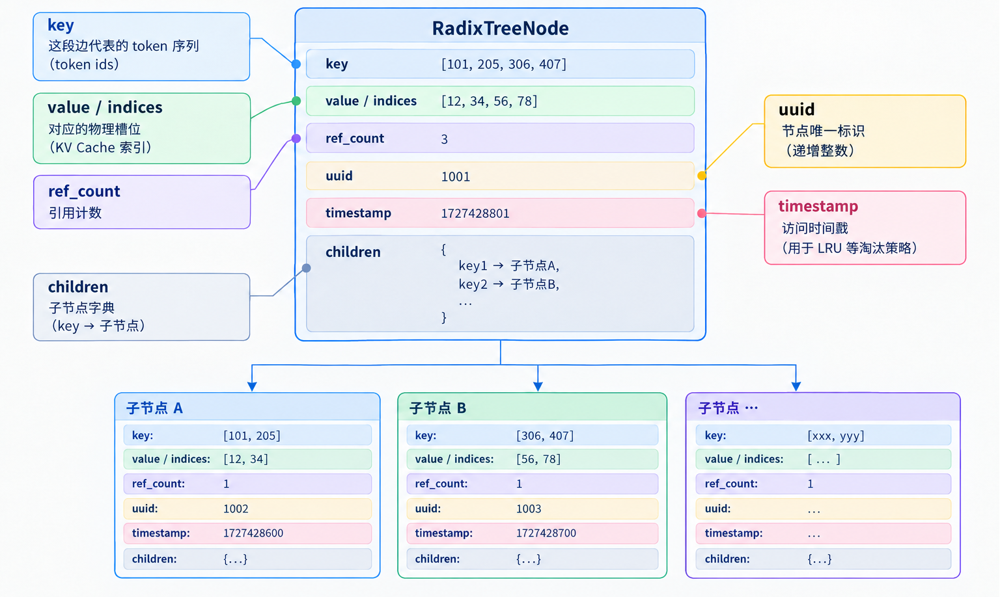

# 第 8 章 RadixAttention 与前缀缓存

在上一部分中，我们介绍了通过分页高效管理 KV Cache 内存分配、减少碎片的方法。**本章进一步聚焦 LLM 在线推理中的实际问题：不同请求之间的 KV Cache 能否跨请求共享复用，以进一步降低显存开销**？答案是肯定的，这可通过前缀缓存（Prefix Cache）实现——对具有共同前缀的请求直接复用已计算的 KV 状态。而 RadixAttention 则更进一步，使用 Radix Tree 将 KV Cache 的物理块映射、高效前缀匹配、与调度器的协同以及 LRU 淘汰策略有机整合，形成一套自动化、**token粒度**的共享机制。


## 1 本章学习目标

这一章从传统 KV Cache 管理所遗留的问题出发，到 Prefix Cache 的出现，进一步探讨这个方法如何支撑 LLM 推理过程中的 KV Cache 高效管理。读完本章后，我们应该能清楚以下问题：

- 传统管理的 KV Cache 在请求结束后会留下哪些问题？
- 为什么可以直接复用的是前缀，而非任意片段？
- 为什么采用路径压缩的 Radix Tree，比逐 token 的普通 Trie 更适合管理共享前缀？
- 最长前缀匹配、插入、分叉与节点分裂的完整流程是什么，以及能否用一个简单例子从头推导出来？
- Radix Tree 节点中保存了什么信息？逻辑 token id 序列与 KV Cache Pool 中物理缓存槽位之间是如何对应的？
- 在完整 RadixAttention 缓存管理的生命周期中，match、schedule、lock、evict 与 free 等关键操作分别扮演什么角色、如何衔接变化？

## 2 从 KV Cache 到 Prefix Cache

在 PartⅠ 的第 4 章中，我们已经介绍过采用 Full Attention 的 LLM 在推理过程中 KV Cache 的生命周期、显存占用，以及传统 KV Cache 管理方案所面临的问题。接下来，我们先对这些内容进行简单回顾。

---

### 2.1 传统 KV Cache 的局限

**传统 KV Cache 的核心收益**是：在自回归生成过程中，把已经计算过的 token 在各层得到的 Key/Value 缓存下来。Prefill 阶段对完整请求计算并写入 KV；之后每个 decode 步只需对当前新 token 计算 Q、K、V，将新的 K、V 追加进缓存，再用当前 Q 与全部已缓存的 KV 做注意力计算。这样便无需对历史 token 重复计算 K、V。

而在过去许多基础实现里，**KV Cache 的生命周期与单个请求严格绑定——请求到达时分配显存，请求结束时全部释放**。

这就会带来一个明显问题，可能出现**跨请求重复计算**的情况：在线 LLM 推理服务中，大量请求往往共享相同的 system prompt、few-shot 示例、工具描述或同一轮对话历史（例如每个请求都以“你是一个专家”开头）。若每个请求都独立计算一遍完整的 prefill，就会造成大量冗余计算，从而拉高 TTFT。

为了解决刚才提到的问题，Prefix Cache 应运而生。其核心思路是改变 KV Cache 的所有权：不再把缓存绑定到单个请求，而是归属到一段可复用的 KV 前缀序列上。请求结束后，对应的 KV 块可以继续保留在共享缓存池中，由淘汰策略决定何时释放。

**这就自然出现一个关键问题：为什么只能复用前缀，而不能复用任意位置的片段？**

---

### 2.2 Prefix Cache 的核心原理

对于每个 token，其生成所依赖的隐藏状态都只能访问该位置及其左侧的序列信息，这一约束由因果注意力机制保证。


**训练时**，对整段序列做一次前向，必须加因果掩码位置 $i$ 只能看到 $0 \ldots i$ ，不能看到未来 token：

$$
h_i = \mathrm{Attention}(q_i,K_{0:i},V_{0:i})
$$

这里是带因果掩码的单向自注意力。

**推理时**：
- **Prefill**&emsp;对整段输入 prompt 并行计算，后面的 prompt token 已经在序列里，因此必须加因果掩码。
- **Decode**&emsp;每次只计算当前新 token，未来 token 尚未生成，因果性由先写入历史 KV、再计算当前 token的过程本身保证，通常不必再显式加三角掩码。

从第一层注意力开始， $h_i$ 已经融合了从序列起点到当前位置的信息，再经线性投影得到的后续层 $K_i$ 、 $V_i$ 也就携带了这段前缀。因此，当前面任意一个 token 不同时，后续位置对应的 KV 都会变。

> **注**：*这里在考虑 Prefix Cache 可行性原理的时候，分别考虑了 Prefill、Decode 两个阶段。但是 Prefix Cache 主要在 Prefill 阶段，即匹配已缓存前缀并跳过重复计算，然后只处理剩余后缀；Decode 阶段不再匹配，仅复用已有 KV 以及追加新的 KV 。*

举例：

- 请求 A&emsp;`["天气", "很", "好"]`
- 请求 B&emsp;`["心情", "很", "好"]`

两者虽然具有相同的后缀 `["很", "好"]`，且“很”、“好”在序列中的位置相同，但 A 中“很”的左侧上下文是“天气”，B 中则是“心情”。**由于 Transformer 的隐藏状态会逐层融合左侧上下文信息**，因此随着网络层数增加，该位置的隐藏状态会逐渐产生差异，并进一步会使后续层对应的 K、V 不同。因此，跨请求直接复用这段后缀的 KV Cache，无法保证后续计算与原始上下文信息一致，从而导致推理结果出现偏差。

*注：经过线性投影得到的 $Q$ 、 $K$ 之后通常还会加位置编码（如 RoPE，作用于 $Q$ 和 $K$ ）。位置下标从序列起点计数，**前缀长度不同时**后续 token 的绝对位置随之改变， $K$ 也会不同*。

即使不考虑位置编码，后续层的隐藏状态也会因左侧上下文不同而产生差异，因此能够安全复用的仍然是完整一致的前缀。加入 RoPE 等位置机制后，Q/K 还会显式依赖 token 的位置，使相同 token 在不同绝对位置时也不能直接复用。

分析完只能复用前缀的原因后，我们先来认识 RadixAttention。至于 Prefix Cache 如何实现跨请求的 KV Cache 复用，将在后面结合 RadixAttention 的部分机制详细展开。

---

### 2.3 RadixAttention 与 Attention

RadixAttention 这个名字容易让人误以为它改动了模型内部的注意力计算，但实际公式与计算流程完全不变，它只是一套高效的 KV Cache 管理与调度机制。即 Attention 计算仍使用原有公式，RadixAttention 的核心在于对 KV Cache 的组织与调度：

- **KV Cache Pool**：在 GPU 上保存真实的 K、V 张量；
- **Radix Tree**：将 token id 序列映射到 Pool 中的物理索引，支持高效的前缀匹配、加入、节点分裂与淘汰；
- **Cache-aware scheduler**：根据匹配结果安排请求顺序，使最近使用的共享前缀尽量保留在缓存中，从而提升命中率。

**因此，RadixAttention 准确的定位是为注意力计算准备并管理可复用 KV 的缓存与调度层**。

## 3 核心数据结构：Radix Tree

**RadixAttention 的核心数据结构是 Radix Tree**。它将各请求的 token id 序列组织成压缩前缀树，使**相同前缀只对应一份 KV Cache**，并且在高效管理的同时支持策略调度，显著提升缓存命中率并降低显存占用。

---

### 3.1 Prefix Cache 对数据结构的要求

如果想要实现一个高效的前缀缓存，需要什么样的数据结构？可以从以下几个角度考虑：

- **快速最长前缀匹配**：给定新请求的 token id 序列，能迅速找出与已有缓存共享的最长公共前缀，从而定位可直接复用的 KV；
- **高效动态加入与分裂**：新序列到来时，能在尽量少改动现有结构的前提下加入新路径；当新序列只匹配某压缩边的一部分时，必须支持就地节点分裂，把公共前缀与后缀分开；
- **前缀共享、后缀独立**：公共前缀对应同一份 KV，分叉后的不同后缀各自独立存储与计算，互不干扰；
- **空间紧凑**：尽量减少元数据开销，避免为无分叉的长路径创建大量节点；
- **安全淘汰**：使用合适的策略，在显存不足时只释放不再被任何请求引用的 KV 块所占用的物理空间。

考虑到上述的需求，就自然会想到用**树结构**来管理 KV Cache，以实现 Prefix Cache。按 token id 序列组织的树能天然表达前缀共享关系，但具体形态差异很大：

| 结构             | 边标签          | 长单分支路径          | 前缀场景代价                  |
|------------------|-----------------|-----------------------|-------------------------------|
| 普通树 / 自定义树 | 无统一约束       | 取决于具体实现         | 难以直接保证高效最长前缀匹配查询   |
| 逐 token Trie    | 1 个 token      | 每个 token 一个节点    | 逻辑简单，但节点与指针开销大   |
| Radix Tree       | 一段 token      | 压缩为一条边 / 一个节点 | 节点少；仅在真正分裂时需要 split |

虽然普通 Trie 天然支持前缀查询，但每条边通常只对应一个 token。LLM 的 prompt 有可能会达数百到数万 token，那么大量路径很长且无分叉，若逐 token 建节点，会产生大量的对象、指针和遍历开销；而 **Radix Tree 将连续无分裂的 token id 片段压缩进单条边，只在真正需要分裂的地方创建结构节点，因此更适合 Prefix Cache 的场景**。

---

### 3.2 基本的组成

一个 Radix Tree 节点的基本组成包括父节点指针、子节点字典、用于从 key Tensor 中提取子节点索引的 `key_fn`，以及该节点自身的 `_key`、`_value` 张量和长度，其中的结构表示为：

<div align="center">
  
  <p><em>图 1. RadixTreeNode结构示意图</em></p>
</div>


定义表示：

```python
class RadixTreeNode:
    def __init__(self, key_fn: KEY_FN) -> None:
        self._parent = None
        self.children = {}       # 子节点字典
        self.key_fn = key_fn     # 从 key tensor 提取“子节点序列索引”的函数
        self.ref_count = 0       # 引用计数
        self.uuid = counter
        self.timestamp = tic or time.monotonic()  # 节点访问时间戳

        self._key: torch.Tensor
        self._value: torch.Tensor
        self._length: int
        
```

需要注意的是：

- `len(node.key) == len(node.value)`：每个逻辑 token 都有对应的物理缓存位置，K/V 一一对应；
- 在节点的 `__init__` 中，`_key`、`_value`、`_length` 仅做类型注解，不赋实际值，后续通过专门方法赋值，方便在新节点加入或匹配过程中的节点分裂时灵活设置内容；
- 根节点为空，不保存任何信息；每个节点则通过简单递增的整数生成唯一的 uuid 来进行区分。

某个节点所代表的完整 token id 序列，是从根到该节点路径上所有 `_key` 的拼接；对应的物理缓存位置则是同一路径上所有 `_value` 的拼接。

除了节点本身的基础字段外，**还有一些方法用于管理树结构**：

| 方法             | 作用                     |
|--------------------------|--------------------------|
| set_key_value         | 设置节点的 key 和 value  |
| set_parent            | 设置节点的父节点         |
| length / parent / value | 获取节点长度、父节点、value |
| is_root / is_leaf    | 判断是否为根节点或叶节点 |
| get_match_len          | 获取与输入的最长公共前缀长度 |
| split_at               | 在指定位置进行分裂         |

那么这些组成部分如何共同参与 Prefix Cache 对 KV Cache 的优化管理？

---

### 3.3 新节点加入、最长前缀匹配与分裂

Prefix Cache 的核心缓存管理通常会发生在 Prefill 阶段。当新请求到达时，系统将当前请求的 token id 序列与已有历史 KV Cache 对应的 token id 序列进行**最长公共前缀匹配**，并根据匹配结果决定后续操作：

- **继续向后匹配**：如果新请求的 token id 序列与当前节点的 token id 序列在**某一段完全一致**，则沿着这条公共前缀路径继续向下匹配，尽可能复用已有的 KV Cache。
- **分裂**：如果在匹配过程中出现 token id 不一致，且匹配长度满足 0 < match_len < node.length，则需要在第一个不相同的位置对当前节点进行分裂。分裂后，**公共前缀部分继续共享，分歧后的部分各自独立存储**。

在缓存仍然驻留且上下文配置兼容的情况下，每个节点对应的 token id 序列只需计算一次；*若对应缓存节点被淘汰，后续请求再次命中该前缀时仍需重新计算*。

Prompt 先经过 Tokenizer 转换为 token id 序列。为便于演示，下面直接使用 token id，并假设有 3 个请求，按照 A → B → C 的顺序依次加入 Radix Tree：

- **请求 A 的 token id 序列**&emsp;[101, 11, 12, 21, 22]
- **请求 B 的 token id 序列**&emsp;[101, 11, 12, 31, 32]
- **请求 C 的 token id 序列**&emsp;[101, 11, 99]

下面直接使用这些 token id 进行演示。假设第一次处理请求 A，并且在这个示例中，每个 token id 对应一个物理槽位：

$$A = [101, 11, 12, 21, 22]$$

经过线性投影处理得到的 KV 被写入物理槽位`[p0, p1, p2, p3, p4]`及对应的 value 。树为空，所以这里只有一个压缩节点：

<div align="center">
  
  <p><em>图 2. Radix Tree初始化构建</em></p>
</div>

第二个处理的请求 B 为 $[101, 11, 12, 31, 32]$ 。先与现有节点逐 token id 比较，得到最长公共前缀长度为 3 （ $[101,11,12]$ ）。分歧发生在节点内部且不能覆盖原节点，因此需要在第 3 个位置处分裂原节点：

<div align="center">
  
  <p><em>图 3. Radix Tree节点分裂</em></p>
</div>

*注：分裂只重组树的元数据。共享前缀仍指向原来的物理槽位 `[p0, p1, p2]`，不需要再复制一次共享前缀部分*。

第三个请求 C 为 $[101, 11, 99]$ 。进入当前首节点后，仅匹配前 2 个 token id （  $[101,11]$  ），因此需要再次在第 2 个位置处对节点进行分裂：

<div align="center">
  
  <p><em>图 4. Radix Tree多级分支</em></p>
</div>

至此，所有的关键操作都出现了：

- **新节点加入**：请求都需要添加新的节点和物理槽位，第一个处理的请求会直接添加到根节点后面，而后续处理的节点会先与之前已有节点的 token id 序列进行最长前缀匹配。
- **最长前缀匹配**：请求 A、B、C 共享最长前缀 `[101,11]`，那么对应部分的 KV Cache 可以直接复用，不需要重新计算；
- **节点分裂**：以请求 A 为例，原来的 `[101, 11, 12, 21, 22]` 最后被拆成 `[101,11]` 与 `[12]`、`[21,22]`。

通过前面的例子，我们已经完整走通了构建 Radix Tree 的**核心工作流程**，这也是 Prefix Cache 实现 KV Cache 管理的基础。接下来，我们看看这一过程在实际实现中是如何完成的。


---

### 3.4 建立 get_match_len() 与 split_at()

在真正实现**最长前缀匹配**（get_match_len）和**节点分裂**（split_at）之前，节点首先需要具备两个基础能力：

- 能够把一段 token id 序列（key）和对应的物理索引（value）绑定到自身，并记录长度（`set_key_value()`）；
- 能够把自己的 key 正确挂到父节点的 children 字典中，完成树结构的双向链接（`set_parent()`）。

**这两个辅助方法是后续操作的前提**。它们的具体实现会在本章对应的 coding 部分详细展开，这里我们先分析——在不考虑缓存淘汰的情况下（没有计数器、时间戳记录），如何基于已经建立好的节点数据与父子关系，实现最长前缀匹配，以及如何进行节点分裂。

---

**最长前缀匹配**的核心思路——假设 `x` 和 `y` 分别表示两个 token id 序列，前者为已加入节点的 token id 序列，后者为新请求的 token id 序列。算法从序列起始位置开始逐个比较两个序列中的 token id，并持续向后遍历，直到满足以下任一条件就停止遍历：

- 已达到较短序列的长度；
- 两个序列在当前位置的 token id 不一致。

遍历结束时，`i` 即表示为两个序列的**最长公共前缀长度**。如果是由于 token id 不一致而停止，**`i` 同时表示两者首次出现差异的下标索引**，可进一步作为后续**节点分裂**的依据。

对应实现：

```text
function get_match_len(x, y) -> int:
    i ← 0
    n ← min(length(x), length(y))
    while i < n and x[i] = y[i]:
        i ← i + 1
    return i
```

*注：项目代码中采取的使用 C++ 语言实现的最长前缀匹配。*

---

**节点分裂**的核心思路——当一个节点只被部分匹配时，把它拆成两段。假设 `get_match_len()` 返回的匹配长度为 `pos` 即前 `pos` 个 token 完全匹配，则调用 `split_at(pos)`：

- 创建一个新节点，接管原节点的前半段（`[:pos]`）key/value，也就是可复用的共享前缀部分；
- 让新节点替换原节点在父节点中的位置（成为原父节点的孩子）；
- 把原节点裁成后半段（`[pos:]`），并挂到新节点后面作为新节点，成为新节点的子节点，最后返回新节点后续匹配从这里继续。

对应实现：

```text
function split_at(node, pos) -> RadixTreeNode:
    assert 0 < pos < node.length          # 防止越界的安全检查

    old_parent ← node.parent
    new_node ← create RadixTreeNode()     # 新节点存放可复用的公共前缀

    # 新节点接管前半段，并挂到原父节点下
    new_node.key   ← node.key[:pos]
    new_node.value ← node.value[:pos]
    new_node.parent ← old_parent          # 同时更新 old_parent.children

    # 原节点变成后半段，并挂到新节点后面成为新节点的子节点
    node.key   ← node.key[pos:]
    node.value ← node.value[pos:]
    node.parent ← new_node                # 同时更新 new_node.children

    return new_node                       # 后续匹配从这个新节点继续
```

到这里，前面讲过的几个核心方法 `get_match_len` 以及 `split_at`。把它们和其余方法实现可以参考普通树的建立、基础定义组合在一起，就可以构成完整的 **RadixTreeNode** 类实现。


## 4 Radix Tree 如何支撑 Prefix Cache

第 3 节关注 Radix Tree 本身的构建，回答“树如何建立”。第 4 节则假设树结构已经形成，进一步分析它如何与 KV Cache Pool、调度器和物理内存管理协同工作，从而实现缓存的匹配、复用、保护与淘汰，由此就可以回答 3.2 小节末尾提出的问题了。


### 4.1 Radix Tree 与 KV Cache Pool 的联系

在建立 Radix Tree 与 KV Cache 的联系时，有三类关键数据对象发挥着重要作用：

| 对象                   | 保存内容                      | 所在位置与作用                              |
|------------------------|-------------------------------|---------------------------------------------|
| Radix Tree 的 key      | token id 序列                 | 逻辑索引，用于判断两个请求是否共享前缀       |
| Radix Tree 的 value    | token slot / page indices     | 地址索引，指向 KV Cache Pool 中对应的存储位置 |
| KV Cache Pool          | 每一层的 K、V 张量            | GPU 上真正参与 Attention 计算的数据          |

*注：为了便于管理 KV Cache 的存储，通常会把 K/V 进行分页存储。SGLang 的相关实现正是采用了这种方式*

需要注意的是，Radix Tree 本身并不保存巨大的 K、V 张量，它只维护 token id 序列与物理地址之间的映射关系。**真正的 KV Cache 数据存放在 GPU 显存中**，方便直接参与计算。简单来说，**key 表示“序列内容”，value 表示“存储地址”**。

那么 Radix Tree 如何利用这套映射关系实现 KV Cache 的复用，以减少请求之间的重复计算？当缓存空间不足时，又如何选择合适的缓存进行淘汰，从而为新的请求释放空间？先从一个简单的例子出发，逐步理解这两个关键过程。


---

### 4.2 从到达到请求结束的缓存生命周期

**前置说明：概念与实现约定**

- **page**：KV Cache 分配和回收的基本单位；一个 page 通常包含 `page_size` 个 token slot；
- **token slot**：一个 token 在 KV Cache Pool 中对应的物理存储位置或索引；
- **page table**：记录请求逻辑 token 位置到物理 page 的映射。具体映射粒度取决于实现；
- **free list**：保存当前尚未分配、可以用于存储新 KV 的物理 page。不同实现中可能命名为 free_pages、release_pages 或其他名称；
- **ref_count**：记录活动请求或缓存句柄对某个 Radix Tree 节点的引用数量。加锁和解锁时，通常会沿当前节点向根节点更新引用计数；
- **handle**：缓存句柄，记录匹配到的 Radix Tree 节点相关信息，后续用于获取对应的物理索引，以及执行 lock/unlock 操作。

这里假设 Radix Tree 结构已稳定，这次聚焦请求在树上的匹配、加锁、借用与归还，把一次请求从到达到结束的职责串起来，便于理解后续策略的实现。

例如，在下面这个例子中，假设历史请求已经在 Radix Tree 中留下了一个共享前缀 $S$ ，并且每个 token id 对应一个物理槽位： 

- $S = [900, 10, 11, 12]$
- $S$ 的 KV： [p0, p1, p2, p3]
- $S$ 对应的树节点：`ref_count = 0`，`last_access_time` 较早

当前还需要处理的两个请求为：

| 请求  | Prompt                        | 匹配结果                                       | 本次还需计算       |
| --- | ----------------------------- | ------------------------------------------ | ------------ |
| R1  | [900, 10, 11, 12, 31, 32]     | cache_hit_len = 4, value = [p0, p1, p2, p3] | [31, 32]     |
| R2  | [900, 10, 11, 12, 41, 42, 43] | cache_hit_len = 4, value = [p0, p1, p2, p3] | [41, 42, 43] |


设 KV Cache Pool 当前 **free list** 中可用槽位有限，下面先让一个请求进入一个运行批次，处理 1 个请求的流程（另一个请求的处理流程同理）如下：

**Step1&emsp;Match 产生候选信息**。R1/R2 的匹配结果包含 `cache_hit_len = 4`、节点 handle 以及物理索引 [p0, p1, p2, p3]。此时 R1/R2 尚未对这些页加锁，这些路径理论上仍可能淘汰它们，因此“匹配到”不等于“已经安全持有”。

>其中，**handle** 主要保存两样东西：
>- **指向的树节点**（匹配到的那个 node）；
>- **当前请求持有的共享前缀长度**.
>
>handle 相当于一把“钥匙”：记录“我匹配到了哪个节点、锁定了多长前缀序列”，后续的 page table 写入等提供了信息。


**Step2&emsp;[Schedule 决定谁先运行](https://github.com/sgl-project/sglang/blob/main/python/sglang/srt/managers/schedule_policy.py)**。调度器比较 R1、R2 的命中长度、后缀长度与资源需求。SGLang 的调度策略分为两类：

- **前缀感知**：lpm、dfs-weight、hrrn、shortest-prefill-first 等，优先长共享前缀、按树 DFS 权重、或让更短未缓存工作先跑；
- **不感知前缀缓存**：fcfs（先来先服务）、lof（最长输出优先）、random、routing-key 等。

这里假设采用 shortest-prefill-first，R1 的未缓存部分更短，两者共享前缀相同，R1 未命中后缀更短（只需两个新槽位），于是优先选中 R1，R2 留在等待队列。调度阶段还可能做 in-batch 前缀检查，避免同一 batch 内重复计算相近前缀。

**Step3&emsp;Lock 把候选变成受保护的引用**。R1 进入批次计算前，对匹配节点调用 lock 相关函数，**从该节点向根逐级 ref_count += 1** ，当某节点 ref_count 从 0 变为 1 时，对应 token 从 `evictable_size` 移入 `protected_size`，并从可淘汰叶子集合中更新状态。共享前缀 [900, 10, 11, 12] 因此受到保护。命中前缀的索引写入请求的 page table，*但加锁本身只负责保护，不负责分配新的 page* 。

**Step4&emsp;Allocate 为未命中部分只申请缺口**。R1 的未命中后缀长度为 2，于是从 **free list** 分配 [p6, p7]，page table 变为 [p0, p1, p2, p3, p6, p7]。若空闲不足，分配器会先请求 CacheManager 做 `evict`（只淘汰当前引用次数为 0 的叶子节点），拿到一定量的释放物理空间后再继续分配。

*注：这个过程中**不会**重新申请已经命中的 [p0, p1, p2, p3] 物理空间*。


**Step5 Insert 把新计算结果变成共享缓存**。Prefill 完成后，用 R1 的 token id 序列与 page table 更新树。已有的 $S$ 节点继续复用，只在其下新增：

$$
[31, 32] \to [p6, p7]
$$

这一步写入的是 token id 到物理地址的索引，不会复制 $S$ 的 KV。**若 insert 发现部分前缀已在树中（竞争态），会对请求侧重复占用的索引立即做 free，避免池里留双份造成内存泄漏。**

**Step6&emsp;Unlock 与请求结束处理**。完成 R1 的计算后，对匹配路径调用 lock 的相关函数（ref_count -= 1）：

- 若某节点 ref_count 降为 0 ，则它直接变为可淘汰状态（进入 evictable_size）；
- 若 ref_count > 0，说明还有其他请求在用，不能被淘汰。

*注：此时成功 Insert 树的 [p6, p7] 并不会被立即 free，它们只是失去了本请求的锁定保护，是否真正从树中移除，取决于后续是否有空间压力触发 evict。*

**Step7&emsp;空间不足时的 evict 与请求结束后的 free**

- **evict**（空间不足时）：当后续请求（如 R2）分配时发现 free 不够，调用 `prefix_cache.evict`。它只会挑选当前引用次数为 0 的叶子节点，**按策略从树中摘除**，并把对应 page 索引物理空间归还。（例如此时若 [31,32] 节点已无引用，就可能被选中，[p6, p7]对应就会被释放）

- **free**（无策略归还）：  
  - Insert 阶段发现竞争态重复 page 时立即 free；  
  - 请求真正结束时，只 free **无法再加入树的非共享 token id 序列**，为了给处理其他请求腾出空间。

**成功共享的前缀 page 不会在请求结束时被 free，只会 unlock ，等待后续空间压力触发或者淘汰机制 evict 才会被释放**。

> **注**： **SGLang** 的 `evict` 会按优先级摘除 ref_count == 0 的叶子节点，并直接释放其物理空间；而 **mini-sglang** 中的 `evict` 仅负责按策略摘除 `ref_count == 0` 的叶子节点并返回对应的物理索引 tensor ，实际释放空间则是由调度层完成。

整个过程可以概括为：

<div align="center">
  
  <p><em>图 5. Radix Cache管理的生命周期</em></p>
</div>

那么整个流程看下来，Prefix Cache 的“命中”只是生命周期的起点，还需要以下步骤：

- **Match** 负责找到地址；
- **Lock** 负责保证地址在使用期间有效；
- **Insert** 负责把新结果加入共享索引，并回收重复占用的 page；
- **evict 与 free** 决定 page 占用的物理空间是否被释放。

*注：Prefill 和 Decode 使用同一张 page table 。默认会把 finished 时的 prompt+output 写入 Radix Tree，并通过 prompt 边界 split 方便后续按需淘汰生成部分，并非“只缓存 prompt、Decode 一律私有直接归还”*。


---

### 4.3 Prefix Cache 的缓存管理实现

4.2 从请求视角串起了 $Match \to Lock \to Allocate \to Insert \to Unlock \to evict/free$ 的完整 Radix Cache 生命周期；这些步骤最终由 Radix Cache 内部的关键状态与辅助方法落地。这里会探讨其实现细节（参考 **mini-sglang** ），先说明核心管理配置：

```python
class RadixPrefixCache:
    def __init__(self, device: torch.device):
        super().__init__()
        self.device = device
        self.page_size = get_global_ctx().page_size          # 分页粒度，对齐 KV Cache 管理单位
        self.key_fn = _get_key_fn(self.page_size)            # 按 page 粒度提取 key 的函数，用于树节点索引
        self.evictable_size = 0
        self.protected_size = 0
        self.root_node = RadixTreeNode(self.key_fn)          # Radix Tree 根节点
        self.root_node.ref_count = 1                         # 保护 root 节点，避免被删除
```

通过以上配置，可以明确生命周期管理需要实现的部分核心方法：

| 方法 | 作用 |
|------|------|
| _tree_walk | 从根节点沿 children 向下匹配，返回最长公共前缀对应的节点、匹配长度 |
| insert_prefix | 按 page 对齐后，将未匹配的剩余部分加入树中（匹配过程中必要时分裂节点） |
| lock_handle | 对匹配路径加/减引用计数，控制节点是否可被淘汰 |
| _collect_leave_nodes_for_evict、evict | 收集所有 **ref_count == 0** 的叶子节点作为淘汰候选；从中按 LRU 淘汰节点，为后续请求腾出空间 |

`match_prefix` 完成后，系统拿到的是树中的一个节点。为了获取这条**已匹配前缀**对应的完整物理索引（供后续直接读取 KV Cache），实现了 `RadixCacheHandle` 类——从当前节点沿 `parent` 向上遍历至根，收集各节点的 `value` 后反转拼接成 1D Tensor。这里不展开实现细节。

---

我们一起分析部分难点方法的实现思路：

**逐节点匹配**的核心思路——从根节点开始沿树向下匹配，直到无法继续匹配（无相同对应的子节点）或已匹配完整个序列为止：

- 每次匹配的对象是一条边。由于**实际存储以 page 为单位管理**，匹配长度需向下对齐到 `page_size`，并据此判断是否需要在当前节点处进行分裂；
- 为避免重复匹配已走过的前缀，每次只截取 `input_ids` 中尚未匹配的后缀作为下一次比较的输入；
- 为支持后续 LRU 缓存淘汰，在匹配结束时需要及时更新当前节点的访问时间戳，记录最近一次访问时间。

**最后，返回匹配结束时的节点以及累计匹配长度**。整个过程保证了最长公共前缀的准确性，并为后续的 `insert_prefix` 和 `lock_handle` 提供了正确的起点。

对应实现：
```text
function _tree_walk(input_ids) -> Tuple[RadixTreeNode, int]:
    prefix_len ← 0
    node ← 根节点
    tic ← 当前时间戳
    while prefix_len < input_ids.length:
        child ← node.children[key(input_ids[prefix_len:])]
        if child 不存在:
            return node, prefix_len
        node ← child
        match_len ← 得到的匹配长度
        match_len ← 向下对齐到 page_size
        prefix_len ← prefix_len + match_len
        if match_len < node.length:          # 匹配到不同的地方需要分裂
            node.split_at(match_len)
            node.timestamp ← tic
            return node, prefix_len
    node.timestamp ← tic
    return node, prefix_len
```
---

**前缀树中加入新序列**的核心思路是——尽可能复用已有前缀，只把**未匹配的后缀部分作为新节点加入到树中**：

- 为了避免 KV Cache 管理过于碎片化，先将输入长度按 `page_size` 向下对齐，只处理完整的页；
- 调用 `_tree_walk` 在 Radix Tree 中查找最长公共前缀，得到匹配结束的节点和匹配长度 `prefix_len`；
- 如果 `prefix_len < insert_len`，说明存在未匹配的后缀，此时：
  - 创建一个新节点，保存未匹配的 token id 及其对应的物理索引；
  - 将新节点挂到当前匹配结束的节点下面（作为其子节点）；
  - 把新节点的长度加入可淘汰大小 `evictable_size` ，即作为备选淘汰对象。

最后，返回匹配到的前缀长度，以及一个指向最终节点的缓存句柄，方便后续访问。

对应实现：

```text
function insert_prefix(input_ids, indices) -> InsertResult:
    # 页对齐，防止碎片化
    insert_len ← 将 input_ids 长度按 page_size 向下对齐
    截取前 insert_len 个 token 及其对应的 indices

    # 查找最长公共前缀
    node, prefix_len ← tree_walk(input_ids)

    # 如果还有未匹配部分，创建新节点挂上去
    if prefix_len < insert_len:
        new_node ← 创建新的 RadixTreeNode
        new_node 保存 Key input_ids[prefix_len:]、Value indices [prefix_len:]
        将 new_node 设置为 node 的子节点
        evictable_size ← new_node.length + evictable_size
        node ← new_node

    return InsertResult(prefix_len, RadixCacheHandle(insert_len, node))
```

---

**选出备选淘汰节点**的核心思路是——首先通过 `_collect_leave_nodes_for_evict` 收集所有当前满足 ref_count == 0 的叶子节点作为淘汰候选，然后按照节点的访问时间戳建立堆，优先淘汰最久未被访问的节点。其中：

- ref_count == 0 是节点可被淘汰的必要条件，用于避免删除当前仍被请求使用的共享前缀；
- 按照 size 按需淘汰，且 size 不能超过当前 evictable_size，从而保证不会尝试淘汰超过当前可回收范围的 Cache；
- 根节点不参与淘汰。根节点代表整棵 Radix Tree，本身并不对应实际的缓存，因此不会作为待淘汰的 Cache 节点。

在实际 `evict` 过程中，如果删除一个叶子节点后，若其父节点也变成了 ref_count == 0 的叶子节点，则将该父节点加入淘汰候选，从而继续向上进行淘汰。

对应实现：

```text
function evict(size) -> torch.Tensor:

    candidates ← 所有 ref_count = 0 的叶子节点
    candidates ← 按最后访问时间构建小顶堆

    evicted_indices ← []
    evicted_size ← 0

    while evicted_size < size:

        node ← 取出最久未访问的叶子节点（从堆中弹出）

        evicted_indices.append(node.value)
        evicted_size ← evicted_size + node.length

        从父节点的 children 中删除 node

        if parent 变为叶子 且 parent.ref_count = 0:
            将 parent 加入淘汰候选

    return 被淘汰节点对应的物理 KV Cache 索引 tensor
```

---

到这里就可以完成 Prefix Cache 的核心管理层面方法实现。结合 mini-sglang 中的 KV Cache 管理（尤其是基于 LRU 的淘汰策略），可以设想这样一个典型场景——某次请求处理完毕后，下一次请求到来时物理空间已不足，系统被迫淘汰 Radix Tree 中的部分节点以释放空间，就会出现这些问题：

- 恰好被释放的是节点 A，而紧随其后的请求本有机会复用节点 A 实现 Cache Hit，却因不必要的 Cache Miss 导致 TTFT 增加；
- 同时，缓存的前缀本身并不携带对话主题或会话身份信息，因此也难以通过主题等方式直接定位并优先保留相关前缀。结果就是本可避免的重复计算被触发，单次请求的计算成本上升。

针对刚才提到的问题，SGLang 最新的 Unified Radix Cache 在统一的一棵 token-keyed Radix Tree 之上，引入了可插拔的组件模型（FULL / SWA / Mamba），并原生支持 HiCache 多层级存储与 session-aware（会话感知）淘汰策略。该策略会按会话活跃度与前缀的“会话身份”进行软保护：优先淘汰未被任何活跃会话引用的节点，再在必要时考虑仍被引用的节点，从而在降低 TTFT 的同时尽可能提高缓存命中率、减少不必要的重计算。

具体设计与实现细节此处不再展开，感兴趣的伙伴可直接阅读这篇[文章](https://www.lmsys.org/blog/2026-08-11-unified-radix-cache)。

---

## 5 总结与测试题

### 5.1 课程总结

本章首先通过 A、B、C 三个请求的示例，介绍 Radix Tree 的构建过程，以及最长前缀匹配和节点分裂的基本原理；随后在树结构已经建立的前提下，以 R1、R2 为例，分析 Prefix Cache 从请求匹配、调度、加锁、物理空间分配，到结果插入、解锁和缓存淘汰的完整生命周期。最后，我们将这些操作与 mini-sglang 中的实现对应起来，进一步说明页对齐、引用计数、重复 page 回收等实现细节，并简要对照当前 SGLang 中的相关部分进行扩展。


### 5.2 测试题

**1.为什么在 Radix Cache 中，evict 只能从叶子节点开始，而不能直接淘汰内部节点或根节点**？

> 提示：回顾 Prefix Cache 的核心优化——前缀复用。如果直接淘汰内部节点，会破坏所有以该节点为前缀的后续路径，导致已经计算好的共享 KV 无法再被其他请求命中。

**2.在 CacheManager 的处理过程中，什么情况下容易出现 page 泄露？会导致什么问题**？

> 提示：请求在 prefill 阶段分配的 page，在后续 insert 进 Radix Tree 时，可能因为其他请求已经加入了相同前缀。

**3.Cache 调度过程中，`evict` 和 `free` 分别在什么场景下使用，二者有何本质区别**？

> 提示：在 SGLang 相关实现中，两者最终都会释放物理 page但作用层次不同——一个是树节点的淘汰，一个是直接归还 page，使用时机也不同。


## 参考资料

- [SGLang: Efficient Execution of Structured Language Model Programs](https://arxiv.org/html/2312.07104v2)
- [mini-sglang：radix_cache.py](https://github.com/sgl-project/mini-sglang/blob/main/python/minisgl/kvcache/radix_cache.py)
- [mini-sglang：CacheManager](https://github.com/sgl-project/mini-sglang/blob/main/python/minisgl/scheduler/cache.py)
- [From Tensor Buffer to Distributed Memory Hierarchy: A Survey of KV Cache Management for LLM Serving](https://arxiv.org/pdf/2607.02574)
- [sglang：radix_cache.py](https://github.com/sgl-project/sglang/blob/main/python/sglang/srt/mem_cache/radix_cache.py)
- [sglang：schedule_policy.py](https://github.com/sgl-project/sglang/blob/main/python/sglang/srt/managers/schedule_policy.py)
- [mini-sglang：cache.py](https://github.com/sgl-project/mini-sglang/blob/main/python/minisgl/scheduler/cache.py)
- [sglang：radix_cache.py](https://github.com/sgl-project/sglang/blob/main/python/sglang/srt/mem_cache/radix_cache.py)
- [unified radix cache](https://www.lmsys.org/blog/2026-08-11-unified-radix-cache) 

