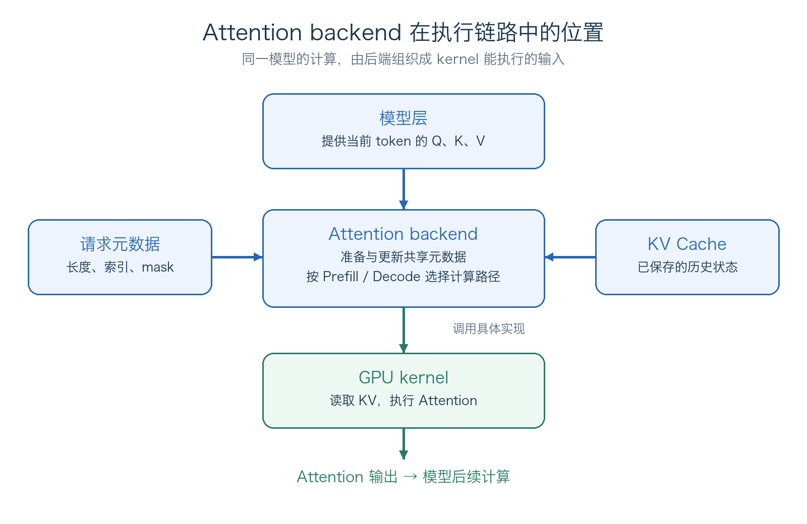
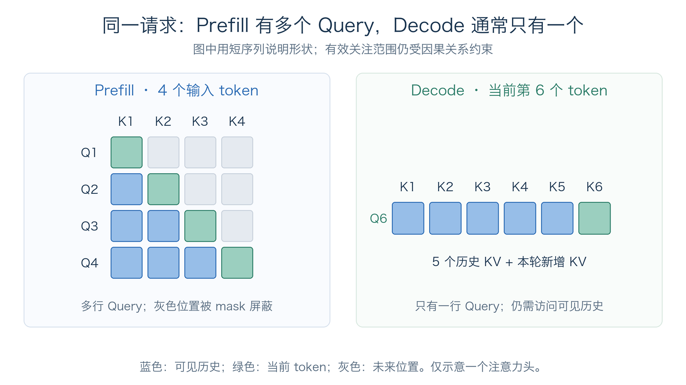
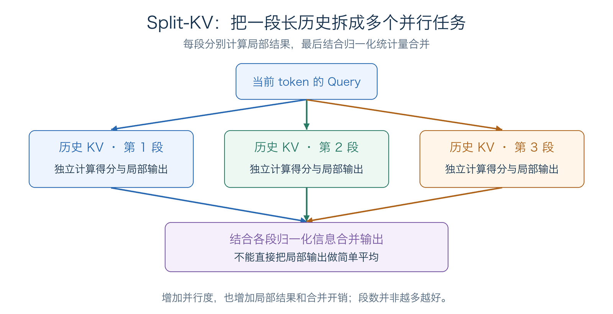
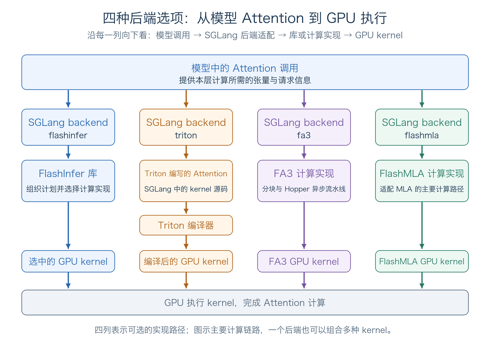
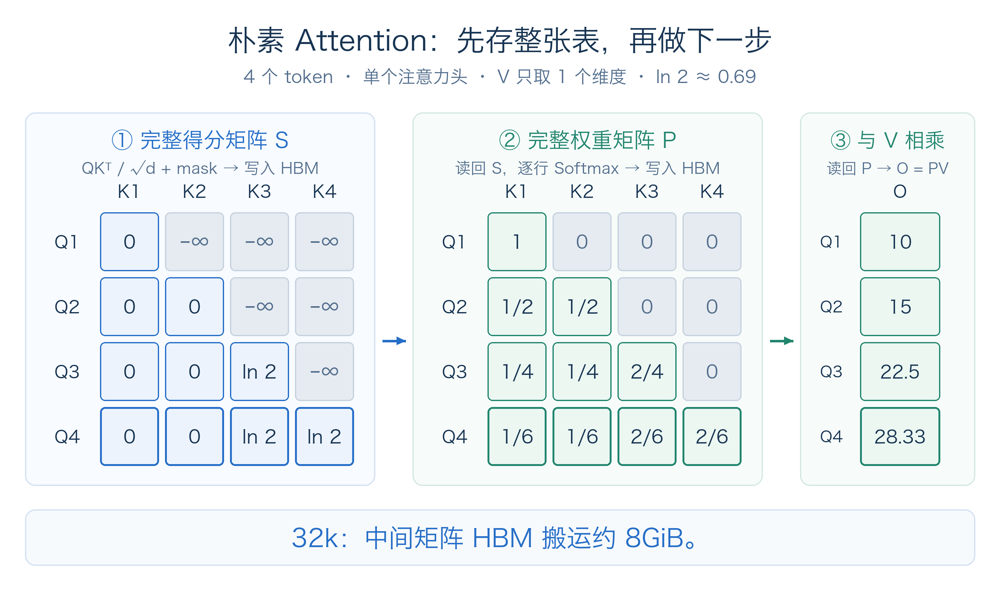
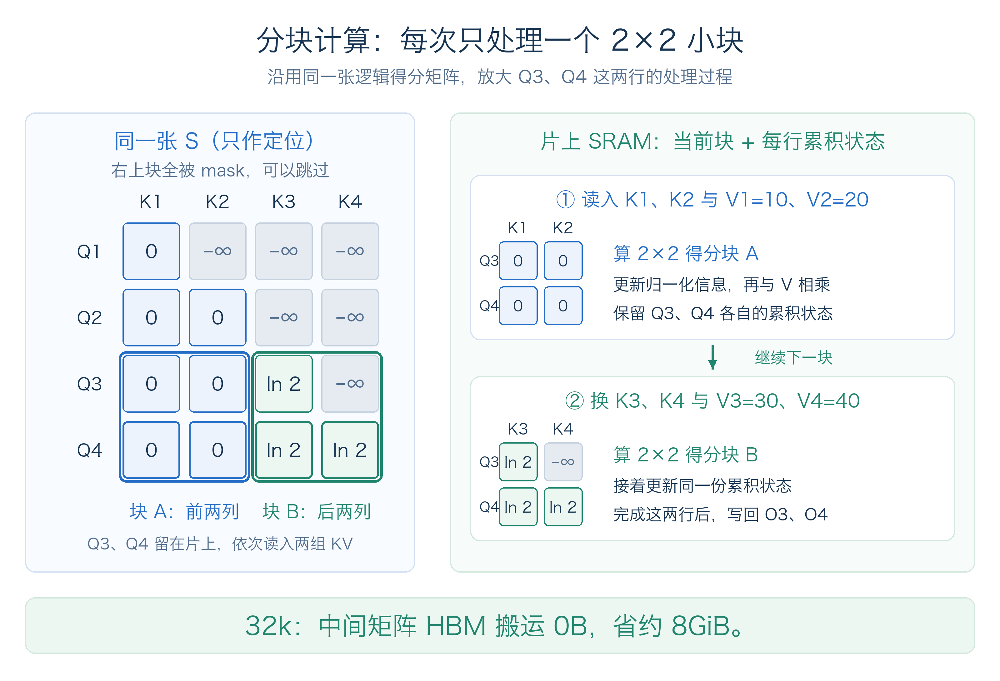
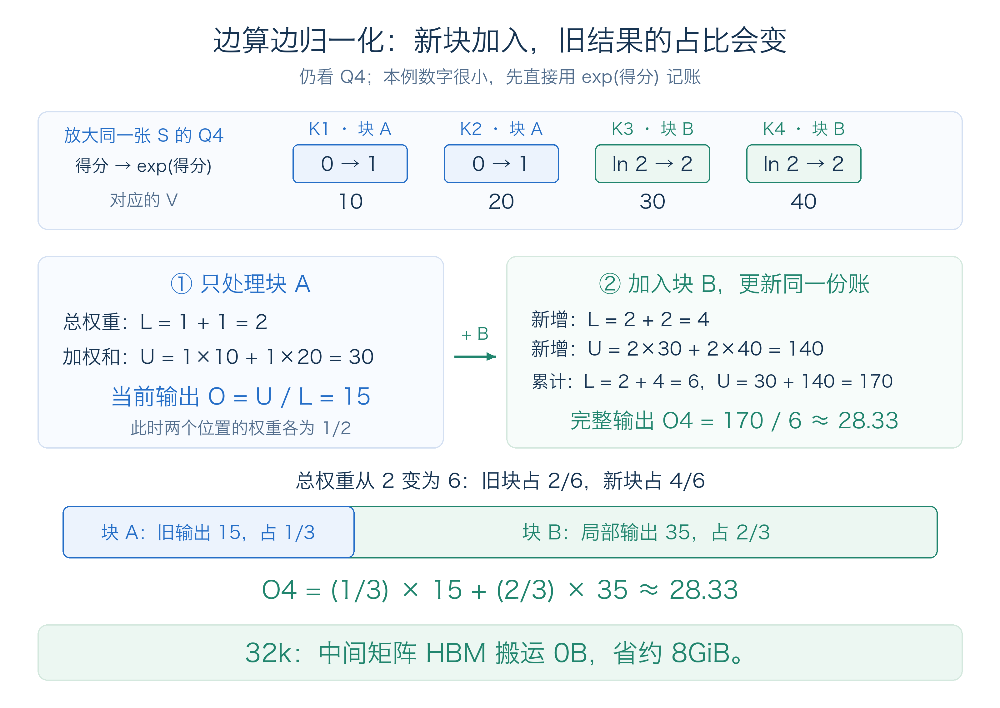
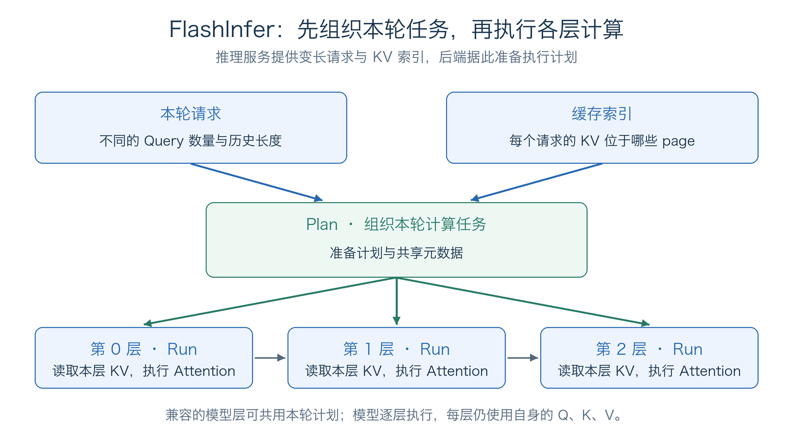
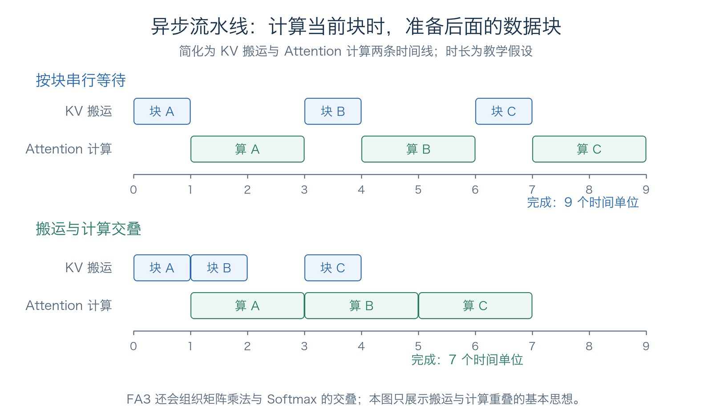
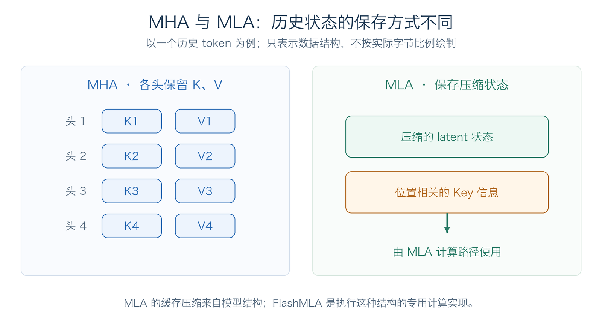

# 第 1 章 注意力后端

前面的课程已经介绍了 Attention 的计算、KV Cache 的管理，以及推理引擎的调度策略等。接下来的章节，我们会更加深入，看看直到今天SGLang的技术都做了什么。比如attention backend。大家可能好奇：同样是计算 Attention，为什么 SGLang 提供了 FlashInfer、Triton、FlashAttention 等不同的实现？

原因在于，Attention 公式只是数学上的原理，而在实际计算中还需要考虑，GPU 应该怎样搬运数据、分配计算任务和执行这些运算。本章从这个区别出发，介绍 attention backend 的职责、几种主要后端的原理与取舍。

## 1 本章学习目标

完成本章学习后，你将能够：

1. 区分 Attention 机制、attention kernel 与 attention backend。
2. 从 Prefill、Decode、模型结构和 GPU 架构解释为什么需要不同的后端。
3. 说明 FlashInfer、Triton、FlashAttention 3 和 FlashMLA 的主要思路、优势与限制。
4. 根据实际请求的特征选择比较对象，并用延迟、吞吐和正确性验证结果。

## 2 Attention backend 负责什么

### 2.1 从数学公式到 GPU 实现

Part I 已经介绍过，标准 Attention 的核心计算可以写为：

$$
O = \operatorname{softmax}\left(\frac{QK^\top}{\sqrt{d_h}} + M\right)V
$$

其中，$Q$ 是当前需要计算的 Query，$K$、$V$ 包括可见历史的 Key、Value，$M$ 是因果掩码等约束。这个公式描述了数学关系。

这里有三个容易混在一起的概念：

| 概念 | 回答的问题 | 例子 |
|---|---|---|
| Attention 机制 | 模型采用怎样的注意力结构？ | MHA、GQA、MLA |
| Attention kernel | 一段具体的 GPU 程序怎样执行计算？ | 分块矩阵乘法、融合 Softmax、分段读取 KV |
| Attention backend | 推理引擎怎样准备输入，并调用适合当前阶段的 kernel？ | SGLang 的 FlashInfer、Triton、FA3 后端 |

因此，**backend 是模型执行与具体计算实现之间的一层适配**。对于固定的模型结构，切换兼容的后端通常是在改变执行方式，模型本身的 Attention 结构和训练参数不会随之改变。

当然，值得注意的是，不同运算顺序或数据类型可能带来浮点误差，所以更换后端后仍需要验证，精度对齐。

### 2.2 后端的职责

模型算出当前 token 的 Q、K、V 后，还需要结合历史 KV 完成 Attention。Attention 后端负责把这次计算需要的数据和信息准备好，调用相应的 GPU kernel，再把 Attention 输出交回模型，继续后面的计算。具体可以分成三件事：

1. **准备计算需要的信息。** 假设一个 batch 中有三个请求，历史长度分别是 128、1024 和 4096 tokens。后端需要告诉 kernel：每个请求要处理哪些新 token、有多长的历史、历史 KV 放在哪里，以及哪些位置允许被关注。这些辅助信息就是前面说的元数据。有了它们，kernel 才能把不同请求的数据区分开，正确完成各自的计算。
2. **处理 KV Cache 的读写。** 缓存管理模块负责分配缓存空间，后端按照提供的位置保存本轮新增的 K、V，并让 kernel 读取已有的历史 KV。即使这些 KV 分散在多个显存 page 中，也要按正确的顺序参与计算。
3. **调用适合当前阶段的计算实现。** 由计算特性决定，Prefill 通常一次处理多个新 token，普通 Decode 则通常每个请求只处理一个新 token。后端会走相应的计算路径，调用具体 kernel，并返回 Attention 输出。

<div align="center">
  
  <p><em>图 1. Attention backend 连接模型计算、请求元数据与 GPU kernel。</em></p>
</div>

这些职责也能对应到 SGLang 的 [`AttentionBackend`](https://github.com/sgl-project/sglang/blob/1d019ce1c85e11ff2f425344e66f446b106f6074/python/sglang/srt/layers/attention/base_attn_backend.py) 接口：`init_forward_metadata` 准备本轮共享的元数据，`forward_extend` 和 `forward_decode` 分别执行追加多个 token、逐步生成时的 Attention，具体实现中再处理 KV 读写和 kernel 调用。

不同后端都要完成这些职责，但组织数据、执行计算和利用 GPU 硬件的方式不同。因此，适合长输入的实现，在逐个生成 token 时未必最合适；适合某种模型或 GPU 的实现，也未必适合另一种。这就引出了下一节的问题：为什么需要不同的后端，又应该根据什么来选择？

## 3 为什么需要不同的后端

后端的输入既包含模型张量，也包含请求状态。是一个many to many的排列组合。我们可以从三个角度理解这种差异。

### 3.1 Prefill 与 Decode 的任务形状不同

| 阶段 | 单个请求本轮的 Query 数量 | Attention 优化重点 |
|---|---|---|
| Prefill | 通常较多，也可能按 chunk 分批执行 | computing boundary，复用片上数据，减少中间矩阵读写 |
| Decode | 普通自回归生成通常为 1 |  memory boundary，效读取历史 KV，降低小任务的调度开销 |

<div align="center">
  
  <p><em>图 2. Prefill 通常有多行 Query；普通 Decode 每个请求通常只有一行，但仍要读取可见历史。</em></p>
</div>

如图，Prefill 中有较多 Query 可以共用一块 KV，更容易摊薄读取成本。Decode 中 Query 很少，GPU 可能没有足够的并行任务。因此，Decode kernel 常会把较长的 KV 序列拆成多段，分别计算局部结果，再结合各段的 Softmax 归一化信息合并输出。

这类方法通常称为 **split-KV**。它增加了并行度，提高GPU利用率，但也引入了局部结果和合并开销；上下文较短或 batch 已经很大时（i.e.GPU利用率已经趋近饱和），拆得更多未必更快。由此也可以理解：同一个后端在不同请求长度和并发下，表现可能不同。

<div align="center">
  
  <p><em>图 3. Split-KV 增加沿历史长度的并行任务；局部输出需要结合归一化信息合并。</em></p>
</div>

### 3.2 模型的 Attention 结构不同

MHA 为每个注意力头保留各自的 K、V；GQA 让多个 Query 头共享一组 KV 头。MLA 则采用低维 latent 表示等方式保存历史状态，缓存格式和计算路径进一步发生变化。

这些结构决定了后端要处理的 head 数量、head dimension 和缓存布局。一个适合标准 MHA/GQA 的 kernel，不能仅靠更换名称就用于 MLA。反过来，MLA 专用后端也无法把普通模型直接变成 MLA 模型。

除此之外，滑动窗口、特殊 mask、投机解码的验证树和不同 KV 数据类型，都可能要求后端提供额外能力。**先确认支持所需功能，再讨论性能**，否则一个单独测试中很快的 kernel，可能无法执行实际服务里的请求。

### 3.3 GPU 架构不同

Attention 的计算会用到 GPU 的显存带宽、片上存储和矩阵计算单元。不同 GPU 架构的能力不同，能使用的指令也不同。

例如，Hopper 提供了 TMA 数据搬运和 WGMMA 矩阵乘法等能力，kernel 可以据此组织更高效的异步流水线。为这些能力设计的实现，不能假设在所有 GPU 上都能获得同样收益。CUDA、编译器及依赖库版本也会影响实际可用的路径。

因此，选择后端要同时考虑 **模型结构、请求形状与硬件能力**。

## 4 四种主要后端的原理与取舍

下面按照课程大纲，介绍 FlashInfer、Triton、FlashAttention 3 和 FlashMLA。

先看它们在实现链路中的位置。模型中的 Attention 调用 SGLang 后端，后端准备元数据并连接具体计算实现，最终由 GPU 执行 kernel。其中，[FlashInfer](https://docs.flashinfer.ai/) 是 kernel 库，[Triton](https://triton-lang.org/main/index.html) 是编写和编译 GPU 程序的工具，FA3 与 FlashMLA 则提供针对特定计算与硬件的 Attention 实现。SGLang 为这些能力提供后端适配，所以它们都能作为后端选项出现。

<div align="center">
  
  <p><em>图 4. 从模型调用到 GPU 执行的四条主要路径。图中的编译节点表示生成 GPU 程序，编译结果可以复用；一个后端也可以组合多种 kernel。</em></p>
</div>

### 4.1 核心思想：分块与融合

这个核心思想出自[FlashAttention 论文](https://arxiv.org/abs/2205.14135)，是早期将attention的数学计算逻辑与IO硬件相结合的成功典范，发现传统attention的计算导致了大量冗余的搬运，并基于此进行优化。影响深远。

先看朴素实现怎样计算 Attention：对于每一行 Query，算出它与各个 Key 的得分，把整张分数表写进 GPU 显存；接着读回来做 Softmax，把得分变成权重，再用这些权重对 V 加权求和。序列长度为 n 时，完整分数表有 n × n 个位置。因果 mask 会屏蔽未来位置，但直接保存整张表的实现仍然会分配这块空间。

<div align="center">
  
  <p><em>图 5a. 朴素实现保存完整的得分表和权重表，再由后续步骤读回使用。三张图沿用同一个 4×4 示例，V 的一个维度为 [10, 20, 30, 40]。</em></p>
</div>

这张表能有多大？以 **32k，也就是 32,768 tokens** 为例，只看单层、单个注意力头，完整分数表就有约 10.7 亿个分数。假设每个分数用 2 字节保存，这张表就占 **2GiB，约 2.15GB**。仅把它完整写出、再读回一次，就要搬约 **4GiB** 数据，还没有计入 Softmax 权重等其他读写。

因此，朴素实现的一大瓶颈就在“搬”：计算单元算出了分数，后续步骤却还要等待庞大的中间结果在显存和片上存储之间往返。这里的优化空间，就是减少这些中间结果的搬运。[FlashAttention](https://arxiv.org/abs/2205.14135) 可以先从两个直觉理解。

**第一个直觉：分块，把一小块数据搬进片上高速存储，尽量在里面完成计算。**

GPU 的显存 HBM 容量大，片上 SRAM 容量小，但访问更快。整张分数表放不进 SRAM，小块数据却可以。因此，每次只搬入需要的一小块 Q、K、V，在片上计算这一块的得分、权重和输出累积，再换下一块。中间结果生成后就接着使用，省去先写回 HBM、下一步再读回来的往返。

<div align="center">
  
  <p><em>图 5b. 固定 Q3、Q4 两行，依次处理两组 KV。左侧完整矩阵仅用于定位；计算时只生成当前小块，接着更新归一化信息并与 V 相乘。</em></p>
</div>

**第二个直觉：边算边归一化，让完整的分数表和权重表从头到尾都不用写回显存。**

这里有一个关键问题：Softmax 要让同一行里所有可见位置的权重合起来为 1。如果每一块都独立归一化，再把输出简单相加，结果就不对了。

FlashAttention 会一边处理数据块，一边保留少量用于归一化的信息和已经累积的输出。可以先把它理解为记两笔账：“目前总权重有多少”“这些权重已经贡献了多少输出”。新块加入后，归一化所依据的总量会变化，于是调整此前累积输出的比例，再合并新块的贡献。这样，全部块处理完后，就能得到整行归一化后的结果；已经用过的局部得分和权重可以丢掉，不必拼成一张大表保存。

<div align="center">
  
  <p><em>图 5c. Q4 先处理块 A，当前输出为 15；块 B 加入后，旧块占比变为 1/3，合并得到约 28.33，与朴素计算相同。</em></p>
</div>

Q、K、V 仍然需要从 HBM 读入，最终输出也要保存；省下的是完整分数表和权重表的存储与反复搬运。这里讨论的是完整 Attention，所需的计算仍然要做，长序列 Prefill 的计算量依旧随序列长度呈二次增长。接下来几种后端会在这个基础上，进一步处理推理服务和具体硬件的问题。

### 4.2 FlashInfer：围绕推理服务组织计算

FlashInfer 是面向推理的 kernel 库。上一节的分块与融合，解决了中间矩阵搬运的问题；到了推理服务，还要解决另一个问题：**每个请求要读多少 KV、KV 的数据放在哪里，以及怎样把这些大小不一的计算任务分给 GPU。**

例如，同一批普通 Decode 请求中，A 要读取 128 个 token 的 KV，B 要读取 8,192 个。两个请求都只有一个新 Query，但 B 需要处理的历史长度是 A 的 64 倍。而且，KV Cache 通常按 page 存放，不保证每个请求的数据在显存中连续排列。FlashInfer 可以把这样的输入组织成可直接执行的 Attention 任务，过程分为三步。

1. **先知道数据在哪里。** SGLang 后端把每个请求的 KV 长度、page 索引等信息交给 FlashInfer。索引相当于一份地址清单：计算 A 时读哪些 page，计算 B 时读哪些 page。支持分页缓存的 kernel 可以按这份清单直接读取 KV，不必先把整个请求的 KV 复制成一块连续数据。page 的分配和回收仍由 SGLang 的缓存管理负责。

2. **Plan：把工作拆成适合并行执行的任务。** 如果把长短请求的每个头都简单地各交给一个 GPU 任务，处理 A 的任务可能很快结束，处理 B 的任务却还在继续读历史。FlashInfer 的计划阶段根据请求长度等信息组织工作；在适合的路径上，长 KV 可以用前面介绍的 split-KV 拆成多段，让更多 GPU 计算单元一起处理 B。计划还会组织各计算任务要处理的分段，尽量均衡工作量，减少长短任务不均带来的空闲。是否拆分、拆成多少段，要结合请求形状和具体实现决定。

3. **Run：按计划读取数据、计算并合并。** 每个模型层传入自己的 Q 和 KV Cache，kernel 按索引读取所需数据，执行 Attention。经过拆分的请求会产生局部结果，再结合各段的归一化信息合并，得到完整输出。拆分增加的是并行度；该请求需要关注的 KV 仍然都要参与计算。

这里的 Plan 安排的是 **Attention 内部的 GPU 计算任务**。哪些用户请求进入这一批，已经由 SGLang 的请求调度器决定。以 [`FlashInferAttnBackend`](https://github.com/sgl-project/sglang/blob/1d019ce1c85e11ff2f425344e66f446b106f6074/python/sglang/srt/layers/attention/flashinfer_backend.py) 为例，它先准备本轮元数据，再逐层调用 FlashInfer 完成计算。

<div align="center">
  
  <p><em>图 6. FlashInfer 先准备本轮计划，再逐层执行；每层使用自身的 Q、K、V。</em></p>
</div>

**Plan与Run分离，复用Plan。** 一批请求要依次经过多个模型层。只要各层的 Attention 配置相同，请求有多长、KV 在哪些 page、计算任务怎么分，通常准备一次就够了，不用每层重新安排。但每层的 Q、K、V 都不同，所以每层还要执行自己的 Run，算出自己的 Attention 结果。下一轮生成时，请求变长了，或者有请求加入、结束，就要更新这份计划。[FlashInfer API 文档](https://docs.flashinfer.ai/api/attention.html) 中也有先做一次 Plan、再逐层 Run 的例子。

因此，FlashInfer 的优势具体体现在：**按实际长度处理变长请求，直接读取分页 KV，组织长短不一的并行任务，并让兼容的模型层复用准备工作。** Prefill 和 Decode 的 Query 数量不同，库也提供对应的计算路径；

这些优化也有代价：准备索引和计划需要时间，split-KV 会增加局部结果的存储与合并开销。如果请求很短，或者 batch 已经提供足够的并行任务，继续拆分未必更快。实际效果还取决于 GPU、数据类型和依赖版本，需要把准备与计算的总耗时一起比较。

### 4.3 Triton：用编译器实现可调整的 GPU kernel

Triton 是编写 GPU 程序的语言和编译器。开发者使用接近 Python 的语法，描述数据块、加载、矩阵运算和输出，再由编译器生成 GPU 代码。因此，SGLang 的 `triton` 后端指的是**使用 Triton 编写的一组 Attention 实现**，Triton 本身并不是一种新的 Attention 公式。

在 SGLang 的 [`TritonAttnBackend`](https://github.com/sgl-project/sglang/blob/1d019ce1c85e11ff2f425344e66f446b106f6074/python/sglang/srt/layers/attention/triton_backend.py) 中，Prefill 和 Decode 使用不同的计算入口。其 Decode 实现会组织分段 KV 计算与结果合并；开发者可以通过调整 block 大小、线程组织和分段策略适配不同形状。官方的 [Fused Attention 教程](https://triton-lang.org/main/getting-started/tutorials/06-fused-attention.html) 也展示了分块 Attention 如何用 Triton 表达。

这种方式的优势是**实现较容易阅读、修改和扩展**，适合开发新功能及支持更多执行环境。限制是性能依赖编译器、kernel 配置与硬件匹配程度；专门使用新架构指令、手工调度的实现可能更快。首次编译也会增加启动成本，所以测量稳态性能时应先完成预热。

不过，不能仅凭“代码更容易写”推断 Triton 一定更慢。对于实际使用的模型、上下文长度和并发，仍要测量具体实现。

### 4.4 FlashAttention 3：利用 Hopper 的异步能力

FlashAttention 3，简称 FA3，在分块 Attention 的基础上进一步利用 Hopper 的硬件能力。其主要思路是使用 TMA 和异步矩阵乘法，让数据搬运、矩阵计算与 Softmax 尽可能交叠执行，减少各个阶段之间的等待。相关设计可参见 [FA3 作者的原理介绍](https://tridao.me/blog/2024/flash3/)。

可以把它理解为一条流水线：处理当前数据块的同时，准备后续数据块，让计算单元不必每次都等搬运全部完成。FA3 还包含低精度计算方面的优化，但是否使用这些路径，需要看后端与数据类型的具体配置。

<div align="center">
  
  <p><em>图 7. 流水线通过交叠减少等待。时长为教学假设，仅展示搬运与计算交叠的基本思想，不代表 FA3 实测性能。</em></p>
</div>

其优势是**在支持的硬件与计算形状上，提高矩阵计算和搬运的利用率**。限制也来自这种专门优化：GPU 架构、软件版本、head dimension 和功能支持都需要匹配，不能把 Hopper 上的结果直接推广到其他 GPU。

在 SGLang 中，`fa3` 通过 [`FlashAttentionBackend`](https://github.com/sgl-project/sglang/blob/1d019ce1c85e11ff2f425344e66f446b106f6074/python/sglang/srt/layers/attention/flashattention_backend.py) 接入，具体 kernel 还会根据设备和执行模式选择。因此，阅读它的性能数据时，需要同时确认实际执行的是哪条路径。

### 4.5 FlashMLA：适配 MLA 的缓存与 Decode

FlashMLA 面向 Multi-head Latent Attention。这里需要先区分两件事：**MLA 的缓存压缩来自模型结构，FlashMLA 则负责高效执行这种结构下的 Attention**。

在常见的 MLA Decode 路径中，模型使用缓存中的 latent 表示参与 Attention，而不是始终把每个历史 token 展开成标准 MHA 的完整多头 K、V。FlashMLA 结合这种数据布局、paged KV Cache 和任务调度，组织计算；较长的 KV 序列也可以分段处理，再合并局部输出。

<div align="center">
  
  <p><em>图 8. MLA 改变历史状态的保存方式，FlashMLA 适配这种结构；图中大小不表示实际字节比例。</em></p>
</div>

其优势是**针对 MLA 的数据特点优化读取和计算，适合支持的 MLA 模型与硬件组合**。限制是模型结构、缓存维度、page size 和数据类型需要满足实现要求；它不是普通 MHA/GQA 模型的通用替代。可用能力应结合 [FlashMLA 项目说明](https://github.com/deepseek-ai/FlashMLA) 与 SGLang 集成版本确认。

当前 SGLang 的 [`FlashMLABackend`](https://github.com/sgl-project/sglang/blob/1d019ce1c85e11ff2f425344e66f446b106f6074/python/sglang/srt/layers/attention/flashmla_backend.py) 主要在 Decode 等路径调用 FlashMLA kernel，而普通 `EXTEND` 会调用继承的 Prefill 实现。这也说明，**一个 backend 可以组合多种 kernel，后端名称不等于每个阶段都使用同一种实现**。

### 4.6 放在一起比较

| 后端 | 主要思路 | 优势 | 主要取舍 |
|---|---|---|---|
| FlashInfer | 面向变长请求和分页 KV，先组织任务再执行适合的 kernel | 推理服务适配较完整，覆盖多种执行路径 | 元数据与计划有开销，依赖和功能支持需匹配 |
| Triton | 用 GPU 编译器表达分块、融合及分段 Attention | 易于阅读、调整和扩展 | 性能依赖编译与调优，首次编译有成本 |
| FA3 | 分块 Attention 加上 Hopper 异步流水线 | 支持场景下能充分使用硬件能力 | 硬件及计算形状限制较强 |
| FlashMLA | 围绕 MLA latent 缓存布局组织读取、计算与调度 | 适配 MLA 特有的计算与存储方式 | 适用模型和缓存格式受限，Prefill 与 Decode 路径可能不同 |

理解这张表时，可以先问自己：当前需要解决的是服务输入组织、kernel 开发、硬件利用率，还是 MLA 专用计算？四种后端的出发点不同，因此不适合脱离场景排出一个固定名次。

## 5 怎样选择与验证后端

### 5.1 先筛选兼容的实现

开始比较之前，先确认模型属于 MHA/GQA 还是 MLA，使用哪种 GPU 与 KV 数据类型，以及是否启用滑动窗口、投机解码或其他特殊功能。满足这些条件的后端，才值得继续测量。

未手动指定 `--attention-backend` 时，SGLang 会根据硬件和模型配置尝试自动选择。这个选择适合作为初始基线；可用后端、默认规则和功能矩阵会随版本变化，部署时应查阅 [Attention Backend 官方文档](https://docs.sglang.io/docs/advanced_features/attention_backend)。文档也列出了更多专用后端，本章围绕课程大纲中的四种实现建立理解基础。

在安装了对应依赖、硬件与模型兼容的环境中，可以通过以下方式指定后端：

```bash
python3 -m sglang.launch_server \
  --model-path Qwen/Qwen3-0.6B \
  --attention-backend flashinfer
```

SGLang 还提供 `--prefill-attention-backend` 和 `--decode-attention-backend`，允许兼容的实现分别负责两个阶段。这样可以利用不同 kernel 的优势，但也需要满足共享 KV 布局及功能支持要求，不能随意拼接任意后端。

### 5.2 比较实际请求的体验

后端切换后，应在相同模型、硬件、KV 数据类型、请求长度、并发和其他执行设置下比较，并在预热完成后采集结果。否则，测到的差异可能来自其他配置。

可以延续 Part I 的 Benchmark 方法，分别观察：

- **TTFT**：长输入的 Prefill 是否变快，以及请求排队是否影响首 token 延迟。
- **TPOT / ITL**：Decode 的逐步生成是否变快。
- **吞吐和显存占用**：高并发下是否能稳定完成更多请求，不同 kernel 的 workspace 是否增加占用。
- **正确性**：采用固定输入及合适的数值比较或任务评测，确认后端切换没有引入错误。

例如，长输入、短输出的服务可能更关注 Prefill 和 TTFT；短输入、长输出的服务则更容易观察到 Decode 的逐步生成耗时。同一个后端在两种服务中得到不同结果，是可以预期的。

## 6 总结与测试题

### 6.1 课程总结

Attention 公式定义数学计算，backend 负责把模型张量、请求状态和 KV Cache 组织成具体 kernel 能执行的输入。Prefill 与 Decode 的形状、模型的 Attention 结构和 GPU 架构不同，因此需要多种实现。

FlashInfer 强调推理服务适配，Triton 提供易于调整的 kernel 实现方式，FA3 使用 Hopper 的异步能力，FlashMLA 适配 MLA 的缓存和计算。选择时先看兼容性，再结合实际请求验证性能与正确性。

### 6.2 测试题

1. Attention 机制、kernel 和 backend 分别承担什么职责？为什么切换 backend 通常不会改变模型结构？
2. 同一个请求在 Prefill 与普通 Decode 阶段的 Query 数量有什么区别？这种区别怎样影响 kernel 的设计？
3. FlashAttention 为什么不需要保存完整的注意力矩阵？这是否意味着完整 Prefill 的 Attention 计算量变为线性？
4. FlashInfer、Triton、FA3 和 FlashMLA 各自重点解决什么问题？为什么不能把 FlashMLA 直接用于任意 MHA 模型？
5. 一个后端在长输入测试中 TTFT 更低，但在高并发、长输出测试中吞吐更低。应该检查哪些因素，才能判断是否适合实际服务？

## 参考资料

- [SGLang：Attention Backend 官方文档](https://docs.sglang.io/docs/advanced_features/attention_backend)
- [SGLang：AttentionBackend 接口与执行分派](https://github.com/sgl-project/sglang/blob/1d019ce1c85e11ff2f425344e66f446b106f6074/python/sglang/srt/layers/attention/base_attn_backend.py)
- [SGLang：FlashInfer 后端实现](https://github.com/sgl-project/sglang/blob/1d019ce1c85e11ff2f425344e66f446b106f6074/python/sglang/srt/layers/attention/flashinfer_backend.py)
- [SGLang：Triton 后端实现](https://github.com/sgl-project/sglang/blob/1d019ce1c85e11ff2f425344e66f446b106f6074/python/sglang/srt/layers/attention/triton_backend.py)
- [SGLang：FlashAttention 后端实现](https://github.com/sgl-project/sglang/blob/1d019ce1c85e11ff2f425344e66f446b106f6074/python/sglang/srt/layers/attention/flashattention_backend.py)
- [SGLang：FlashMLA 后端实现](https://github.com/sgl-project/sglang/blob/1d019ce1c85e11ff2f425344e66f446b106f6074/python/sglang/srt/layers/attention/flashmla_backend.py)
- [FlashAttention：IO-aware Exact Attention 论文](https://arxiv.org/abs/2205.14135)
- [FlashInfer：推理 Attention 引擎论文](https://arxiv.org/abs/2501.01005)
- [FlashInfer：kernel 库与 API 文档](https://docs.flashinfer.ai/)
- [Triton：Fused Attention 教程](https://triton-lang.org/main/getting-started/tutorials/06-fused-attention.html)
- [Triton：语言与编译器介绍](https://triton-lang.org/main/index.html)
- [FlashAttention 3：异步与低精度优化原理](https://tridao.me/blog/2024/flash3/)
- [FlashMLA：项目说明](https://github.com/deepseek-ai/FlashMLA)
