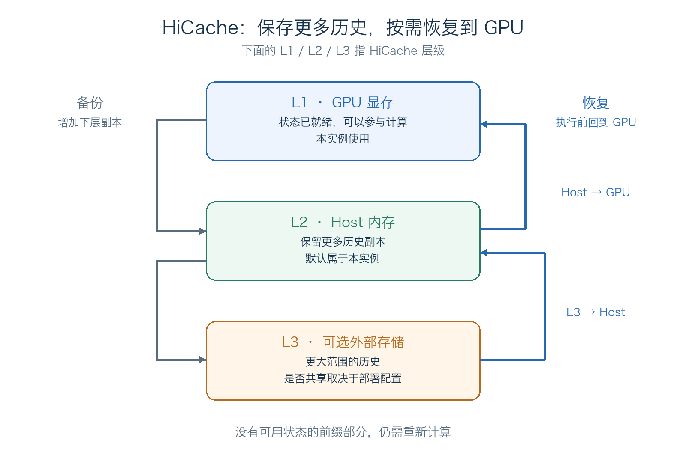
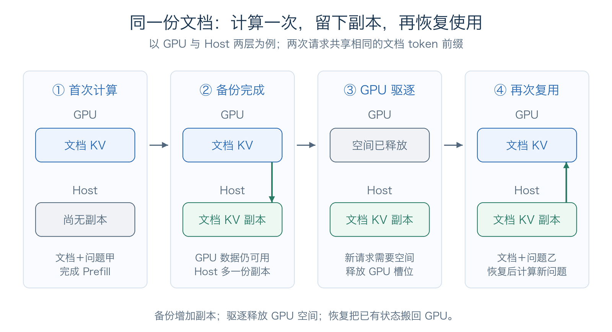
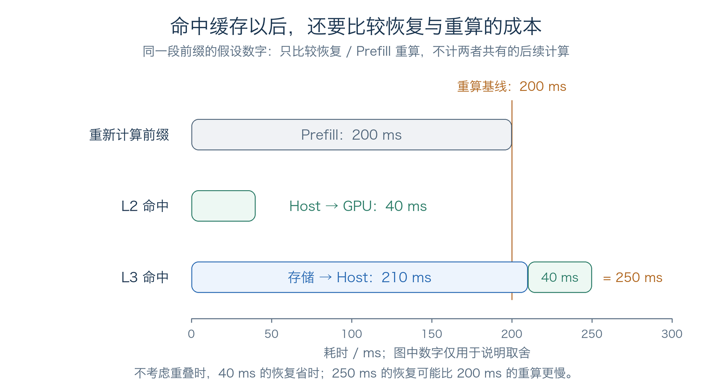
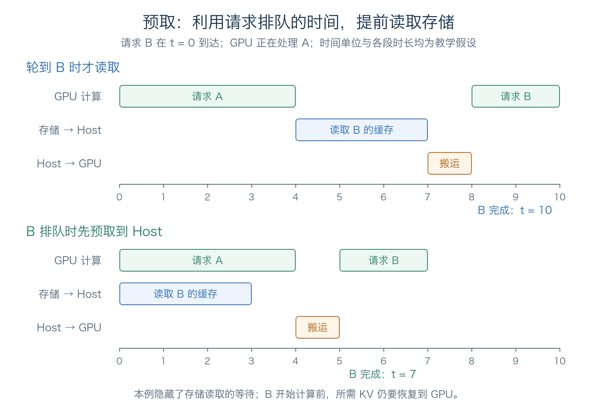
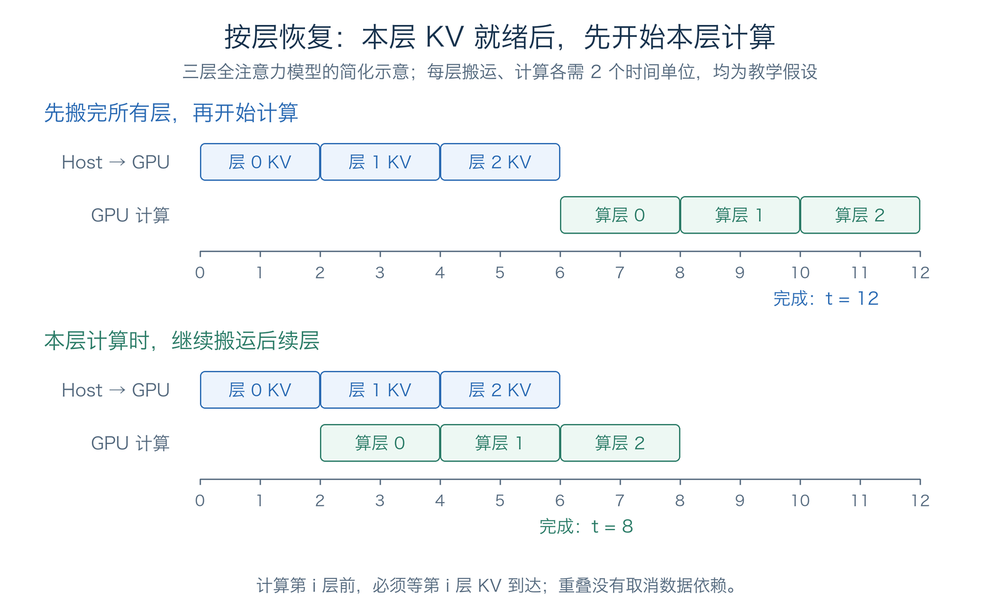

# 第 3 章 分层缓存

前面的课程已经介绍了 KV Cache 和Radix Attention前缀复用：多个请求具有相同前缀时，可以复用已经计算好的历史状态，减少重复的 Prefill。但是，GPU 显存有限。在长下文的压力下，很有可能会有大量的KV Cache驱逐与重算。

分层缓存解决的就是这种“算过，但没有地方继续保留”的问题。SGLang 的 HiCache 将前缀缓存从 GPU 显存（L1）扩展到 Host 内存（L2）和可选的外部存储（L3），用数据搬运换取更少的重复计算。本章围绕一次文档复用，介绍它的基本流程，以及容量、带宽和延迟之间的取舍。

## 1 本章学习目标

完成本章学习后，你将能够：

1. 解释为什么已有前缀缓存，还需要分层缓存。
2. 说明 HiCache 的 L1、L2、L3 分别存放什么，以及不同层的命中意味着什么。
3. 描述一段前缀状态从计算、备份到恢复复用的过程。
4. 比较读回缓存与重新计算的成本，并解释预取、计算与搬运重叠的作用。
5. 判断哪些请求场景更可能从 HiCache 中获益。

## 2 前缀缓存为什么还不够

假设用户上传了一份长文档，先问“这份文档主要讲了什么”，过一段时间再问“第二节的方案有哪些限制”。两次输入都以相同文档开头，因此第二次可以复用文档前缀的 KV，只计算后续的新问题。

如果这段 KV 一直留在 GPU 上，复用很直接。但在两次提问之间，服务可能已经处理了大量其他请求。为了给当前请求腾出显存，缓存管理器会驱逐部分暂时不用的前缀。如果文档 KV 只保存在 GPU 上，被驱逐后就失去了这次复用机会。

Paged KV Cache 改善的是显存的分配与回收；前缀缓存避免的是相同前缀的重复计算。两者都很重要，但都不能让有限的 GPU 显存无限保存历史。HiCache 在此基础上，进一步回答：**GPU 暂时放不下的历史状态，能否先留在其他地方，等需要时再读回来？**

## 3 HiCache 的三层分别负责什么

### 3.1 L1、L2 与 L3

HiCache 按照数据所在的位置划分缓存层次：

| 层级 | 保存位置 | 主要用途 | 命中后怎样使用 |
|---|---|---|---|
| L1 | GPU 显存 | 保存当前计算和近期复用的状态 | 所需 KV 已在 GPU，可以直接参与计算 |
| L2 | 本实例的 Host 内存 | 保留更多暂时不在 GPU 上的历史 | 先将所需 KV 搬回 GPU |
| L3 | 可选的外部存储后端 | 保存更大范围的历史；配置为共享存储时支持跨实例复用 | 通常先读到 Host，再搬回 GPU |

L1 容量有限，但数据就在 GPU 上。L2 和 L3 可以提供更大的保存空间，代价是命中后需要恢复数据，搬运链路和存储访问都会带来额外耗时。

<div align="center">
  
  <p><em>图 1. 下层保存更多历史；执行前，所需状态沿恢复路径回到 GPU。</em></p>
</div>

### 3.2 如何跨层前缀匹配

HiCache 收到新请求后，仍然从输入的开头寻找相同的连续 token 前缀。但这段前缀的 KV 可能一部分在 GPU，一部分在 Host，还有一部分只在 L3。因此，跨层匹配需要同时回答：**前缀相同到哪里，这些位置的 KV 又能从哪里取得？**

可以把这个过程分成三步：

1. **先匹配本地 L1 和 L2。** 系统沿本地缓存树，从请求开头逐段比较 token。树中的节点既记录这一段 token，也记录它在 GPU 或 Host 中的副本。这个阶段主要查索引，还没有把 Host 的 KV 搬回 GPU。
2. **再按需查询 L3。** 如果启用了 L3，对于本地没有匹配到的后续部分，系统会按缓存页生成查找key，向存储后端查询是否存在对应 KV。这个key可以理解为“前缀指纹”：它结合当前页的 token 和此前前缀生成，避免把相同文字、不同上下文的状态混在一起。系统按需查询这些页，不需要维护整个 L3 的全局位置表；具体查询过程可参见 [HiCacheController](https://github.com/sgl-project/sglang/blob/1d019ce1c85e11ff2f425344e66f446b106f6074/python/sglang/srt/managers/cache_controller.py)。
3. **确定能连续复用多长的前缀。** 各层命中的部分需要从请求开头连续接起来，不能中间缺一段，却跳到后面的缓存开始复用。而且，查到副本只是确认“有地方可以取”；L2、L3 的KV Cache内容仍然需要搬运到GPU上进行计算。

举个例子，假设文档前缀有 1,024 tokens可以复用，每个缓存页包含 256 tokens，各段满足复用条件：

| 文档前缀中的位置 | 可用副本在哪里 | 参与 GPU 计算前需要做什么 |
|---|---|---|
| 第 1–512 个 token | L1 | 直接使用 |
| 第 513–768 个 token | L2 | 从 Host 恢复到 GPU |
| 第 769–1,024 个 token | L3 | 先读到 Host，再恢复到 GPU |

如果这三段都成功就绪，就可以复用完整的 1,024 tokens。如果最后一段没有可用副本，就只能复用前 768 tokens，剩余文档和新问题仍要计算。**匹配到的前缀可以来自不同层，实际复用的前缀必须连续，并且所需状态已经就绪。**

这里比较的是 token 是否完全一致，不能因为文本“意思差不多”就复用。即使文档内容相同，前面的 system prompt 或模板不同，也可能改变可匹配的前缀。

同时值得注意的是，本节用全注意力的 KV 说明流程，混合模型架构还要检查SWA窗口 KV、MAMBA递归状态等是否完整，相关实现可参见 [Unified Radix Cache](https://github.com/sgl-project/sglang/blob/1d019ce1c85e11ff2f425344e66f446b106f6074/python/sglang/srt/mem_cache/unified_radix_cache.py)。

## 4 一次文档缓存的生命周期

我们继续使用刚才的“同一份文档、两个问题”的例子，并假设文档前缀满足缓存复用条件。

### 4.1 第一次请求：计算并保留副本

第一次请求输入“文档＋问题甲”。系统没有可用的文档缓存，因此完成 Prefill，在 GPU 上得到相应的 KV，再继续生成回答。

按照所选缓存策略，HiCache 可以把适合保留的前缀状态备份到 Host；启用了 L3 时，还可以继续写入存储。这种备份是在下层增加副本，GPU 上的原数据可以继续使用，直到后来需要回收。

如果所有前缀都立即备份，后续命中的机会更多，但当前也会消耗搬运带宽和 Host 容量。因此，系统需要决定哪些数据值得保留、何时复制。备份尚未完成或没有被选中备份的前缀，被驱逐后仍可能需要重算。

### 4.2 第二次请求：按命中位置恢复

第二次请求输入“同一文档＋问题乙”。系统先寻找可复用的前缀，再根据数据是否就绪决定怎样执行：

1. **L1 命中**：文档前缀的 KV 仍在 GPU，直接复用。
2. **L2 命中**：GPU 上的副本已被驱逐，但 Host 保留了状态。系统分配所需 GPU 槽位，把状态搬回来，再执行新增部分。
3. **L3 命中**：本地未保留足够状态，但存储中有兼容副本。先读到 Host，再恢复到 GPU。
4. **没有可用缓存**：重新计算缺失部分，建立新的 KV。

实际请求也可能只有前面一部分在 L1，后面一部分在 L2 或 L3，剩余部分需要计算。因此，复用的是一段连续、状态就绪的前缀，并不要求整份文档都命中同一层。

<div align="center">
  
  <p><em>图 2. 一次 L2 复用的过程：备份增加副本，驱逐释放 GPU 空间，再次请求时恢复文档状态。</em></p>
</div>

这里节省的是可复用前缀的重复前向计算。新问题及其必要的计算仍然要执行，而且新增 token 的 Attention 仍然要读取文档 KV。**缓存了文档，并不意味着回答新问题时不再使用文档内容。**

SGLang 的 [`HiCacheController`](https://github.com/sgl-project/sglang/blob/1d019ce1c85e11ff2f425344e66f446b106f6074/python/sglang/srt/managers/cache_controller.py) 负责组织 Host 与 GPU 之间的备份、恢复和存储操作。读源码时，可以用 `write`、`load`、`prefetch` 分别对应这几类动作。

## 5 性能取舍

其实，有一个意料之外但是情理之中的事实：开启了分级缓存，并不一定更快。这其实归因于一个性能的取舍。我们之前提到过，分级缓存节省了重复计算相同前缀KV Cache的时间，但是，相应的也增加了在各级之间搬运KV Cache的开销。所以，接下来会说明如何抉择，以及针对这个点进行优化。

### 5.1 比较读回与重算的时间

L1 命中的状态已经在 GPU 上；L2 和 L3 命中还要付出数据恢复成本。因此，缓存命中率高，并不自动等于首 token 延迟低。

对于同一段可复用前缀，可以粗略比较：

$$
T_{\mathrm{restore}}
\approx T_{\mathrm{storage}\to\mathrm{Host}} + T_{\mathrm{Host}\to\mathrm{GPU}}
$$

L2 命中不需要第一项，L3 命中通常包含两项。在暂不考虑重叠和其他开销时，只有当恢复时间比重新计算这段前缀所需的时间更短，复用才有直接的延迟收益。

举一个只用于理解取舍的假设例子：某段前缀重算需要 200ms，从 Host 恢复需要 40ms，那么复用很划算。如果从较慢存储读取再恢复需要 250ms，就可能不如直接重算。这里的数字不是实测结果；真实时间要看缓存大小、有效带宽、存储负载和模型计算速度。

<div align="center">
  
  <p><em>图 3. 用正文中的假设数字比较恢复与重算，不计两种路径共有的后续计算；这些数字不是实测结果。</em></p>
</div>

而且，备份也有成本。如果大量前缀以后都不会再使用，系统只是多写了一批数据，却没有省下任何后续计算。所以评估 HiCache 要观察复用是否真的发生，以及节省的计算是否足以覆盖备份与恢复开销。

### 5.2 预取：把读取提前到等待阶段

这个就是针对读取跨层缓存数据的优化之一。假设 GPU 正在处理请求 A，请求 B 已经到达但还在排队，而 B 的文档前缀只保存在 L3。HiCache 可以在 B 等待时先把缓存读到 Host，让存储访问与其他请求的计算同时进行。

这种提前读取称为 **prefetch，预取**。如果轮到 B 执行时数据已经就绪，就减少了临时读取存储的等待。预取能否隐藏全部读取耗时，取决于排队窗口有多长，以及存储读取能否及时完成。

<div align="center">
  
  <p><em>图 4. 预取把存储读取提前到排队阶段。时间单位和时长为教学假设；所需 KV 仍要恢复到 GPU。</em></p>
</div>

如果轮到 B 时还没读完，就需要决定继续等待还是开始计算：

| 预取策略 | 数据尚未读完时怎样处理 | 主要取舍 |
|---|---|---|
| `best_effort` | 不额外等待，复用已经就绪的前缀，剩余部分重算 | 尽早开始执行，但可能放弃部分复用 |
| `wait_complete` | 等预取完成再执行 | 争取复用更多前缀，但增加等待 |
| `timeout` | 在限定等待时间内争取读完，之后使用已经就绪的前缀 | 在等待时间与重算量之间折中 |

这三种策略没有固定优劣。长前缀重算很贵时，多等一会可能更快；前缀很短或存储拥堵时，继续等待可能拖慢请求。用户关心的是完整请求的耗时，而不是尽可能高的命中率。

### 5.3 按层恢复：让搬运与计算交叠

除了提前从存储读取，Host 到 GPU 的恢复也可以与模型计算交叠。因为模型逐层执行，处理第 0 层时只需要这一层所需的历史 KV，不必先等所有层的 KV 都搬完。

因此，系统可以在第 0 层状态就绪后开始执行新增 token 的第 0 层计算，同时继续搬运后续层的 KV。执行到某一层前，仍要确保该层需要的数据已经到达 GPU。

<div align="center">
  
  <p><em>图 5. 按层恢复使搬运与计算交叠，但每层仍要等自身 KV 就绪。时长为教学假设。</em></p>
</div>

这种优化减少的是 GPU 空等的时间，实际效果取决于传输与计算能否重叠。更完整的图解可参见 [HiCache 可视化课程](https://yichizhang.dev/AI-Infra-Visualized/lessons/hicache/)。它没有取消数据依赖：如果下一层 KV 尚未就绪，计算仍然要等。

## 6 怎样判断场景是否适合 HiCache

### 6.1 先看重复前缀，再看容量压力

以下场景更可能获得收益：多轮对话重复携带历史、围绕同一份长文档反复问答，或者 Agent 多次使用相同任务前缀。它们的共同点是，已经计算的长前缀会再次被使用。

还要看这些前缀是否容易被 GPU 驱逐。如果热点前缀都能长期留在 L1，下层缓存的额外收益可能有限。相反，历史很多、两次复用间隔较长、GPU 容量不足时，L2 或 L3 才更有机会补回失去的命中。

若请求几乎没有相同前缀、输入很短，或者搬运链路已经拥堵，增加缓存容量未必能改善延迟。HiCache 主要减少重复 Prefill，不能仅凭开启它就推断 Decode 会变快，也不会因此提高模型的最大上下文长度。

### 6.2 用服务指标验证收益

在模型和硬件支持的环境中，可以从 GPU 与 Host 两层开始：

```bash
python3 -m sglang.launch_server \
  --model-path Qwen/Qwen3-0.6B \
  --enable-hierarchical-cache
```

这个参数启用 HiCache，不会自动配置共享 L3。Host 池大小、备份策略及存储接入方法，应结合安装版本的 [HiCache 使用文档](https://github.com/sgl-project/sglang/blob/1d019ce1c85e11ff2f425344e66f446b106f6074/docs/docs/advanced_features/hicache_best_practices.mdx) 确认。

测试时可以重复请求相同长前缀，并在两次请求间插入其他流量，观察 GPU 驱逐后能否从下层恢复。与关闭 HiCache 的基线比较时，要保持模型、请求分布、并发和其他配置一致。

重点观察 TTFT、输入吞吐和尾延迟，同时检查各层实际复用的 token 数、Host 占用和搬运负载。只有命中增加，并且服务指标确实改善，才能说明新增保存空间转化成了收益。

## 7 总结与测试题

### 7.1 课程总结

HiCache 延续前缀缓存的思路，把历史状态的保存范围从 GPU 扩展到 Host 和可选存储。命中 L1 可以直接使用；命中 L2 或 L3 需要恢复到 GPU；没有可用状态的部分仍然要重新计算。

分层缓存用更大的容量争取后续复用，用预取和按层恢复减少等待，但也消耗带宽和存储资源。判断是否值得，应比较真实的重复前缀、重算成本与恢复成本，并最终回到首 token 延迟和服务吞吐。

### 7.2 测试题

1. 已有 Paged KV Cache 和前缀缓存，为什么还可能需要 HiCache？它们分别解决什么问题？
2. 同一段前缀命中 L1、L2 和 L3 时，执行前分别需要做哪些事情？L3 是否一定是共享存储？
3. 某段前缀重新计算需要 150ms，从 Host 恢复需要 30ms，从存储读取还需要 200ms。在不考虑重叠时，两种下层命中是否都有延迟收益？
4. 请求排队时预取有什么作用？轮到执行时尚未读完，`best_effort`、`wait_complete` 和 `timeout` 分别怎样取舍？
5. 为什么第 0 层的 KV 就绪后，就可能开始计算，而不用等所有层恢复？这种重叠需要满足什么数据依赖？
6. 开启 HiCache 后命中率增加，但 TTFT 的尾延迟变差。应该从哪些方面检查原因？

## 参考资料

- [SGLang：HiCache 系统设计、缓存范围与读写策略](https://github.com/sgl-project/sglang/blob/1d019ce1c85e11ff2f425344e66f446b106f6074/docs/docs/advanced_features/hicache_design.mdx)
- [SGLang：HiCache 使用与配置](https://github.com/sgl-project/sglang/blob/1d019ce1c85e11ff2f425344e66f446b106f6074/docs/docs/advanced_features/hicache_best_practices.mdx)
- [SGLang：HiCacheController 数据搬运实现](https://github.com/sgl-project/sglang/blob/1d019ce1c85e11ff2f425344e66f446b106f6074/python/sglang/srt/managers/cache_controller.py)
- [SGLang：Unified Radix Cache 状态管理实现](https://github.com/sgl-project/sglang/blob/1d019ce1c85e11ff2f425344e66f446b106f6074/python/sglang/srt/mem_cache/unified_radix_cache.py)
- [AI Infra Visualized：HiCache 可视化课程](https://yichizhang.dev/AI-Infra-Visualized/lessons/hicache/)
