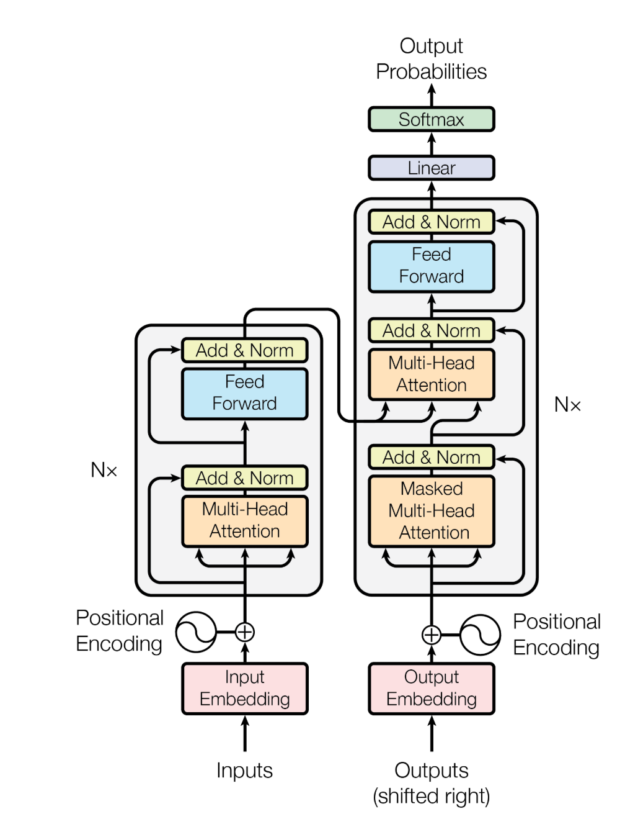
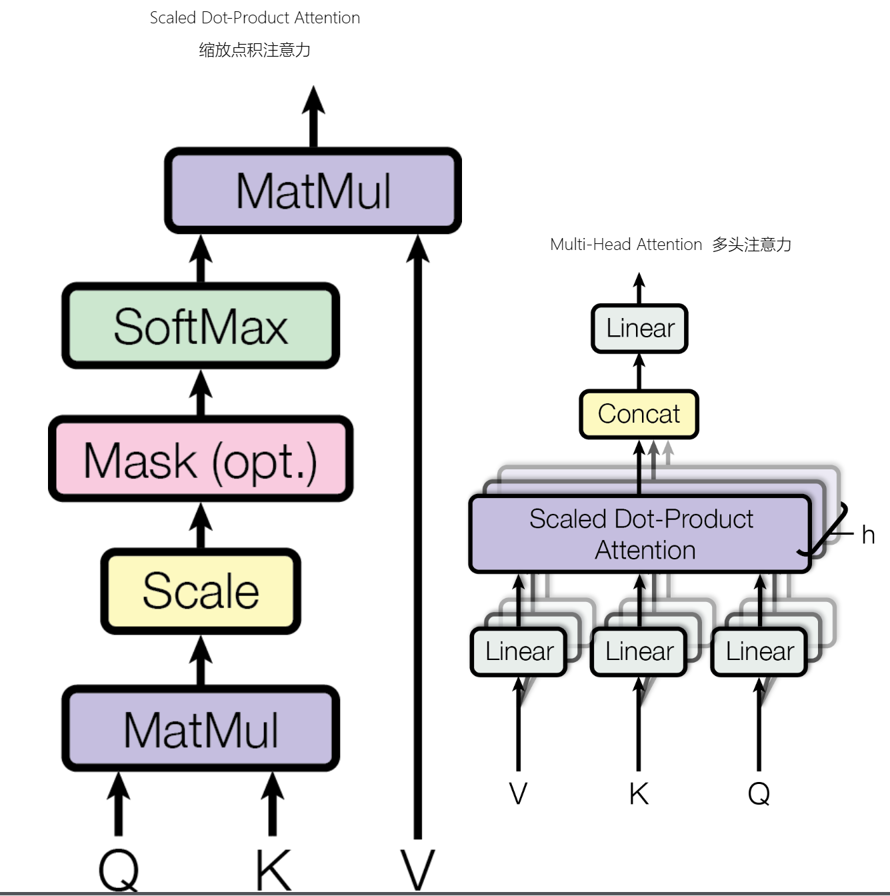

# Chapter 1 Introduction to LLM

## 1 Learning Objectives of This Chapter

Welcome to Chapter 1 of the zero-to-sglang course. As the starting point of the entire course, this chapter will help you build an overall understanding of Large Language Models (LLMs), laying the foundation for the later, deeper study of inference pipelines, GPU architecture, and inference frameworks.

After completing this chapter, you will be able to:

1. Clearly explain the basic definition and development history of LLMs, as well as what they can and cannot do.
2. Understand the typical real-world application scenarios of LLMs.
3. Understand the core architecture of LLMs—the Transformer—and grasp the roles of its key components: positional encoding, multi-head attention, layer normalization and residual connections, and the feed-forward network.
4. Become familiar with the key foundational concepts that run throughout the entire course (tokens, parameters, context window, autoregressive generation, etc.).

## 2 Definition, Brief History, and Boundaries of LLMs

**What is an LLM.** A large language model is a class of language models based on deep neural networks and trained on massive amounts of text. Its core capability is: given a piece of text, predict the next most likely token. It is precisely this seemingly simple "predict the next word" capability that, at a sufficiently large model scale and data scale, gives rise to diverse emergent abilities such as understanding, reasoning, generation, translation, and coding. Here, "Large" refers both to a large number of parameters (from billions to hundreds of billions or even trillions) and to a large volume of training data.

- **2017**: Google proposed the Transformer architecture (*Attention Is All You Need*), replacing RNNs/CNNs with the self-attention mechanism and laying the foundation for modern LLMs.
- **2018–2019**: Two routes emerged—BERT (a bidirectional encoder) and GPT (an autoregressive decoder)—and the pretraining + fine-tuning paradigm became mainstream.
- **2020**: GPT-3 (175B parameters) demonstrated the "few-shot learning" capability of large-scale models, and the scaling effect drew widespread attention.
- **2022 to present**: ChatGPT ignited a wave of applications; open-source models such as LLaMA, Qwen, and DeepSeek iterated rapidly, and models continued to evolve in both architecture (e.g., RoPE, GQA/MLA, RMSNorm, SwiGLU) and training techniques.

**Capability boundaries.** Powerful as they are, LLMs are essentially probabilistic models that continuously predict the probability of the next character based on the input. Therefore, they have clear limitations: they may produce content that looks plausible but is actually wrong (hallucination); their knowledge is limited by the cutoff date of the training data; they have limited memory of long text that exceeds the context window; and they lack genuine causal reasoning and real-time perception of the external world. Understanding these boundaries helps us use and optimize models sensibly.

## 3 Typical Applications of LLMs

LLMs have already permeated a large number of real-world scenarios. Typical applications include:

### 3.1 Dialogue and Q&A:

Traditional conversational assistants are the main battleground for LLMs, centered on chat—the user asks and the model answers. From the earliest GPT-3 until now, traditional conversational assistants have made great progress: from single-modal to multi-modal, from text to images and audio, and from offline chat to being able to search the web. To some extent, conversational assistants have taken over part of the ecological niche of search engines—when people have a question, they are quite likely to ask an AI rather than search in a browser.

### 3.2 Text Generation:

Content generation and creation is the area where LLMs deliver the most significant productivity gains. Applications where large models write and draft reports are now very common; some more advanced uses include official/business document writing, meeting minutes, and generating PDFs and Docs directly. Applications in text generation are already extremely widespread.

At the same time, large models are also shining in translation. Large models are replacing traditional machine translation, and the "flash" models released by various model vendors are becoming the main players in the translation field.

### 3.3 Code-related:

Claude Code, Codex, and Cursor are the hottest AI programming tools recently. Domestic products from Chinese vendors such as Qcode, Zcode, and Codebuddy are also competing for market share. These vibe-coding tools let even non-professionals generate a working piece with a single sentence, easing the workload of programmers. They are becoming increasingly popular, to the point that not having used them is practically "falling behind."

Behind all these applications lies the model's efficient **inference** capability—which is exactly the problem that the later chapters of this course (inference pipeline, GPUs, inference frameworks) focus on solving.

### 3.4 The Foundation of AI Applications: Inference Cost and Latency

All these applications are centered on large models. The output of a large model is the most important thing for an AI tool; when we use an AI tool, we are essentially leveraging the output of a large model, and that output in turn depends on inference. Inference cost directly affects the cost of using a model, and inference latency directly affects the user experience. Therefore, inference cost and latency are of paramount importance.

The autoregressive generation characteristic of LLMs causes memory requirements to grow linearly with the input sequence length and batch size. In high-concurrency scenarios, more than 70% of GPU memory is occupied by the KV Cache (these concepts will be explained later), which limits the per-card concurrency ceiling and context length, and the recomputation caused by cache eviction further drives up costs. [According to NVIDIA's estimates, for an inference cluster without KV Cache offloading optimization](https://www.donews.com/news/detail/4/6512672.html#1), the per-token generation cost increases by 2–3x due to recomputation, and even up to 3.5x during high-concurrency peaks. For a medium-scale enterprise's AI customer-service system, the extra cost caused by the KV Cache memory bottleneck and cache eviction accounted for 78% of the total monthly operating cost.

Latency directly affects the experience. Time To First Token (TTFT) and Time Per Output Token (TPOT) determine the user's interaction experience. Whether a service can meet the service-level objective of matching human reading speed (≤150 ms/token) has become a key constraint for production deployment.

These are exactly the problems that efficient inference tools aim to solve.

The emergence of these efficient inference frameworks is precisely to address the increasingly severe cost and latency bottlenecks that appeared after the explosion of applications, driving LLMs from being technically usable to being commercially profitable.

## 4 Core Architecture: Transformer

The origin of the Transformer model can be traced back to 2017, when it was first proposed by Google's research team in the paper [*Attention Is All You Need*](https://arxiv.org/abs/1706.03762). The core innovation of this model was the introduction of the **self-attention mechanism**, which discarded the traditional Recurrent Neural Network (RNN) and Convolutional Neural Network (CNN) structures. The self-attention mechanism allows the model to compute in parallel when processing sequential data, thereby greatly improving computational efficiency and solving the long-range dependency problem.

<div align="center">
    
<p><em>Figure 1. The overall architecture of the Transformer</em></p>
</div>

The figure above shows the block structure of the Transformer: on the left is the **encoder block**, and on the right is the **decoder block**. Stacking the decoder and encoder N times forms the Transformer structure.

### 4.1 Positional Encoding — Sinusoidal Positional Encoding

$$
\begin{align*}
PE_{(pos,2i)} &= \sin\left(\frac{pos}{10000^{2i/d_{\text{model}}}}\right) \\
PE_{(pos,2i+1)} &= \cos\left(\frac{pos}{10000^{2i/d_{\text{model}}}}\right)
\end{align*}
$$

**Variable definitions:**

$pos$: the position of the token in the sequence (0, 1, 2, ..., N-1)
$i$: the dimension index
$d_{model}$: the model embedding dimension (512 in the paper)
$10000$: the base frequency (configurable)
After computing the positional encoding from the formula, it is directly added to the word embedding: $X = Token + PE(pos)$

Sinusoidal positional encoding is a key design in the Transformer model for injecting **positional information** into a sequence. Because the core of the Transformer is the self-attention mechanism, it **has no inherent awareness of input order** on its own; if word vectors were fed directly into the model, then "I love you" and "you love me" would be treated as the same set. To solve this problem, positional information must be explicitly added to the input. Sinusoidal positional encoding is a way of representing position that requires no training and is generated by a fixed formula. Its core idea is to use sine and cosine functions of different frequencies to generate, for each position in the sequence, a unique encoding vector that is also capable of perceiving relative positional relationships.

Specifically, for the $pos$-th position in the sequence (counting from 0) and the $d$-th dimension of the encoding vector (with total dimension $d_{\text{model}}$), we define the dimension-pair index $i = 0, 1, \dots, \frac{d_{\text{model}}}{2} - 1$. The rule for generating the encoding values is as follows:

When the dimension $d$ is even (i.e., $d = 2i$), the sine function is used; when the dimension $d$ is odd (i.e., $d = 2i+1$), the cosine function is used. It is worth noting that the even and odd dimensions within the same pair **share the same frequency base**.

The computation formulas are:

$$
PE_{(pos, 2i)} = \sin\left(\frac{pos}{10000^{2i / d_{\text{model}}}}\right)
$$

$$
PE_{(pos, 2i+1)} = \cos\left(\frac{pos}{10000^{2i / d_{\text{model}}}}\right)
$$

Here, $10000^{2i / d_{\text{model}}}$ determines the wavelength across different dimensions, thereby forming a multi-scale encoding system: low dimensions (small $i$) correspond to high frequencies and can finely distinguish adjacent positions; high dimensions (large $i$) correspond to low frequencies and can cover relative relationships over longer distances. Ultimately, each position gets an encoding vector with the same dimension as the word vector, and the two are added together as the model input.

This design brings several notable advantages. First, it is fully deterministic and **requires no extra parameters**, avoiding added model complexity or the overfitting problems that learned positional embeddings can introduce during training. Second, thanks to the periodicity of the trigonometric functions, the encoding values are bounded within $[-1, 1]$, which is numerically stable and easy to add to word vectors. More importantly, it **naturally supports modeling of relative positions**: for any fixed offset $k$, the encoding vector at position $pos+k$ can be expressed as a linear transformation of the encoding vector at position $pos$ (depending only on $k$), which makes it easier for the self-attention mechanism to learn the relative positional relationships among elements in the sequence, rather than only absolute positions. This property is especially crucial when handling variable-length sequences and capturing local dependencies.

Sinusoidal positional encoding was first proposed in *Attention Is All You Need* as the standard positional encoding scheme for the original Transformer. Although learnable positional embeddings, relative positional encodings, and other variants appeared later, sinusoidal encoding, thanks to its simplicity, efficiency, and training-free nature, is still widely used in many sequence-modeling scenarios or serves as a classic example for understanding the mechanism of positional encoding.

### 4.2 Multi-Head Attention

<div align="center">
    
<p><em>Figure 2. Multi-head attention mechanism</em></p>
</div>

The attention mechanism mimics how human attention works. When a person looks at a picture, they do not spread their **attention evenly across every corner of the photo**, but selectively focus on the striking and prominent parts of the image. The attention mechanism works the same way: it focuses on the important parts of the input, which manifests as larger weights. In essence, the attention mechanism is a weighted sum.

The multi-head attention mechanism is a core innovation of the Transformer model. By running multiple attention heads in parallel, it enables the model to simultaneously attend to multiple kinds of dependencies in the sequence from different perspectives and different semantic levels, thereby greatly enhancing its ability to model complex patterns. Below, starting from the approach and limitations of single-head attention, we gradually unfold the complete design of multi-head attention.

#### 4.2.1 The Approach and Limitations of Single-Head Attention

The computation of single-head attention is based on the scaled dot-product attention mechanism. For an input sequence $X$ (of shape $[batchSize, seqLen, d_{model}]$), it is first mapped into the Query (Q), Key (K), and Value (V) through three sets of weight matrices:

$$
Q = X W^Q, \quad K = X W^K, \quad V = X W^V
$$

where $W^Q, W^K, W^V$ all have shape $[d_{model}, d_{model}]$, so $Q, K, V$ retain the shape $[batchSize, seqLen, d_{model}]$. The attention output is then computed:

$$
\text{Attention}(Q, K, V) = \text{softmax}\left(\frac{Q K^T}{\sqrt{d_k}}\right)V
$$

Here $d_k = d_{model}$, and the scaling factor $\sqrt{d_k}$ is used to prevent the dot-product results from becoming too large and pushing the gradients into the saturation region.

The limitation of single-head attention is that it can only compute one kind of query-key-value relationship, as if observing with only a single pair of eyes. This makes it difficult for the model to simultaneously capture multiple patterns such as syntactic structure, semantic association, and long-range dependency; the attention distribution tends to be too dispersed and cannot focus on multiple important subspaces. Therefore, the common practice is to repeat the attention mechanism multiple times, letting each head learn a different subspace representation, and finally merge the results.

#### 4.2.2 The Design Idea of Multi-Head Attention

Multi-head attention splits the $d_{model}$-dimensional query, key, and value into $h$ independent heads. Each head performs attention computation in parallel in a lower-dimensional space ($d_k = d_{model} / h$), enabling the model to jointly extract information from multiple representation subspaces. Each head has its own projection matrices and can attend to different types of features—for example (this is just an example; we cannot determine the exact division of labor of each head), **some heads may focus on local syntactic structure, while others capture long-range semantic dependencies.** Of course, inside the model there is only a series of floating-point numbers, and we cannot know the precise division of labor, but practice has proven that this is useful.

#### 4.2.3 The Detailed Computation Process of Multi-Head Attention

**Step 1: Multi-head splitting (assuming the input Q, K, V have already undergone linear projection)**

For the input $Q, K, V$ (all of shape $[batchSize, seqLen, d_{model}]$), first split them into $h$ heads. Through reshape and transpose operations, the head dimension is brought forward:

```python
Q = Q.reshape(batch_size, seq_len, h, d_k)   # [bs, seq_len, h, d_k]
Q = Q.transpose(1, 2)                        # [bs, h, seq_len, d_k]
```

After the transpose, the shape of $Q, K, V$ becomes $[batchSize, h, seqLen, d_k]$. In this way, each head can be batch-processed independently and efficiently.

**Step 2: Compute the attention of each head in parallel**

For the $i$-th head, independently perform scaled dot-product attention:

$$
\text{Head}_i = \text{Attention}(Q_i, K_i, V_i) = \text{softmax}\left(\frac{Q_i K_i^T}{\sqrt{d_k}}\right)V_i
$$

where $Q_i, K_i, V_i$ all have shape $[batchSize, seqLen, d_k]$, so $Q_i K_i^T$ has shape $[batchSize, seqLen, seqLen]$, representing the pairwise attention scores among all positions within that head. The output of that head, $\text{Head}_i$, also has shape $[batchSize, seqLen, d_k]$.

**Step 3: Concatenation and final linear transformation**

Concatenate the outputs of all heads along the head dimension to restore the original dimension:

$$
\text{MultiHead}(Q,K,V) = \text{Concat}(\text{Head}_1, ..., \text{Head}_h)
$$

The concatenated shape is $[batchSize, seqLen, h \times d_k] = [batchSize, seqLen, d_{model}]$. Finally, a linear transformation is performed through an output projection matrix $W^O$ (of shape $[d_{model}, d_{model}]$) to obtain the final multi-head attention output:

$$
\text{Output} = \text{MultiHead}(Q,K,V) W^O
$$

This output keeps the same dimension as the input, which facilitates subsequent operations such as residual connections.

#### 4.2.4 The Specific Parameters in the Original Paper

In *Attention Is All You Need*, the multi-head attention design adopts the following configuration:

- Model dimension $d_{model} = 512$
- Number of heads $h = 8$
- Dimension of each head $d_k = d_v = d_{model} / h = 64$
- Scaling factor $\sqrt{d_k} = \sqrt{64} = 8$

This setting makes the computational cost of multi-head attention roughly the same as that of single-head attention (each head computes in a lower-dimensional space, so the total computation is basically unchanged), yet significantly improves the model's representational power.

### 4.3 Layer Normalization (LayerNorm) and Residual Connections

#### 4.3.1 What Is Normalization

**Normalization is a technique that scales data according to specific rules** so that it falls into a unified standard range or distribution. In deep learning, it mainly refers to transforming the activations or weights of intermediate layers of a neural network in order to stabilize the training process and accelerate convergence.

In probability theory, the normalization formula is $x_{norm} = (x - \mu) / \sigma$, where $\mu$ and $\sigma$ are the mean and standard deviation of the original data, respectively. After this processing, the data distribution is "reset" to a standard state. Subtracting the mean from each element and dividing by the standard deviation ultimately yields a **distribution with variance one and mean zero**.

The original layer normalization in the Transformer:

$$
\text{LayerNorm}(v) = \gamma \frac{v - \mu}{\sigma} + \beta
$$

Similarly, layer normalization is normalization performed over the same layer (a single sample), and it is not essentially different from ordinary normalization.

1. **Compute the mean** (over all neurons in the same layer):

$$
\mu = \frac{1}{d} \sum_{i=1}^{d} v_i
$$

2. **Compute the standard deviation**:

$$
\sigma = \sqrt{\frac{1}{d} \sum_{i=1}^{d} (v_i - \mu)^2 + \varepsilon}
$$

where $\varepsilon$ is a tiny constant ($10^{-6}$) to prevent division-by-zero errors.

3. **Normalize**:

$$
\hat{v} = \frac{v - \mu}{\sigma}
$$

4. **Adjust with learnable parameters**:

$$
\text{Output} = \gamma \cdot \hat{v} + \beta
$$

The **learnable parameters** $\gamma$ (scale) and $\beta$ (shift) have the same dimension as the input, letting the model learn the scaling and shifting on its own.

#### 4.3.2 What Is a Residual

In deep learning, "residual" specifically refers to a **residual connection**, also known as a **skip connection**. It is a "shortcut" that connects layers of a neural network, allowing information to pass directly around certain layers.

<div align="center">
    
<p><em>Figure 3. Residual connection and layer normalization (Add & Norm)</em></p>
</div>

Residual formula:

$$
Output=  Input +Layer(Input)
$$

As can be seen in this figure, the so-called residual connection directly adds the data from before the multi-head attention layer at the residual layer. Understood at an abstract level, the residual connection introduces the information flow of the shallow layers, preventing the loss of information from growing larger and the error from expanding as the number of layers deepens. The residual keeps introducing earlier information to make corrections.

From a mathematical perspective, the residual does not force the network to directly learn the ideal mapping $H(x)$; instead, it lets the network learn the "residual" $F(x)=H(x)−x$. If a layer does not need to perform a transformation, the network only needs to learn $F(x)≈0$, preserving the input $x$. If a transformation is needed, the network learns the correction to the input. In the extreme case: even if the $Layer$ learns poorly, it can at least guarantee $Output ≈ Input$, so it is no worse than not adding the deeper layer.

#### 4.3.3 Layer Normalization and Residual Connections

In the original Transformer paper, Layer Normalization and the Residual Connection are core designs that work in tandem, together ensuring stable training of deep networks.
In the original paper, the residual connection comes first, followed by normalization:

$$\text{output} = \text{LayerNorm}\big(x + \text{Sublayer}(x)\big)$$

where $x$ is the tensor input to the current sub-layer module. $\text{Sublayer}(x)$ is the sub-layer's own transformation (for example, multi-head self-attention or the feed-forward network), acting directly on $x$. $x + \text{Sublayer}(x)$ represents the residual connection. $\text{LayerNorm}$ represents layer normalization, applied after the residual connection.

Compared with the **later-proposed variant** Pre-Norm (normalize first, then the sub-layer, and finally the residual), what is used here is Post-Norm, in the order: **sub-layer → residual → normalization**.

**The residual connection ensures that gradients are propagated back directly, at least preserving the identity-mapping capability**, while **layer normalization standardizes the distribution after the addition, avoiding numerical explosion/vanishing**. **The combination of the two makes networks of 12 or even more layers trainable.**

### 4.4 Feed-Forward Network (Feed Forward) and Activation Functions

<div align="center">
    
<p><em>Figure 4. Feed-forward network (Feed Forward)</em></p>
</div>

The activation function used in the original Transformer paper *Attention Is All You Need* is **ReLU** (Rectified Linear Unit), specifically applied in the **Position-wise Feed-Forward Networks**.

#### 4.4.1 Where ReLU Is Applied

In each layer of the encoder and decoder, the structure of the feed-forward network is:

$$
\text{FFN}(x) = \max(0, xW_1 + b_1)W_2 + b_2
$$

The **first layer** is a **linear transformation** + **ReLU activation**, and the **second layer** is only a **linear transformation**, with no activation function.

#### 4.4.2 Specific Parameter Configuration

According to the original paper:

| Parameter | Value | Description |
|------|-----|------|
| **Input/Output dimension** | $d_{\text{model}} = 512$ | Consistent with the model's main dimension |
| **Intermediate layer dimension** | $d_{\text{ff}} = 2048$ | Expanded 4x and then compressed |
| **Activation function** | $ReLU$ | Applied only in the first layer |

The **complete pipeline** is: first a **512-dimensional input**, then a **linear layer (512→2048)**, then **ReLU**, then a **linear layer (2048→512)**, and finally the output.

#### 4.4.3 Why Use ReLU?

ReLU is **computationally efficient**; compared with Sigmoid/Tanh, ReLU's derivative is simple to compute (0 or 1).

#### 4.4.4 The Basic Qualities a Good Activation Function Needs

First, it must be **nonlinear**. An activation function must be nonlinear. For a linear function, no matter how deep the neural network is, it is always essentially a simple network that can only fit simple functions—a multi-layer network would degenerate into a single-layer linear model. A nonlinear function can increase the network's complexity and enable it to learn complex problems.

Second, it must have **differentiability**. It should be differentiable almost everywhere within its domain, so as to support gradient descent and back-propagation; otherwise, gradient descent cannot be used to train the model. ReLU is not differentiable at x=0, but in practice the subgradient can be used, which works well.

Third, **computation must be simple and efficient**. An activation function is called billions of times during model inference and training, so under such high-magnitude computation, its computational cost should not be too high.

### 4.5 Extended Reading: From This Course's Basics to the State-of-the-Art (SOTA)

As an introductory course, this course explains the most classic and fundamental Transformer components. However, industry and academia have been evolving rapidly, and many components have already been replaced by more advanced schemes. The table below only provides a **terminology comparison**, without detailed explanation, for interested students to follow as a guide and extend their learning on their own.

| Component / Dimension | This course's basics | Evolution path → State-of-the-art (SOTA) |
| :--- | :--- | :--- |
| Overall architecture | Encoder-Decoder | → Decoder-only → MoE (sparse experts) |
| Positional encoding | Sinusoidal / absolute positional encoding | → Learnable positional encoding → ALiBi → RoPE → NoPE |
| Attention mechanism | MHA (multi-head attention) | → MQA → GQA → MLA → NSA / DSA → KDA |
| Attention scope | Global dense attention | → Sparse attention → Sliding-window attention → Global/local hybrid |
| Normalization method | LayerNorm | → RMSNorm → Dual normalization (Pre+Post Norm) / QK-Norm |
| Normalization position | Post-Norm | → Pre-Norm |
| Activation function | ReLU | → GeLU → Swish → GLU family (GeGLU / SwiGLU) |
| Feed-forward network (FFN) | Dense FFN (Dense MLP) | → MoE FFN (mixture of experts) |
| KV handling | No cache, recompute each time | → KV Cache → KV quantization → PagedAttention |
| Position extrapolation / long context | Fixed context length | → RoPE interpolation/extension (NTK, YaRN, etc.) → Long-context architectures |
| Compute precision | FP32 | → FP16 / BF16 → FP8 → INT8 / INT4 |

## 5 Key Foundational Concepts

### 5.1 Prompt Engineering

This is the most basic and direct way of interacting. A **prompt** is the instruction or question you give the AI—the input text that triggers the model to generate content. **Prompt engineering** is a systematic set of methods for studying and designing prompts, with the goal of making the AI output what you want more stably and accurately.

It is like a document written for the AI; the key is to clearly state the background and requirements so that the model's output is more controllable. When a task becomes complex and a large amount of dynamic information needs to be stuffed into the prompt, the prompt becomes bloated and its effectiveness declines.

### 5.2 Context Engineering

If prompt engineering is about asking the question well, then context engineering is about preparing all the background material for the conversation. **Context** refers to all the information provided to the LLM during a single inference process, **including the prompt, conversation history, external data**, and so on. **Context engineering** is the discipline of designing and optimizing this information to improve the AI's understanding and task performance.

Context engineering is not about dumping all the material on the LLM. It is responsible for managing the AI's **limited working memory**—that is, the context window—and deciding what information to put in at a particular moment. **Context engineering is a more macro-level system design**, whereas prompt engineering is about writing specific instructions within this well-designed framework.

Doing context engineering well is important: you need to arrange what information to give the model at what moment. **The first reason is that the model's context window is limited**—feeding all the information into the model would exhaust its context window and also disperse the model's attention, which manifests as the model becoming "dumber." **The second reason is cost**—carrying all the information for inference every time consumes more tokens. Therefore, doing context engineering well is important.

### 5.3 Skill
A **skill** can be understood as a **structured prompt** or a **professional skill pack for the AI to use**. It encapsulates the experience, workflow, and rules for completing a particular task into a reusable, standardized module. A skill tells the model how to do something and what tools to call.

If a large model is a person, then a skill is the operating manual—or instruction booklet—that lets the brain accurately complete specific work. It solves the problem of the large model knowing what to do but not knowing exactly how to do it. Skills are the hands and feet of an Agent, the core capability unit for executing specific tasks.

### 5.4 Retrieval-Augmented Generation (RAG)
**RAG (Retrieval-Augmented Generation)** is a technique that lets the LLM first retrieve the latest, most relevant information from an external knowledge base before generating an answer.

It effectively addresses two core pain points of LLMs: first, stale knowledge, since the model's training data has a cutoff date; and second, the tendency to confidently talk nonsense—that is, model hallucination. By introducing authoritative external knowledge as a basis, RAG can significantly improve the accuracy and reliability of answers.

RAG is a key technical means for implementing context engineering. It is responsible for retrieving information from long-term memory (such as a vector database) to fill the model's short-term working memory (the context window).

### 5.5 Agent

If all the previous concepts are about making the AI think and answer better, then an **Agent** is about making the AI start to act. An **AI Agent** is a software entity that can autonomously perceive its environment, understand goals, and execute tasks to achieve those goals.

It is like a person with the capacity for autonomous behavior. It has **autonomy** and can work independently; it has **reactivity** and can respond dynamically; and it is **goal-driven**, with the ability to plan actions to complete a task.

A typical agent workflow is **goal decomposition + skill invocation + result verification**. After receiving a task, it decomposes the steps on its own, calls the corresponding skills to execute them, and checks the results.

### 5.6 Harness

A **Harness** can be understood as the **runtime base or operating system of an agent**. It is not a specific model, but an engineering framework that provides the model with hands, feet, and a nervous system.

It handles all the engineering matters that enable the model to actually get work done, such as tool invocation, task planning, execution scheduling, and memory management. A widely circulated formula is: **Model (brain) + Harness (hands, feet, and nervous system) = Agent**. It lets you build a custom Agent by combining various plugins, like building with blocks.

### 5.7 Other Foundational Concepts

**Token**: The smallest unit into which text is split by the tokenizer. What the model actually processes is the integer IDs corresponding to the tokens. For DeepSeek, one token is roughly equivalent to 1.6–1.7 Chinese characters.

**Embedding**: Mapping discrete token IDs into continuous vector representations. Embedding vectors carry semantic information and can be used for clustering, classification, and so on; documents can also be embedded and retrieved using RAG.

**Parameters**: The learnable weights in a model. The number of parameters is often used to measure model scale, e.g., 7M or 70B, where M is million and B is billion. When we say a model has 600B parameters, it means the model has 600 billion parameters, and one parameter is one floating-point number.

**Autoregressive Generation**: The model generates tokens one by one, each time taking the already-generated content as input to predict the next token.

**Context Window**: The maximum number of tokens the model can process at once, which determines how long a piece of text it can see. Today's mainstream flagship models generally support a 1M context window, roughly enough to fit in about 1.5 to 2 copies of *Dream of the Red Chamber*.

## 6 Summary and Exercises

### 6.1 Summary

In this chapter, we have built an overall understanding of large language models: an LLM is essentially a large-scale neural network that "predicts the next token," and under the scaling effect it gives rise to diverse emergent abilities. It has undergone rapid development from the proposal of the Transformer to today's flourishing of open-source models, while also having boundaries such as hallucination and knowledge staleness. Its core architecture, the Transformer, is composed of four major components—**positional encoding, multi-head attention, layer normalization and residual connections, and the feed-forward network**—and achieves efficient parallel computation on top of the self-attention mechanism. These concepts are the foundation for the subsequent study of inference pipelines and system optimization.

### 6.2 Exercises

1. Explain in one sentence what the core capability of an LLM is, and explain why "predicting the next token" can bring about such rich capabilities.
2. Why does the self-attention mechanism need positional encoding? How does sinusoidal positional encoding provide positional information?
3. Briefly describe the respective roles of residual connections and layer normalization.

## References

- [https://datawhalechina.github.io/diy-llm/chapter13](https://datawhalechina.github.io/diy-llm/chapter13/chapter13_%E7%AC%AC%E5%8D%81%E4%B8%89%E7%AB%A0%E5%A4%A7%E6%A8%A1%E5%9E%8B%E7%9A%84%E5%9F%BA%E6%9C%AC%E8%AE%AD%E7%BB%83%E6%B5%81%E7%A8%8B.html)
- [*Attention Is All You Need*](https://arxiv.org/abs/1706.03762)
- [https://www.donews.com](https://www.donews.com/news/detail/4/6512672.html#1)
