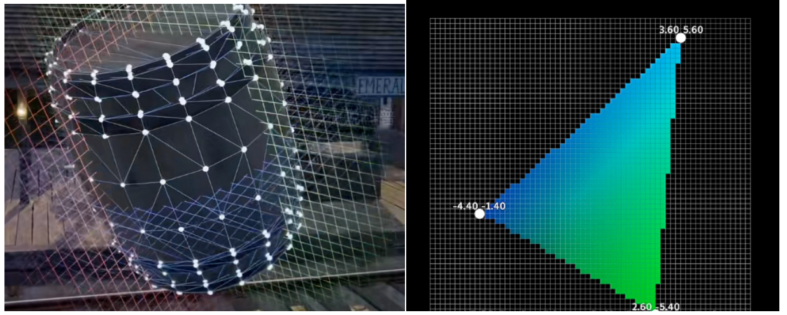
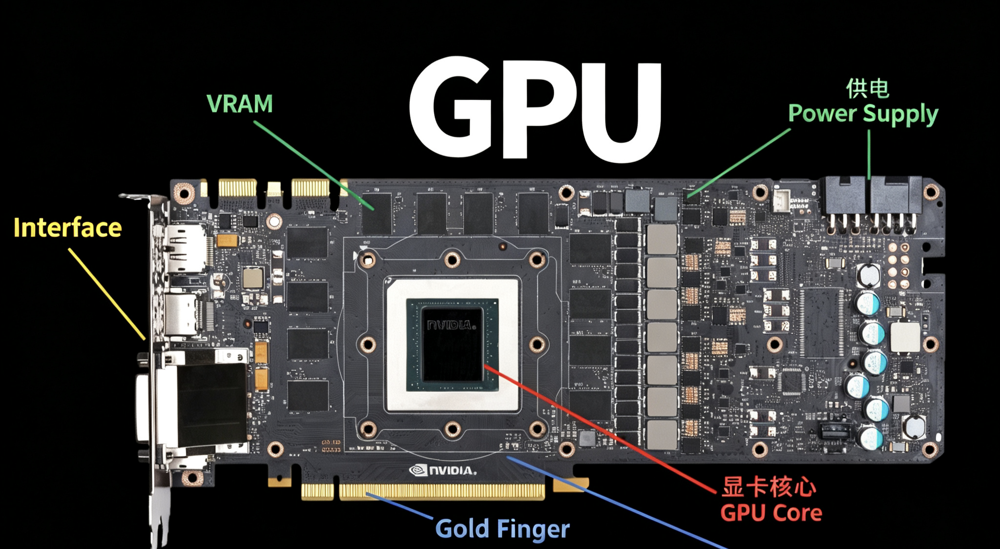
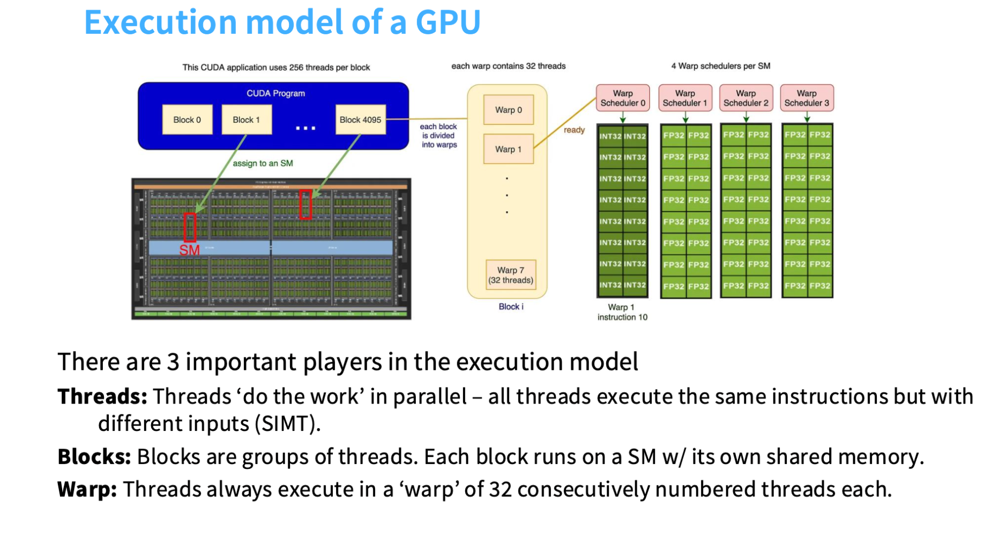
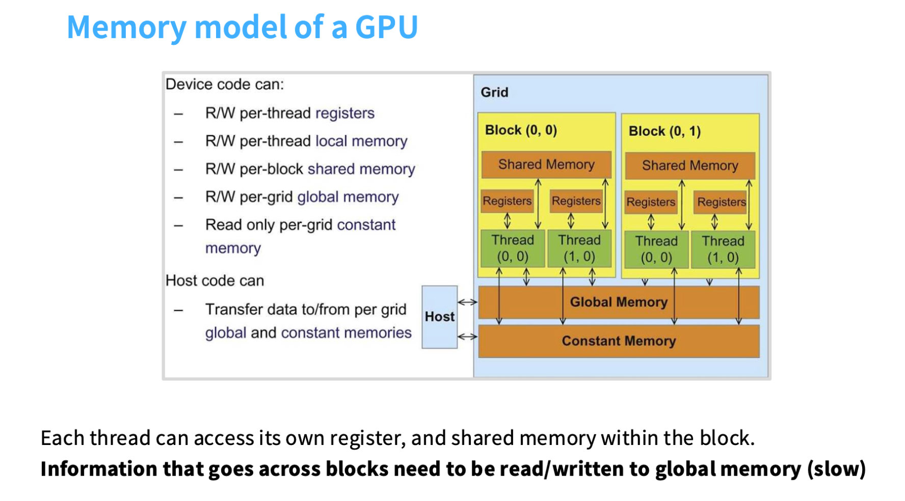

# Chapter 3 Introduction to GPU

Welcome to the zero-to-sglang course. This is the second part of the course. In the previous chapter we introduced the specific process of large-model inference and learned about the life journey of a token as well as technologies such as the KV Cache. Next, we will introduce the architecture of the GPU and the execution flow of an LLM on the GPU. As the foundation of large-model training and inference, the GPU runs through the entire life cycle of a large model, so it is necessary for us to learn GPU-related knowledge. Let us now begin this chapter.

## 1 Chapter Overview

This chapter revolves around **GPU hardware architecture** and the **execution flow of large-model inference on the GPU**, and is divided into three parts:

1. **GPU architecture fundamentals**: Starting from the origin of the GPU as a graphics processor, we compare the design philosophies of the CPU and the GPU (low latency vs. high throughput), and take the A100 as an example to break down GPC→TPC→SM→CUDA/Tensor Core.

2. **The GPU execution model**: We explain the three-level scheduling of Block/Warp/Thread under the SIMT execution model, as well as the multi-level memory hierarchy of registers→shared memory→L2→global memory.

3. **The execution flow of LLM inference on the GPU**: We explain why LLM inference is inseparable from the GPU, and break inference down into three stages: preprocessing, the compute-intensive Prefill, and the memory-intensive Decode.

## 2 GPU Architecture Fundamentals

### 2.1 The Origin of the GPU: The Graphics Processor

Before the concept of deep learning became popular, the GPU was, in the eyes of ordinary people, a **gaming graphics card**—that is, a graphics processor. The following example illustrates the difference between the GPU and the CPU.

When we open a 3D model in a game, we can see that the 3D model is composed of one **small triangle** after another. A triangle is made up of three lines. To save storage space, we only store the coordinates of the triangle's three vertices; we do not store the coordinates of the pixel points that make up the lines, but compute them in real time.

    

<em>Figure 1. 3D models and the computation of triangles</em>

Since a straight line is formed by two points, we find that for a line we only store **the information of the two endpoints**, and the pixel points in the middle are computed and rendered in real time. From the coordinates of the two vertices we can compute the slope and intercept, and thus calculate the positions of the points between the two lines. Although these are all simple calculations—only a large number of simple multiplications and additions—the CPU is inherently built to execute complex logic and can only compute them one by one, so the **computation time is very long**.

People then thought of creating a computing unit that can **perform large amounts of simple multiplication and addition in parallel**, which is the GPU. There is no superiority or inferiority between the CPU and the GPU; they are simply units designed to perform different functions. The computing units of the GPU are called **CUDA cores**.

#### 2.1.1 The Sprouting of Graphics Display (Before the 1980s)

**In the era without GPUs**, computers relied entirely on the CPU to compute graphics for display. **1981**: The CGA display card equipped in the IBM PC could only display 16 colors, like an electronic photo frame, with all computation done by the CPU. **1987**: IBM introduced the VGA standard, capable of displaying 256 colors, but it was still a pure display function with no computing capability.

**The key** was that ATi was founded in 1985 and began using ASIC technology to make graphics chips. In 1992, ATi's Mach32 graphics card integrated **graphics acceleration** functionality for the first time, which was the starting point of the GPU.

#### 2.1.2 The Melee of 3D Accelerator Cards (1990s)

The 1990s were the golden age of graphics accelerators, but the formal name "GPU" did not yet exist.

**Milestone events**: In **1994**, 3DLabs released the Glint300SX, and **the first 3D accelerator chip for PCs** was born; in **1996**, 3dfx's Voodoo chip enabled ordinary PCs to run 3D games, ushering in the consumer-grade 3D era; in **1997**, Fujitsu released the first 3D geometry processor for personal computers, and Mitsubishi introduced a chip supporting **Transform and Lighting (T&L)**.

But standards among the various vendors were chaotic and mutually incompatible; the chips could only handle specific 3D tasks and were single-purpose; at the time they were called 3D accelerator cards, and there was still no concept of a GPU.

#### 2.1.3 The Formal Birth of the GPU: NVIDIA (1999–2006)

In **1999**, NVIDIA released the GeForce 256 and **proposed the concept of the GPU (Graphics Processing Unit) for the first time**. This name distinguished it from the traditional CPU and declared **the birth of the graphics card**.

The GeForce 256 was revolutionary. In terms of **hardware T&L technology**, it liberated the coordinate transformation and lighting computation of **3D** graphics from the CPU, making them the GPU's dedicated job. It achieved **single-chip integration**, integrating the functions of triangle construction, clipping, texturing, and rendering, and it achieved a **performance leap**: reducing the CPU's 3D computation burden by more than 80%.

In 2000 the market underwent a major reshuffle. After 2000, old vendors such as 3dfx and Matrox gradually withdrew, leaving only NVIDIA GeForce and ATI Radeon to compete for supremacy (ATI was acquired by AMD in 2006).

#### 2.1.4 The Programmable Era: (2001–2012)

Phase One: Fixed-Pipeline Shaders (2001–2006)

In **2001**, Microsoft's DirectX 8 introduced the **vertex shader** and the **pixel shader**, and the GPU could run simple programs. Previously the GPU was like a worker tightening screws on a fixed assembly line; now it became capable of executing simple instructions.

Phase Two: Unified Shader Architecture (2006–2012)

In **2006**, NVIDIA released the GeForce 8800 GTX (the G80 core), **the first GPU with a unified shader architecture**. Originally the vertex shader and the pixel shader were separate; now they became general-purpose. Computing resources could be allocated dynamically, raising utilization from 50% to over 90%. At the same time, NVIDIA released **CUDA** technology, enabling the GPU to run C programs.

| Architecture / Year | Core Technology | Representative Product |
|------------|----------|----------|
| Tesla (2006) | Introduced CUDA, ushering in GPGPU | GTX 280 |
| Fermi (2010) | Supported double-precision computation, ECC error correction | GTX 480 |
| Kepler (2012) | Dynamic parallelism, high energy efficiency | GTX 680 |

#### 2.1.5 The General-Purpose Computing Era (2012–2018)

**2012** was the turning point: AI researchers used GPUs to train deep neural networks, making AlexNet's image-recognition accuracy astound the world. From then on, the GPU was upgraded from a gaming graphics card to an AI engine.

NVIDIA built the **NVIDIA CUDA ecosystem**, allowing programmers to easily harness GPU computing power.

#### 2.1.6 The Difference Between the CPU (Central Processing Unit) and the GPU (Graphics Processing Unit)

The CPU is the execution model we first came into contact with. Programs run sequentially, executing instructions step by step in a single thread. Supporting this execution mode requires a large control unit and fast execution capability, because there is a great deal of branching and conditional control logic. Therefore the CPU devotes a large amount of chip area to branch prediction (see the figure below); although the **number of cores is limited, they run extremely fast**. By contrast, the GPU has a vast number of **computing units** (ALUs)—those little green squares. **Only a very small portion of the chip area is used for control logic, using a small amount of control logic to coordinate a huge number of parallel-computing units.** Conceptually, this reflects the different priorities of the CPU and the GPU.

The design goals of the two are completely different. The CPU optimizes latency, pursuing **the fastest completion of a single task**. The **GPU optimizes throughput**; the GPU does not care about the latency of a single task, and only pursues the fastest overall completion of all tasks. To this end, the GPU is equipped with a large number of threads that can be quickly put to sleep and woken up. Although the GPU's latency per task is higher, its overall completion time actually leads the CPU. This is their different design philosophy and goal. Therefore, the architectural difference of the GPU lies in the fact that the GPU runs a large number of **Streaming Multiprocessors** (SMs).

The CPU was originally designed to minimize single-task latency and respond quickly to complex logic. Most of its transistors are used for control logic and cache. The number of cores is usually 4–64, and it can perform tasks such as out-of-order execution, branch prediction, and speculative execution.

The GPU was originally designed to maximize data throughput and process simple computations in bulk. Most of its transistors are used for Arithmetic Logic Units (ALUs). Its cores are numerous but simple, reaching the thousands (e.g., the A100 has 6,912 FP32 CUDA cores). It optimizes **throughput**, pursuing the fastest overall completion of all tasks, and to this end is equipped with a large number of threads that can be switched quickly to hide memory-access latency; the latency of a single task is not its optimization target.

    

<em>Figure 2. Structural comparison of the GPU and the CPU</em>

From the figure above, we can see that the **CPU's computing units** (the green part) are few, and most of it is used for **Control** and **Cache**. This determines that it can perform **complex logical operations**. The GPU is different: it has **few control units (the yellow part)**, and most of it is **green computing units**. This determines that it can perform **large amounts of parallel simple multiplication and addition**. In scenarios that require a lot of branch judgment and complex control flow, the GPU's efficiency is far lower than that of the CPU. The GPU mainly optimizes **throughput**, pursuing the fastest overall completion of all tasks. Control logic occupies only a tiny fraction of the chip area, while computing units (ALUs) make up the vast majority. Therefore, when we use a GPU, we still need **the CPU's scheduling**; a good GPU must be paired with a good CPU to fully realize its potential.

In the AI era, the **matrices** in deep learning pushed the GPU to the altar. Because the core of the AI era is the computation of **neural networks**, which involves a large number of **matrix operations**, and the essence of matrix operations is a large number of **multiplications and additions**, this is particularly well suited to the GPU for such **simple and repetitive** operations. Around 2010, people began to use GPUs for AI-related computation.

### 2.2 The Composition of the A100 GPU Core

We use the A100 to introduce the specific structure of a GPU.

    

<em>Figure 3. The overall structure of a graphics card (GPU). The board carrying the components is the printed circuit board (PCB).</em>

A cross-sectional diagram of an NVIDIA graphics card is shown in the figure. A graphics card consists of **power supply, GPU core, video memory, display interfaces, and the gold fingers**.

We mainly introduce the GPU core: the GPU core is composed of **CUDA cores, control units, cache units, and so on**. The biggest difference between the CPU and the GPU is that the work the GPU is responsible for is mostly repetitive 3D modeling or rendering, and the streaming processors are responsible for vertex operations or pixel operations, dynamically allocating the number of streaming processors performing vertex and pixel operations to achieve efficient resource utilization.

**The A100** is a pure computing GPU that NVIDIA designed for data centers, with no graphics-output capability.

#### 2.2.1 Product Form Factor

The A100 comes in multiple form-factor versions; here we uniformly introduce the **PCIe 80GB version**.

GA100 is the physical design of the complete chip; actual products differ from the whitepaper. The core reason is chip binning: when manufacturing such a huge chip containing 54.2 billion transistors, it is very hard to guarantee 100% perfection. To avoid wasting chips with tiny defects, NVIDIA disables the problematic parts and sells them as slightly lower-spec products at a downgrade. Therefore, the A100 PCIe 80GB version is the product of disabling 1 GPC and another 2 TPCs from the complete GA100 chip, ultimately yielding 108 SMs.

Data source: [NVIDIA A100 Tensor Core GPU Architecture](https://images.nvidia.com/aem-dam/en-zz/Solutions/data-center/nvidia-ampere-architecture-whitepaper.pdf)

**Dimensions**: dual-slot full-height, 267 mm long. **Power consumption**: 300W (80GB version). **Cooling** is **passive**, with no fan (relying on the server's airflow ducting). **Interface**: PCIe 4.0 x16 gold fingers + NVLink bridge connector; **weight** about 1.4 kg.

#### 2.2.2 PCB Board-Level Components

**The GA100 GPU core chip**

**Packaging**: a giant BGA package, about 55 mm × 55 mm. **Location**: at the very center of the board, soldered onto the PCB. 54.2 billion **transistors**, a 7 nm process, with an area of 826 mm².

**HBM2e memory stacks** (a revolutionary design)
Unlike the GDDR memory chips of consumer-grade GPUs, the A100 adopts **3D stacking technology**:

#### 2.2.3 GA100 GPU Core Architecture

The Ampere architecture topology is as follows:

    

<em>Figure 4. The architecture of the GPU core</em>

The NVIDIA Ampere architecture is a GPU architecture released by NVIDIA in 2020, its eighth-generation GPU architecture. It uses a 7-nanometer process and integrates up to 54.2 billion transistors, making it the largest 7-nanometer chip in the world at the time. This architecture is mainly aimed at data centers, artificial intelligence, high-performance computing, and professional graphics.

The A100 has a four-level architecture topology. First is the **GPC (Graphics Processing Cluster)**; a complete PCIe 80GB version core has 7 GPCs; each GPC has 8 **TPCs (Texture Processing Clusters)**, for a total of 54 TPCs; each TPC has 2 **SMs (Streaming Multiprocessors)**, for a total of 108; each SM has 64 **CUDA cores**, for a total of 108 × 64 = **6,912 FP32 CUDA cores**.

Then there are the **Tensor Cores**, 4 per SM, for an actual total of 108 × 4 = 432. In addition, there are 5 HBM2 memory stacks.

Data sources:

[NVIDIA A100 Tensor Core GPU Architecture](https://images.nvidia.com/aem-dam/en-zz/Solutions/data-center/nvidia-ampere-architecture-whitepaper.pdf)

[https://ar5iv.labs.arxiv.org/html/2405.11425#1](https://ar5iv.labs.arxiv.org/html/2405.11425#1)

#### 2.2.4 The Internal Structure of the SM (Streaming Multiprocessor)

The A100's SM is the core of the Ampere architecture, with fundamental enhancements compared with consumer-grade GPUs:

The SM is the fundamental unit that maps a Thread Block onto physical hardware and completes the actual computation. When a GPU kernel is launched, thread blocks are assigned to idle SMs, and the SM is responsible for decoding the warps (32 threads each) within it and dispatching them to CUDA cores (which handle general-purpose operations) or Tensor Cores (which handle matrix multiply-accumulate operations) for execution. Without the SM's scheduling, the CUDA cores and Tensor Cores cannot run on their own.

    

<em>Figure 5. The architecture of the SM (Streaming Multiprocessor)</em>

**The unique feature of the SM** lies in its **CUDA cores**, 64 per group, with an actual configuration of 64 FP32 + 64 INT32. In addition, there is the **third-generation Tensor Core**, which supports **structured sparsity** and also supports **double-precision FP64** (which consumer-grade GPUs do not have).

#### 2.2.5 Tensor Core

The NVIDIA A100 Tensor Core is its **third-generation Tensor Core** technology, the core computing unit specially designed for the A100 GPU to **accelerate AI training, high-performance computing (HPC), and data analytics**. Through dedicated hardware and brand-new precision formats, it achieves an order-of-magnitude performance leap in core operations such as matrix multiplication.

The Tensor Core is a hardware unit specially designed to perform **matrix multiply-accumulate (FMA)** operations, and it is far more efficient than general-purpose CUDA cores when handling the core operations of deep learning and scientific computing. The A100 supports multiple data precisions, and in particular introduces the innovative **TensorFloat-32 (TF32)** format. TF32 uses an 8-bit exponent and a 10-bit mantissa, providing the numerical range of FP32 and the mantissa precision of FP16. Tensor Cores perform multiplication in TF32 and accumulate the results in FP32. The A100's Tensor Core supports **structured sparsity** technology. It can exploit the sparsity in AI models (i.e., a large number of parameters being zero) to **further increase** throughput.

The A100 Tensor Core provides astonishing computational throughput, with specific performance as follows:

| Precision | Dense Tensor Core Performance | Description |
|------|----------------------|----------------------|
| FP16/BF16 | 312 TFLOPS | Half precision, the workhorse precision of deep learning. |
| INT8      | 624 TOPS   | 8-bit integer, mainly used for AI inference, extremely fast. |
| FP64      | 19.5 TFLOPS | Double precision, meeting the high-precision needs of scientific computing, etc. |
| TF32      | 156 TFLOPS | FP32 numerical range, FP16 mantissa precision, and FP32 accumulation. |

| Precision | Sparse Tensor Core Performance (2:4) | Description |
|------|----------------------------|----------------------------|
| FP16/BF16 | 624 TFLOPS | Half precision, the workhorse precision of deep learning. |
| TF32      | 312 TFLOPS | FP32 numerical range, FP16 mantissa precision, and FP32 accumulation. |
| INT8      | 1248 TOPS  | 8-bit integer, mainly used for AI inference, extremely fast. |
| FP64      | Sparsity not supported, still 19.5 TFLOPS |

Data source: [NVIDIA A100 Tensor Core GPU](https://images.nvidia.cn/aem-dam/en-zz/Solutions/data-center/a100/nvidia-a100-datasheet-nvidia-a4-2188504-r5-zhCN.pdf#1#1)

In the context of GPU computing (especially the A100's Tensor Core), **dense** and **sparse** refer to the **way data is processed**, which directly determines whether the compute power can be doubled.

Simply put, **dense** computation, during computation, takes all the numbers in the matrix (including zeros) to participate in the multiply-accumulate operations, none left out. **Sparse**: **the A100's 2:4 sparsity is structured sparsity, where at most 2 out of every 4 consecutive values in the weight matrix are kept as non-zero; the hardware, when loading, reads only the non-zero values and their indices, directly skipping the computation corresponding to the zero values.** Because zero multiplied by any number is zero, skipping them can save half the computation, so the speed naturally doubles.

**1. Dense Computation (Default Mode)**

It is essentially standard matrix multiplication. For example, multiplying two 1024×1024 matrices requires the Tensor Core to perform about 1 billion multiply-accumulate operations. In this case, the A100's FP16 compute power is **312 TFLOPS** (i.e., 312 trillion operations per second). This is its baseline speed.

**2. Sparse Computation (Accelerated Mode)**

Using **structured data**, the A100 requires that among **every 4 consecutive values in the matrix weights, at least 2 are forced to be 0** (i.e., 2:4 sparsity). This is not random; this fixed mathematical pattern must be satisfied. Because it knows half are zero, the Tensor Core **automatically compresses** the data when reading it, reading only those 2 non-zero values and their index positions to compute. The amount of computation is directly halved, so the FP16 compute power rises from **312 TFLOPS** to **624 TFLOPS**.

As mentioned earlier, the A100 GPU has **432** third-generation Tensor Cores, distributed across **108** Streaming Multiprocessors (SMs). The Tensor Core adopts a **Warp-Level** programming model. A warp (32 threads) works cooperatively to load data from video memory into registers, and then the Tensor Core performs the matrix operations. Developers can invoke Tensor Cores through deep learning libraries such as **CUDA** and **cuDNN**, as well as mainstream AI frameworks (such as PyTorch and TensorFlow).

A detailed description of the above can be found in the [NVIDIA technical blog](https://developer.nvidia.com/blog/using-tensor-cores-in-cuda-fortran/).

## 3 The GPU Execution Model

We have briefly introduced the structure of the A100 GPU, but we do not yet know how the GPU actually executes computation. Next, we introduce how the various parts of the GPU perform computation.

### 3.1 The Execution Flow of the SM (Streaming Multiprocessor)

We can regard the Streaming Multiprocessor as **the basic hardware unit in the GPU for independent scheduling and execution**. When programming with tools like Triton, the level of operation corresponds to a block, which is assigned to an SM for execution. Inside each SM, it contains many **Streaming Processors** (SPs), and each streaming processor **executes a large number of threads in parallel**. It can be understood this way: the SM has a set of **control logic** that can decide what to execute, such as implementing **branch judgment**; while the SP is responsible for applying the same instruction to different pieces of data. This enables massive parallel computation. Under this architecture, each **SM is the basic unit of control granularity**, while a single SP can independently complete a large amount of computation. Take the A100 as an example: it contains 108 SMs, far exceeding the core count of most CPUs. Each SM internally integrates a large number of SPs and dedicated matrix-multiplication units—this is the basic form of its computing model. Each SM can control its dedicated components (such as Tensor Cores) to perform computation.

**Thread Scheduling and Execution**

The SM manages **thousands of threads** simultaneously, deciding which thread uses which computing unit at what time. Unlike the CPU, it does not save a large amount of state for each thread; instead it performs lightweight switching with almost no overhead.

**Instruction Pipeline**

The SM internally has **4 independent instruction pipelines**, and each clock cycle it can simultaneously issue 4 different instructions to different warps.

**Data Caching and Sharing**

The SM has a built-in **192KB L1 cache / shared memory**, allowing all CUDA cores within this SM to quickly access data, with much lower latency than global video memory.

### 3.2 A Detailed Explanation of the Core Terms of the Execution Model

    

<em>Figure 6. The execution flow of the SM</em>

In GPU operation, we divide thinking into three levels of granularity: **block, warp, and thread**, which is the order of progressively finer granularity. A block is a large group of threads, and **each block is assigned to one SM for processing**. You can think of each SM as a unit that **works independently**, and the block as the **processing unit** assigned to it. Inside each block there are **a large number of threads**, and each thread represents a task unit to be executed. When these threads execute, they run in groups, and this grouping is called a warp. Each warp consists of 32 consecutively numbered threads, extracted from the block and executed synchronously. From this diagram we can see: multiple blocks are assigned to different SMs, each block contains multiple warps, and each warp in turn consists of a large number of threads. All these threads execute the same instruction on different data—this is the basic execution model.

    

<em>Figure 7. The memory view of the execution model</em>

#### 3.2.1 Warp

The concept of the warp originates from its working mechanism: all threads execute the same instruction in lockstep, but each processes its own different data. In the A100, each SM (Streaming Multiprocessor) can simultaneously host up to 64 active warps.

A **warp** is a fixed group of 32 threads and is the **smallest unit** of SM scheduling. **A warp is like a "bus"**: the 32 passengers (threads) must **get on and off at the same stop**, executing exactly the same instruction. If some thread needs to take a different branch (if-else), the whole bus has to wait for it—this is called **Warp Divergence**.

The SM simultaneously resides **64 warps**, with 4 warp schedulers each managing 16 warps; the 32 threads within a warp execute synchronously on the **SIMD units**. Warps are created, managed, and scheduled by the SM's SIMT (Single Instruction, Multiple Threads) unit. After a Thread Block is assigned to an SM, the SM groups the threads within it according to consecutive, increasing thread IDs.

#### 3.2.2 Block

A block is a group of threads specified by the programmer, mapped onto **1 SM** for execution. A block must be entirely mapped onto the same SM for execution and cannot be split across multiple SMs.
Each block exclusively occupies the SM's **shared memory** and **register resources**; all threads within a block must execute **within the same SM** (they cannot cross SMs).

#### 3.2.3 Thread

A thread is the **finest-grained execution unit**; each thread executes the same kernel code but operates on different data. A thread is like a "worker on an assembly line," each responsible for one data element (such as one number in a vector).

Each thread has **private registers** (up to 255 per thread); the thread ID `threadIdx.x` determines which data it processes.

#### 3.2.4 SIMT (Single Instruction, Multiple Threads)

The GPU execution model in which multiple threads (a warp) share the same instruction but operate on different data. **SIMT (Single Instruction, Multiple Threads)** is the **parallel-computing execution model** adopted by NVIDIA GPUs (including the A100). It was first introduced by NVIDIA in the G80 architecture and is the theoretical basis by which the CUDA programming model can hide hardware details and let developers program according to multi-threaded logic.

SIMT is the **fundamental way the SM (Streaming Multiprocessor) executes instructions**. After a GPU kernel is launched, the **warp scheduler** within the SM fetches an instruction at the granularity of a **warp** (a fixed 32 threads), and then **broadcasts** that instruction to all active threads within the warp. Each thread, on its own CUDA core or Tensor Core, operates on the **different data** stored in its **private registers**, achieving the parallelism of "one instruction processing multiple pieces of data."

#### 3.2.5 The Essential Difference from SIMD (Single Instruction, Multiple Data)

| Feature | **SIMT (GPU)** | **SIMD (e.g., the CPU's AVX)** |
| :--- | :--- | :--- |
| **Execution granularity** | Multiple threads (each thread has its own independent instruction address counter and register state) | Vector lanes (the entire vector shares a single instruction address) |
| **Branch handling** | **Supports thread-level branching** (if/else, loops), able to independently execute different paths | All lanes must execute uniformly; branching is difficult |
| **Hardware implementation** | The hardware scheduler dynamically manages the thread mask | The compiler packs data into vectors |

**Warp Divergence**

Although SIMT supports branching, there is a significant performance constraint. When the 32 threads within a warp encounter a **conditional branch** (such as `if (threadId % 2 == 0)`), some threads satisfy the condition (active) and some do not (inactive).

The SM cannot let active and inactive threads execute different instructions simultaneously. It can only **execute the active-thread path first**, masking the inactive threads via a **mask**; then **switch to executing the other path**, masking the previously active threads.

If the branch divergence within the same warp is severe, the two paths **execute serially**, and the performance loss is close to half (or even more). Therefore, the key to optimizing SIMT programs is to **avoid branch divergence within the same warp as much as possible**.

The SIMT model is **the underlying logic of the GPU's high throughput**. It encapsulates hardware-level **SIMD-style dense computation** into **SPMD-style programming flexibility**, enabling developers to write multi-threaded code similar to that of the CPU, while the hardware, through warp scheduling, masking, and convergence mechanisms, automatically maps thread-level parallelism into a high-throughput computation stream. This is precisely the basis on which the A100's SM can efficiently and cooperatively schedule the instruction execution of CUDA cores and Tensor Cores.

### 3.3 The GPU Memory Model

    

<em>Figure 8. The GPU's memory hierarchy model</em>

**The closer the memory is to the SM, the faster the access speed.** Therefore there exist **extremely high-speed memory types (such as the L1 cache and shared memory)** that are located inside the SM and have **extremely fast read/write speeds**. The **register file** resides inside the SM and stores thread-private variables and computation results.

As shown in the figure, these green regions are SM clusters, while **the blue region represents the L2 cache adjacent to the SMs**. Although they are not inside the SM, their physical location is still very close, and they are **quite fast** too (although an order of magnitude slower than L1). Outside the chip (take this 3090 or PCIe A100 as an example), **DRAM memory** is actually installed next to the GPU chip, which means the data must physically **leave the chip and travel through physical connections**. You can see these yellow connectors along the edge in this chip diagram. These are the HBM connectors, which connect to the DRAM chips outside the actual GPU.

You can see on the left side of the figure above the **speed** required to access these memories. The access speed of the memory inside the SM is much faster—it takes only about 20 clock cycles to fetch data from it—whereas accessing the L2 cache or global memory takes 200 to 300 clock cycles. This **gap severely impacts performance**. If a piece of computation needs to access global memory, it may mean that your SM has no work to do—the matrix multiplications are all done, the tasks are exhausted, and it can only spin idle. In this case **utilization will not be high**. This will, to some extent, become the central theme in thinking about memory architecture, and it is also the key to understanding how the GPU works.

First are the registers, **which are extremely fast storage units** used to hold individual numeric data. Local memory, shared memory, and global memory increase progressively in the memory hierarchy, and their speed becomes slower and slower.

**Code can write to global memory** and can also write to constant memory (although this is not commonly used). Each thread can access **its own registers and shared memory**, but **information across thread blocks must be written to global memory**. This means that when writing the threads that execute a task, ideally they should operate on the same small batch of data, so that there is no need to cross threads. We can load this small batch of data into shared memory, all threads can efficiently access the shared memory, and once execution is complete the task is done. This is the most ideal execution mode. Conversely, **if a thread needs to access data all over the place**, it must access **global memory**, which is very, very slow.

---

#### 3.3.1 Level One: Global Memory

| Feature | Parameter / Description |
|------|------------|
| **Physical location** | The HBM2e memory stacks outside the GPU chip; the 80GB version uses HBM2e |
| **Capacity** | A100: 80GB |
| **Bandwidth** | **~2 TB/s** (A100 80GB PCIe, HBM2e); |
| **Latency** | 290 cycles; this varies across benchmarks and has multiple different values—the value adopted here is from [Stanford's cs336 data](https://cs336.stanford.edu/) |
| **Programming control** | **Manual management** (`cudaMalloc`) |
| **Visibility** | Accessible to all threads |

Global memory can hold all of the model's weights, activations, and gradients; training data, intermediate results, and final outputs, achieving **data persistence**; we copy data from host memory via PCIe, so it is the **CPU-GPU transfer channel**.

Global memory provides **massive capacity** (80GB), able to accommodate the huge memory footprint of large models; its cost is relatively low (HBM2e, though expensive, is 100 times cheaper than SRAM) and it is the foundation of GPU storage.

---

#### 3.3.2 Level Two: L2 Cache (Level-Two Cache)

| Feature | Parameter / Description |
|------|------------|
| **Physical location** | **Inside the GPU chip, shared by all SMs** |
| **Capacity** | **40MB** (A100) |
| **Bandwidth** | NVIDIA officially states that the A100's 40MB L2 cache, through a new architectural design, [provides up to 2.3x the read bandwidth compared with the V100](https://developer.nvidia.com/blog/nvidia-ampere-architecture-in-depth/). Although there is no officially published exact figure, the industry generally, based on testing and estimation, considers its bandwidth to be about 5 TB/s |
| **Latency** | 200 cycles |
| **Programming control** | **Automatic management** (hardware-controlled) |
| **Visibility** | All threads on all SMs |

The L2 cache can **accelerate global data** by automatically caching hot data from global memory (such as frequently accessed model weights); it is a **data-sharing hub**, where SMs exchange data through the L2 cache; and it can **guarantee data consistency**, so the L2 data seen by all SMs is consistent.

The L2 cache can also alleviate the memory-wall bottleneck—this is the L2 cache's most fundamental role. By caching frequently accessed data (such as model weights), the L2 cache avoids accessing the slow video memory (HBM) every time, which can significantly reduce latency and improve effective bandwidth.

Moreover, in the NVIDIA architecture, all data communication between all GPU units (including all SMs) and the video memory (HBM) must pass through the L2 cache. It can be said that the L2 is the data hub of the entire GPU. Unlike the L1 cache, which is private to each SM, the L2 cache is shared by all SMs of the entire GPU. This means that threads on different SMs can efficiently share data, achieving cross-SM data communication.

---

#### 3.3.3 Level Three: L1 Cache / Shared Memory

| Feature | Parameter / Description |
|------|------------|
| **Physical location** | **Inside each SM** |
| **Capacity** | 192KB/SM combined L1 cache and shared memory, with [up to 164KB/SM configurable as shared memory](https://docs.nvidia.com/cuda/ampere-tuning-guide/) |
| **Latency** | Measurements in Figure 8: 33 cycles for L1 cache and 23/19 cycles for shared-memory loads/stores |
| **Programming control** | L1 cache is managed automatically by hardware; shared memory is used explicitly by the program (`__shared__`) |
| **Visibility** | L1 cache serves threads on the SM; each block’s shared memory is accessible to threads within that block |

The L1 cache is managed automatically by hardware and caches data accessed by threads. Shared memory is used explicitly by the program to exchange data among threads in the same block, for example to reuse tiles in matrix multiplication.

L1 cache hits and data reuse in shared memory both reduce accesses to the next memory level.

#### 3.3.4 Level Four: Register File

| Feature | Parameter / Description |
|------|------------|
| **Physical location** | **Inside the SM, next to each CUDA core** |
| **Capacity** | **256KB/SM** (A100) |
| **Programming control** | **Fully automatic** (allocated by the compiler) |
| **Visibility** | **Thread-private** |

The register file can achieve **zero-latency computation**; it stores threads' local variables and temporary results. It also achieves **extreme parallelism**, with 255 registers per thread, supporting deep pipelining.

The characteristic of the register file is that it is **fast**, but **expensive**, because the register file has a small capacity. Its **capacity limit determines the degree of parallelism**: the fewer registers used, the more warps an SM can reside.

#### 3.3.5 Why GPU Memory Is Divided into So Many Levels

In the physical world, the upper limit of speed is the speed of light. It takes time for an electrical signal to propagate through a wire, and the shorter the physical distance, the naturally lower the transmission latency. The latency of on-chip communication is far lower than that of off-chip communication.

The closer the memory is to the GPU's computing cores, the faster its speed, but the smaller its capacity, due to the chip's space constraints. The farther from the GPU core, the larger the memory capacity, but the lower the speed.

In addition, data just accessed is very likely to be accessed again (such as the weights in a loop), so placing it in global memory incurs a large overhead. There is also **spatial locality**: adjacent data is very likely to be accessed together (such as elements in the same row of a matrix).

**The GPU's solution** is to divide into levels: the **L2 cache** exploits temporal locality, caching repeatedly accessed weights; **shared memory** exploits spatial locality, manually loading tiling data; and the **warp** exploits the broadcast feature of constant memory, serving 32 threads with a single read.

#### 3.3.6 The Essential Difference Between GPU Memory and CPU Memory

The table below illustrates the difference between the GPU and the CPU:

| Feature | GPU (A100) | CPU (Xeon) |
|------|------------|------------|
| **Main-memory bandwidth** | 2 TB/s | Xeon 6 can reach several hundred GB/s |
| **Cache control** | Shared memory is **manually controlled** | Cache is fully automatic |
| **Thread registers** | [255 per thread](https://forums.developer.nvidia.com/t/whats-the-max-register-number-that-causes-slowdown/234969#main-container) | The x86-64 architecture has 16 general-purpose registers per thread (x86) |
| **Latency tolerance** | **Hides latency** through warp switching | Latency reduction above all |
| **Memory model** | **Explicit synchronization of shared memory** | Cache-coherence protocol |

**The essential difference between the CPU and the GPU** is that the GPU memory system is **optimized for throughput** and tolerates high latency, while the CPU memory system is **optimized for latency** and reduces latency. This is why the GPU needs more levels and manual control.

## 4 The Execution Flow of LLM Inference on the GPU

The core of LLM inference on the GPU is **autoregressively** generating tokens one by one, and the whole process can be clearly divided into three stages: **preprocessing**, **Prefill**, and **Decode**. This is closely related to the GPU execution model we learned earlier, and each stage has completely different demands on GPU resources.

### 4.1 Why LLM Inference Is Inseparable from the GPU

Before breaking down the inference flow, let us first answer a fundamental question: why does large-model inference almost necessarily rely on the GPU? The answer goes back to the GPU architecture and execution model discussed in the previous two chapters.

**1. The essence of inference is a huge amount of matrix operations.** Every layer of the Transformer is composed of large-scale matrix multiplications (GEMM/GEMV)—attention's Q×Kᵀ, the attention-weighted summation, and the linear projections and FFN of each layer are all, in essence, large amounts of simple multiply-accumulate operations. This is exactly the work that the GPU's thousands of CUDA cores and dedicated Tensor Cores are best at, whereas the CPU has only a few dozen heavy-logic cores, and serially processing operations of this scale would be several orders of magnitude slower.

**2. Large models require extremely high memory bandwidth.** A 70B model's FP16 weights are about 140GB, and each generated token requires moving the relevant weights from video memory to the computing units. The GPU's HBM memory bandwidth can reach about 2 TB/s, far greater than that of CPU main memory. Inference speed is largely determined by how many bytes of weights can be moved per second, and the CPU memory system simply cannot meet this.

**3. The GPU's design of hiding latency with throughput happens to fit inference.** During inference, hundreds or thousands of tokens and multiple requests can be processed in parallel. Through warp switching, the GPU immediately schedules other ready threads while waiting for memory access, eliminating memory latency through scheduling and keeping the expensive computing units and memory bandwidth continuously saturated. The CPU pursues low latency for a single task and, faced with such large-batch homogeneous tasks, cannot bring its strengths to bear.

**4. The maturity of the software ecosystem.** CUDA, cuDNN, and frameworks such as PyTorch/TensorFlow, together with operators deeply optimized for the GPU memory hierarchy such as FlashAttention and PagedAttention, make the GPU the de facto standard platform for LLM training and inference.

**LLM inference is a typical compute-intensive + memory-intensive task, and the GPU is precisely hardware born for large-scale parallel computation and high-bandwidth memory access. The two are highly compatible, and this is the fundamental reason why inference is inseparable from the GPU.**

### 4.2 The GPU Inference Execution Process

All the input tokens are processed in parallel as **one huge matrix**. Operations such as matrix multiplication (GEMM) dominate, the **arithmetic intensity is extremely high**, and they can effectively utilize the GPU's Tensor Cores.

#### 4.2.1 **CPU work**:

During model loading, the weights are transferred into GPU memory. When a request arrives, the CPU tokenizes the input and prepares the token IDs and other inputs.

The CPU notifies the GPU to begin executing the computation via a kernel-launch instruction. This instruction defines the scale of the thread grid and thread blocks that need to be launched on the GPU.

#### 4.2.2 Data Transfer

The CPU transfers the token IDs and other inputs to the GPU through the A100’s PCIe 4.0 x16 interface.

The GPU performs embedding and linear projections to produce Q, K, and V, then computes attention and the feed-forward network. Intermediate results remain on the GPU for subsequent operations, ultimately producing an output token.

#### 4.2.3 The GPU Computing Matrix Multiplication in Parallel

This is the core link where the GPU brings its parallel-computing capability into play.

1. **Task decomposition**: The GPU's **thread scheduler** decomposes the huge matrix-multiplication task (such as `Q×K^T`) into a large number of smaller task blocks that can be executed in parallel.
2. **Tiling**: The output matrix C is divided into multiple **tiles**, and the computation task of each tile is assigned to one **block**.

3. **Fine-grained allocation**: Within a block, the task is further allocated to smaller **warps**, and ultimately each **thread** is responsible for computing one or a few elements in the result matrix.

After a **Streaming Multiprocessor** receives the task block assigned to it, the following fine-grained data flow and computation occur internally:
1.  **Load into shared memory**: The SM first loads the data block needed for computation from **global memory (HBM)** into the faster **shared memory**. This can significantly reduce repeated access to the slow global memory.
2.  **Allocate to registers**: Next, the **thread** reads the portion of data it is responsible for computing from shared memory and stores it in the fastest **registers**.
3.  **Core computation**: Finally, the **CUDA cores or Tensor Cores** perform the multiply-accumulate operations on the data in the registers.
4. **Write back the result**: After the computation is complete, the result data is written back from the registers along the original path via shared memory, and ultimately back to **global memory**.

For this process, refer to the [document from the University of Michigan's Department of Electrical Engineering and Computer Science](https://web.eecs.umich.edu/~fessler/irt/irt/mex/src/fdk/fdk-cuda-wei/doc/).

### 4.3 The Prefill and Decode Stages

The Prefill and Decode stages were explained in detail in Chapter 2 and are not repeated here; we only explain the GPU-related content.

**The Prefill stage**: processes the entire user input; it is **batched matrix multiplication (GEMM)**, **compute-intensive**, mainly relying on the **Tensor Core**, and processes all user input at once. It is massively parallel. This stage is compute-intensive because it involves a large amount of matrix multiplication (GEMM) and can fully utilize the GPU's Tensor Cores. In this stage, GPU compute power is the bottleneck, so it is called a **compute-intensive** task.

**The Decode stage**: generates output token by token; it is **matrix-vector multiplication (GEMV)**, **memory-access-intensive**, with the main bottleneck being moving the model weights and the KV Cache from HBM. It is strictly serial. After generating the first token, the model enters the Decode stage. Its task is to autoregressively predict the next token based on all previously generated tokens and the KV Cache. This stage processes only **the vector of one new token** at a time. The main operation is matrix-vector multiplication, and the amount of computation is far smaller than in the Prefill stage. At this point, **reading the entire model's weights and the huge KV Cache from video memory (HBM) becomes the performance bottleneck**. The GPU's computing units are often idle while waiting for data.

### 4.4 Summary

| Stage | Core Task | Computation Type | GPU Bottleneck | Key Optimization |
| :--- | :--- | :--- | :--- | :--- |
| **Prefill** | Process the input prompt | **Compute-intensive** | Tensor Core compute power | Maximize parallelism, make good use of matrix multiplication |
| **Decode** | Generate token by token | **Memory-intensive** | Video-memory bandwidth (HBM) | KV Cache, quantization, Continuous Batching |

## 5 Summary and Exercises

### 5.1 Summary

This chapter revolves around two main threads—**GPU hardware architecture** and the **execution flow of large-language-model inference on the GPU**—and its core content can be summarized as:

#### 5.1.1 **The Birth and Design Philosophy of the GPU**:

The GPU evolved from a graphics processor into an AI accelerator. Its essence is to trade **a large number of simple computing units (CUDA cores)** and **very little control logic** for **extremely high data throughput**, forming a sharp contrast with the CPU's "low-latency, complex-logic" design goal.

#### 5.1.2 **The Hierarchical Architecture of the A100 GPU**:

From the chip's global level (GPC → TPC → SM) to the SM's internals (CUDA cores, Tensor Cores, shared memory, register file), understand the role of each level and the data-flow path. Among them, the **SM** is the basic atomic unit of execution, and the **Tensor Core** is the dedicated circuit that accelerates matrix multiplication.

#### 5.1.3 **The GPU Execution Model**:

With **SIMT (Single Instruction, Multiple Threads)** at its core, threads are scheduled at the granularity of a **warp (32 threads)**, blocks are mapped to SMs, and threads perform the specific operations. Key concepts include **Warp Divergence**, **coalesced memory access**, and **hiding latency through warp switching**.

#### 5.1.4 **The GPU Memory Hierarchy and Bottlenecks**:
Global memory (HBM) has ~2 TB/s bandwidth but high latency; the L2 cache (40MB) comes next; each SM has 192KB of combined L1 cache and shared memory, with up to 164KB configurable as shared memory; the 256KB/SM register file stores thread-private data. **The growth of memory bandwidth lags far behind the growth of compute power**, which constitutes the "memory wall" and is also the main bottleneck of LLM inference.

#### 5.1.5 **The Two Stages of LLM Inference**:

**Prefill**: processes the input prompt, batched matrix multiplication (GEMM), **compute-intensive**, with the Tensor Core saturated.
**Decode**: generates token by token, matrix-vector multiplication (GEMV), **memory-intensive**, with HBM bandwidth as the bottleneck.

---

### 5.2 Exercises

1. What are the stages of LLM inference, what are the characteristics of each, and why has the GPU become the main tool for LLM inference?

2. Briefly describe the essential difference between the CPU and the GPU in architectural design, and explain why the GPU is suited to the matrix operations in deep learning.

3. Describe the differences between the Prefill and Decode stages of LLM inference in terms of computation type, bottleneck resource, and typical optimization techniques.

## References

- [https://datawhalechina.github.io/diy-llm/chapter6/chapter6_GPU和GPU相关的优化.html](https://datawhalechina.github.io/diy-llm/chapter6/chapter6_%E7%AC%AC%E5%85%AD%E7%AB%A0GPU%E5%92%8CGPU%E7%9B%B8%E5%85%B3%E7%9A%84%E4%BC%98%E5%8C%96.html)
- [https://cs336.stanford.edu/](https://cs336.stanford.edu/)
- [https://images.nvidia.com/aem-dam/en-zz/Solutions/data-center/nvidia-ampere-architecture-whitepaper.pdf](https://images.nvidia.com/aem-dam/en-zz/Solutions/data-center/nvidia-ampere-architecture-whitepaper.pdf)
- [NVIDIA A100 Tensor Core GPU Datasheet (Chinese version)](https://images.nvidia.cn/aem-dam/en-zz/Solutions/data-center/a100/nvidia-a100-datasheet-nvidia-a4-2188504-r5-zhCN.pdf)
- [https://ar5iv.labs.arxiv.org/html/2405.11425#1](https://ar5iv.labs.arxiv.org/html/2405.11425#1)
