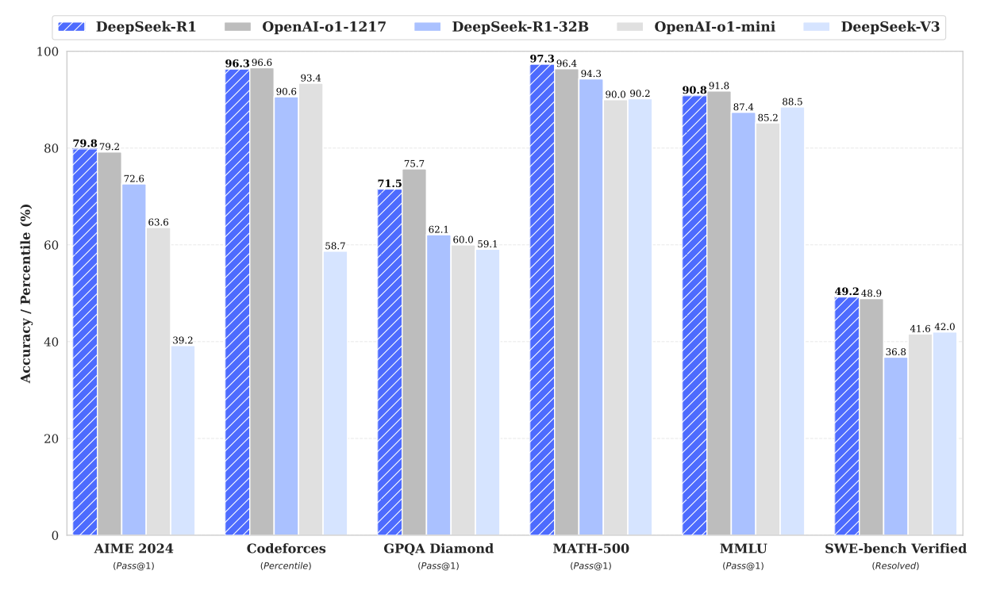
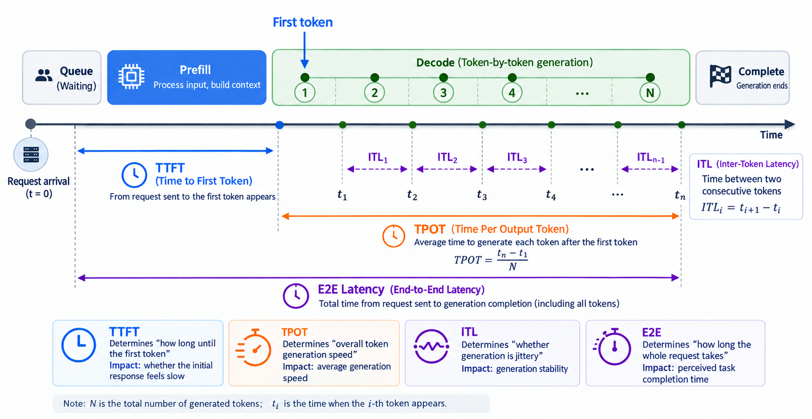
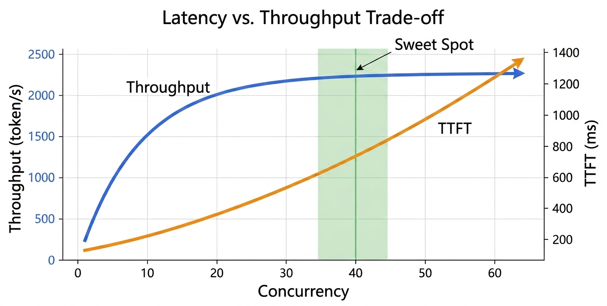
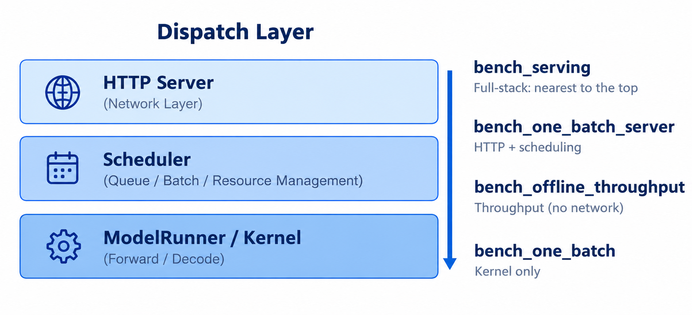
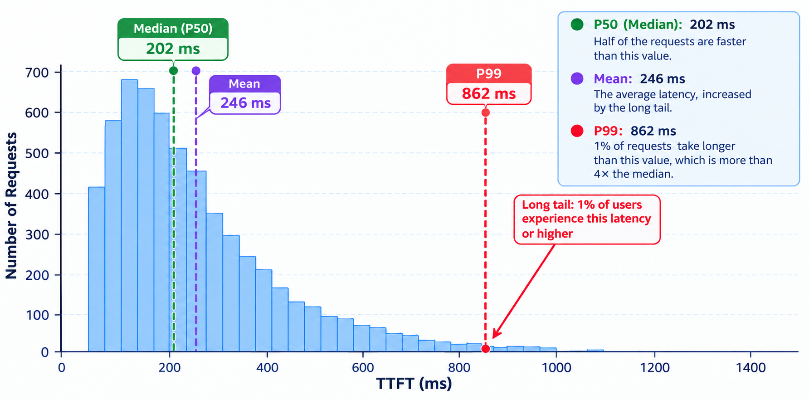

# Chapter 5 — Introduction to Benchmark

The previous chapters analyzed the inference process and distinguished the compute and memory-access characteristics of Prefill and Decode, pointing out that they are closer to compute-bound and memory-bound respectively. These conclusions are still qualitative. To verify system optimizations, compare different engines, or plan deployment capacity, we need quantitative performance data. A benchmark is exactly the method for obtaining such data while keeping results reproducible and comparable.

## 1 Learning objectives

The rest of this course will build a mini-sglang from scratch and analyze SGLang in depth. Along the way, whether each change is effective needs to be validated quantitatively with benchmarks. This chapter lays that foundation. By the end of this chapter, you should be able to:

- distinguish latency and throughput, and understand TTFT, TPOT, ITL, throughput, and Goodput;
- understand percentiles and tail latency, and learn to evaluate latency with distributions rather than means;
- choose a suitable benchmark dataset for the evaluation target and design a reproducible, comparable test;
- run SGLang benchmark tools and interpret their results.

## 2 What is a benchmark and why does it matter?

### 2.1 Introduction

When you open an evaluation website or paper about a large language model (LLM), what do you usually see first?

   
   
Figure 5.1 Benchmark performance of DeepSeek-R1

 

This is the most direct and common form of evaluation. When major models are released, they report scores on a series of standardized benchmarks.

Of course, evaluation should not focus on capability alone. Cost and inference speed are also key dimensions. Another example comes from [Artificial Analysis](https://artificialanalysis.ai/), which evaluates models from the perspectives of intelligence, inference speed, and price:

   
   
Figure 5.2 Model performance rankings on Artificial Analysis

 

Websites such as Artificial Analysis combine model performance with cost per token and plot a Pareto frontier. This reveals a practical reality: some frontier models are powerful but expensive, while some lower-ranked models may strike a better balance between performance and cost.

   
   
Figure 5.3 Performance-versus-cost comparison on Artificial Analysis

 

The central question of **evaluation** is: given a fixed model, how "good" is it? This looks like a simple scoring problem, but it is in fact a deep and complex systems-engineering effort. To understand the scope of this chapter, we first need to distinguish two kinds of benchmarks:

- **Model Capability Benchmark**: evaluates the model itself. Through standardized tasks such as MMLU, GSM8K, HumanEval, and SWE-bench, it measures output quality in knowledge understanding, mathematical reasoning, code generation, and other capabilities. It asks whether the model "answers well".
- **Inference Workload Benchmark**: evaluates an already deployed inference service. Under a given request workload, it measures TTFT, TPOT, throughput, P99 latency, and other engineering metrics. It asks whether the model "runs quickly and reliably", and is also commonly called an AI Infra benchmark.

The two kinds of benchmark differ in evaluation target, input form, and metrics: the former gives tasks to a model and checks answer quality; the latter sends requests to an inference service and observes system performance. They must not be conflated.

> Model capability benchmarks are not the focus of this chapter. Unless stated otherwise, “benchmark” means an `LLM inference workload benchmark`. For more on model capability benchmarks, see [Evaluation and Benchmarking](https://github.com/datawhalechina/diy-llm/blob/main/docs/zh/chapter12/chapter12_%E8%AF%84%E4%BC%B0%E4%B8%8E%E5%9F%BA%E5%87%86%E6%B5%8B%E8%AF%95.md).

### 2.2 Why use benchmarks?

A benchmark is a set of reproducible and comparable tests. Its value shows in three ways.

First, **understanding the performance boundaries and bottleneck characteristics of an inference service or hardware platform**. After changing one thing in the system, a subjective feeling that it "got faster" is not enough to prove anything. You need to run the same request set before and after the change and judge the gain by the quantifiable difference.

Second, **quantifying the actual effect of inference-service optimizations**. Whether two implementations, two kinds of hardware, or two versions are better or worse can only be settled by running the same workload under identical conditions.

Third, **providing data for capacity planning and resource allocation in production**. How many concurrent requests a single GPU can carry, and what latency it delivers at a given concurrency, must be measured before deployment rather than learned from production feedback.

## 3 Core metrics

Inference-service metrics fall into two categories: **latency**, which describes the response speed of an individual request, and **throughput**, which describes the system's overall output capacity. They answer different questions and cannot substitute for each other.

### 3.1 Latency metrics

There are four latency metrics. Their positions within a single request are shown below:

  
  
<em>Figure 5.4 Timeline of a request</em>

- **TTFT (Time to First Token)**: the time from sending a request to generating the first token, including queueing, Prefill, and the first Decode step. It reflects how long the user waits between sending the request and seeing the first output.
- **TPOT (Time Per Output Token)**: the average generation time per token after the first token, mainly determined by Decode; it reflects the generation rate.
- **ITL (Inter-Token Latency)**: the interval between adjacent tokens. It describes the same phenomenon as TPOT; the difference is that TPOT is an average, while ITL is observed token by token and more easily exposes jitter during generation.
- **E2E latency**: the total time from sending a request until it completes.

To illustrate how these metrics relate, suppose a request has an input of 1,000 tokens, aims to generate 200 tokens, and the measured TTFT is 250 ms and TPOT is 25 ms. The generation time for the remaining 199 tokens after the first one is:

$$\text{Remaining generation time} = 25 \times 199 = 4975 \text{ ms}$$

$$\text{E2E} = \text{TTFT} + \text{Remaining generation time} = 250 + 4975 = 5225 \text{ ms} \approx 5.2 \text{ s}$$

From the equations above, of the 5.2 s, Prefill accounts for only 250 ms; almost all the rest comes from Decode. Therefore, optimizing TPOT is more beneficial for **long-output** workloads, while TTFT is the main concern for **short-output, long-input** workloads such as document question answering. This conclusion is consistent with the compute-bound / memory-bound analysis in Chapter 2.

Converting TPOT into a generation rate is more intuitive: 25 ms/token corresponds to 40 tokens/s. The industry commonly uses 100 ms/token (10 tokens/s, roughly 450 English words per minute) as a reference lower bound for generation speed; below it, the reading experience degrades noticeably.

### 3.2 Throughput metrics

There are two throughput metrics:

- **Throughput**: output per unit of time, measured in `token/s` or `request/s`, representing the system's overall efficiency.
- **Goodput**: throughput subject to latency constraints. If TTFT must stay below 500 ms, requests beyond that limit are not counted; only the remaining ones count toward Goodput. Simply raising concurrency can push Throughput up, but if latency has blown past the limit across the board, that throughput has no practical value.

Because higher concurrency also raises latency, the industry has in recent years leaned toward Goodput rather than Throughput as the measure.

Latency and throughput trade off against each other: higher concurrency and larger batches mean higher GPU utilization and higher throughput, but each request queues longer and TTFT gets worse. The two must therefore be observed together.

  
  
<em>Figure 5.5 Throughput and TTFT as concurrency changes (constructed example)</em>

In Figure 5.5, the blue curve is throughput, the orange curve is TTFT, and the horizontal axis is concurrency; the data are constructed examples. The blue curve rises quickly at first and then approaches saturation, while the orange curve keeps rising as concurrency grows. Comparing the two shows that higher concurrency is not always better: there is a window where throughput is close to its ceiling while TTFT has not yet run away.

Different scenarios are sensitive to different metrics, corresponding to the scenario classification discussed in Chapter 2:

| Scenario | Key metrics |
|------|---------|
| Dialogue / chat | TTFT |
| Long-form generation / writing | TPOT |
| Offline batch processing / evaluation | Throughput |
| Real-time speech / multi-step Agent reasoning | TTFT and tail latency |

## 4 How to design a benchmark

The first question in designing a benchmark is to be clear about what you want to measure. Only then should you choose the corresponding dataset and fix the runtime parameters.

### 4.1 Define the evaluation target and workload

This section discusses **inference workload benchmarks**, not model capability benchmarks. Model capability benchmarks use tasks such as MMLU, GSM8K, HumanEval, and SWE-bench to check output quality. Inference workload benchmarks use real or constructed request sets to apply load to an inference service and measure latency, throughput, and resource efficiency. The former answers “How capable is the model?”; the latter answers “How well does the inference system perform?”

Therefore, the choice of dataset or request set should match the evaluation target. Model capability evaluation can use tasks for general knowledge, mathematical reasoning, or code generation. Inference-service evaluation should use request distributions matching the target application, such as real conversations, fixed-length requests, shared-prefix requests, or multi-turn traces with tool calls. Results from the two kinds of benchmark cannot directly substitute for each other.

In practice, first be clear whether you are evaluating model capability or the engineering performance of an inference service, then choose the benchmark that matches the evaluation target:

  
  
<em>Figure 5.6 Representative categories of LLM benchmarks</em>

> The evaluation target and the dataset must match. Measuring coding ability with conversation data produces meaningless results.

SGLang also provides four benchmark tools at different levels, whose coverage corresponds to the different layers of the engine:

  
  
<em>Figure 5.7 Engine layers and benchmark-tool coverage</em>

| Tool | Through HTTP | Through scheduler | Purpose |
|------|--------|---------|------|
| `bench_serving` | Yes | Yes | Closest to an online workload; reports TTFT / TPOT / ITL / throughput and percentiles |
| `bench_one_batch_server` | Yes | Yes | End-to-end latency for one batch, including HTTP and scheduling overhead |
| `bench_offline_throughput` | No | Yes | Measures maximum throughput without network overhead |
| `bench_one_batch` | No | No | Calls the kernel directly for kernel-level analysis |

In most cases, `bench_serving` is sufficient. It ships with several built-in request sets:

- **sharegpt**: real conversation data, close to chat workloads;
- **random**: fixed-length random requests, only for testing the performance ceiling, not representative of real traffic;
- **generated-shared-prefix**: requests with a shared prefix, used to measure the benefit of prefix reuse;
- **agentic-trace**: multi-turn traces with tool calls, corresponding to Agent workloads.

### 4.2 Fix runtime parameters

Once the dataset is chosen, the runtime parameters must be fixed; otherwise the results are not comparable:

- Fix concurrency or request rate: depending on the scenario, choose fixed concurrency (`--max-concurrency`) or a fixed rate (`--request-rate`).
- Fix hardware, model, precision, and quantization method. FP16 and INT8 can differ by more than 2x in throughput.
- Warm up sufficiently: send a number of dummy requests so that CUDA Graphs and the KV-cache allocator reach a steady state before collecting statistics.
- Fix output length or its distribution. When comparing two versions, if the output length distributions differ, the throughput numbers are not comparable.

## 5 How to interpret benchmark results

### 5.1 Look at latency before throughput

After a benchmark finishes, you usually get a results table. Interpreting it only requires following one principle: first check whether latency meets the requirement, then look at throughput. This can be summarized in three points.

First, define the latency target, or SLA (Service Level Agreement), that is, the upper bounds that TTFT and TPOT must each satisfy.

Second, look at the distribution rather than only the mean; P50 and P99 should be observed together. P99 represents the slowest portion of requests and is the line that service stability has to hold.

When reporting these latency metrics, the mean cannot reflect the tail of the distribution. The figure below illustrates the TTFT distribution of a batch of requests, with latency on the horizontal axis and number of requests on the vertical axis:

  
  
<em>Figure 5.8 TTFT distribution and percentiles</em>

The median P50 is approximately 202 ms, meaning that half of requests are faster than this value. The mean is pulled up to 246 ms by the long tail, while P99 reaches 862 ms, more than four times the median, meaning that 1% of requests wait that long. Latency should therefore be evaluated with percentiles, especially tail latencies such as P90 and P99. SGLang benchmark tools output mean, median, P90, P95, and P99 by default.

Third, when comparing results, check every condition item by item: model, precision, hardware, concurrency, request set, and output length. If any one of them differs, the comparison loses its meaning.

### 5.2 Common pitfalls

The following are the most common interpretation mistakes in practice:

1. Looking at throughput without latency. Throughput at concurrency 64 may be higher than at concurrency 16, but P99 TTFT may have deteriorated from 300 ms to 3 s, which no longer meets the requirements of real-time services.
2. Looking at the mean without tail latency. Suppose that among 100 requests, 99 have a TTFT within 100–300 ms and only one takes 2 s. The average may still look fine, but that long-tail request has already noticeably hurt the experience of some users. Online services therefore usually need to watch P50, P95, and P99 together.
3. Measuring a cold-start state because the service was not warmed up or too few requests were sent. The first run may include one-off overheads such as CUDA initialization, model loading, and memory allocation. If you start collecting statistics after sending only a few requests, the results are easily distorted by these one-off costs. Normally you should run a warm-up phase first, and only then start formal measurement.
4. Treating `bench_one_batch` results as online performance. This tool bypasses the scheduler and HTTP layer, so its numbers are significantly higher, and it is intended for kernel-level analysis only. For example, a model measured at 20 ms in bench_one_batch does not mean an online request also takes only 20 ms. A real service may also include request queueing, scheduling, network communication, and other service-layer overheads.
5. Comparing throughput with workloads of different lengths. Input and output lengths directly affect the amount of Prefill and Decode computation. If one test averages 500 input tokens and 100 output tokens while another averages 4,000 input tokens and 500 output tokens, the resulting token/s figures cannot be compared directly even on the same GPU. When comparing two optimizations, use the same request set and similar input/output length distributions as far as possible.
6. Ignoring tokenizer differences when comparing token/s across models. Different models use different tokenizers, so the same text may be split into different numbers of tokens. For example, for the same 1,000 Chinese characters, model A may produce 1,000 tokens while model B produces 1,500. Comparing their token/s directly cannot simply be read as model A or B actually processing faster.
7. Looking only at token/s and ignoring Goodput. If the SLA says TTFT must not exceed 500 ms and 30% of requests already exceed it under the current configuration, those requests contribute to throughput but have no business value. Goodput counts only the requests that meet the latency constraint and better reflects the system's real serving capacity.
8. Drawing conclusions from single-machine measurements while ignoring communication overhead and interconnect topology in multi-GPU and multi-machine deployments. A single GPU on a single machine has no communication overhead, but multi-GPU parallelism (Tensor Parallelism) needs NVLink/RDMA to transfer intermediate activations, and multi-machine deployments also involve network latency. Extrapolating the optimal concurrency measured on a single machine (say 16) directly to an 8-GPU deployment often leads to worse latency.
9. Failing to fix the random seed, so kernel execution paths differ and results fluctuate. Some sampling kernels (such as top-p sampling) depend on random numbers, and different seeds may trigger different execution branches or memory-access patterns. If the seed is not fixed between two runs, the results can fluctuate by more than 5%, making it impossible to tell whether a difference comes from the optimization or from noise.

## 6 Summary and Exercises

### 6.1 Summary

This chapter introduced the role of benchmarks, the core metric system, how to design them, and how to interpret them. There are two key points: first, distinguish the two sets of metrics, latency (TTFT / TPOT / ITL / E2E) and throughput (Throughput / Goodput), and evaluate latency with percentiles rather than the mean; second, recognize that the value of a benchmark lies in comparability. When interpreting results, define the latency target first, then inspect the distribution and check every condition item by item. This methodology will be used in later chapters to evaluate the performance of mini-sglang and SGLang.

### 6.2 Exercises

1. What do TTFT, TPOT, and ITL measure? Why is optimizing TPOT more beneficial than optimizing TTFT for long-output workloads?

   > Hint: Consider the roles of Prefill and Decode.

2. What does it mean when the mean and P99 differ by an order of magnitude? Why should service stability focus on P99 rather than the mean?

3. In a chat workload, users report that “there is no response for a long time after sending a request, but once output starts it is fast”. Which metric is abnormal, and what should be optimized?

4. Why is a direct token/s comparison across models unreliable?

   > Hint: Consider tokenizers.

5. Which kind of benchmark should be used for a language model focused on mathematical reasoning and for a speech-synthesis model? Why can they not share the same dataset?

6. List the considerations required for a reproducible and comparable benchmark.

   > Hint: Cover at least concurrency, hardware, warm-up, output length, and the metrics to report.

## References

- [SGLang Documentation](https://docs.sglang.io/docs/developer_guide/benchmark_and_profiling#benchmark)
- [Chapter 12 of diy-llm: Evaluation and Benchmarking](https://github.com/datawhalechina/diy-llm/blob/main/docs/zh/chapter12/chapter12_%E8%AF%84%E4%BC%B0%E4%B8%8E%E5%9F%BA%E5%87%86%E6%B5%8B%E8%AF%95.md)
- [Response Times: The 3 Important Limits](https://www.nngroup.com/articles/response-times-3-important-limits/)
- [GSM8K: Training Verifiers to Solve Math Word Problems](https://arxiv.org/abs/2110.14168)
- [Measuring Massive Multitask Language Understanding (MMLU)](https://arxiv.org/abs/2009.03300)
- [NVIDIA NIM LLMs Benchmarking](https://docs.nvidia.com/nim/benchmarking/llm/latest/overview.html)
- [A Brief Introduction to LLM Inference Benchmarking](https://rudeigerc.dev/posts/llm-inference-benchmarking/)
- [A Survey on Large Language Model Benchmarks](https://arxiv.org/abs/2508.15361v1)
- [DeepSeek-R1: Incentivizing Reasoning Capability in Large Language Models via Reinforcement Learning](https://arxiv.org/abs/2501.12948)
