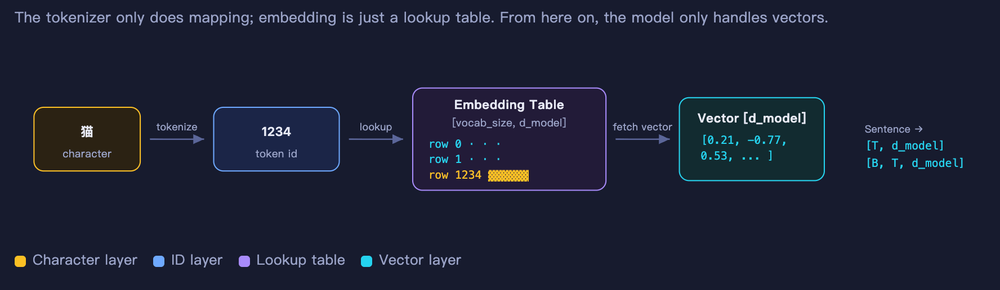
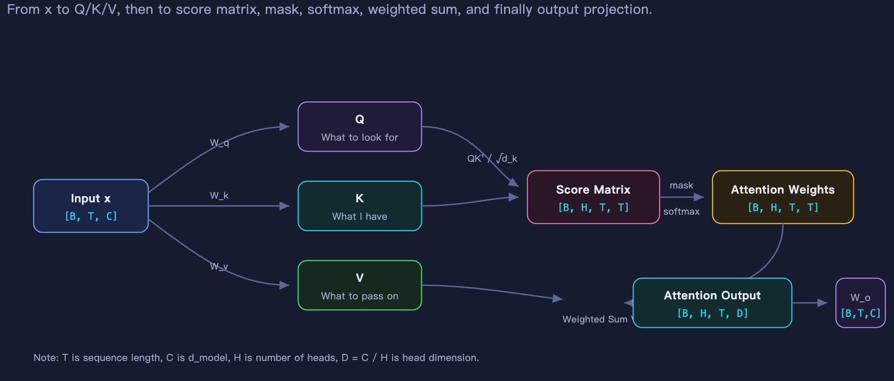
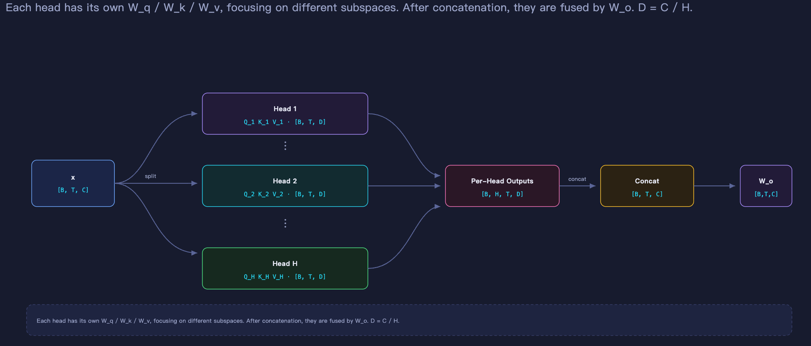
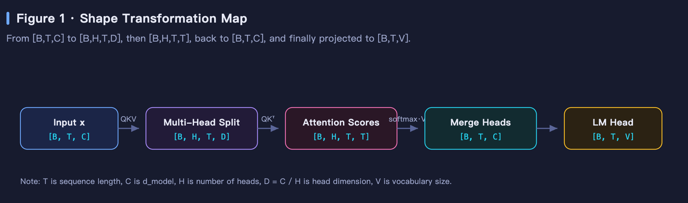
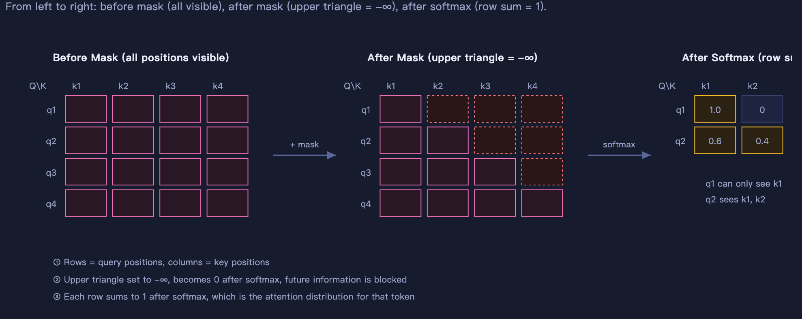
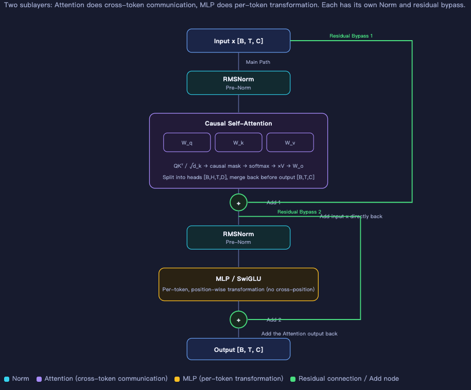
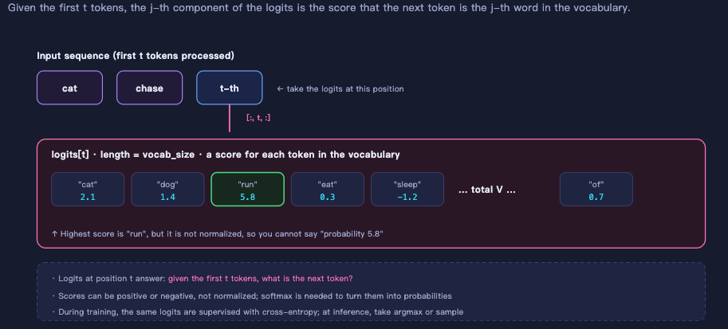
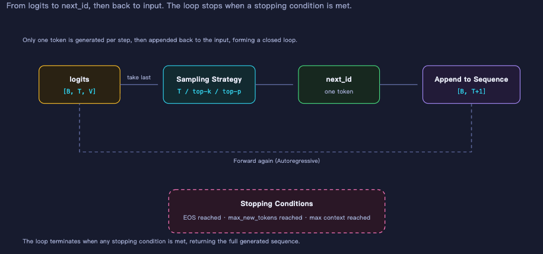
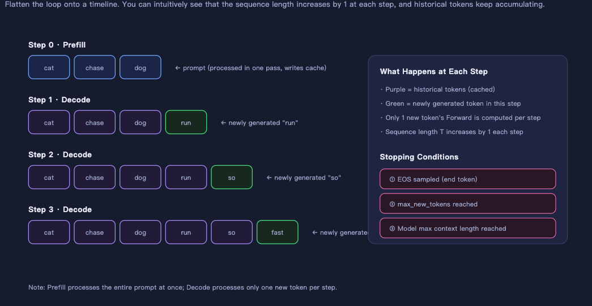

# Chapter 3 Forward Pass and Generation

Welcome to Chapter 3 of Part II of the zero-to-sglang course. This chapter builds the conceptual foundation for understanding forward passes and generation in large language models (LLMs), preparing you for inference optimizations such as KV Cache in later chapters.

## 1 Learning Objectives

After completing this chapter, you will be able to:

1. Explain the core concepts introduced in this chapter.
2. Trace the full conceptual path of a token: from its input representation, through a forward pass that produces logits, to sampling the next token.
3. Distinguish the roles of forward pass, generation, prefill, decode, and KV Cache, and explain why they should be understood separately.

This chapter focuses on concepts and data flow. The implementation is covered in the companion coding chapter. After reading it, you should understand the end-to-end forward-pass and generation pipeline without writing code.

## 2 The Core of a Forward Pass: Attention, Blocks, and Logits

### 2.1 From Text to Embeddings: Tokenization

    

<em>Figure 1. Tokenization and embeddings</em>

When a character enters a model, the first step is not computation. It must first be **translated into a vector**, which requires a tokenizer.

**Tokenization** means **splitting text into small units the model can process (tokens), then converting those tokens into numeric IDs**.

You can think of it as three steps:

1. **Raw text**: `"I love datawhale"`
2. **Split into tokens**: perhaps `["I", "love", "datawhale"]`
3. **Convert to numeric IDs**: for example, `[123, 456, 789]`

The model does not see words directly. It sees these numeric IDs. Tokenization is necessary because neural networks operate on numbers rather than strings; it converts human language into a sequence of numbers.

Common tokenization methods include:

- **BPE**: Byte Pair Encoding, which merges frequent character sequences into subwords.
- **WordPiece**: Similar to BPE and commonly used by BERT.
- **SentencePiece**: Commonly used by multilingual models.

A **tokenizer only maps** text to tokens and tokens to integer IDs. It does not understand semantics or participate in the model's computation.

An **embedding** is a lookup table with shape `[vocab_size, d_model]`. For ID 123, the model retrieves row 123. That vector is the model's **initial representation** of the corresponding token. At this point, it contains no contextual information; it is only a learned static vector. A sentence becomes a sequence of IDs, which becomes a `[T, d_model]` matrix after lookup, or `[B, T, d_model]` after adding the batch dimension. From this point onward, the model processes vectors rather than text.

### 2.2 Positional Encoding: Telling the Model About Order

Positional encoding was introduced in Chapter 1 of Part I, so we cover only the basics here.

Embedding lookup selects a row by ID and is independent of position. `"cat chases dog"` and `"dog chases cat"` may contain the same tokens, but their order changes the meaning completely.

We therefore need positional encoding to inject information about **which position a token occupies** into its vector.

A common approach is **RoPE (Rotary Position Embedding)**. Rather than adding a separate position vector, RoPE rotates Q and K inside attention so their dot product carries relative position information. It is widely used in modern LLMs.

After this step, every token vector contains both **identity information** (which token it is) and **position information** (where it appears in the sequence).

### 2.3 Attention: Tokens Begin to Communicate

So far, token vectors are independent: they do not know that the other tokens exist. Attention is the first stage that lets tokens exchange information.

The input vector first goes through **Q/K/V projections**, which map the same input vector into three different spaces. Q represents "what I am looking for," K represents "what I have," and V represents "what I actually pass on."

    

<em>Figure 2. Q/K/V projections</em>

Next comes the **multi-head split**: `d_model` is divided into H heads, each of which performs attention independently before the results are concatenated. Different heads can attend to different patterns.

    

<em>Figure 3. Multi-head split</em>

    

<em>Figure 4. Multi-head attention computation</em>

An important component is the **causal mask**. It **sets scores for future positions to negative infinity**, ensuring that token t can see only tokens 1 through t and cannot look ahead.

    

<em>Figure 5. Causal mask</em>

After attention, each token vector incorporates information from **all historical tokens it is allowed to see**. This is the most computationally expensive part of a forward pass.

### 2.4 Transformer Blocks: Attention, MLP, Residuals, and Normalization

A Transformer block does two things. First, **attention** lets tokens communicate. Second, an **MLP** lets each token process that information independently.

The following is a Pre-Norm structure:

    

<em>Figure 6. Transformer block structure (Pre-Norm)</em>

**Attention operates across tokens** and exchanges information. **An MLP operates on one token at a time**, applying a nonlinear transformation independently at every position. **Residual connections** provide a direct gradient path through deep networks, so many layers can be stacked without degradation. Modern **Pre-Norm** puts normalization before each sublayer, which improves training stability. Normalization keeps the input distribution of each layer stable and helps prevent exploding or vanishing activations.

One block is not enough, so models stack N layers. After N layers, each token vector has undergone N rounds of information exchange and transformation, becoming a highly contextualized representation. A final **final norm** then stabilizes the output to a consistent scale.

### 2.5 LM Head: From Vectors to Logits

Final norm outputs `[B, T, d_model]`, but we need to predict the next token. This is where the **LM Head**, short for Language Modeling Head, is used. It is the output head at the top of a decoder-only language model. Its core job is to map the hidden states from the final Transformer layer into vocabulary space, producing an unnormalized score, or logit, for every token so the model can predict the next one.

The LM Head usually follows the final LayerNorm. Strictly speaking, it is usually a linear layer.

Logits are the raw, unnormalized prediction scores produced by the final layer. A **logits** vector contains a raw score for every vocabulary token at each position.

    

<em>Figure 7. LM Head and logits</em>

Logits are not probabilities because they have not been normalized. The logits at position t score **which token should come next, given the first t tokens**. During training, logits from all positions are used to compute cross-entropy loss; during inference, only the logits at the final position are used.

### 2.6 Common Structural Variants in Modern LLMs

The standard Transformer block is the foundation, but modern LLMs often replace or optimize modules such as attention, FFN/MLP, normalization, positional encoding, and KV Cache. The table below introduces these variants without deriving their formulas or implementations.

| Module | Basic approach | Modern variant | Brief description |
|---|---|---|---|
| FFN / MLP | One dense MLP | MoE (Mixture of Experts) | Multiple expert FFNs; a router selects top-k experts for each token. Parameter count can be large while activated computation stays controlled. |
| Attention | MHA (Multi-Head Attention) | MQA / GQA | Multiple query heads share a smaller number of key/value heads, reducing KV Cache and memory-bandwidth usage. |
| Normalization | LayerNorm | RMSNorm | Removes mean centering, making normalization simpler while preserving stable training. |
| Normalization placement | Post-Norm | Pre-Norm | Places normalization before each sublayer for more stable deep training. |
| Positional encoding | Learned absolute positions / sinusoidal encoding | RoPE | Rotates Q and K inside attention so dot products carry relative position information. |
| Attention computation | Standard attention | FlashAttention | An I/O-aware implementation that reduces memory accesses and accelerates attention. |

These variants do not change the essence of a forward pass: tokens become embeddings, pass through multiple blocks, and finally reach the LM Head and logits. The differences lie in more modern implementations of attention, FFN, normalization, positional encoding, and cache management.

## 3 From Logits to Text

The logits produced by an LM Head are raw scores for vocabulary tokens. Turning those scores into generated text requires sampling. An autoregressive model repeatedly runs a forward pass to produce logits, samples a token, appends it to the sequence, and continues until it reaches a stopping condition.

    

<em>Figure 8. The autoregressive generation loop</em>

### 3.1 Why Sampling Is Needed

An LM Head produces logits, not a final answer. Logits normally pass through softmax to form a probability distribution, and a policy then selects one token as output.

**Sampling is the policy for selecting a token.** Language generation is an open-ended, multi-solution, probabilistic task rather than a deterministic mapping. Different sampling strategies yield different outputs. If the same prompt sometimes produces different results, sampling randomness is often the reason.

### 3.2 Common Sampling Strategies

#### 3.2.1 Greedy Decoding

At every step, greedy decoding chooses the token with the highest probability. It produces deterministic output and is useful for factual question answering, but it can be repetitive and rigid.

#### 3.2.2 Temperature

**Temperature** is one of the most common hyperparameters in LLM sampling. It controls the strength of randomness in generation. It does not change the model itself; it rescales logits at inference time, thereby changing the probability distribution of the next token.

You can think of logits as the model's raw scores for candidate tokens. Softmax converts those scores into probabilities. Temperature determines how strongly score differences matter:

- **Low temperature**: strongly favors high-scoring tokens, so low-scoring tokens have almost no chance.
- **High temperature**: flattens score differences, giving lower-scoring tokens more opportunity.

Mathematically, after the model outputs logits, temperature $T$ divides the logits before softmax:

$$
p_i = \frac{\exp(\text{logit}_i / T)}{\sum_j \exp(\text{logit}_j / T)}
$$

- $T = 1$: the original distribution, with no rescaling.
- $T < 1$: enlarges logit differences and makes the distribution sharper.
- $T > 1$: reduces logit differences and makes the distribution flatter.
- $T \to 0$: approaches greedy decoding by selecting the most probable token.
- $T \to \infty$: approaches a uniform distribution and becomes almost purely random.

#### 3.2.3 Top-k and Top-p

**Top-k and Top-p are both truncation-sampling strategies: they retain only part of the model's probability distribution, discard the low-probability tail, renormalize, and then sample.** They balance diversity against coherence, avoiding both nonsensical pure random sampling and repetitive greedy decoding.

After softmax, the model assigns a probability to every vocabulary token. A vocabulary commonly contains tens or hundreds of thousands of tokens, and many have very small probabilities. Sampling directly from the full distribution can occasionally select implausible tokens, causing the output to drift off topic or become incoherent.

Therefore, we need to **retain reasonable candidates** with high probability, **remove long-tail noise** with low probability, **renormalize** the retained candidates, and then **sample** from the new distribution.

Top-k and Top-p are the two most common ways to truncate the candidate set.

Top-k is simple: retain only the $k$ highest-probability tokens, discard the rest, renormalize the remaining $k$ tokens, and sample.

Top-p uses a dynamic candidate count instead: sort tokens by probability and retain the smallest set whose cumulative probability reaches $p$, then renormalize and sample.

In other words, the size of its candidate set is determined by the shape of the probability distribution.

#### 3.2.4 Strategy Summary

| Name | Operation level | What changes | Random? | Extreme or equivalent case |
|---|---|---|---|---|
| Greedy | Final selection rule | Selects argmax directly | No | Equivalent to top-k = 1, or $T \to 0$ |
| Temperature | Distribution adjustment | Expands or shrinks logit differences | Indirectly affects randomness | $T=1$ is unchanged; $T<1$ is more deterministic; $T>1$ is more random; $T \to 0$ is greedy |
| Top-k | Candidate truncation | Retains a fixed top $k$ tokens | Sampling may follow | $k=1$ is greedy; $k=$ vocabulary size means no truncation |
| Top-p | Candidate truncation | Retains the smallest set with cumulative probability $p$ | Sampling may follow | $p=1$ means no truncation; very small $p$ approaches greedy |

### 3.3 The Autoregressive Generation Loop

Generation is not completed in a single pass; it is a loop. At its core, autoregressive generation means:

**Predict the next token from the existing tokens, append that new token to the sequence, then use the updated sequence to predict another token, repeating this process.**

Every step depends only on the current and previous tokens, never on future tokens. The model enforces this with a causal mask.

During training, the true answer is known, so predictions for every position can be computed in parallel. During inference, the next token must be generated by the model itself, so tokens must be emitted one after another in sequence.

The loop ends when it reaches an end token, the maximum length, or another stopping condition.

    

<em>Figure 9. Generation-loop illustration</em>

Generation stops when one of the following conditions is reached:

1. An EOS token is sampled.
2. `max_new_tokens` is reached.
3. The model's maximum context length is reached.

## 4 Prefill, Decode, and KV Cache

Prefill and decode were introduced in detail in the Part I inference chapter. Here, we give a concise overview that connects these concepts to the implementation. KV Cache will receive a more detailed treatment in the next chapter.

Prefill and decode are not two different models. They are two stages of the same autoregressive generation loop. The key question is: **which tokens are already known, and which tokens must still be generated by the model?**

### 4.1 Prefill: Processing the Full Prompt at Once

Prefill occurs before the first new token is generated. Its input is the full prompt, or more generally, the entire context known so far. Since every token in this context is already known, the model does not need to process them one at a time. It can send the whole sequence through the Transformer at once and compute hidden states for all positions in parallel.

With a causal mask, each position can still see only itself and earlier positions, never future ones. However, because all positions enter the model at once, matrix computation can be highly parallelized and GPU utilization is high. At the end of prefill, the model takes the output at the final position, passes it through the LM Head to obtain logits, and samples the first new token.

Prefill has three main jobs:

1. Process the full prompt in parallel.
2. Build the KV Cache needed for subsequent generation.
3. Produce the first new token.

It determines the latency from when a user sends a request until they see the first token, commonly called time to first token.

### 4.2 Decode: Generating One Token at a Time

Decode begins after prefill. Once the first new token has been generated, the model must produce the second, third, and subsequent tokens until it stops. The next token depends on the one that was just generated, which in turn depends on the token before it. Therefore, unlike prefill, the model cannot compute all future tokens in parallel at once.

The process becomes a serial loop:

- Use the token generated in the previous step as the current input.
- Combine it with cached history to compute its hidden state.
- Pass it through the LM Head to obtain new logits.
- Sample the next token.
- Append it to the end of the sequence.
- Repeat.

Each decode step processes only one new token, so the computation may appear small, but it must be repeated many times. Decode determines the average latency per output token and directly affects generation speed and throughput.

### 4.3 The Core Difference Between Prefill and Decode

The biggest differences between prefill and decode are input length and parallelism.

Prefill takes an entire prompt, which may contain hundreds, thousands, or even tens of thousands of tokens. All positions can be processed in parallel, so prefill resembles a training forward pass. It is typically compute-bound, with GPU arithmetic throughput as its bottleneck.

Decode normally takes only one new token, but each step must read model weights and cached history. Its computation is relatively small, yet it accesses GPU memory frequently. It is therefore typically memory-bandwidth-bound, where data movement rather than raw computation is the bottleneck.

From the perspective of the generation loop:

- Prefill occurs only once.
- Decode occurs repeatedly until an end token, maximum length, or another stopping condition is reached.

This distinction also appears in implementations: the first forward pass receives the complete prompt and produces the first token and the cache; the subsequent loop passes only the token from the previous step together with the cache, producing the next token. The initial pass and the later loop correspond to prefill and decode.

### 4.4 Why KV Cache Speeds Up Generation

To understand KV Cache, return to self-attention. In a Transformer's attention computation, each token produces Query, Key, and Value representations. For a new token, its Query computes attention weights against the Keys of all historical tokens, then uses those weights to aggregate their Values.

**A historical token's Key and Value depend only on that token's representation and the model weights; they do not change when new tokens are generated later.** Once a token's Key and Value have been computed, they can therefore be reused in subsequent steps.

Without KV Cache, the model must send the entire prefix through the network for every new token and recompute Key and Value for all historical tokens. The longer the history, the more repeated work there is. When generating token 100, much of the computation for the preceding 99 tokens has already been performed but would still be repeated.

With KV Cache, the process changes:

- During prefill, compute the Key and Value for every prompt token once and save them for each layer.
- During decode, compute Query, Key, and Value only for the newly generated token.
- Append the new Key and Value to the cache.
- Use the new Query to read all historical Keys and Values from the cache and perform attention.

Each step now processes only the newly added token rather than the whole sequence. Historical Keys and Values are no longer recomputed, saving substantial matrix computation. The savings become more pronounced as the sequence grows, making KV Cache essential for practical autoregressive generation.

KV Cache is not free, however. It consumes considerable GPU memory, growing with the number of layers, attention heads, sequence length, and batch size. In long-context generation, KV Cache often accounts for most memory use. Decode must also read the cache at every step, so memory bandwidth can become a bottleneck. This motivates optimizations such as paged memory management, cache quantization, and grouped-query attention.

## 5 Key Concepts

**Hidden State**
A vector representation output by every Transformer layer, commonly shaped `[B, T, d_model]`. After multiple layers, it changes from a static vector containing only token identity into a dynamic representation that contains context.

**Causal Mask**
Sets attention scores for future positions to negative infinity, ensuring that token t can see only tokens 1 through t and cannot look ahead. It is the architectural mechanism that enforces autoregressive generation.

**MLP / FFN**
A feed-forward network that applies nonlinear transformations independently at each token position, without communication across positions. It lets each token process the information gathered by attention.

**LM Head**
The linear layer at the top of a model that maps the hidden state from final normalization into vocabulary space to produce logits for every token. It answers the question of how hidden states become vocabulary scores.

**Logits**
The unnormalized raw scores produced by the LM Head. Each position has a logits vector of length `vocab_size`, which scores every possible next token. Logits are not probabilities: they may be negative and do not sum to 1.

**Softmax**
A function that converts logits into a probability distribution. After softmax, every value is nonnegative and all values sum to 1. Only then do the values represent probabilities for next-token candidates.

**Sampling**
The process of choosing the next token from a probability distribution. Language generation is open-ended, multi-solution, and probabilistic, so it needs sampling rather than a single fixed answer in every situation.

**Stopping Conditions**
Conditions that end the generation loop. Common examples include sampling EOS, reaching `max_new_tokens`, reaching the model's maximum context length, matching a custom stop string, completing structured output, or receiving an external interruption.

**EOS**
End of Sequence: a token that usually indicates the end of the model's response.

**max_new_tokens**
The maximum number of new tokens that may be generated for a request. Generation stops forcibly when this limit is reached.

**Maximum Context Length**
The maximum number of tokens a model can process at once, including the prompt and generated tokens. Exceeding it usually requires truncation, a sliding window, or a special long-context strategy.

**Time to First Token (TTFT)**
The time from sending a request until the first output token appears. It is primarily affected by prefill.

**Time per Output Token (TPOT) / Inter-Token Latency (ITL)**
The average time required to generate each new token. It is primarily affected by decode.

## 6 Summary and Exercises

### 6.1 Summary

This chapter followed the path of "how a token enters a model and how it is generated" to establish the complete conceptual chain from text to logits to the next token:

1. **Forward path**: raw text → tokenizer splits and maps it to token IDs → embedding lookup produces `[B, T, d_model]` → positional encoding injects order information → N Transformer blocks → final norm → LM Head → logits.
2. **Attention and blocks**: Q/K/V, multi-head splitting, and the causal mask let attention exchange information across tokens. An MLP applies a nonlinear transformation independently at every position, while residual connections and Pre-Norm stabilize deep networks.
3. **From logits to text**: logits are unnormalized raw scores rather than probabilities. Softmax converts them into a probability distribution, then sampling strategies such as greedy decoding, temperature, Top-k, and Top-p choose the next token, append it to the sequence, and continue the autoregressive loop.
4. **Prefill and decode**: they are stages of the same generation loop. Prefill processes the full prompt in parallel and builds KV Cache; decode generates tokens serially. KV Cache stores historical Keys and Values so the entire history does not need to be recomputed at every step.

### 6.2 Exercises

1. Describe the complete conceptual path of a token from input representation, through a forward pass that produces logits, to sampling the next token.
2. What is the difference between logits and a probability distribution? Why does inference need sampling instead of always taking the largest logit? How do temperature, Top-k, and Top-p affect generation?
3. What are the key differences between prefill and decode? Why is prefill typically compute-bound while decode is typically memory-bandwidth-bound?

## References

- [Attention Is All You Need](https://arxiv.org/abs/1706.03762)
- [RoFormer: Enhanced Transformer with Rotary Position Embedding](https://arxiv.org/abs/2104.09864)
