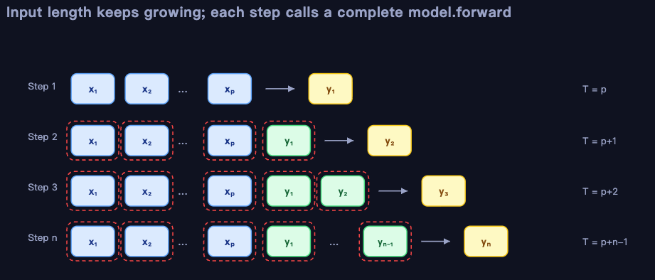
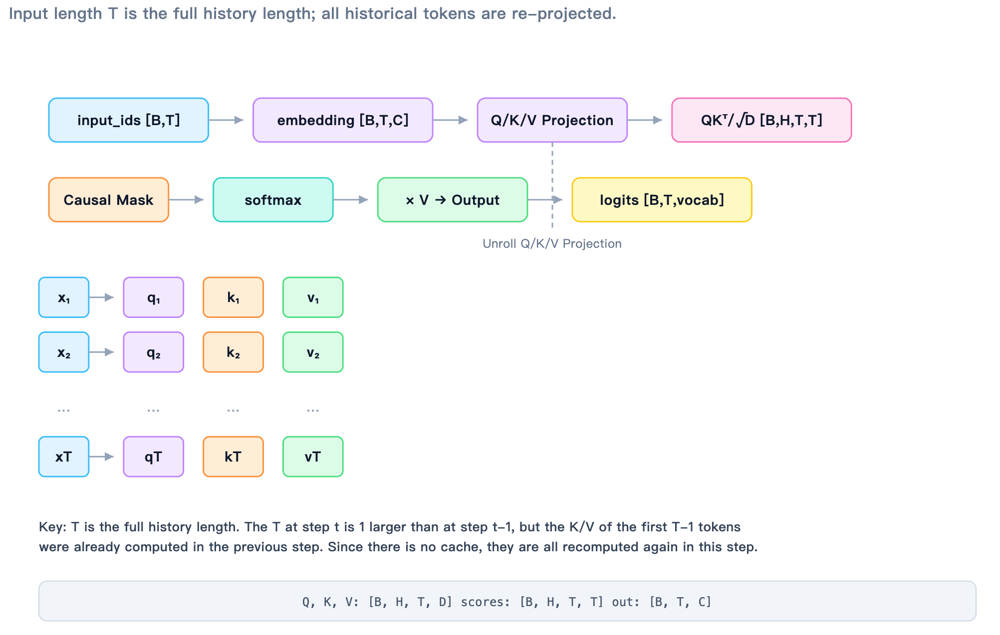
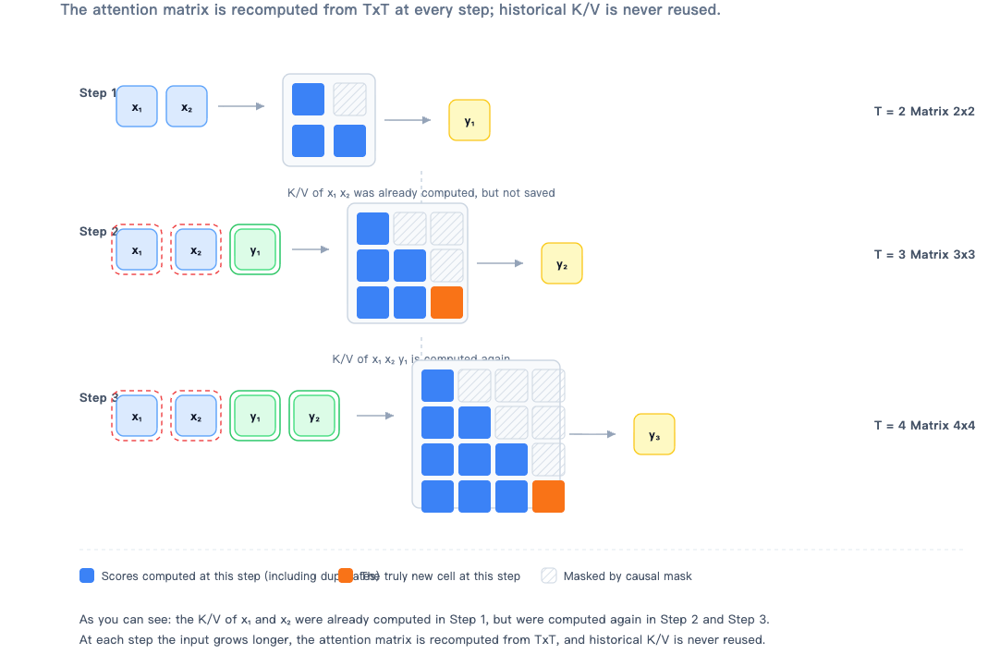
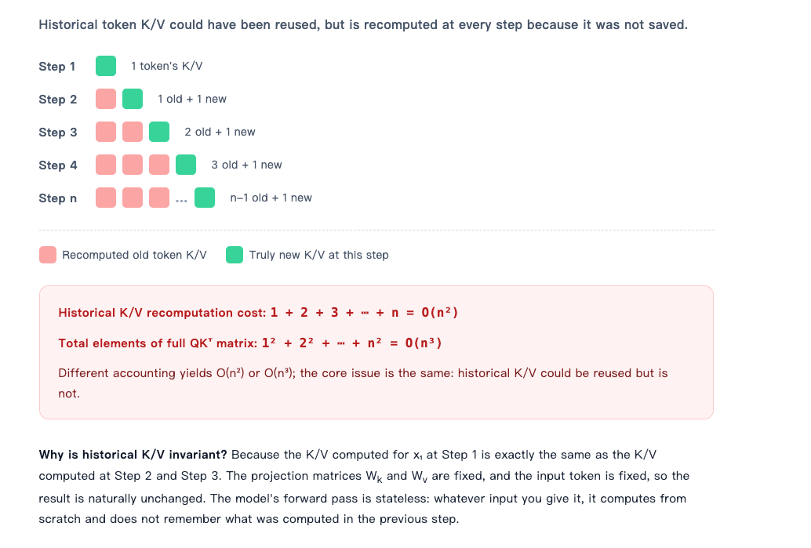
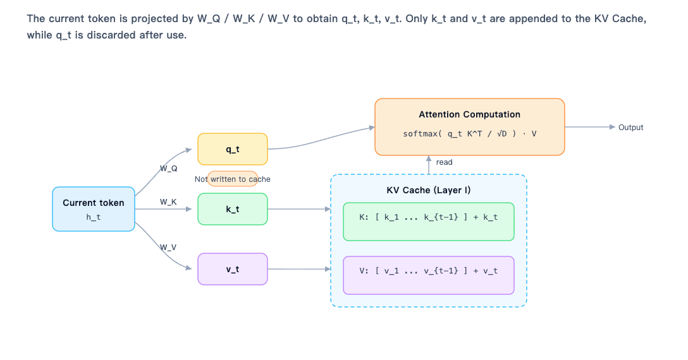
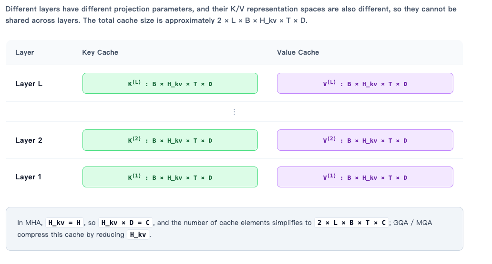
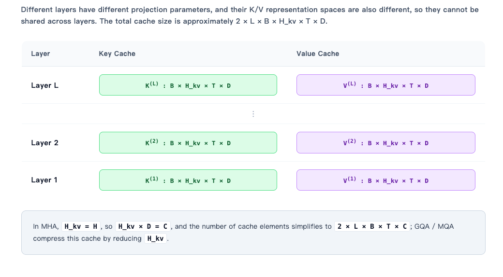

# Chapter 4 KV Cache Optimization

In the previous chapter, we divided autoregressive generation into prefill and decode, and saw how a model generates text one token at a time. This chapter explains one of the most fundamental and important optimizations in an inference system: KV Cache. **By preserving the Keys and Values of historical tokens in every attention layer, KV Cache avoids recomputing results during decode and makes long-sequence generation practical.**

This chapter starts with the repeated computation that occurs without KV Cache, then explains what is cached, how the cache is read and written, and the resulting complexity benefits.

## 1 Learning Objectives

After completing this chapter, you will be able to:

1. **Explain why computation is repeated without KV Cache**: starting from the autoregressive generation loop, explain why every step must send the entire history through the model again, and why historical tokens' K/V representations are repeatedly projected and reused in attention computation.
2. **Describe KV Cache's core idea and cached objects**: explain that KV Cache stores the tensors produced when historical tokens pass through K/V linear projections in every self-attention layer, rather than Query, the attention matrix, logits, or complete hidden states.
3. **Derive the complexity benefits of KV Cache**: derive $O(n^2)$ and $O(n^3)$ without a cache from the K/V-projection and attention-matrix perspectives, and show how KV Cache reduces K/V projection to $O(n)$ and per-step attention from $O(T^2)$ to $O(T)$.
4. **Distinguish prefill from decode**: explain how prefill computes and writes K/V for all prompt tokens at once, while decode computes K/V only for each new token and appends it to the cache.

## 2 Repeated Computation Without KV Cache

In autoregressive language-model generation, the model predicts one next token, appends that token to the end of the input sequence, and predicts another token. Without KV Cache, the model does not retain what it computed in the prior step. Every prediction must send the complete history so far through the network and recompute it from scratch.

This means the model processes the full prompt to generate token 1, then the prompt plus token 1 to generate token 2, then the prompt plus tokens 1 and 2 to generate token 3. The input grows at every step, and the model repeatedly projects every historical token and recomputes attention. This repeated work is the source of inefficiency without KV Cache.

### 2.1 Generation Loop Without KV Cache

    

<em>Figure 1. Generation loop without KV Cache</em>

Suppose the prompt is $x_1,x_2,ldots,x_p$ and we want to generate $n$ new tokens. The generation loop without KV Cache works as follows:

**Step 1**: send the whole prompt to the model and obtain the first new token, $y_1$.

**Step 2**: append $y_1$ to the prompt, send the expanded sequence through the model again, and obtain $y_2$.

**Step 3**: append $y_2$ as well, send the sequence through the model again, and obtain $y_3$. This continues until the model generates the $n$th token.

The model returns **logits** for every position, but we care only about the final position because it predicts the **next token**. We take its logits, sample from them or choose the argmax, append the new token to the sequence, and start the next iteration.

The input is the entire **history**, not just the newly generated token. The model performs a forward pass for every token even though we need output only from the final position. Historical tokens are recomputed repeatedly: their Keys and Values have not changed, but because they were not saved, **they must be calculated again at every step**.

### 2.2 Where Computation Is Wasted: Repeated Historical K/V Projections

    

<em>Figure 2. Repeated projections of historical K/V</em>

To see **where the wasted computation occurs**, consider the calculations within a single step. Suppose the input sequence at step $t$ has length $T$ and shape $B 	imes T$, where $B$ is the batch size. After embedding lookup, it becomes $B 	imes T 	imes C$, where $C$ is the hidden dimension, and then enters each Transformer block.

In the attention layer, **the model first applies linear projections to all $T$ positions** to obtain Query, Key, and Value. Their shapes are all $B 	imes H 	imes T 	imes D$, where $H$ is the number of attention heads and $D$ is the dimension of each head. Because $T$ includes the complete history, every historical token undergoes Q, K, and V projection again.

The model then computes attention scores by **multiplying Query by the transpose of Key** and dividing by $sqrt{D}$, producing a $B 	imes H 	imes T 	imes T$ matrix. Every element of this matrix measures the relationship between a query position and a key position. A causal mask ensures that query position $i$ can see only keys with $j le i$, preventing it from looking at future tokens. After softmax, the scores are multiplied by Value to obtain the attention output. The output then goes through output projection, residual connection, LayerNorm, and MLP before proceeding to the next layer.

Throughout this process, $T$ is the full history length. The $T$ at step $t$ is one larger than it was at step $t-1$, but the K/V of the first $T-1$ tokens were already computed at step $t-1$. Without a cache, those representations are projected again and participate in attention-score computation again at step $t$. **That is the repeated work.**

### 2.3 A Small Example: From [x₁, x₂] to [x₁, x₂, y₁, y₂]

    

<em>Figure 3. Example generation without KV Cache</em>

Suppose the prompt contains only two tokens, $x_1$ and $x_2$, and we want to generate three new tokens.

**Step 1**: the input is $[x_1,x_2]$, with length 2. The model computes Q, K, and V for both positions, and the attention-score matrix is $2 	imes 2$. Sampling from the final logits gives $y_1$.

**Step 2**: the input becomes $[x_1,x_2,y_1]$, with length 3. The model recomputes K/V for $x_1$ and $x_2$, along with K/V for the newly added $y_1$. The attention-score matrix becomes $3 	imes 3$. The final logits produce $y_2$.

**Step 3**: the input becomes $[x_1,x_2,y_1,y_2]$, with length 4. The model again computes K/V from scratch for $x_1$, $x_2$, $y_1$, and $y_2$. The attention-score matrix becomes $4 	imes 4$. The final logits produce $y_3$.

The K/V for $x_1$ and $x_2$ were already computed in step 1, yet they are computed again in steps 2 and 3. The K/V for $y_1$ was computed in step 2 and then recomputed in step 3. As the input grows, each attention matrix is recomputed from scratch as $T 	imes T$, and historical K/V is never reused.

### 2.4 How Much Is Repeated: O(n²) or O(n³)?

    

<em>Figure 4. Complexity of repeated computation</em>

The amount of repeated work can be quantified. If we consider only historical token K/V projections, step 1 computes K/V for one token, step 2 for two tokens, step 3 for three tokens, and step $n$ for $n$ tokens. The total amount of repeated construction is

$$
1+2+3+\cdots+n=\sum_{t=1}^{n}t=O(n^2).
$$

This is one source of the statement that generation without KV Cache is $O(n^2)$: **this $O(n^2)$ generally refers to time complexity**.

If we instead count the total number of elements in the full $QK^\top$ matrices, step $t$ has a $t 	imes t$ matrix, giving

$$
1^2+2^2+\cdots+n^2=\sum_{t=1}^{n}t^2=O(n^3).
$$

This is why you may encounter either $O(n^2)$ or $O(n^3)$, depending on what is being counted. The common phrase "from $O(n^2)$ to $O(n)$" emphasizes that a decode step no longer recomputes the full history: the current query reads historical cache, so per-step attention changes from $T 	imes T$ to $1 	imes T$.

Regardless of the accounting method, the fundamental problem is the same: historical K/V can be reused but is recomputed at every step because it is not saved. A model forward pass is stateless; it recalculates whatever input it receives and does not remember the previous step.

## 3 Core Idea: What Does KV Cache Store?

**KV Cache stores the K and V tensors produced when every historical token passes through Key and Value linear projections in every self-attention layer during autoregressive generation.** It does not store Query, raw tokens, or logits. It lets the current token compute only its own Query and directly look up the Keys and Values that historical tokens have already produced.

### 3.1 What KV Cache Stores from the Single-Step Formula

    

<em>Figure 5. How KV Cache works</em>

Suppose we are processing layer $l$ at step $t$. Let the input hidden state of the current token at this layer be $h_t^{(l-1)}$. The attention layer applies three linear projections to obtain Query, Key, and Value:

$$
q_t^{(l)} = h_t^{(l-1)} W_Q^{(l)},\quad
k_t^{(l)} = h_t^{(l-1)} W_K^{(l)},\quad
v_t^{(l)} = h_t^{(l-1)} W_V^{(l)}.
$$

Conceptually, Query represents what the current token wants to find, Key provides an index for what each position offers, and Value carries the actual information from each position.

Before the current token is generated, the cache already contains the Keys and Values of every preceding token at the same layer:

$$
\mathcal{K}_{t-1}^{(l)} = [k_1^{(l)}, k_2^{(l)}, \ldots, k_{t-1}^{(l)}],
\quad
\mathcal{V}_{t-1}^{(l)} = [v_1^{(l)}, v_2^{(l)}, \ldots, v_{t-1}^{(l)}].
$$

**The cache does not preserve raw tokens** or complete hidden states. It stores the results after historical tokens have passed through K/V projection at this layer. **Every layer has its own cache, and caches cannot be shared between layers.**

When the current token arrives, the model computes only its own $q_t^{(l)}$, $k_t^{(l)}$, and $v_t^{(l)}$; it does not send historical tokens through the network again. The new Key and Value are appended to the cache for this layer:

$$
\mathcal{K}_t^{(l)} = [\mathcal{K}_{t-1}^{(l)}; k_t^{(l)}],
\quad
\mathcal{V}_t^{(l)} = [\mathcal{V}_{t-1}^{(l)}; v_t^{(l)}].
$$

The historical part of the cache remains unchanged, expanding it from K/V for the first $t-1$ tokens to K/V for the first $t$ tokens.

The current token then **uses its Query to search the updated Key cache**, obtaining attention weights over all historical positions. It uses those weights to aggregate the Value cache and produce its attention output at this layer:

$$
o_t^{(l)}
=
\operatorname{softmax}
\left(
\frac{
q_t^{(l)} \left(\mathcal{K}_t^{(l)}\right)^\top
}{
\sqrt{D}
}
\right)
\mathcal{V}_t^{(l)}.
$$

The output then goes through output projection, residual connection, LayerNorm, and MLP before entering the next layer.

For multi-head attention, every head follows the same process independently: it computes its own Query, Key, and Value; maintains its own K/V cache; and performs its own attention computation. The outputs of all heads are then concatenated and passed through an output projection.

The most important distinction is that Query serves only the current step and is unnecessary once that step is complete, so it is not cached. Key and Value are queried repeatedly by later steps, so they must be cached. KV Cache stores precomputed K and V for every historical position in every layer and KV head, not the attention matrix, logits, or complete hidden states.

### 3.2 K/V Is Cached for Every Layer and Every KV Head

    

<em>Figure 6. Per-layer KV Cache</em>

KV Cache is not one global cache. Each Transformer block has its own cache. If a model has $L$ layers, the cache stores:

$$
\text{Layer }1:\quad K^{(1)},V^{(1)},
$$

$$
\text{Layer }2:\quad K^{(2)},V^{(2)},
$$

$$
\cdots
$$

$$
\text{Layer }L:\quad K^{(L)},V^{(L)}.
$$

**K/V cannot be shared across layers** because each layer has different attention parameters $W_Q^{(l)}, W_K^{(l)}, W_V^{(l)}$, resulting in representations in different spaces.

For layer $l$, suppose there are $H_{kv}$ KV heads, each with dimension $D$, batch size $B$, and current sequence length $T$. Key and Value typically have the shape

$$
K^{(l)},V^{(l)} \in \mathbb{R}^{B \times H_{kv} \times T \times D}.
$$

The total number of KV Cache elements across all layers is therefore approximately

$$
2 \times L \times B \times H_{kv} \times T \times D.
$$

With standard multi-head attention, $H_{kv}=H$ and $D=C/H$, so $H_{kv}D=C$. The total number of elements simplifies to

$$
2 \times L \times B \times T \times C.
$$

With GQA or MQA, $H_{kv}$ is smaller than the number of query heads $H$, so the KV Cache becomes substantially smaller. This is an important direction for reducing KV Cache memory consumption.

If each element occupies $\text{dtype\_bytes}$ bytes, KV Cache memory consumption is

$$
2 \times L \times B \times H_{kv} \times T \times D \times \text{dtype\_bytes}.
$$

For example, with FP16, $\text{dtype\_bytes}=2$.

### 3.3 Why Cache Only K/V, Not Q?

Attention uses the current token's Query to query historical tokens' Keys and retrieve information from their Values.

During decode:

- The current token needs its own Query.
- The current token needs historical Keys to compute attention weights.
- The current token needs historical Values for the weighted sum.
- Historical token Queries are not needed in later generation steps.

A historical token's Query is useful only when that token itself is the current query. At that time, it has already completed its attention computation and produced its output. Later tokens never need to reuse a historical Query. Caching Query therefore has no benefit and would instead increase memory and bandwidth use.

This is why it is called KV Cache: it stores only Key and Value.

### 3.4 Generation Flow with KV Cache

With KV Cache, generation has two stages.

    

<em>Figure 7. KV Cache flow in prefill and decode</em>

**Prefill** sends the complete prompt to the model once. The model computes K/V for all prompt tokens in every layer and saves them in the cache. It also produces the first new token.

**Decode** then accepts only one new token at a time. Rather than recomputing historical K/V, it:

1. Computes $q_t$, $k_t$, and $v_t$ for the current token in every layer.
2. Appends the current layer's $k_t$ and $v_t$ to its cache.
3. Computes attention scores between the current layer's $q_t$ and the updated K cache.
4. Uses the attention scores to compute a weighted sum of the V cache.
5. Produces the current token's output and continues through higher layers.
6. Produces logits for the next token, samples it, and starts the next iteration.

In a decode step, attention no longer computes a full $T 	imes T$ matrix over the history. Instead, the current Query attends over historical Keys through a $1 	imes T$ attention operation. Historical K/V is genuinely reused.

### 3.5 Common Misconceptions

KV Cache does not cache the hidden state of the entire sequence. It stores the Key and Value projection results inside attention for every layer.

KV Cache is not one cache shared by every layer. Each layer has its own K/V cache.

KV Cache does not cache the attention matrix. Attention weights are temporary values calculated at each step and are not saved.

KV Cache does not cache logits. Logits are produced only by the final layer and are used only to sample at the current step.

KV Cache is not limited to the final layer. On the contrary, every self-attention layer needs its own K/V cache.

With RoPE, Key is usually cached after rotary positional encoding is applied. Query is rotated at the current step before use. Value generally does not use positional rotation.

KV Cache fundamentally preserves the Keys and Values of historical tokens at each layer, preventing the model from recomputing the full history at every step. The model's forward pass remains stateless, but the inference system uses an external cache to reuse historical computation.

Without KV Cache, step $t$ recomputes K/V for every token from 1 through $t$. With KV Cache, step $t$ computes K/V only for the current token and appends it to the cache. Per-step attention changes from $T 	imes T$ to $1 	imes T$, which is the core idea behind KV Cache optimization.

## 4 Complexity Derivation: From O(n²) to O(n)

This section focuses only on complexity changes caused by sequence length. To simplify the analysis, we ignore constants such as the number of layers $L$, hidden dimension $d$, and number of attention heads $H$, and consider only how computation scales with the number of tokens.

Let the prompt length be $p$ and let the model generate $n$ new tokens. At decode step $t$, the total sequence length is

$$
T_t = p + t.
$$

To highlight the dominant behavior, assume $p$ is fixed and $n$ is the main variable. Then $T_t$ has the same asymptotic order as $n$.

### 4.1 Without KV Cache: Historical K/V Is Recomputed Every Step

Without KV Cache, step $t$ must send the complete history through the model again. Therefore, every one of the $T_t$ tokens undergoes Q/K/V projection again.

Considering only K/V projection, computation at step $t$ scales as

$$
O(T_t).
$$

The total K/V projection work for generating $n$ tokens is

$$
\sum_{t=1}^{n} O(T_t)
=
O\left(\sum_{t=1}^{n} (p+t)\right)
=
O\left(np + \frac{n(n+1)}{2}\right)
=
O(n^2).
$$

This is one source of the statement that generation without KV Cache is $O(n^2)$: historical K/V could have been reused, but is projected again at every step.

If we instead count the attention-score matrix, its size at step $t$ is $T_t 	imes T_t$, with

$$
T_t^2
$$

elements. Across $n$ steps, this becomes

$$
\sum_{t=1}^{n} T_t^2
=
\sum_{t=1}^{n} (p+t)^2
=
O(n^3).
$$

Thus, from the perspective of full attention matrices, the total complexity without KV Cache is $O(n^3)$. At a single step, attention complexity is

$$
O(T_t^2).
$$

### 4.2 With KV Cache: Historical K/V Is Computed Only Once

With KV Cache, generation has two stages.

During prefill, the prompt is passed through the model once, and the K/V for every prompt token is computed and written into the cache. Decode then processes one new token at a time.

At decode step $t$, the model computes only $q_t$, $k_t$, and $v_t$ for the current token. K/V projection therefore applies to one token and has complexity

$$
O(1).
$$

The total K/V projection work for generating $n$ tokens is

$$
\sum_{t=1}^{n} O(1) = O(n).
$$

K/V projection therefore decreases from $O(n^2)$ without a cache to $O(n)$ with a cache.

Now consider attention. The current token uses its Query to query historical Keys, whose length is $T_t$. Thus, the attention-score vector at step $t$ has length $T_t$, and computation scales as

$$
O(T_t).
$$

Across $n$ steps, that is

$$
\sum_{t=1}^{n} O(T_t)
=
O\left(\sum_{t=1}^{n} (p+t)\right)
=
O(n^2).
$$

Per-step attention decreases from

$$
O(T_t^2)
$$

to

$$
O(T_t).
$$

### 4.3 Complexity Comparison

| Perspective | Without KV Cache | With KV Cache |
|---|---|---|
| Per-step K/V projection | $O(T)$ | $O(1)$ |
| Cumulative K/V projection over $n$ steps | $O(n^2)$ | $O(n)$ |
| Per-step attention | $O(T^2)$ | $O(T)$ |
| Cumulative attention over $n$ steps | $O(n^3)$ | $O(n^2)$ |
| Cache memory | $0$ | $O(T)$ |

If we include hidden dimension $d$, attention can be written as $O(T^2 d)$ and $O(Td)$, while projection can be written as $O(Td^2)$ and $O(d^2)$. However, sequence length remains the main variable, so the simplified notation above is common.

### 4.4 From O(n²) to O(n)

The phrase "from $O(n^2)$ to $O(n)$" generally refers to the fact that historical K/V projection is no longer recomputed at every step when generating $n$ tokens:

$$
\text{Without cache:}\sum_{t=1}^{n} T_t = O(n^2),
$$

$$
\text{With cache:}\sum_{t=1}^{n} 1 = O(n).
$$

This is the most direct benefit of KV Cache.

However, attention still has to interact with history. The current token must query every historical Key, so per-step attention is $O(T)$ and cumulative attention across $n$ steps remains

$$
O(n^2).
$$

Therefore, the reduction to $O(n)$ does not mean all inference becomes linear. It means the repeated K/V computation eliminated by caching becomes linear. The cumulative complexity of full attention during decode remains $O(n^2)$ unless further optimizations, such as sliding-window attention, sparse attention, or linear attention, are used.

### 4.5 Total Complexity Including Prefill

When the prompt is included, a complete generation with KV Cache is approximately:

- Prefill: $O(p^2)$ attention, $O(p)$ K/V projection and cache construction.
- Decode: $O(n^2)$ attention, $O(n)$ K/V projection.

Total attention is approximately

$$
O((p+n)^2),
$$

and total K/V projection is approximately

$$
O(p+n).
$$

Without KV Cache, total attention is approximately

$$
O((p+n)^3),
$$

and total K/V projection is approximately

$$
O((p+n)^2).
$$

The core complexity benefits of KV Cache can therefore be summarized as

$$
\text{Repeated historical K/V projections: } O(n^2) \rightarrow O(n),
$$

and

$$
\text{Per-step attention: } O(T^2) \rightarrow O(T).
$$

The cumulative attention cost of decode, which queries history token by token, still remains $O(n^2)$. That is the precise meaning of the claim that KV Cache changes the relevant computation from $O(n^2)$ to $O(n)$.

## 5 Summary and Exercises

### 5.1 Summary

This chapter established the key ideas behind how KV Cache eliminates repeated work in autoregressive generation:

1. **The problem without a cache**: every generated token causes the model to reprocess the complete history. Historical K/V projection accumulates to $O(n^2)$, while full attention matrices accumulate to $O(n^3)$.
2. **What is cached**: KV Cache stores the results of Key and Value projections for historical tokens in every layer. Query serves only the current step, so historical Queries do not need to be cached.
3. **Prefill and decode**: prefill computes K/V for the complete prompt and writes it to cache; decode computes K/V only for each new token, appends it, and uses the current Query to read historical K/V.
4. **Benefits and cost**: cumulative K/V projection decreases from $O(n^2)$ to $O(n)$ and per-step attention decreases from $O(T^2)$ to $O(T)$; in exchange, KV Cache memory grows linearly with the number of layers, batch size, and sequence length.

### 5.2 Exercises

1. Why are historical tokens' Keys and Values recomputed at every decode step without KV Cache?
2. Why does KV Cache store only Key and Value rather than Query, the attention matrix, or logits?
3. Compare how prefill and decode read and write KV Cache, and describe the computational characteristics of each stage.
4. What specific computation does the claim "KV Cache reduces complexity from $O(n^2)$ to $O(n)$" refer to? Why does cumulative attention complexity across the full decode process remain $O(n^2)$?

## References

- [Attention Is All You Need](https://arxiv.org/abs/1706.03762)
