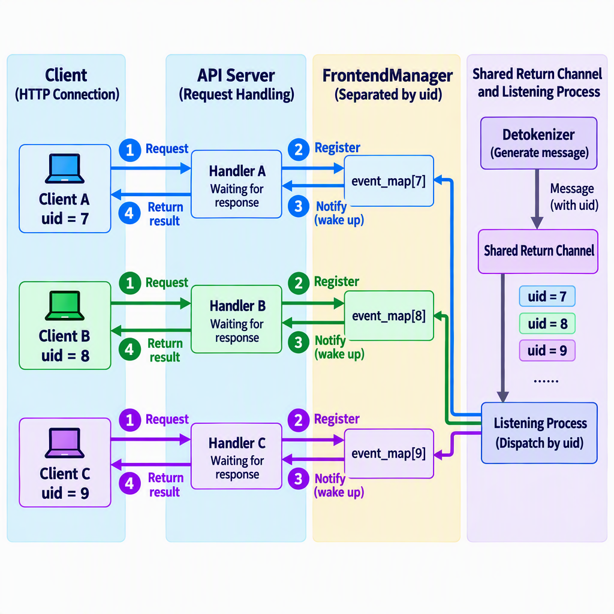
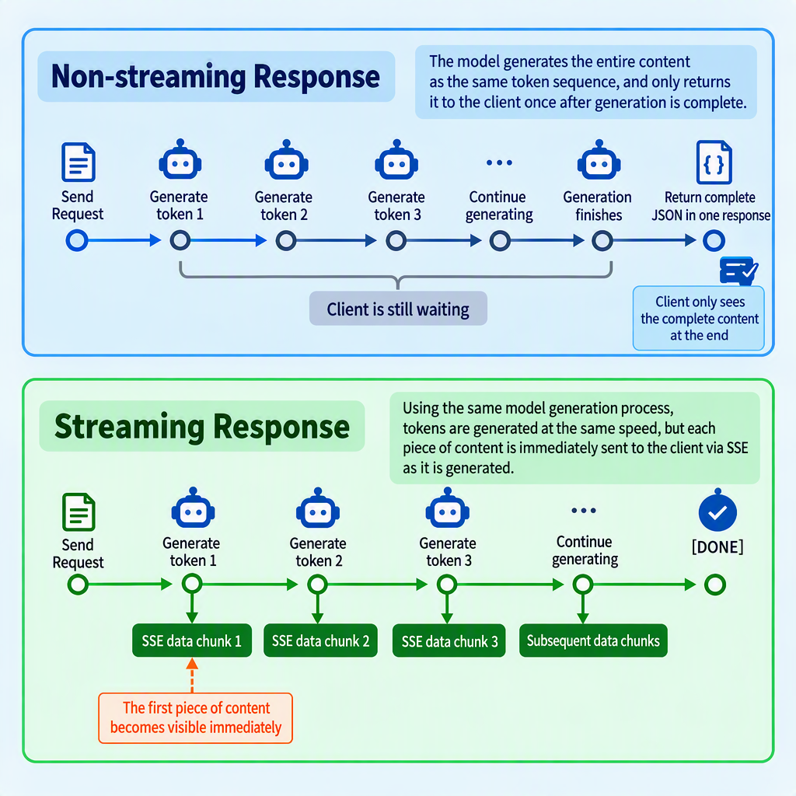
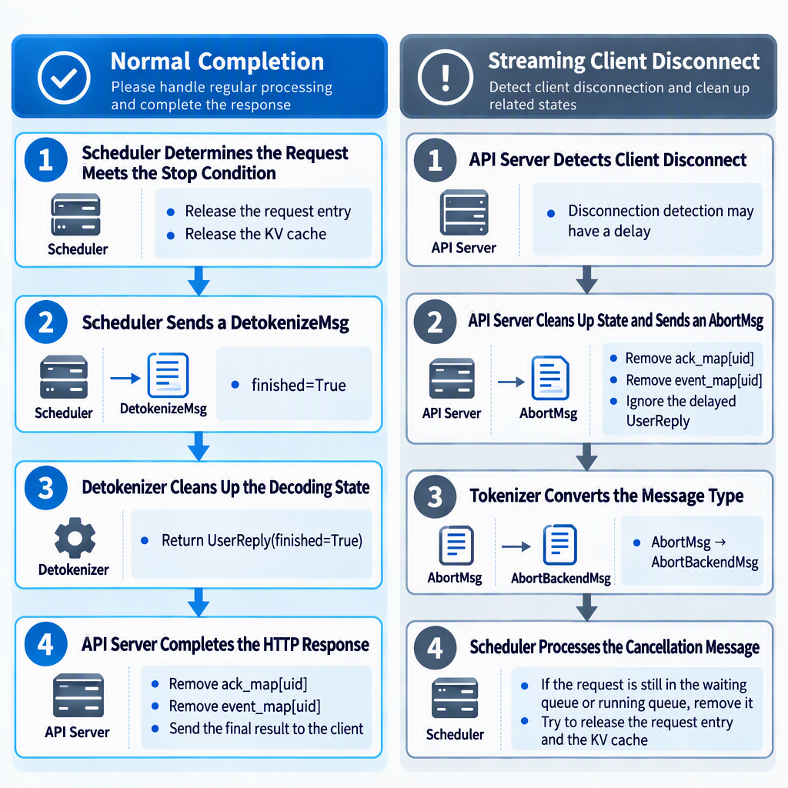

# Chapter 5 Serving It: HTTP and Concurrent Requests

In the preceding chapters, we added the model forward pass, sampling loop, and KV Cache to our generation program. We can now enter text in Python and obtain model output. However, the program still cannot serve other applications as an online service: it has no stable network interface, cannot manage multiple concurrent requests independently, and cannot return generated results incrementally over the network.

Chapter 2 followed one request through the API Server, Tokenizer, Scheduler, Engine, and Detokenizer. Rather than repeating that entire path, this chapter focuses on the API Server at the request entry point and asks a more specific question: **When multiple clients issue HTTP requests concurrently, how does the API Server submit work, wait for results, and route interleaved incremental outputs back to the correct connections?**

We will first identify the capabilities still missing between a local function and an online service. We will then examine how mini-sglang uses asynchronous tasks, request identifiers, and event notifications to manage concurrent connections. Next, we will compare streaming and non-streaming responses and examine paths that request cancellation and state cleanup do not yet cover. This chapter focuses on how the serving layer receives and manages concurrent requests. The next chapter will explain how the backend forms batches from those requests and schedules the GPU.

## 1 Learning Objectives

After completing this chapter, you will be able to:

- Explain which capabilities are still missing between a local generation function and an HTTP inference service.
- Explain why the API Server should not run model computation directly in its event loop.
- Explain how mini-sglang isolates concurrent requests using a process-local unique uid, result buffers, and event notifications.
- Distinguish HTTP concurrency, computation parallelism, and backend batching.
- Compare streaming and non-streaming response handling and explain the role of SSE.
- Describe state cleanup when a request completes normally or a client disconnects, and identify paths that the current implementation does not yet cover.

The companion coding exercise will implement the complete routes, message passing, and concurrency tests. The Scheduler's batching policy is deferred to the next chapter.

## 2 From a Function Call to a Serving Interface

Suppose the previous chapter has already produced a function that can generate text:

```python
def generate(prompt: str, max_tokens: int) -> str:
    ...
```

This function answers "how do we obtain model output?" but not "how can other programs use this capability reliably?" Turning it into an online service requires at least four categories of capabilities:

- **Interface contract**: define the endpoint, request fields, and response structure, and validate the input.
- **Request identifier**: assign each request a uid that is unique within the current API Server process so that returned results can be matched to the correct client connection.
- **Asynchronous waiting**: pause the current request while the backend computes so that the API Server can continue accepting other requests.
- **Lifecycle management**: handle normal completion, client disconnection, and state cleanup.

Streaming output builds on these capabilities. Whenever the backend produces another piece of text, the API Server returns it to the client over the HTTP connection that remains open.

### 2.1 Defining Input with a Request Model

mini-sglang uses FastAPI to provide its HTTP service and Pydantic request models to describe its inputs. FastAPI is a Python Web framework for implementing HTTP interfaces, while Pydantic describes and validates request data. A "request model" here is not the large language model that performs inference. It is a Python class derived from Pydantic's `BaseModel` that declares which fields an HTTP request contains, their types, and their default values. The following example keeps only the fields relevant to this chapter:

```python
class OpenAICompletionRequest(BaseModel):
    model: str
    prompt: str | None = None
    messages: list[Message] | None = None
    max_tokens: int = 16
    stream: bool = False
```

The request model defines what the service accepts. A client may provide either a plain string in `prompt` or a multi-turn conversation in `messages`; `max_tokens` limits the number of generated tokens; and `stream` determines whether results are delivered incrementally or all at once.

JSON is a text data format commonly used by HTTP APIs. FastAPI parses JSON according to the request model and returns a validation error when a field has the wrong type. The network request is therefore converted into a structured Python object, so later code does not need to repeatedly extract fields from raw JSON.

mini-sglang exposes OpenAI-style endpoints such as `/v1/chat/completions`: they use similar paths, request fields, and response structures so that existing clients can connect more easily. A similar interface, however, does not mean that the complete protocol is implemented. Token-usage values are still placeholders in the current teaching implementation; the `model` field does not change the model loaded when the server starts; fields such as `n` and `stop` may appear in a request but are not yet passed to the backend; and the finish reason does not distinguish a length limit from an end-of-sequence marker (EOS). This distinction prevents us from confusing "callable through the interface" with "fully protocol-compatible."

The request model defines the external request format. The next step is to convert those external fields into an internal message that the inference backend can process.

### 2.2 Establishing a Boundary Between HTTP and the Inference Backend

After receiving a request, the API Server does not run the model forward pass directly. Instead, it converts the external protocol into an internal message:

```python
uid = state.new_user()
msg = TokenizeMsg(
    uid=uid,
    text=prompt,
    sampling_params=sampling_params,
)
await state.send_one(msg)
```

These lines perform three operations:

1. Assign a process-local uid to the request and create its result buffer and notification object in the API Server.
2. Package the text and sampling parameters into an internal `TokenizeMsg`.
3. Send the message to a Tokenizer Worker through an asynchronous ZMQ communication channel.

ZMQ (ZeroMQ) is a tool for inter-process message communication. Here, an asynchronous ZMQ communication channel carries messages between the API Server and independent Workers without requiring either side to call the other's Python functions directly. A Worker is a process responsible for a particular category of work; for example, a Tokenizer Worker converts text into token IDs.

From this point on, the HTTP request-handling coroutine only needs to wait for a reply. A coroutine is an asynchronous execution unit scheduled by the event loop; when it reaches `await`, it can pause and allow other tasks to run. The event loop continually checks which asynchronous tasks are ready to resume and switches among them. Tokenization, scheduling, and model computation all run in backend processes rather than blocking the API Server's event loop through a synchronous function call.

This boundary is important. The HTTP layer handles how requests enter the system and how results leave it, while the backend handles model computation. If the two are coupled through a blocking call, one long-running generation request may delay other connections. Separating them allows the API Server to process new network events while it waits for backend results.

## 3 How the API Server Manages Concurrent Requests

Suppose request A has been submitted and is waiting for the next token. Request B now arrives. The API Server should be able to parse and submit B immediately instead of waiting for A to finish. This requires solving two problems: how the event loop can process other tasks during the wait, and how each returned message reaches the request that owns it.

### 3.1 `async` Does Not Automatically Eliminate Blocking

Consider this problematic implementation:

```python
@app.post("/generate")
async def generate(req: GenerateRequest):
    text = blocking_generate(req.prompt)
    return {"text": text}
```

Although the route is declared with `async def`, `blocking_generate` contains no `await` and continues to occupy the current thread while it runs. The event loop cannot switch to another coroutine during this computation, so new connections may wait for a long time.

The key to asynchronous concurrency is therefore not merely adding `async` to a function. Long-running work must be handed to an independent backend. While waiting for network events or messages, the API Server uses `await` so that the event loop can process other tasks. mini-sglang's HTTP coroutine waits for backend messages instead of running model computation in the API Server.

### 3.2 Isolating Request State with uid

Multiple requests share the same API Server and the same channel through which the Detokenizer returns results. `FrontendManager` is the object in the API Server that manages request identifiers, result buffers, and notifications. To prevent responses from being routed to the wrong connection, it assigns each request a monotonically increasing, non-repeating uid within the current process and keeps two uid-indexed state maps:

```python
ack_map: dict[int, list[UserReply]]
event_map: dict[int, asyncio.Event]
```

`UserReply` is the reply message that the Detokenizer sends to the API Server. It contains the request uid, the newly available text in `incremental_output`, and a `finished` flag indicating whether the request has completed. `ack_map[uid]` stores `UserReply` objects that have arrived but have not yet been consumed by that request. `event_map[uid]` notifies the waiting coroutine for that request that a new result is available.

The two structures are not interchangeable. `asyncio.Event` can be understood as an asynchronous notification flag: `set()` marks it as "new result available," `wait()` lets a coroutine wait for the notification, and `clear()` resets the flag. The event itself does not carry a `UserReply`. With only an event, a waiting coroutine would know that a result exists but could not retrieve its contents. A list stores data but cannot actively notify a waiter; with only a list, the coroutine would have to poll it continuously. One structure stores messages, while the other wakes the waiting task.

The uid associates an external connection with its internal request. It travels through the Tokenizer, Scheduler, and Detokenizer before returning to the API Server. As long as the identifier remains unchanged across components, the API Server can determine which client owns each piece of output. The counter restarts when the service restarts, so this uid is not a global identifier across processes or service instances.

### 3.3 Dispatching Results from a Shared Channel

The API Server starts a long-running `listen` coroutine that receives all `UserReply` objects returned by the Detokenizer. Rather than writing each reply directly to an HTTP connection, it first places the message in the buffer indexed by its uid and then wakes the corresponding request:

```python
async def listen(self):
    while True:
        reply = await self.recv_tokenizer.get()
        for reply in _unwrap_msg(reply):  # Unwrap one reply or a batch of replies.
            if reply.uid not in self.ack_map:
                continue
            self.ack_map[reply.uid].append(reply)
            self.event_map[reply.uid].set()
```

The process can be summarized as follows:

<div align="center">
  
  <p><em>Figure 5.1 Concurrent request and response routing</em></p>
</div>

The response coroutine for each request waits at `await event.wait()`. When no result is available, it pauses and returns control to the event loop. Once `listen` sets the corresponding event, the coroutine resumes and retrieves the messages from its buffer.

Suppose the replies arrive in the order `A1 → B1 → B2 → A2`. Although these messages are interleaved on the shared channel, the response coroutines for A and B read only their own buffers, so each client still sees its output in the correct order.

### 3.4 Concurrency, Parallelism, and Batching Are Different

At this point, the API Server can manage multiple unfinished requests at once, but that does not mean those requests are being computed in parallel.

- **Concurrency** means managing multiple tasks during the same period. An event loop can switch among coroutines even when it runs on only one thread.
- **Parallelism** means that multiple operations execute at the same instant, such as processes running on different CPU cores or multiple GPU worker processes computing together.
- **Batching** means organizing data from multiple requests into the same model execution.

The API Server may accept ten requests concurrently while the backend still processes them one by one. Conversely, an offline program can execute a static batch without HTTP. In a static batch, a fixed set of requests is chosen before execution, and new requests are not added until that batch finishes. Serving-layer concurrency therefore solves the problem of preventing one connection from blocking the others; it does not automatically improve GPU utilization.

The next chapter addresses a different layer of the problem. Because requests arrive and finish at different times, Continuous Batching lets the Scheduler dynamically select runnable requests and advance them together through model execution.

## 4 Streaming and Non-Streaming Responses

The backend produces tokens incrementally, and the Detokenizer converts them into incremental text that can be returned directly to the client. After receiving these `UserReply` objects, the API Server can use either of two response modes: collect the complete result and return it once, or return each new piece as soon as it arrives.

### 4.1 Non-Streaming: Collecting the Complete Result

A non-streaming request keeps waiting for replies with the same uid and concatenates their incremental text:

```python
full_content = ""
async for reply in state.wait_for_ack(uid):
    full_content += reply.incremental_output
    if reply.finished:
        break
```

After receiving the completion marker, the API Server places the complete text in a regular JSON response. "Non-streaming" describes only how the client ultimately receives the result; it does not mean that the server uses a synchronous blocking call. While waiting for replies, the coroutine still allows the event loop to process other tasks.

### 4.2 Streaming: Returning Results Incrementally with SSE

When a request sets `stream=true`, mini-sglang uses SSE (Server-Sent Events) to keep the HTTP connection open and send a sequence of data chunks. The following example omits fields unrelated to this discussion and shows only the event structure:

```text
data: {"choices":[{"delta":{"content":"KV Cache"},"finish_reason":null}]}

data: {"choices":[{"delta":{},"finish_reason":"stop"}]}

data: [DONE]

```

Each SSE event begins with `data:` and is separated from the next event by a blank line. `delta` carries the content added by the current event, while `finish_reason` states why generation ended. At completion, mini-sglang first sends a chunk with `finish_reason="stop"` and then sends `[DONE]` to mark that all streaming data has been delivered. The first chunk also carries `role="assistant"` to indicate that the following text comes from the assistant, and it may contain the first piece of text at the same time. Clients must not assume that the role and text always arrive in separate events.

SSE is a one-way data stream from server to client, which matches the interaction pattern of an inference service: a client submits one request, and the server continuously returns incremental text. It still uses regular HTTP and does not require a separate bidirectional protocol. The current implementation uses `cmpl-{uid}` as the chunk id and `text_completion.chunk` as its object, another reason we call the endpoint OpenAI-style rather than fully protocol-compatible.

In the code, FastAPI's `StreamingResponse` is a response type that can write content in multiple steps. It consumes an asynchronous generator, which can produce values repeatedly: every `yield` delivers one chunk to the client, while `await` pauses the generator and yields control again as it waits for the next backend message.

```python
return StreamingResponse(
    state.stream_with_cancellation(
        state.stream_chat_completions(uid),
        request,
        uid,
    ),
    media_type="text/event-stream",
)
```

Streaming lets users see content that has already been generated sooner. It reduces how long users wait to see the first piece of content and improves interactivity. It does not reduce the number of model forward passes or directly increase backend throughput. The main difference between streaming and non-streaming occurs while results are returned, not during model computation.

<div align="center">
  
  <p><em>Figure 5.2 Streaming versus non-streaming response timeline</em></p>
</div>

## 5 Request Completion, Cancellation, and State Cleanup

A service must handle more than the successful path in which generation finishes and the response returns normally. A client may close the connection midway, or the network may fail. If the API Server stops sending data without notifying the backend, the Scheduler may continue advancing the request and its KV Cache may continue occupying GPU memory.

### 5.1 Normal Completion

After determining that a request has met a stopping condition, the Scheduler removes its record of that request, releases the corresponding cache resources, and sends a `DetokenizeMsg` with `finished=True`. The Detokenizer receives this flag, removes the associated decoding state, and sends `UserReply(finished=True)` to the API Server. The API Server then completes the response and removes `ack_map[uid]` and `event_map[uid]`.

The steps that a normally completed request follows in the API Server can therefore be written as:

```text
Create the uid and waiting state
    → Submit the internal message
    → Receive and return incremental results
    → Receive finished
    → Complete the response and remove the result buffer and notification object
```

State cleanup is not optional. If completed uids remain in the maps indefinitely, stale state accumulates as the service continues running.

### 5.2 Streaming Client Disconnects and Cooperative Cancellation

For a streaming request, mini-sglang checks whether the client has disconnected while producing output. The same cancellation path runs when the Web server cancels the asynchronous task handling that connection. In the current source, `abort_user` waits a fixed 0.1 seconds, removes the uid's result buffer and notification object from the API Server, and then sends an `AbortMsg`:

```text
Client disconnects
    → API Server removes the result buffer and notification object, then sends AbortMsg
    → Tokenizer converts it to AbortBackendMsg
    → Scheduler handles the cancellation message; if the request is still in
      the waiting queue or running set, remove it and try to release resources
```

This is cooperative cancellation rather than an immediate interruption. Cooperative cancellation does not forcibly terminate executing code. Instead, it sends a cancellation message and relies on each component to stop future work when it processes that message. The message must pass through the asynchronous communication channel, Tokenizer, and Scheduler. Computation already submitted to the GPU does not stop the instant the message arrives, so late tokens may still appear after cancellation. How the Scheduler locates a uid among waiting and running requests is covered in the next chapter.

Replies that were already sent may also reach the API Server after cancellation. In that case, `listen` sees that the uid is no longer present in `ack_map` and ignores the late reply, preventing a cancelled request from accumulating more results in the API Server.

<div align="center">
  
  <p><em>Figure 5.3 Normal request completion and cancellation flow</em></p>
</div>

### 5.3 Error Paths Not Yet Fully Handled

The following details are not prerequisites for understanding the main serving path, but they reveal limitations in the current reference implementation. mini-sglang demonstrates the main cancellation path for streaming requests, but that path should not be interpreted to mean that every component's state is always reclaimed completely.

First, the non-streaming `/v1/chat/completions` path does not explicitly check whether the client has disconnected. If a client leaves early, the backend will usually continue generating, and the result buffer and notification object in the API Server can only be removed after the request completes normally.

Second, when the Tokenizer Worker receives an `AbortMsg`, it only converts the message to `AbortBackendMsg` and forwards it to the Scheduler. It does not also tell `DetokenizeManager` to remove the decoding state for that uid. A cancelled request will usually never receive `finished=True`, so its state may remain in the Detokenizer. This is a cleanup gap in the current reference implementation.

Another failure can occur before any result is returned. For example, if the Scheduler finds that the input length has reached the model's maximum sequence length, the current implementation logs a warning and drops the request without returning an error or `finished=True` to the API Server. The HTTP coroutine may then wait indefinitely, and its result buffer and notification object cannot be removed through the normal path.

These cases show that a complete lifecycle requires more than `AbortMsg`. It also needs a unified error reply, completion or error markers recognized by every component, and cleanup mechanisms that also run when an error occurs. Calling out these gaps distinguishes "understanding the main serving path" from "handling errors reliably in a production environment."

### 5.4 Slow Clients and Result Backlog

If the backend produces results faster than a client can read them for an extended period, unconsumed replies can accumulate in `ack_map[uid]`. This is a backpressure problem: the producer is faster than the consumer.

`StreamingResponse` is affected by the client's reading speed while writing to the HTTP connection, but the Scheduler does not slow generation when a client reads slowly. The independent `listen` coroutine can continue receiving results from ZMQ and appending them to the list. In other words, the current implementation does not report "the client cannot keep up" to the Scheduler. A single request is ultimately bounded by `max_tokens` and the model's maximum sequence length, but many concurrent requests or long outputs can still accumulate substantial data in memory. A production service must also bound per-connection buffers, enforce timeouts, or cancel a request when its client remains behind.

## 6 Summary and Exercises

### 6.1 Summary

This chapter added a serving layer to the generation program. The API Server uses a request model to define the external interface, converts an HTTP request into an internal message carrying a uid, and passes that message to the backend through an asynchronous communication channel instead of running the model directly in the event loop.

The API Server uses three mechanisms to manage concurrent requests: the uid distinguishes requests, `ack_map` stores unconsumed results, and `event_map` wakes the corresponding coroutine when a result arrives. One shared listener coroutine receives all returned messages and uses the uid to send each result to the corresponding request.

A non-streaming response collects the complete text before returning it, while a streaming response returns new content incrementally through SSE. When a request ends, every component should clean up the state associated with its uid. When a client disconnects, the cancellation signal must also propagate to the backend. The current mini-sglang implementation demonstrates the main cooperative-cancellation path for streaming requests, but non-streaming disconnections, Detokenizer cancellation cleanup, and some error replies are not yet fully handled.

At this point, the serving layer can manage multiple concurrent requests, but it does not determine how the GPU processes those requests together. The next chapter enters the Scheduler and explains how Continuous Batching organizes model execution dynamically.

### 6.2 Exercises

1. Why can placing a synchronous generation function inside an `async def` route still block other connections?
2. Why does mini-sglang have the API Server send an internal message instead of calling the model directly?
3. What roles do `ack_map` and `event_map` play? Why is neither sufficient on its own?
4. When replies from multiple requests arrive interleaved on one shared channel, how does the API Server avoid routing a result to the wrong client?
5. What is the difference among HTTP concurrency, computation parallelism, and backend batching?
6. Which metric or aspect of user experience does streaming improve, and why does it not directly reduce model computation?
7. Which components does mini-sglang's current streaming-cancellation path traverse? Why does receiving a cancellation message not imply that computation stops immediately? Which exceptional paths remain incompletely handled?

## References

- [Official mini-sglang repository (reference commit 9a91cfa)](https://github.com/sgl-project/mini-sglang/tree/9a91cfafe754aa85daee49998176275667eb58f2)
- [mini-sglang: system architecture and request lifecycle](https://github.com/sgl-project/mini-sglang/blob/9a91cfafe754aa85daee49998176275667eb58f2/docs/structures.md)
- [mini-sglang: API Server, concurrent state, and streaming responses](https://github.com/sgl-project/mini-sglang/blob/9a91cfafe754aa85daee49998176275667eb58f2/python/minisgl/server/api_server.py)
- [mini-sglang: frontend and backend message definitions](https://github.com/sgl-project/mini-sglang/tree/9a91cfafe754aa85daee49998176275667eb58f2/python/minisgl/message)
- [mini-sglang: Tokenizer Worker and cancellation-message conversion](https://github.com/sgl-project/mini-sglang/blob/9a91cfafe754aa85daee49998176275667eb58f2/python/minisgl/tokenizer/server.py)
- [mini-sglang: cancellation and resource release in the Scheduler](https://github.com/sgl-project/mini-sglang/blob/9a91cfafe754aa85daee49998176275667eb58f2/python/minisgl/scheduler/scheduler.py)
- [FastAPI: StreamingResponse](https://fastapi.tiangolo.com/advanced/custom-response/#streamingresponse)
- [MDN: Server-Sent Events](https://developer.mozilla.org/en-US/docs/Web/API/Server-sent_events)
