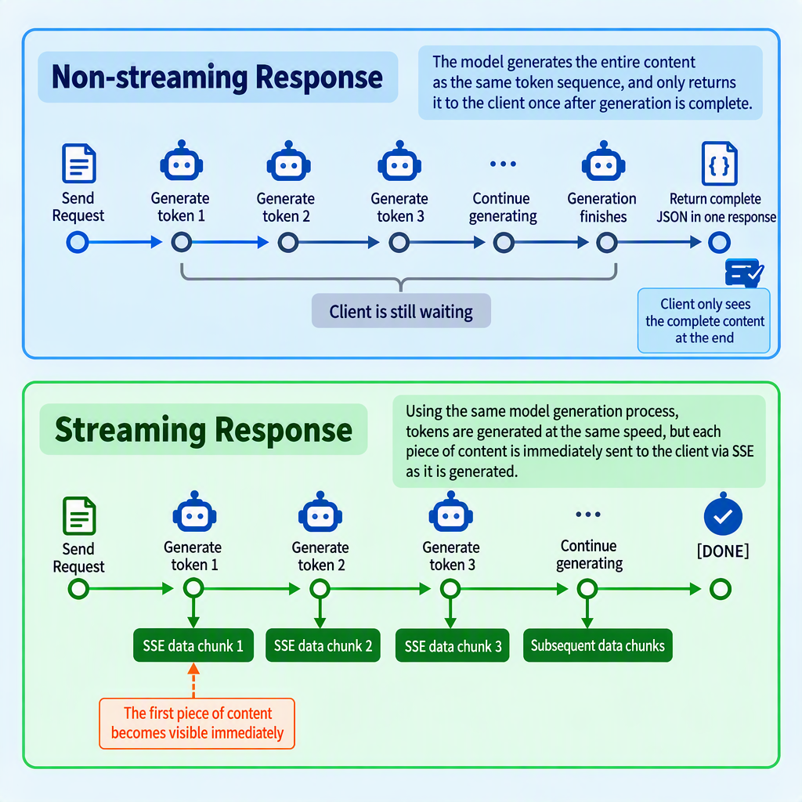

# Chapter 5 Serving It: HTTP and Concurrent Requests

We have added the model forward pass, sampling loop, and KV Cache to a generation program. It can now accept text in Python and produce an answer. To let a web page, mobile app, or program on another machine use that model, the next step is to run it as a service.

This article starts with HTTP, clients, and servers, then follows a request into the inference system and back to the user. It explains how a service keeps concurrent requests separate and what streaming and cancellation accomplish. The companion [code walkthrough](./Chapter5_HTTP-and-Concurrent-Requests_code.md) covers the Python implementation; the next chapter covers batching and GPU scheduling.

## 1 Learning Objectives

After completing this chapter, you will be able to:

- Explain clients, servers, HTTP, and why a local generation function needs a serving interface.
- Read a request's address, method, headers, and body, including `messages` and `stream`.
- Describe the path from the client through the inference system and back to the user.
- Explain the need for concurrency and request isolation, and distinguish concurrency, parallelism, and batching.
- Compare streaming and non-streaming responses and explain completion, cancellation, and resource cleanup.

## 2 From a Local Program to an HTTP Service

### 2.1 What Clients and Servers Do

When you call a generation function in your own Python program, the caller has direct access to the function and model object. A chat interface, however, may run on a user's device while the model lives on another machine with a GPU. The programs need a way to exchange a question and an answer across process and machine boundaries.

A **client** is the program that sends a request, such as a chat web page, mobile app, or command-line script. A **server** accepts requests, performs work, and returns results. These are roles in an interaction, not device categories: a business application running on a server machine can itself be a client of an inference service.

Serving a generation program means keeping it running with the model loaded and accepting external calls through an agreed network interface. Multiple applications can share the model service without each installing the model or loading its own copy of the weights.

### 2.2 How HTTP Defines Requests and Responses

HTTP, the Hypertext Transfer Protocol, is an application-layer communication protocol. It defines how a client sends a request and how a server returns a response. Despite the name, HTTP can carry JSON, images, and generated text as well as hypertext.

In a basic exchange, a client sends a request to an address, and the server processes it and returns a response. HTTP specifies the general message structure. The service API defines which path means “generate an answer” and which JSON fields carry the input. HTTP itself neither runs the model nor decides how the GPU executes work.

For `http://localhost:1919/v1/chat/completions`, `http` is the protocol, `localhost` is the machine running the client, `1919` is the port on which the service listens, and `/v1/chat/completions` is the endpoint path. If the service runs elsewhere, the client must use a reachable address for that machine.

**Check your understanding:** How does a local function call differ from a remote service request? Must a client be a browser? Does HTTP specify how a model computes its output?

## 3 Reading a Request and a Response

### 3.1 What a Request Contains

The following simplified HTTP/1.1 message illustrates a chat request. It omits transport details such as content length; runnable commands are provided in the code article.

```http
POST /v1/chat/completions HTTP/1.1
Host: localhost:1919
Content-Type: application/json

{
  "model": "Qwen/Qwen3-0.6B",
  "messages": [
    {"role": "user", "content": "What is KV Cache?"}
  ],
  "max_tokens": 128,
  "stream": false
}
```

The first line contains the `POST` method, which this endpoint uses to submit a generation task, and the path identifying the endpoint. `Host` and `Content-Type` are headers: they specify the destination host and port and indicate that the body uses JSON. After the blank line, the JSON body carries the task's input and parameters.

| Body field | Meaning |
| --- | --- |
| `model` | The model name requested by the client; whether this selects a different model depends on the implementation |
| `messages` | Messages in conversation order, potentially including history and the current question |
| `role` | The message's role, such as `user`, `assistant`, or `system` instructions |
| `content` | The text of this message |
| `max_tokens` | The maximum number of tokens to generate, not a character count or a guaranteed output length |
| `stream` | Whether to return results incrementally: `false` collects the result first, while `true` requests streaming |

Here, `messages` is a list of conversation messages, distinct from the HTTP request message itself. For a multi-turn conversation, the client usually includes the relevant history in this list; a previous API call does not imply that the server remembers it. Some endpoints also accept a `prompt` string for plain text input.

### 3.2 What a Response Contains

With `stream` set to `false`, the server can return one JSON response after generation completes. This example again omits fields that are not needed for the explanation:

```http
HTTP/1.1 200 OK
Content-Type: application/json

{
  "choices": [{
    "message": {
      "role": "assistant",
      "content": "KV Cache stores the Keys and Values of previous tokens."
    },
    "finish_reason": "stop"
  }]
}
```

`200` is an HTTP status code indicating a successful request. The header identifies the body as JSON. Inside the body, `message` contains the assistant's answer and `finish_reason` describes why generation ended. Invalid requests and service failures should receive appropriate error statuses and explanations. HTTP success does not establish that the model's answer is correct.

**Check your understanding:** Can you locate the endpoint path, data format, and question separately? How does `messages` express a conversation? Does `stream` change the input or the way results return?

## 4 Following a Request Through the Inference System

With the external interface established, we can revisit the responsibilities introduced in Chapter 2. A request passes through these stages on its way from the client to the user-visible answer:

| Stage | Responsible component | What happens |
| --- | --- | --- |
| Send the request | Client | Place the question, conversation history, and generation parameters in an HTTP request |
| Receive and check | API Server | Parse and check the input, register request ownership, and submit work to the backend |
| Encode text | Tokenizer | Convert plain text, or conversation text after applying a chat template, into token IDs |
| Queue and schedule | Scheduler | Decide when to process the request and which requests participate in computation together |
| Generate tokens | Engine | Run model forward passes and sampling to produce subsequent tokens |
| Decode text | Detokenizer | Convert generated tokens into incremental text suitable for display |
| Return the answer | API Server and client | Route results to the corresponding request and display them to the user |

These are responsibilities, not a requirement to run each row in a separate process. During generation, producing tokens, decoding text, and returning new content can repeat many times. A non-streaming request collects that text and returns the complete answer at the end.

The API Server handles network input and output; the backend handles tokenization, scheduling, and model computation. Generation often takes much longer than parsing an HTTP request. While waiting for the backend, the frontend should still accept new requests and handle other connections. This brings us to concurrency.

**Check your understanding:** Who turns text into tokens? Who decides which requests compute next? Does producing a token mean that the client has already received displayable text?

## 5 Serving Multiple Users at Once

### 5.1 Why Concurrency Is Needed

A chat application may have many users: B and C can submit questions before A's answer finishes generating. **Concurrency** means managing multiple unfinished tasks during the same period. If the service must finish A before accepting B, a long request delays everyone behind it.

Large inference clusters have the same requirement. More model replicas can support more work, but each service entry point still needs to manage connections and track their individual states. Scaling the cluster does not replace request management.

The serving layer should accept B while A waits and return B's available results without waiting for A to finish. Yielding execution while waiting for the backend is central to this behavior. The code article explains how asynchronous coroutines implement that waiting.

### 5.2 Keeping Requests Separate

With concurrency, results need not return in submission order. Suppose fragments arrive as `A1 → B1 → B2 → A2`. The API Server needs to know which request owns each fragment; otherwise, B's answer might be written to A's connection.

Each request needs a distinguishing identifier that travels with internal work and replies. The API Server uses it to deliver A's fragments to A and B's fragments to B, preserving order within each request. Generation parameters, received results, and completion state must also remain separate so requests do not overwrite one another.

This independence concerns request state and result ownership. It does not require each request to have a dedicated model copy or GPU. The companion article covers mini-sglang's identifiers, shared listener coroutine, and producer-consumer implementation that delivers results to each request.

### 5.3 Concurrency, Parallelism, and Batching

| Concept | Main question | Example |
| --- | --- | --- |
| Concurrency | Can multiple unfinished tasks be managed at once? | The API Server accepts B while A waits for generation |
| Parallelism | Does work execute at the same instant? | Processes run simultaneously on different CPU cores |
| Batching | Can multiple requests share one model execution? | The Scheduler puts A and B into one batch |

An API Server can accept ten requests while the backend computes them one by one. An offline program can also batch inputs without using HTTP. HTTP concurrency therefore does not automatically improve GPU utilization. The next chapter explains how Continuous Batching lets requests that arrive and finish at different times share model execution.

**Check your understanding:** Why accept B before A finishes? How do interleaved results find the correct client? Does accepting ten requests mean that the GPU computes all ten together?

## 6 Returning Once or Streaming Incrementally

### 6.1 The User-Visible Difference

As the model generates text, the service can wait until the complete answer is ready or send available pieces along the way. These are non-streaming and streaming responses. Non-streaming does not mean the entire service blocks: other requests can continue while this request waits for its final answer.

Streaming suits a chat interface because users can read content that has already been generated. It reduces the wait before seeing the first content. It does not reduce the number of model forward passes or guarantee earlier completion of the whole answer.

<div align="center">
  
  <p><em>Figure 5.2 Streaming versus non-streaming response timeline</em></p>
</div>

### 6.2 Carrying New Content with SSE

Server-Sent Events, or SSE, is a format for sending a sequence of events through an HTTP response. The client submits one request, and the server keeps the response open while sending new content. It fits this primarily one-way flow from server to client.

The following is a simplified chat-interface example. A blank line separates data events containing `data:` lines. `delta.content` carries newly added text, which the client can concatenate in order.

```text
data: {"choices":[{"delta":{"content":"KV Cache"}}]}

data: {"choices":[{"delta":{"content":" stores previous Keys and Values."}}]}

data: [DONE]

```

`[DONE]` is an end marker defined by this kind of API, not a field required by the SSE standard. One event also need not correspond to one token or one network packet: text decoding and network buffering can change how much content each read returns. Clients must parse event boundaries instead of treating each network read as a complete event.

**Check your understanding:** Does non-streaming block other requests? Which part of the waiting experience does streaming improve? Are SSE events and model tokens necessarily one-to-one?

## 7 Handling Completion and Users Who Leave

While processing a request, the system retains result buffers, decoding state, scheduling records, and KV Cache resources. On normal completion, each component should finish its work for the request and release or manage resources according to its caching policy, preventing stale state from accumulating.

A user may also close the page or click stop midway. Closing the network connection alone does not necessarily tell the backend that the user has left, so generation may continue. The service needs to propagate cancellation from the HTTP entry point to the backend, let the Scheduler stop advancing the request, and handle its resources. Late results already in transit must also be recognized and discarded.

This is cooperative cancellation: components stop future work when they process the notification. Propagation takes time, and work already submitted to the GPU does not disappear instantly. The user's stop action and complete resource reclamation occur at different times.

A client can also remain connected but read slowly. If generation outpaces delivery for a long time, undelivered results accumulate. Buffer limits, timeouts, or cancellation can bound resource use; feeding a consumer's capacity limit back upstream is called backpressure. Errors also need explicit completion or failure signals so clients do not wait forever.

These are lifecycle requirements for a service. The code article checks which paths the mini-sglang teaching implementation covers and where cleanup remains incomplete.

**Check your understanding:** Why might closing HTTP leave generation running? Why is cancellation not instantaneous? What accumulates when a client reads slowly?

## 8 Summary and Exercises

### 8.1 Summary

HTTP serving lets applications use a model through an agreed request-response interface. A request passes through the API Server, tokenization, scheduling, model computation, and text decoding before the API Server returns results to the client.

With multiple callers, the service must handle other requests while waiting and preserve ownership through request identifiers. Streaming exposes available content sooner; completion, cancellation, and error handling finish the lifecycle. These serving responsibilities are distinct from GPU batching.

Continue with the [code walkthrough](./Chapter5_HTTP-and-Concurrent-Requests_code.md) to connect these concepts to the implementation, then Chapter 6 to learn how the Scheduler organizes computation for concurrent requests.

### 8.2 Exercises

1. Why is local text generation insufficient for other applications to use a model? What roles do the client, server, and HTTP play?
2. What do the example request's method, path, headers, and body contain? What do `messages` and `stream` express?
3. Which stages take a request from the client through the model and back? Why separate network request management from model computation?
4. Why does a service need concurrency? How can it keep interleaved replies from reaching the wrong client?
5. How do HTTP concurrency, computation parallelism, and backend batching differ?
6. Which part of the user experience does streaming improve? Why does it not directly reduce model computation?
7. Which responsibilities must a cancellation notification traverse after disconnection? Why does cancellation not stop computation immediately, and which resources need cleanup?

## References

- [MDN: An overview of HTTP](https://developer.mozilla.org/en-US/docs/Web/HTTP/Overview)
- [MDN: HTTP messages](https://developer.mozilla.org/en-US/docs/Web/HTTP/Messages)
- [MDN: Using server-sent events](https://developer.mozilla.org/en-US/docs/Web/API/Server-sent_events/Using_server-sent_events)
- [mini-sglang: system architecture and request lifecycle (reference commit 9a91cfa)](https://github.com/sgl-project/mini-sglang/blob/9a91cfafe754aa85daee49998176275667eb58f2/docs/structures.md)
