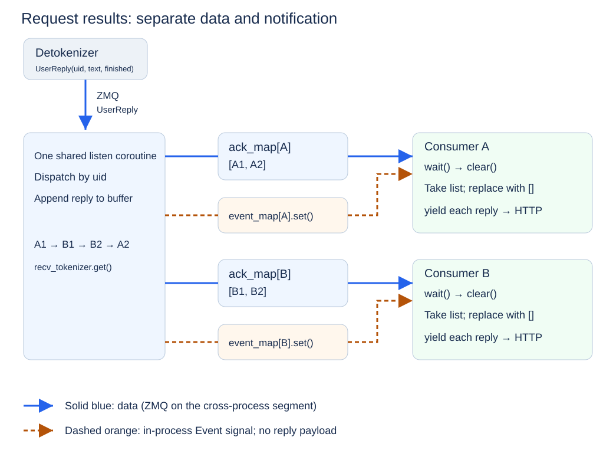

# Chapter 5 HTTP and Concurrent Requests (Code Walkthrough)

The [concept article](./Chapter5_HTTP-and-Concurrent-Requests.md) introduced HTTP requests, concurrency, streaming, and cancellation. This article follows mini-sglang's actual implementation through request models, internal messages, result buffers, and response coroutines.

The reference version is commit [9a91cfa](https://github.com/sgl-project/mini-sglang/tree/9a91cfafe754aa85daee49998176275667eb58f2), primarily `python/minisgl/server/api_server.py`. Apart from explicitly runnable shell commands, Python blocks are source excerpts or labeled counterexamples, not a complete standalone service. Chapter 6 covers the Scheduler's batching policy.

## 1 Learning Objectives

After completing this chapter, you will be able to:

- Locate request models, HTTP routes, and the conversion to internal messages.
- Explain how `new_user`, `listen`, and `wait_for_ack` combine uids, result buffers, and notifications.
- Trace non-streaming text collection and streaming SSE encoding.
- Locate cancellation-message creation, conversion, and handling, and identify cleanup gaps.

## 2 From HTTP Input to Backend Work

Follow the [mini-sglang installation instructions](https://github.com/sgl-project/mini-sglang/tree/9a91cfafe754aa85daee49998176275667eb58f2#2-installation) to prepare a GPU environment for inference. Run the following command in that environment:

```bash
python -m minisgl --model "Qwen/Qwen3-0.6B"
```

Send a request from another terminal:

```bash
curl -N http://localhost:1919/v1/chat/completions \
  -H "Content-Type: application/json" \
  -d '{
    "model": "Qwen/Qwen3-0.6B",
    "messages": [{"role": "user", "content": "What is KV Cache?"}],
    "max_tokens": 128,
    "stream": true
  }'
```

`-N` disables curl's output buffering so SSE events are easier to observe. Repeat with `stream` set to `false` to compare incremental output with a complete JSON response. Reading the source does not require running GPU inference.

| Responsibility | Reference source |
| --- | --- |
| Request parsing, state, and responses | `OpenAICompletionRequest`, `v1_completions`, and `FrontendManager` in `server/api_server.py` |
| Internal message structures | `TokenizeMsg`, `UserReply`, `AbortMsg`, and `AbortBackendMsg` in `message/` |
| Tokenization, decoding, and cancellation conversion | `tokenize_worker` in `tokenizer/server.py` |
| Scheduling and resource reclamation | `_process_one_msg` and `_process_last_data` in `scheduler/scheduler.py` |

### 2.1 Defining Input with a Request Model

mini-sglang uses FastAPI to provide its HTTP service and Pydantic request models to describe its inputs. FastAPI is a Python Web framework for implementing HTTP interfaces, while Pydantic describes and validates request data. A "request model" here is not the large language model that performs inference. It is a Python class derived from Pydantic's `BaseModel` that declares which fields an HTTP request contains, their types, and their default values. The following example keeps only the fields relevant to this chapter:

```python
class OpenAICompletionRequest(BaseModel):
    model: str
    prompt: str | None = None
    messages: list[Message] | None = None
    max_tokens: int = 16
    stream: bool = False
```

`Message`, defined in the same file, contains `role` and `content`. The request model defines what the service accepts. A client may provide either a plain string in `prompt` or a multi-turn conversation in `messages`; `max_tokens` limits the number of generated tokens; and `stream` determines whether results are delivered incrementally or all at once.

JSON is a text data format commonly used by HTTP APIs. FastAPI parses JSON according to the request model and returns an error when parsing or validation fails; some values may also be coerced according to the model's rules. The network request is therefore converted into a structured Python object, so later code does not need to repeatedly extract fields from raw JSON.

mini-sglang exposes OpenAI-style endpoints such as `/v1/chat/completions`: they use similar paths, request fields, and response structures so that existing clients can connect more easily. A similar interface, however, does not mean that the complete protocol is implemented. Token-usage values are still placeholders in the current teaching implementation; the `model` field does not change the model loaded when the server starts; fields such as `n` and `stop` may appear in a request but are not yet passed to the backend; and the finish reason does not distinguish a length limit from an end-of-sequence marker (EOS). This distinction prevents us from confusing "callable through the interface" with "fully protocol-compatible."

The request model defines the external request format. The next step is to convert those external fields into an internal message that the inference backend can process.

### 2.2 Establishing a Boundary Between HTTP and the Inference Backend

After receiving a request, the API Server does not run the model forward pass directly. Instead, it converts the external protocol into an internal message:

```python
state = get_global_state()
if req.messages:
    prompt = [msg.model_dump() for msg in req.messages]
else:
    assert req.prompt is not None, "Either 'messages' or 'prompt' must be provided"
    prompt = req.prompt

uid = state.new_user()
await state.send_one(
    TokenizeMsg(
        uid=uid,
        text=prompt,
        sampling_params=SamplingParams(
            ignore_eos=req.ignore_eos,
            max_tokens=req.max_tokens,
            temperature=req.temperature,
            top_k=req.top_k,
            top_p=req.top_p,
        ),
    )
)
```

This is the input conversion and submission portion of `v1_completions`. `req` is the parsed request. A nonempty `messages` list becomes a list of dictionaries; otherwise the route uses `prompt`. After selecting the input, submission performs three operations:

1. Assign a process-local uid to the request and create its result buffer and notification object in the API Server.
2. Package the text and sampling parameters into an internal `TokenizeMsg`.
3. Send the message to a Tokenizer Worker through an asynchronous ZMQ communication channel.

ZMQ (ZeroMQ) is a tool for inter-process message communication. Here, an asynchronous ZMQ communication channel carries messages between the API Server and independent Workers without requiring either side to call the other's Python functions directly. A Worker is a process responsible for a particular category of work; for example, a Tokenizer Worker converts text into token IDs.

From this point on, the HTTP request-handling coroutine only needs to wait for a reply. A coroutine is an asynchronous execution unit scheduled by the event loop; when it reaches `await`, it can pause and allow other tasks to run. The event loop continually checks which asynchronous tasks are ready to resume and switches among them. Tokenization, scheduling, and model computation all run in backend processes rather than blocking the API Server's event loop through a synchronous function call.

This boundary is important. The HTTP layer handles how requests enter the system and how results leave it, while the backend handles model computation. If the two are coupled through a blocking call, one long-running generation request may delay other connections. Separating them allows the API Server to process new network events while it waits for backend results.

**Check your understanding:** Where is `messages` converted? Which sampling parameters reach the internal message? Why does the HTTP route avoid running the model directly?

## 3 How the API Server Manages Concurrent Requests

Suppose request A has been submitted and is waiting for the next token. Request B now arrives. The API Server should be able to parse and submit B immediately instead of waiting for A to finish. This requires solving two problems: how the event loop can process other tasks during the wait, and how each returned message reaches the request that owns it.

### 3.1 `async` Does Not Automatically Eliminate Blocking

Consider this problematic implementation:

```python
@app.post("/generate")
async def generate(req: GenerateRequest):
    text = blocking_generate(req.prompt)
    return {"text": text}
```

Although the route is declared with `async def`, `blocking_generate` contains no `await` and continues to occupy the current thread while it runs. The event loop cannot switch to another coroutine during this computation, so new connections may wait for a long time.

The key to asynchronous concurrency is therefore not merely adding `async` to a function. Long-running work must be handed to an independent backend. While waiting for network events or messages, the API Server uses `await` so that the event loop can process other tasks. mini-sglang's HTTP coroutine waits for backend messages instead of running model computation in the API Server.

### 3.2 Isolating Request State with uid

Multiple requests share the same API Server and the same channel through which the Detokenizer returns results. `FrontendManager` is the object in the API Server that manages request identifiers, result buffers, and notifications. To prevent responses from being routed to the wrong connection, it assigns each request a monotonically increasing, non-repeating uid within the current process and keeps two uid-indexed state maps:

```python
ack_map: dict[int, list[UserReply]]
event_map: dict[int, asyncio.Event]
```

`UserReply` is the reply message that the Detokenizer sends to the API Server. It contains the request uid, the newly available text in `incremental_output`, and a `finished` flag indicating whether the request has completed. `ack_map[uid]` stores `UserReply` objects that have arrived but have not yet been consumed by that request. `event_map[uid]` notifies the waiting coroutine for that request that a new result is available.

The two structures are not interchangeable. `asyncio.Event` can be understood as an asynchronous notification flag: `set()` marks it as "new result available," `wait()` lets a coroutine wait for the notification, and `clear()` resets the flag. The event itself does not carry a `UserReply`. With only an event, a waiting coroutine would know that a result exists but could not retrieve its contents. A list stores data but cannot actively notify a waiter; with only a list, the coroutine would have to poll it continuously. One structure stores messages, while the other wakes the waiting task.

The uid associates an external connection with its internal request. It travels through the Tokenizer, Scheduler, and Detokenizer before returning to the API Server. As long as the identifier remains unchanged across components, the API Server can determine which client owns each piece of output. The counter restarts when the service restarts, so this uid is not a global identifier across processes or service instances.

`new_user` creates the state:

```python
def new_user(self) -> int:
    uid = self.uid_counter
    self.uid_counter += 1
    self.ack_map[uid] = []
    self.event_map[uid] = asyncio.Event()
    return uid
```

### 3.3 Dispatching Results from a Shared Channel

On the first send, `send_one` calls `_create_listener_once` to start a long-running `listen` coroutine that receives all `UserReply` objects returned by the Detokenizer. Rather than writing each reply directly to an HTTP connection, it first places the message in the buffer indexed by its uid and then wakes the corresponding request:

```python
async def listen(self):
    while True:
        reply = await self.recv_tokenizer.get()
        for reply in _unwrap_msg(reply):  # Unwrap one reply or a batch of replies.
            if reply.uid not in self.ack_map:
                continue
            self.ack_map[reply.uid].append(reply)
            self.event_map[reply.uid].set()
```

The process can be summarized as follows:

<div align="center">
  
  <p><em>Figure 5.1 Shared result channel, request buffers, and event notifications</em></p>
</div>

Each request consumes its own results through `wait_for_ack(uid)`. This is the complete method from the reference version, including its trailing cleanup:

```python
async def wait_for_ack(self, uid: int):
    event = self.event_map[uid]

    while True:
        await event.wait()
        event.clear()

        pending = self.ack_map[uid]
        self.ack_map[uid] = []
        ack = None
        for ack in pending:
            yield ack
        if ack and ack.finished:
            break

    del self.ack_map[uid]
    del self.event_map[uid]
```

The sequence is **wait → clear → take and replace the list → yield each reply**:

1. `wait()` waits for notification, allowing other tasks to run while no result is available.
2. `clear()` resets the flag. It neither deletes results nor implies that exactly one reply arrived.
3. `pending` takes ownership of the current list, and the map receives a new empty list for future replies.
4. Each reply in the detached list is yielded to the non-streaming collector or streaming encoder.

There is no `await` between `clear()` and replacing the list, so `listen` cannot interleave within these lines on the same event loop. While consuming `pending`, the caller may yield control for a network write. New replies then enter the new list and set the Event for the next iteration.

An Event is a notification flag, not a message counter. Several replies can share one wake-up because all their data remains in the list. In the figure, solid blue arrows carry data, with ZMQ used for the cross-process segment. Dashed orange arrows represent setting and waking an in-process `asyncio.Event`, not another ZMQ channel.

### 3.4 Checking Isolation Through Producers and Consumers

Within this structure, `listen` produces buffered replies, each request's `wait_for_ack` consumes them, and the shared state consists of separate lists indexed by uid. There is one shared listener and multiple request consumers; individual requests do not compete to read directly from ZMQ.

Suppose the arrival order is `A1 → B1 → B2 → A2`. The producer stores replies by uid, so A's consumer only takes A's list and B's consumer only takes B's. After a consumer detaches its current list, the producer can still append future replies to the replacement list.

**Check your understanding:** Why can an Event not replace the list? Can one wake-up represent several replies? Where do new replies go while the consumer processes the old list?

## 4 Streaming and Non-Streaming Responses

The backend produces tokens incrementally, and the Detokenizer converts them into incremental text that can be returned directly to the client. After receiving these `UserReply` objects, the API Server can use either of two response modes: collect the complete result and return it once, or return each new piece as soon as it arrives.

### 4.1 Non-Streaming: Collecting the Complete Result

A non-streaming request keeps waiting for replies with the same uid and concatenates their incremental text:

```python
full_content = ""
async for reply in state.wait_for_ack(uid):
    full_content += reply.incremental_output
    if reply.finished:
        break
```

After receiving the completion marker, the API Server places the complete text in a regular JSON response. "Non-streaming" describes only how the client ultimately receives the result; it does not mean that the server uses a synchronous blocking call. While waiting for replies, the coroutine still allows the event loop to process other tasks.

### 4.2 Streaming: Returning Results Incrementally with SSE

When a request sets `stream=true`, mini-sglang uses SSE (Server-Sent Events) to keep the HTTP connection open and send a sequence of data chunks. The following example omits fields unrelated to this discussion and shows only the event structure:

```text
data: {"choices":[{"delta":{"content":"KV Cache"},"finish_reason":null}]}

data: {"choices":[{"delta":{},"finish_reason":"stop"}]}

data: [DONE]

```

Each SSE data event shown here begins with `data:` and is separated from the next event by a blank line. `[DONE]` is an API convention, not a required SSE end marker. `delta` carries the content added by the current event, while `finish_reason` states why generation ended. At completion, mini-sglang first sends a chunk with `finish_reason="stop"` and then sends `[DONE]` to mark that all streaming data has been delivered. The first chunk also carries `role="assistant"` to indicate that the following text comes from the assistant, and it may contain the first piece of text at the same time. Clients must not assume that the role and text always arrive in separate events.

SSE is a one-way data stream from server to client, which matches the interaction pattern of an inference service: a client submits one request, and the server continuously returns incremental text. It still uses regular HTTP and does not require a separate bidirectional protocol. The current implementation uses `cmpl-{uid}` as the chunk id and `text_completion.chunk` as its object, another reason we call the endpoint OpenAI-style rather than fully protocol-compatible.

In the code, FastAPI's `StreamingResponse` is a response type that can write content in multiple steps. It consumes an asynchronous generator, which can produce values repeatedly: every `yield` hands a chunk to the response layer for transmission; network buffering also affects when it reaches the client, while `await` pauses the generator and yields control again as it waits for the next backend message.

```python
return StreamingResponse(
    state.stream_with_cancellation(
        state.stream_chat_completions(uid),
        request,
        uid,
    ),
    media_type="text/event-stream",
)
```

`stream_chat_completions` encodes internal replies as SSE data. The reference generator below shows the first chunk, final chunks, and the early exit:

```python
async def stream_chat_completions(self, uid: int):
    first_chunk = True
    async for ack in self.wait_for_ack(uid):
        delta = {}
        if first_chunk:
            delta["role"] = "assistant"
            first_chunk = False
        if ack.incremental_output:
            delta["content"] = ack.incremental_output

        chunk = {
            "id": f"cmpl-{uid}",
            "object": "text_completion.chunk",
            "choices": [{"delta": delta, "index": 0, "finish_reason": None}],
        }
        yield f"data: {json.dumps(chunk)}\n\n".encode()

        if ack.finished:
            break

    # send final finish_reason
    end_chunk = {
        "id": f"cmpl-{uid}",
        "object": "text_completion.chunk",
        "choices": [{"delta": {}, "index": 0, "finish_reason": "stop"}],
    }
    yield f"data: {json.dumps(end_chunk)}\n\n".encode()
    yield b"data: [DONE]\n\n"
    logger.debug("Finished streaming response for user %s", uid)
```

Streaming lets users see content that has already been generated sooner. It reduces how long users wait to see the first piece of content and improves interactivity. It does not reduce the number of model forward passes or directly increase backend throughput. The main difference between streaming and non-streaming occurs while results are returned, not during model computation.

**Check your understanding:** Where is non-streaming text concatenated? Where does the first chunk receive its role? What object does `StreamingResponse` consume?

## 5 Request Completion, Cancellation, and State Cleanup

A service must handle more than the successful path in which generation finishes and the response returns normally. A client may close the connection midway, or the network may fail. If the API Server stops sending data without notifying the backend, the Scheduler may continue advancing the request and its KV Cache may continue occupying GPU memory.

### 5.1 Normal Completion

In `_process_last_data`, the Scheduler checks stopping conditions, removes completed requests from its running state, and calls `_free_req_resources` to return request-table slots and handle KV Cache according to the caching policy. Reusable prefixes need not all be discarded immediately. It then sends `DetokenizeMsg(finished=True)`; decoding clears its corresponding state and returns `UserReply(finished=True)`.

On the frontend, `wait_for_ack` places deletion of `ack_map[uid]` and `event_map[uid]` after its generator loop. **These statements run only if the generator advances to its end; a successful response does not guarantee frontend cleanup.** Both the non-streaming collector above and `stream_chat_completions` break when they receive `finished`, while `wait_for_ack` is still suspended at `yield`. The caller does not resume it, and closing a generator does not execute ordinary trailing statements, so the maps can retain stale entries.

This is a cleanup gap in the reference implementation. The excerpts preserve its behavior for inspection. A fix would need to consider `try/finally` together with explicit generator closure when callers exit early, or centralized request-lifecycle ownership of cleanup. Seeing a completion marker alone does not prove that all state has been reclaimed.

### 5.2 Streaming Client Disconnects and Cooperative Cancellation

For a streaming request, mini-sglang checks whether the client has disconnected while producing output. The same cancellation path runs when the Web server cancels the asynchronous task handling that connection. In the current source, `abort_user` waits a fixed 0.1 seconds, removes the uid's result buffer and notification object from the API Server, and then sends an `AbortMsg`:

```python
async def stream_with_cancellation(self, generator, request: Request, uid: int):
    try:
        async for chunk in generator:
            # detect if the client has disconnected
            if await request.is_disconnected():
                logger.info("Client disconnected for user %s", uid)
                raise asyncio.CancelledError
            yield chunk
    except asyncio.CancelledError:
        asyncio.create_task(self.abort_user(uid))
        raise

async def abort_user(self, uid: int):
    await asyncio.sleep(0.1)
    if uid in self.ack_map:
        del self.ack_map[uid]
    if uid in self.event_map:
        del self.event_map[uid]
    logger.warning("Aborting request for user %s", uid)
    await self.send_one(AbortMsg(uid=uid))
```

`stream_with_cancellation` catches `CancelledError`, schedules cancellation in the background, and propagates the exception with a bare `raise`. `abort_user` removes frontend state and sends the internal message. The message then follows this path:

```text
Client disconnects
    → API Server removes the result buffer and notification object, then sends AbortMsg
    → Tokenizer converts it to AbortBackendMsg
    → Scheduler handles the cancellation message; if the request is still in
      the waiting queue or running set, remove it and try to release resources
```

This is cooperative cancellation rather than an immediate interruption. Cooperative cancellation does not forcibly terminate executing code. Instead, it sends a cancellation message and relies on each component to stop future work when it processes that message. The message must pass through the asynchronous communication channel, Tokenizer, and Scheduler. Computation already submitted to the GPU does not stop the instant the message arrives, so late tokens may still appear after cancellation. How the Scheduler locates a uid among waiting and running requests is covered in the next chapter.

Replies that were already sent may also reach the API Server after cancellation. In that case, `listen` sees that the uid is no longer present in `ack_map` and ignores the late reply, preventing a cancelled request from accumulating more results in the API Server.

The next two steps appear in `tokenizer/server.py` and `scheduler/scheduler.py`. These excerpts show the cancellation branches:

```python
# tokenize_worker: build the backend cancellation messages
batch_output = BatchBackendMsg(
    data=[AbortBackendMsg(uid=msg.uid) for msg in abort_msg]
)
```

```python
# Scheduler._process_one_msg: handle an AbortBackendMsg
req_to_free = self.prefill_manager.abort_req(msg.uid)
req_to_free = req_to_free or self.decode_manager.abort_req(msg.uid)
if req_to_free is not None:
    self._free_req_resources(req_to_free)
```

`abort_req` locates and removes the request. Resource release runs only when a request object is returned. Whether submitted computation or late messages remain also depends on the scheduling loop.

### 5.3 Error Paths Not Yet Fully Handled

The following details are not prerequisites for understanding the main serving path, but they reveal limitations in the current reference implementation. mini-sglang demonstrates the main cancellation path for streaming requests, but that path should not be interpreted to mean that every component's state is always reclaimed completely.

First, the non-streaming `/v1/chat/completions` path does not explicitly check whether the client has disconnected. If a client leaves early, the backend will usually continue generating, and the frontend is also subject to the generator cleanup gap described in Section 5.1.

Second, when the Tokenizer Worker receives an `AbortMsg`, it only converts the message to `AbortBackendMsg` and forwards it to the Scheduler. It does not also tell `DetokenizeManager` to remove the decoding state for that uid. A cancelled request will usually never receive `finished=True`, so its state may remain in the Detokenizer. This is a cleanup gap in the current reference implementation.

Another failure can occur before any result is returned. For example, if the Scheduler finds that the input length has reached the model's maximum sequence length, the current implementation logs a warning and drops the request without returning an error or `finished=True` to the API Server. The HTTP coroutine may then wait indefinitely, and its result buffer and notification object cannot be removed through the normal path.

These cases show that a complete lifecycle requires more than `AbortMsg`. It also needs a unified error reply, completion or error markers recognized by every component, and cleanup mechanisms that also run when an error occurs. Calling out these gaps distinguishes "understanding the main serving path" from "handling errors reliably in a production environment."

### 5.4 Slow Clients and Result Backlog

If the backend produces results faster than a client can read them for an extended period, unconsumed replies can accumulate in `ack_map[uid]`. This is a backpressure problem: the producer is faster than the consumer.

`StreamingResponse` is affected by the client's reading speed while writing to the HTTP connection, but the Scheduler does not slow generation when a client reads slowly. The independent `listen` coroutine can continue receiving results from ZMQ and appending them to the list. In other words, the current implementation does not report "the client cannot keep up" to the Scheduler. A single request is ultimately bounded by `max_tokens` and the model's maximum sequence length, but many concurrent requests or long outputs can still accumulate substantial data in memory. A production service must also bound per-connection buffers, enforce timeouts, or cancel a request when its client remains behind.

**Check your understanding:** Which message conversions implement cancellation? Why can trailing generator cleanup be skipped? Does this implementation propagate slow-client capacity limits to the Scheduler?

## 6 Summary and Exercises

### 6.1 Summary

This chapter added a serving layer to the generation program. The API Server uses a request model to define the external interface, converts an HTTP request into an internal message carrying a uid, and passes that message to the backend through an asynchronous communication channel instead of running the model directly in the event loop.

The API Server uses three mechanisms to manage concurrent requests: the uid distinguishes requests, `ack_map` stores unconsumed results, and `event_map` wakes the corresponding coroutine when a result arrives. One shared listener coroutine receives all returned messages and uses the uid to send each result to the corresponding request.

A non-streaming response collects the complete text before returning it, while a streaming response returns new content incrementally through SSE. When a request ends, every component should clean up the state associated with its uid. When a client disconnects, the cancellation signal must also propagate to the backend. The current mini-sglang implementation demonstrates the main cooperative-cancellation path for streaming requests, but frontend cleanup after early generator exit, non-streaming disconnections, Detokenizer cancellation cleanup, and some error replies remain incomplete.

At this point, the serving layer can manage multiple concurrent requests, but it does not determine how the GPU processes those requests together. The next chapter enters the Scheduler and explains how Continuous Batching organizes model execution dynamically.

### 6.2 Exercises

1. Why can a synchronous generation function inside an `async def` route block other connections? Identify where execution needs to yield.
2. Trace `messages`, `max_tokens`, and `stream` through the branches of `v1_completions`.
3. What roles do `ack_map` and `event_map` play, and why is neither sufficient alone?
4. Walk through `wait → clear → take and replace the list → yield`. When several `set()` calls share one wake-up, why is more than one reply preserved?
5. Inject interleaved replies for uids A and B. How would you verify that each consumer receives only its own replies and that completion or cancellation cleans up state?
6. Locate the role, incremental text, finish reason, and `[DONE]` output in `stream_chat_completions`.
7. If the caller breaks on `finished`, does `wait_for_ack` execute its trailing deletions? Design a GPU-free check and explain the cleanup guarantees still needed for cancellation and errors.

## References

- [Official mini-sglang repository (reference commit 9a91cfa)](https://github.com/sgl-project/mini-sglang/tree/9a91cfafe754aa85daee49998176275667eb58f2)
- [mini-sglang: system architecture and request lifecycle](https://github.com/sgl-project/mini-sglang/blob/9a91cfafe754aa85daee49998176275667eb58f2/docs/structures.md)
- [mini-sglang: API Server, concurrent state, and streaming responses](https://github.com/sgl-project/mini-sglang/blob/9a91cfafe754aa85daee49998176275667eb58f2/python/minisgl/server/api_server.py)
- [mini-sglang: frontend and backend message definitions](https://github.com/sgl-project/mini-sglang/tree/9a91cfafe754aa85daee49998176275667eb58f2/python/minisgl/message)
- [mini-sglang: Tokenizer Worker and cancellation-message conversion](https://github.com/sgl-project/mini-sglang/blob/9a91cfafe754aa85daee49998176275667eb58f2/python/minisgl/tokenizer/server.py)
- [mini-sglang: cancellation and resource release in the Scheduler](https://github.com/sgl-project/mini-sglang/blob/9a91cfafe754aa85daee49998176275667eb58f2/python/minisgl/scheduler/scheduler.py)
- [FastAPI: StreamingResponse](https://fastapi.tiangolo.com/advanced/custom-response/#streamingresponse)
- [MDN: Server-Sent Events](https://developer.mozilla.org/en-US/docs/Web/API/Server-sent_events)

- [Python: asynchronous generators and closure](https://docs.python.org/3/reference/expressions.html#asynchronous-generator-functions)
