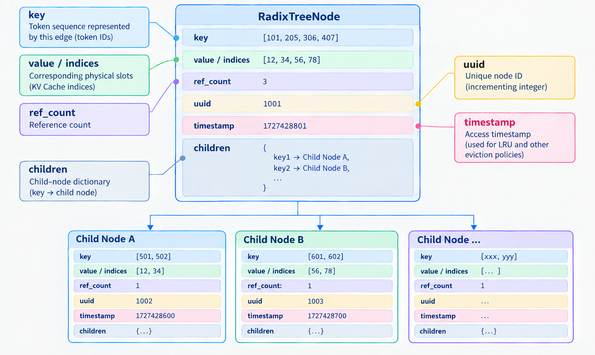

# Chapter 8 RadixAttention and Prefix Caching

In the previous part, we introduced paging as a way to manage KV Cache memory allocation efficiently and reduce fragmentation. **This chapter focuses on a practical problem in online LLM inference: can the KV Cache be shared and reused across different requests to further reduce GPU-memory usage?** The answer is yes. Prefix caching makes this possible by directly reusing the already-computed KV states of requests that have a common prefix. RadixAttention goes further: it uses a Radix Tree to integrate physical KV Cache block mapping, efficient prefix matching, coordination with the scheduler, and LRU eviction into an automated, **token-granularity** sharing mechanism.


## 1 Learning Objectives

This chapter starts with the problems left by traditional KV Cache management, introduces Prefix Cache, and then examines how it supports efficient KV Cache management during LLM inference. After reading this chapter, you should be able to answer the following questions clearly:

- What problems can remain after a request ends when KV Cache is managed traditionally?
- Why can a prefix be reused directly, while an arbitrary segment cannot?
- Why is a path-compressed Radix Tree more suitable for managing shared prefixes than a token-by-token ordinary Trie?
- What is the complete process for longest-prefix matching, insertion, branching, and node splitting, and can it be derived from start to finish with a simple example?
- What information is stored in a Radix Tree node? How do a logical token sequence and physical cache slots in the KV Cache Pool correspond to each other?
- In the complete lifecycle of RadixAttention cache management, what roles do the key operations—match, schedule, lock, evict, and free—play, and how do they connect and change over time?

## 2 From KV Cache to Prefix Cache

In Chapter 4 of Part I, we introduced the KV Cache lifecycle and GPU-memory usage of an LLM using Full Attention during inference, as well as the problems faced by traditional KV Cache management. We first briefly review those points.

---

### 2.1 Limitations of Traditional KV Cache

**The core benefit of the traditional KV Cache** is that it avoids recomputing the Key/Value of historical tokens during decoding, greatly reducing the computation required for autoregressive generation.

However, in many earlier basic implementations, **the KV Cache lifecycle was strictly tied to an individual request: GPU memory was allocated when a request arrived and released in full when the request ended**.

This creates an obvious problem: **the same computation may be repeated across requests**. In online LLM inference services, many requests often share the same system prompt or tool descriptions (for example, every request may begin with “You are an expert”). If every request independently performs a complete prefill, a large amount of redundant computation is incurred.

Prefix caching was introduced to solve this problem. Its central idea is to change who owns the KV Cache: instead of binding the cache to one request, assign it to a reusable KV prefix sequence. After a request ends, the corresponding KV blocks can remain in a shared cache pool, and an eviction policy decides when they should be released.

**This naturally raises a key question: why can only a prefix be reused, rather than a segment at an arbitrary position?**

---

### 2.2 Core Principle of Prefix Cache

For each token, the hidden state used to generate it can access only the sequence information at that position and to its left. This constraint is guaranteed by causal attention.


**During training**, one forward pass is applied to the whole sequence. A causal mask must ensure that position $i$ can see only $0 \ldots i$ and cannot see future tokens:

$$
h_i = \mathrm{Attention}(q_i,K_{0:i},V_{0:i})
$$

This is one-way self-attention with a causal mask.

**During inference**:
- **Prefill**&emsp;The entire input prompt is computed in parallel. Later prompt tokens already exist in the sequence, so a causal mask must be applied.
- **Decode**&emsp;Only the current new token is computed each time. Future tokens have not yet been generated, so causality is ensured by the process itself: historical KV is written first, and the current token is then computed. An explicit triangular mask is usually unnecessary.

Starting from the first attention layer, $h_i$ has already incorporated information from the start of the sequence through the current position. The subsequent-layer $K_i$ and $V_i$, obtained through linear projections, therefore also carry information about this prefix. Consequently, whenever any preceding token changes, the KV at every subsequent position changes as well.

***Note**: When considering why Prefix Cache is feasible, we discussed the Prefill and Decode phases separately. Cross-request prefix matching normally takes place when a request enters the Prefill phase, so that repeated computation can be skipped. During Decode, no further matching is performed; existing KV is reused and new KV is appended.*

For example:

- Request A&emsp;`["weather", "is", "fine"]`
- Request B&emsp;`["mood", "is", "fine"]`

Although the two requests have the same suffix `[“is”, “fine”]`, and “is” and “fine” occur at the same positions in the sequences, the context to the left of “is” is “weather” in A and “mood” in B. **Because a Transformer's hidden states progressively incorporate information from the left-side context**, the K and V at corresponding positions in later layers will differ. The KV Cache for this suffix therefore cannot be reused directly across requests.

Even without considering positional encoding, the hidden states in later layers differ because the left-side contexts differ, so only a completely identical prefix can be reused directly. With positional mechanisms such as RoPE, Q/K also depend explicitly on token positions, which means that the same token at different absolute positions cannot be reused directly either.

Having analyzed why only prefixes can be reused, we now introduce RadixAttention. How cross-request KV Cache reuse is implemented will be explained later together with the relevant parts of RadixAttention.

---

### 2.3 RadixAttention and Attention

The name RadixAttention can easily give the impression that it changes the model's internal attention computation. In fact, its formulas and computational flow are unchanged. It is an efficient KV Cache management and scheduling mechanism. Attention is still computed with the original formulas; RadixAttention focuses on organizing and scheduling the KV Cache:

- **KV Cache Pool**: stores the actual K and V tensors on the GPU;
- **Radix Tree**: maps token sequences to physical indices in the Pool and supports efficient prefix matching, insertion, node splitting, and eviction;
- **Cache-aware scheduler**: orders requests according to matching results, keeping recently used shared prefixes in the cache as much as possible and thereby improving the hit rate.

**Therefore, RadixAttention is best understood as the caching and scheduling layer that prepares and manages reusable KV for attention computation.**

## 3 Core Data Structure: Radix Tree

**The core data structure of RadixAttention is the Radix Tree**. It is itself only a storage structure. It organizes the token-id sequences of requests as a compressed prefix tree, so that an identical prefix corresponds to only one copy of the KV Cache. In the Scheduler, this structure supports efficient prefix matching and policy-based scheduling, substantially improving the cache hit rate and reducing GPU-memory usage.

---

### 3.1 Data-Structure Requirements of Prefix Cache

What kind of data structure is needed for an efficient prefix cache? We can consider the following requirements:

- **Fast longest-prefix matching**: given a new request's token-id sequence, quickly find the longest common prefix shared with an existing cache, so the KV that can be reused directly can be located;
- **Efficient dynamic insertion and splitting**: when a new sequence arrives, add its path while changing the existing structure as little as possible. If the new sequence matches only part of a compressed edge, the structure must support splitting a node in place, separating the common prefix from the suffix;
- **Shared prefixes and independent suffixes**: a common prefix maps to the same KV, while different suffixes after a branch are stored and computed independently without interfering with one another;
- **Compactness**: minimize metadata overhead and avoid creating many nodes for a long path without branches.

Given these requirements, a **tree structure** is a natural choice for managing the KV Cache and implementing Prefix Cache. A tree organized by token-id sequences naturally expresses prefix sharing, but the concrete forms can differ greatly:

| Structure | Edge label | Long single-branch path | Cost in prefix scenarios |
|------------------|-----------------|-----------------------|-------------------------------|
| Ordinary / custom tree | No uniform constraint | Depends on the implementation | Difficult to guarantee efficient longest-prefix queries directly |
| Token-by-token Trie | One token | One node per token | Simple logically, but high node and pointer overhead |
| Radix Tree | A sequence of tokens | Compressed into one edge / one node | Few nodes; splitting is needed only when an actual branch appears |

Although an ordinary Trie naturally supports prefix queries, each edge generally corresponds to only one token. An LLM prompt may contain hundreds or tens of thousands of tokens. Creating one node per token would introduce a large number of objects, pointers, and traversal steps. **A Radix Tree compresses a continuous, branch-free token sequence into a single edge and creates structural nodes only where a real split is needed, making it more suitable for Prefix Cache scenarios.**

---

### 3.2 Basic Components

The basic components of a Radix Tree node include a pointer to its parent, a dictionary of child nodes, a `key_fn` used to extract a child-node index from a key Tensor, and the node's own `_key`, `_value`, and length. They can be represented as follows:


<div align="center">
  
  <p><em>Figure 1. RadixTreeNode structure diagram</em></p>
</div>


Definition:

```python
class RadixTreeNode:
    def __init__(self, key_fn: KEY_FN) -> None:
        self._parent = None
        self.children = {}       # Dictionary of child nodes
        self.key_fn = key_fn     # Extracts the "child sequence index" from a key tensor
        self.ref_count = 0       # Reference count
        self.uuid = counter
        self.timestamp = tic or time.monotonic()  # Node access timestamp

        self._key: torch.Tensor
        self._value: torch.Tensor
        self._length: int
        
```

Note the following:

- `len(node.key) == len(node.value)`: each logical token id has a corresponding physical cache location; K and V correspond one-to-one;
- in the node's `__init__`, `_key`, `_value`, and `_length` are type annotations only and are not assigned actual values. They are assigned later through dedicated methods, which makes it flexible to set their contents when a new node is added or when a node is split during matching;
- the root node is empty and stores no information. Each other node is distinguished by a unique `uuid` generated with a simple monotonically increasing integer.

The complete token-id sequence represented by a node is the concatenation of all `_key` values along the path from the root to that node. The corresponding physical cache locations are the concatenation of all `_value` values along the same path.

In addition to the node's basic fields, **several methods manage the tree structure** (see mini-sglang):

| Method | Function |
|--------------------------|--------------------------|
| set_key_value | Set the node's key and value |
| set_parent | Set the node's parent |
| length / parent / value | Obtain the node length, parent, or value |
| is_root / is_leaf | Determine whether the node is the root or a leaf |
| get_match_len | Obtain the longest common-prefix length with the input |
| split_at | Split at a specified position |

How do these components work together to optimize KV Cache management for Prefix Cache?

---

### 3.3 Adding a New Node, Longest-Prefix Matching, and Splitting

When a new request arrives, the system performs a **longest common-prefix match** between the request's token-id sequence and the token-id sequences corresponding to existing historical KV Cache, then chooses the next operation based on the result:

- **Continue matching downward**: if the new request's token-id sequence and the current node's token-id sequence are **identical over a segment**, follow this common-prefix path downward and reuse as much existing KV Cache as possible.
- **Split**: if token ids differ during matching and the match length satisfies $0 < \mathrm{match\_len} < \mathrm{node.length}$, split the current node at the first differing position. After the split, **the common-prefix part remains shared, while the diverging parts are stored independently**.

As long as the cache remains resident and the context configuration is compatible, the token-id sequence corresponding to each node needs to be computed only once. *If the corresponding cache node is evicted, a later request that hits this prefix must compute it again.*

To understand Radix Tree construction more intuitively, first convert prompts into token-id sequences with a tokenizer. Suppose three requests are added in the order A → B → C:

- **Request A**: “Hello, world!” --tokenizer-->`[101, 11, 12, 21, 22]`
- **Request B**: “Hello, western Sichuan~” --tokenizer-->`[101, 11, 12, 31, 32]`
- **Request C**: “How are you?”&emsp;--tokenizer-->`[101, 11, 99]`

Suppose request A is processed first, and in this example each token id corresponds to one physical slot:

$$A = [101, 11, 12, 21, 22]$$

The KV produced by the linear projections is written to physical slots `[p0, p1, p2, p3, p4]` and the corresponding values. The tree is empty, so there is one compressed node:

<div align="center">
  
  <p><em>Figure 2. Initial construction of the Radix Tree</em></p>
</div>

The second request, B, is $[101, 11, 12, 31, 32]$. Compare it with the existing node token by token. The longest common-prefix length is 3 ($[101,11,12]$). The divergence occurs inside the node and does not cover the original node, so the original node must be split at position 3:

<div align="center">
  
  <p><em>Figure 3. Radix Tree node split</em></p>
</div>

*Note: splitting only reorganizes the tree metadata. The shared prefix still points to the original physical slots `[p0, p1, p2]`; it does not need to be copied again.*

The third request, C, is $[101, 11, 99]$. After entering the current first node, it matches only the first two token ids ($[101,11]$), so the node must be split again at position 2:

<div align="center">
  
  <p><em>Figure 4. Radix Tree with multiple levels of branches</em></p>
</div>

At this point, all the key operations have appeared:

- **Adding a new node**: every request may add a new node and physical slots. The first request is added directly below the root; later requests first perform longest-prefix matching against the token-id sequences already present.
- **Longest-prefix matching**: requests A, B, and C share the longest prefix `[101,11]`, so the KV Cache for this part can be reused directly without recomputation.
- **Node splitting**: for request A, the original `[101, 11, 12, 21, 22]` is ultimately split into `[101,11]`, `[12]`, and `[21,22]`.

Through this example, we have followed the **core workflow** for building a Radix Tree from start to finish. This is also the foundation for RadixAttention's KV Cache management.

For a related implementation, see the [code analysis](./Chapter8_RadixAttention-and-Prefix-Caching.md).


## 4 How the Radix Tree Supports Prefix Cache

Section 3 focused on building the Radix Tree. This section further analyzes how it works together with the KV Cache Pool, scheduler, and physical-memory management to implement cache matching, reuse, protection, and eviction.

---

### 4.1 Relationship Between the Radix Tree and KV Cache Pool

Three kinds of data objects play important roles in connecting the Radix Tree and the KV Cache Pool:

| Object | Content | Location and role |
|------------------------|-------------------------------|---------------------------------------------|
| Radix Tree key | Token-id sequence | Logical index used to determine whether two requests share a prefix |
| Radix Tree value | Token slots / page indices | Address index pointing to the corresponding storage locations in the KV Cache Pool |
| KV Cache Pool | K and V tensors for every layer | The actual data on the GPU used in Attention computation |

***Note**: To manage KV Cache storage conveniently, K/V is usually stored in pages. SGLang's implementation uses this approach.*

The Radix Tree itself does not store the huge K and V tensors. It maintains only the mapping between token-id sequences and physical addresses.

The following example shows how the Scheduler uses this mapping to manage the KV Cache efficiently.

---

### 4.2 Cache Lifecycle from Arrival to Request Completion

**Prerequisite concepts:**

- **page**: the basic unit for allocating and reclaiming KV Cache; one page usually contains `page_size` token slots;
- **token slot**: the physical storage location or index corresponding to one token in the KV Cache Pool;
- **page table**: records the mapping from logical token positions to physical pages. The exact mapping granularity depends on the implementation;
- **free list**: stores physical pages that have not yet been allocated and can be used to store new KV. Different implementations may call it `free_pages`, `release_pages`, or something else;
- **ref_count**: records the number of references to a Radix Tree node held by active requests or cache handles. When locking and unlocking, the reference count is usually updated from the current node up to the root;
- **handle**: a cache handle that records information about the matched Radix Tree node and is later used to obtain the corresponding physical indices and perform lock/unlock operations.

In this example, suppose the Radix Tree is stable, previous requests have created a shared prefix $S$ in the Radix Tree, and each token id corresponds to one physical slot. The following process mainly follows the mini-SGLang implementation, with parts of SGLang's code as supplementary reference:


- $S = [900, 10, 11, 12]$
- KV for $S$: `[p0, p1, p2, p3]`
- Tree node corresponding to $S$: `ref_count = 0`, `last_access_time` is relatively early

Two requests still need to be processed:

| Request | Prompt | Match result | Still needs computation |
| --- | ----------------------------- | ------------------------------------------ | ------------ |
| R1 | [900, 10, 11, 12, 31, 32] | cache_hit_len = 4, value = [p0, p1, p2, p3] | [31, 32] |
| R2 | [900, 10, 11, 12, 41, 42, 43] | cache_hit_len = 4, value = [p0, p1, p2, p3] | [41, 42, 43] |


Suppose the number of available slots in the KV Cache Pool's **free list** is limited. We first let one request enter a running batch and process one request; the other request follows the same process:

**Step 1: Match produces candidate information.** The match result for R1/R2 contains `cache_hit_len = 4`, the node handle, and the physical indices `[p0, p1, p2, p3]`.

At this point, R1/R2 have not locked these pages. The paths could therefore still be evicted in principle, so “matched” does not mean “already safely held.”

>The **handle** mainly stores two things:
>- **The referenced tree node** (the node that was matched);
>- **The length of the shared prefix currently held by the request**.
>
>A handle is like a “key”: it records “which node I matched and how long a prefix I locked,” providing the information needed later to write the page table and perform lock/unlock operations.


**Step 2: Schedule decides which request runs first.**

In mini-sglang, scheduling attempts to add requests in their arrival order in `pending_list` until the token budget or resources are exhausted. It has no complex prefix-aware policy.

In full SGLang, the scheduler compares the hit length, suffix length, and resource requirements. SGLang's scheduling policies fall into two categories:

- **Prefix-aware**: `lpm`, `dfs-weight`, `hrrn`, `shortest-prefill-first`, and others. These prioritize long shared prefixes, use tree DFS weights, or run shorter uncached work first;
- **Prefix-cache-unaware**: `fcfs` (first come, first served), `lof` (longest output first), `random`, `routing-key`, and others.

Assume that `shortest-prefill-first` is used. The shared prefixes are the same, but R1 has a shorter uncached suffix (only two new slots), so R1 is selected first and R2 remains in the waiting queue. During scheduling, an in-batch prefix check may also be performed to avoid recomputing similar prefixes within the same batch.


**Step 3: Lock turns candidates into protected references.** Before R1 enters the batch for computation, the matching node is passed to the lock-related function:
- **Increment `ref_count` by 1 level by level from that node up to the root**;
- Move the corresponding token-id sequence from `evictable_size` to `protected_size`, and update its status in the set of candidate eviction leaves.

The shared prefix `[900, 10, 11, 12]` is therefore protected. The indices for the hit prefix are written to the request's page table, *but locking itself only protects existing pages; it does not allocate a new page*.

**Step 4: Allocate only the missing portion.** R1's uncached suffix has length 2, so `[p6, p7]` is allocated from the **free list**, and the page table becomes `[p0, p1, p2, p3, p6, p7]`. If there is not enough free space, the allocator first asks the CacheManager for a certain amount of released physical space and then continues allocation.

***Note**: During this process, the already-hit physical space `[p0, p1, p2, p3]` is **not** requested again.*


**Step 5: Insert turns the newly computed result into shared cache.** After Prefill finishes, the tree is updated with R1's token-id sequence and page table. The existing $S$ node continues to be reused; only the following child is added:

$$
[31, 32] \to [p6, p7]
$$

This step writes the index from token ids to physical addresses; it does not copy the KV for $S$. **If `insert` finds that part of the prefix already exists in the tree (a race), it immediately frees the indices redundantly occupied by the request, preventing duplicate copies from remaining in the pool and causing a memory leak.**

**Step 6: Unlock and request completion.** After R1's computation is complete, the relevant matching path is passed to the unlock-related function (`ref_count -= 1`):

- If a node's `ref_count` drops to 0, it immediately becomes evictable and enters `evictable_size`;
- If `ref_count > 0`, another request is still using it, so it cannot be evicted.

At this point, the reference count for the corresponding prefix becomes 0, but the prefix is not immediately removed from the shared prefix tree and its physical slots are not immediately released.

**Step 7: Evict when space is insufficient, and free when a request ends**

- **evict** (when space is insufficient): when a later request such as R2 finds that there is not enough free space during allocation, it calls `prefix_cache.evict`. This selects only leaf nodes whose current reference count is 0, **removes them from the tree according to the policy**, and returns their physical page indices. For example, if the `[31,32]` node has no references at this point, it may be selected and `[p6, p7]` may be released.

- **free** (unconditional return):
  - Free duplicate pages immediately when `insert` detects a race;
  - When a request actually ends, free only the non-shared token sequence that could not be inserted into the tree, making the space available to other requests.

**A successfully shared prefix page is not freed when a request ends. It is only unlocked and waits for later memory pressure or an eviction policy to trigger `evict` and release it.**

***Note**: In **SGLang**, `evict` removes zero-reference leaf nodes according to priority and directly releases their physical space. In **mini-SGLang**, `evict` only removes leaf nodes with `ref_count == 0` according to the policy and returns the corresponding physical-index tensor; the scheduling layer actually releases the space.*

The entire process can be summarized as follows:

<div align="center">
  
  <p><em>Figure 5. RadixAttention lifecycle</em></p>
</div>

Looking at the complete process, a Prefix Cache “hit” is only the starting point of the lifecycle. The following steps are also required:

- **Match** finds the address;
- **Lock** ensures that the address remains valid while it is being used;
- **Insert** adds the new result to the shared index and reclaims duplicate pages;
- **evict and free** determine whether the physical space occupied by a page is released.

*Note: Prefill and Decode use the same page table. By default, the prompt plus output at the time a request finishes is written to the Radix Tree, and a split at the prompt boundary makes it possible to evict the generated portion when needed. It is not the case that “only the prompt is cached and Decode is always private and returned directly.”*


For the implementation approach to Prefix Cache management, see the [code analysis](./Chapter8_RadixAttention-and-Prefix-Caching.md).

In addition, SGLang's latest Unified Radix Cache further optimizes KV Cache management and supports hybrid-attention models. For its design, see this [article](https://www.lmsys.org/blog/2026-08-11-unified-radix-cache).


## 5 Summary and Exercises

### 5.1 Summary

This chapter used requests A, B, and C to introduce the construction of a Radix Tree. With the tree already established, it then used R1 and R2 to analyze the complete lifecycle: request matching, scheduling, locking, physical-space allocation, result insertion, unlocking, and cache eviction.


### 5.2 Exercises

1. Why does Prefix Cache use a **Radix Tree (path compression)** instead of an ordinary Trie?
> Hint: Compare the two structures in terms of node count and number of lookup steps. Consider that **long common prefixes** are common in LLM requests because of system prompts, multi-turn conversations, and similar patterns.

2. Why can **evict** in a Radix Cache start only from leaf nodes, rather than directly evicting an internal node or the root?
> Hint: Recall the core optimization of Prefix Cache—prefix reuse. Evicting an internal node directly would break every subsequent path that uses that node as a prefix, so other requests could no longer hit the shared KV that has already been computed.

3. During scheduling, in what situations are **evict** and **free** used, and what is the fundamental difference between them?
> Hint: In SGLang-related implementations, both ultimately release physical pages, but they operate at different layers: one evicts a tree node, while the other directly returns pages, and their timing differs as well.


## References

- [SGLang: Efficient Execution of Structured Language Model Programs](https://arxiv.org/html/2312.07104v2)
- [mini-sglang: radix_cache.py](https://github.com/sgl-project/mini-sglang/blob/main/python/minisgl/kvcache/radix_cache.py)
- [mini-sglang: CacheManager](https://github.com/sgl-project/mini-sglang/blob/main/python/minisgl/scheduler/cache.py)
- [From Tensor Buffer to Distributed Memory Hierarchy: A Survey of KV Cache Management for LLM Serving](https://arxiv.org/pdf/2607.02574)
- [sglang: radix_cache.py](https://github.com/sgl-project/sglang/blob/main/python/sglang/srt/mem_cache/radix_cache.py)
- [sglang: schedule_policy.py](https://github.com/sgl-project/sglang/blob/main/python/sglang/srt/managers/schedule_policy.py)
- [mini-sglang: cache.py](https://github.com/sgl-project/mini-sglang/blob/main/python/minisgl/scheduler/cache.py)
- [sglang: radix_cache.py](https://github.com/sgl-project/sglang/blob/main/python/sglang/srt/mem_cache/radix_cache.py)
- [unified radix cache](https://www.lmsys.org/blog/2026-08-11-unified-radix-cache)
- [mini-sglang: decode.py](https://github.com/sgl-project/mini-sglang/blob/main/python/minisgl/scheduler/decode.py)
- [mini-sglang: prefill.py](https://github.com/sgl-project/mini-sglang/blob/main/python/minisgl/scheduler/prefill.py)
