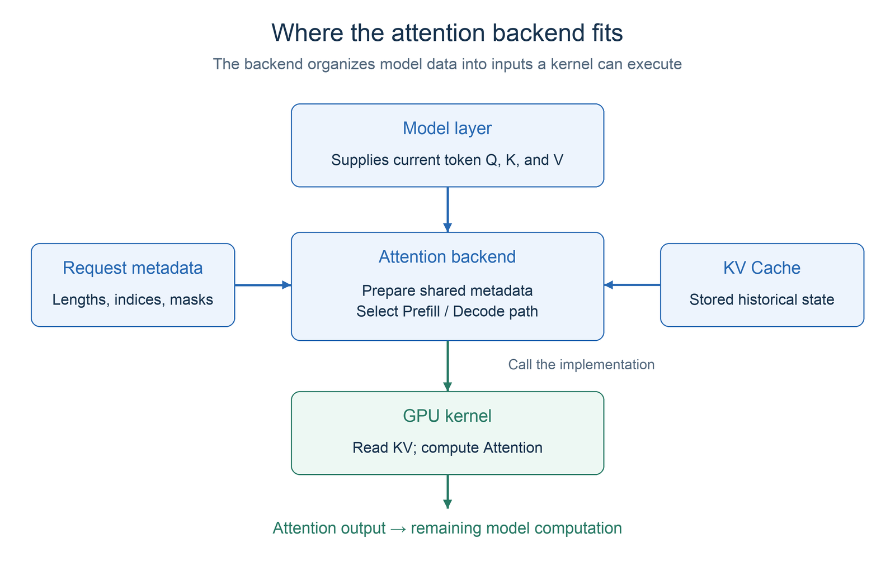
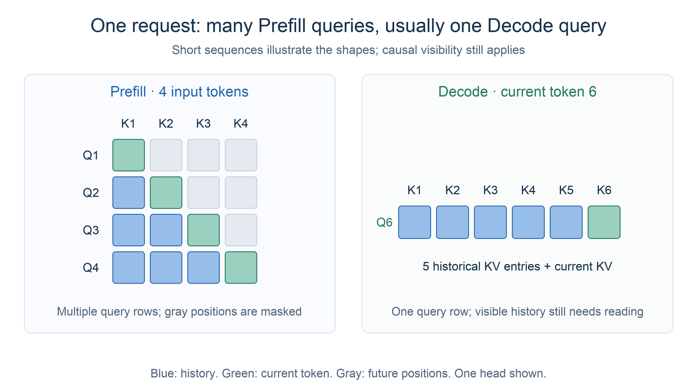
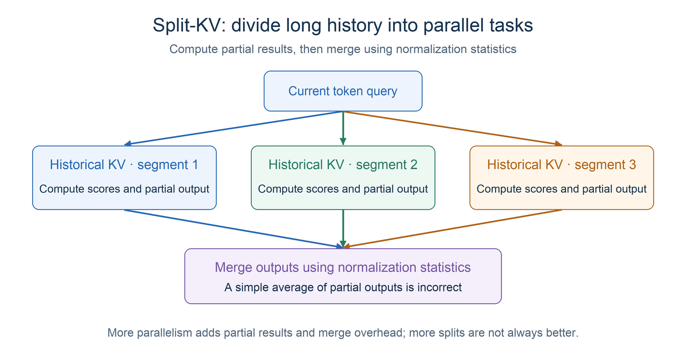
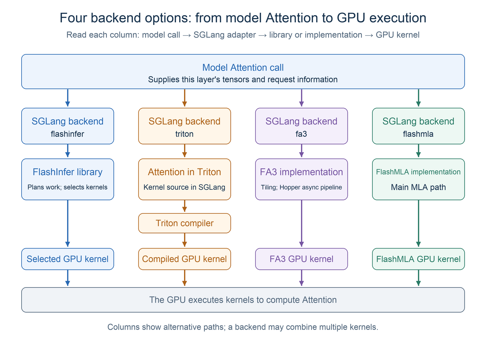
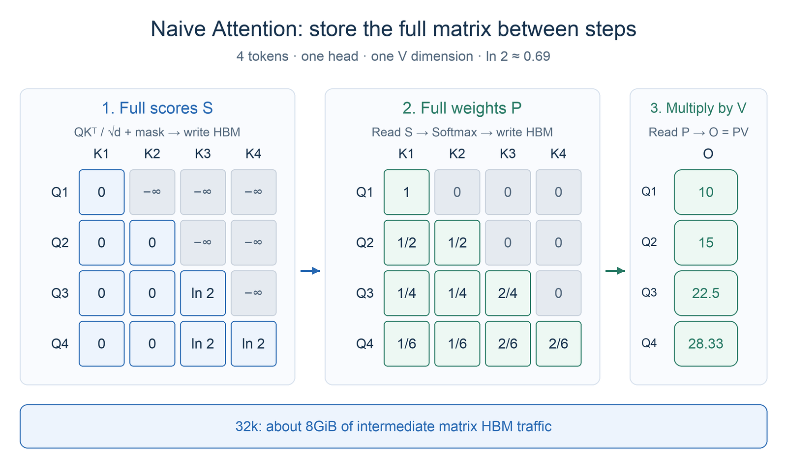
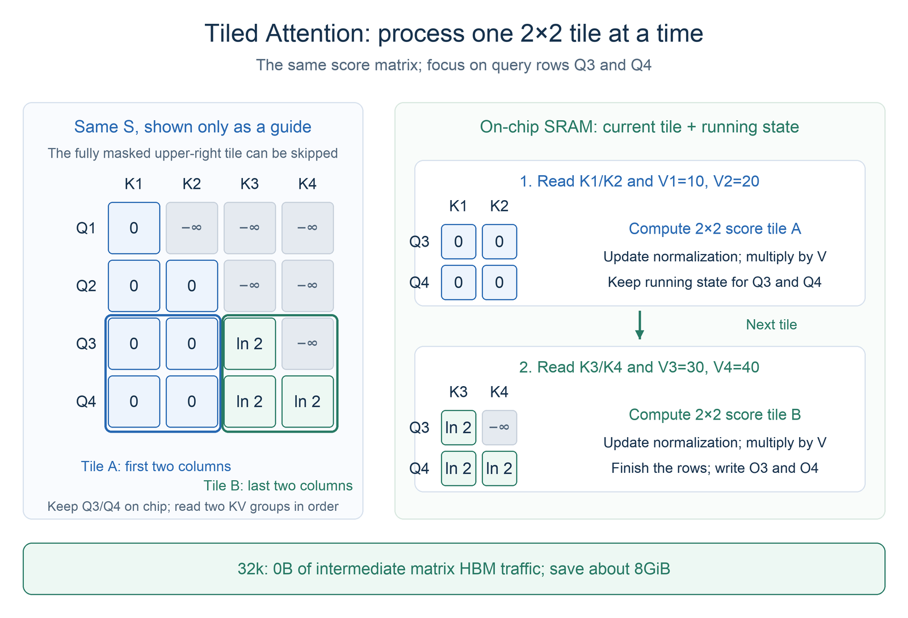
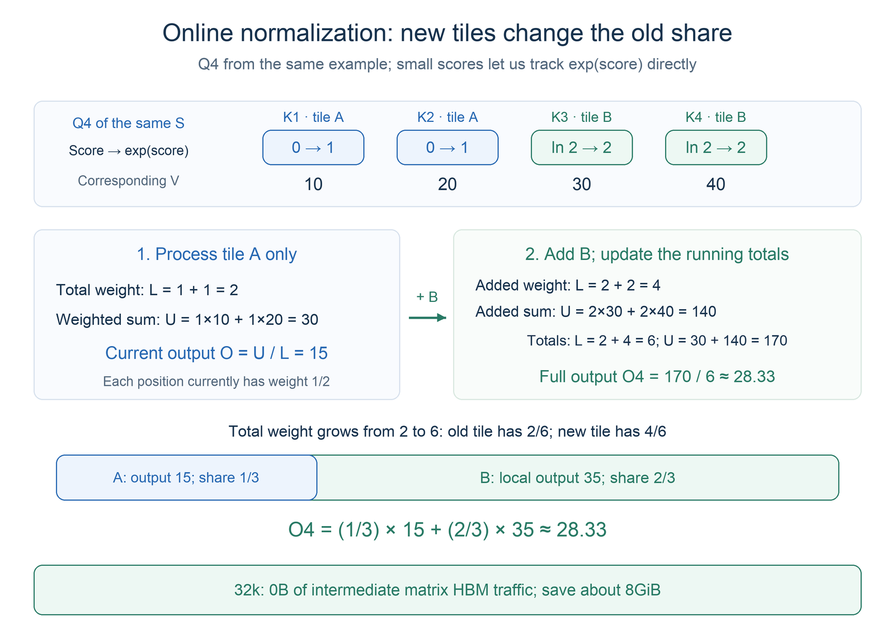
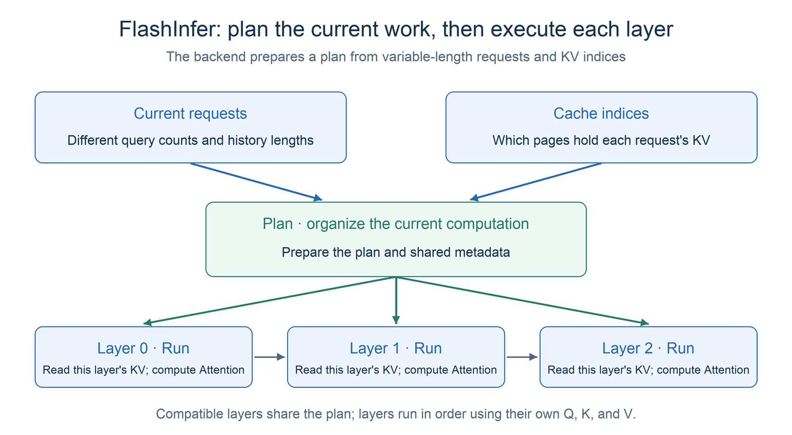
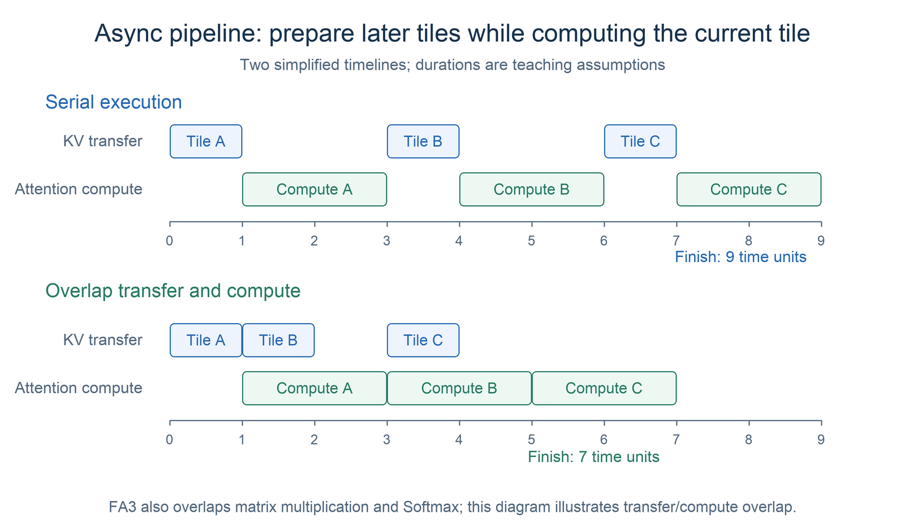
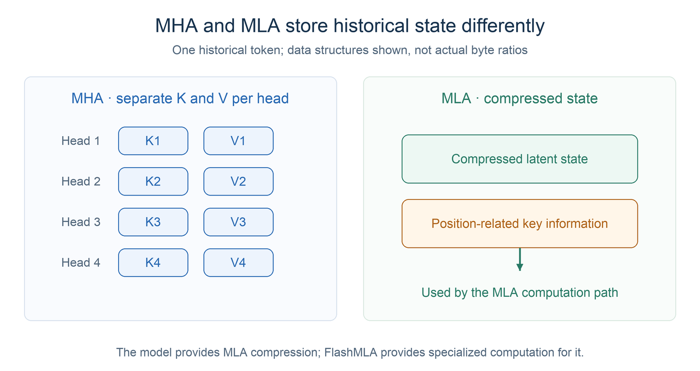

# Chapter 1 Attention Backends

Earlier chapters introduced Attention computation, KV Cache management, and inference scheduling. We now take a closer look at the techniques used in SGLang, starting with attention backends. You may have wondered: if they all compute Attention, why does SGLang offer different implementations such as FlashInfer, Triton, and FlashAttention?

The Attention formula describes the mathematics. An actual implementation must also decide how the GPU moves data, divides the work, and executes the operations. This chapter explains what an attention backend does and how the main backends differ in their design, strengths, and limitations.

## 1 Learning Objectives

After completing this chapter, you will be able to:

1. Distinguish an Attention mechanism, an attention kernel, and an attention backend.
2. Explain why Prefill, Decode, model architecture, and GPU architecture call for different backends.
3. Describe the main ideas, strengths, and limitations of FlashInfer, Triton, FlashAttention 3, and FlashMLA.
4. Choose implementations to compare for a given workload, then validate latency, throughput, and correctness.

## 2 What an Attention Backend Does

### 2.1 From the Formula to a GPU Implementation

As introduced in Part I, the core computation of standard Attention is:

$$
O = \operatorname{softmax}\left(\frac{QK^\top}{\sqrt{d_h}} + M\right)V
$$

Here, $Q$ contains the current queries, $K$ and $V$ include the visible keys and values, and $M$ represents constraints such as a causal mask. The formula specifies the mathematical relationship.

Three concepts are easy to confuse:

| Concept | Question it answers | Examples |
|---|---|---|
| Attention mechanism | What attention structure does the model use? | MHA, GQA, MLA |
| Attention kernel | How does a specific GPU program carry out the computation? | Tiled matrix multiplication, fused Softmax, split-KV reads |
| Attention backend | How does the inference engine prepare inputs and call a suitable kernel for the current phase? | SGLang's FlashInfer, Triton, and FA3 backends |

The **backend adapts model execution to a concrete computation implementation**. For a fixed model architecture, switching to a compatible backend usually changes how the computation runs. It does not change the model's Attention structure or trained parameters.

Different operation orders or data types can introduce floating-point differences, so a backend change still requires numerical validation.

### 2.2 The Backend's Responsibilities

Once the model computes Q, K, and V for the current tokens, it must combine them with historical KV to complete Attention. The backend prepares the data and information needed for this computation, calls the appropriate GPU kernel, and returns the Attention output so the model can continue. Its work falls into three parts:

1. **Prepare the information needed for computation.** Suppose a batch contains three requests with history lengths of 128, 1,024, and 4,096 tokens. The backend tells the kernel which new tokens belong to each request, how much history it has, where its historical KV is stored, and which positions it may attend to. This supporting information is the metadata mentioned earlier. It lets the kernel distinguish requests and compute each result correctly.
2. **Handle KV Cache reads and writes.** The cache manager allocates storage. The backend uses the supplied locations to save newly computed K and V and lets the kernel read historical KV. Even when the KV is spread across several GPU memory pages, it must participate in the computation in the correct logical order.
3. **Call an implementation suited to the current phase.** Prefill usually processes multiple new tokens at once, while ordinary Decode usually processes one new token per request. The backend follows the corresponding computation path, calls the kernel, and returns the Attention output.

<div align="center">
  
  <p><em>Figure 1. The attention backend connects model computation, request metadata, and GPU kernels.</em></p>
</div>

These responsibilities also appear in SGLang's [`AttentionBackend`](https://github.com/sgl-project/sglang/blob/1d019ce1c85e11ff2f425344e66f446b106f6074/python/sglang/srt/layers/attention/base_attn_backend.py) interface. `init_forward_metadata` prepares metadata shared within the current forward pass. `forward_extend` and `forward_decode` execute Attention when adding multiple tokens and generating tokens step by step, respectively. Concrete implementations handle KV reads and writes and kernel calls.

Every backend has these responsibilities, but each organizes data, executes computation, and uses GPU hardware differently. An implementation suited to long inputs may be less suitable for generating one token at a time. An implementation suited to one model or GPU may not suit another. This leads to the next question: why do we need different backends, and how should we choose among them?

## 3 Why Different Backends Are Needed

A backend receives both model tensors and request state, creating many combinations to support. We can understand the differences from three perspectives.

### 3.1 Prefill and Decode Have Different Workload Shapes

| Phase | Queries per request in the current step | Main optimization focus |
|---|---|---|
| Prefill | Usually many; may also run in chunks | Compute-bound cases: reuse on-chip data and reduce intermediate matrix traffic |
| Decode | Usually one during ordinary autoregressive generation | Memory-bound cases: read historical KV efficiently and reduce overhead for small tasks |

<div align="center">
  
  <p><em>Figure 2. Prefill usually has multiple query rows. Ordinary Decode usually has one row per request, but still reads the visible history.</em></p>
</div>

In Prefill, multiple queries can reuse the same KV tile, spreading the cost of reading it across more computation. In Decode, there are few queries, so the GPU may not have enough parallel work. Decode kernels therefore often split a long KV sequence into segments, compute partial results independently, and merge them using each segment's Softmax normalization information.

This is commonly called **split-KV**. It increases parallelism and GPU utilization, but also introduces partial results and merging overhead. More splits may not help when the context is short or the batch already supplies enough work to keep the GPU busy. This helps explain why the same backend can perform differently at different request lengths and concurrency levels.

<div align="center">
  
  <p><em>Figure 3. Split-KV adds parallel work along the history dimension. Merging partial outputs requires normalization information.</em></p>
</div>

### 3.2 Models Use Different Attention Structures

MHA keeps separate K and V for each attention head. GQA lets multiple query heads share a group of KV heads. MLA uses a low-dimensional latent representation and other state to store history, changing both the cache format and computation path.

These structures determine the head count, head dimension, and cache layout a backend must handle. A kernel designed for standard MHA/GQA cannot support MLA simply by changing its name. Likewise, an MLA-specific backend cannot turn an ordinary model into an MLA model.

Sliding windows, special masks, speculative decoding verification trees, and different KV data types may also require extra backend capabilities. **Check feature support before comparing performance.** A fast standalone kernel may be unable to execute the workload required by an actual service.

### 3.3 GPUs Have Different Architectures

Attention uses GPU memory bandwidth, on-chip storage, and matrix computation units. GPU architectures differ in their capabilities and available instructions.

For example, Hopper provides TMA data movement and WGMMA matrix multiplication capabilities. Kernels can use them to build more efficient asynchronous pipelines. An implementation designed around these features cannot be assumed to deliver the same gains on every GPU. CUDA, compiler, and dependency versions also affect which paths are available.

Backend selection therefore depends on **model structure, workload shape, and hardware capabilities**.

## 4 How the Four Main Backends Work

Following the course outline, we introduce FlashInfer, Triton, FlashAttention 3, and FlashMLA.

First, consider their positions in the execution stack. The model's Attention operation calls an SGLang backend, which prepares metadata and connects to a concrete implementation. The GPU then executes its kernels. [FlashInfer](https://docs.flashinfer.ai/) is a kernel library; [Triton](https://triton-lang.org/main/index.html) is a tool for writing and compiling GPU programs; FA3 and FlashMLA provide Attention implementations tailored to specific computation and hardware. SGLang supplies backend adapters for these capabilities, which is why all four appear as backend options.

<div align="center">
  
  <p><em>Figure 4. Four main paths from a model call to GPU execution. Compilation produces reusable GPU programs; a backend can also combine multiple kernels.</em></p>
</div>

### 4.1 The Core Idea: Tiling and Fusion

This idea comes from the [FlashAttention paper](https://arxiv.org/abs/2205.14135), an influential early example of designing Attention computation around hardware I/O. It identified redundant data movement in conventional Attention and optimized the computation to reduce it.

Start with a straightforward implementation. For each query row, compute its scores against the keys and write the complete score matrix to GPU memory. Read it back for Softmax to turn scores into weights, then use the weights to compute a weighted sum of V. For a sequence of length n, the full score matrix has n × n entries. A causal mask hides future positions, but an implementation that materializes the whole matrix still allocates this space.

<div align="center">
  
  <p><em>Figure 5a. A naive implementation stores complete score and weight matrices for later steps to read. All three figures use the same 4×4 example, with one dimension of V equal to [10, 20, 30, 40].</em></p>
</div>

How large is this matrix? With **32k, or 32,768 tokens**, the full score matrix for just one layer and one attention head has about 1.07 billion entries. At two bytes per score, it occupies **2GiB, or about 2.15GB**. Writing and reading it once moves about **4GiB** of data, before counting Softmax weights or other traffic.

A major bottleneck is therefore data movement: after computing scores, later steps still have to wait for large intermediate results to travel between GPU memory and on-chip storage. Reducing this traffic is the opportunity. We can understand [FlashAttention](https://arxiv.org/abs/2205.14135) through two intuitions.

**First: work in tiles. Bring a small amount of data into fast on-chip storage and do as much work there as possible.**

GPU HBM has large capacity. On-chip SRAM is smaller but faster to access. The full score matrix cannot fit in SRAM, but small tiles can. Load the required Q, K, and V tiles, compute their scores and weights, accumulate their output contribution on chip, and then move to the next tile. Intermediate results are consumed as they are produced, avoiding a write to HBM followed by a read for the next operation.

<div align="center">
  
  <p><em>Figure 5b. Keep Q3 and Q4 fixed and process two KV groups in order. The full matrix on the left is only a guide; computation produces one tile at a time, updates normalization information, and multiplies by V.</em></p>
</div>

**Second: normalize as you go. Never write the complete score or weight matrix to GPU memory.**

There is an important catch: Softmax requires the weights across all visible positions in a row to sum to one. Normalizing each tile independently and simply adding its output would give the wrong result.

FlashAttention keeps a small amount of normalization information and an accumulated output while processing tiles. Think of it as keeping two running totals: how much total weight has been seen, and how much output those weights have contributed. Adding a new tile changes the normalization total, so the previous output's share is adjusted before the new contribution is merged. After all tiles are processed, the result matches normalization over the full row. Used local scores and weights can be discarded instead of assembled into a large stored matrix.

<div align="center">
  
  <p><em>Figure 5c. After tile A, Q4's current output is 15. Adding tile B reduces tile A's share to 1/3; the merged output is about 28.33, matching the naive computation.</em></p>
</div>

Q, K, and V still have to be read from HBM, and the final output must be stored. The savings come from avoiding the storage and repeated movement of complete score and weight matrices. We are discussing full Attention: the required computation still takes place, and long-sequence Prefill computation remains quadratic in sequence length. The following backends build on this idea to address inference serving and specific hardware.

### 4.2 FlashInfer: Organizing Computation for Inference Serving

FlashInfer is a kernel library for inference. Tiling and fusion address intermediate matrix traffic. Inference serving adds another problem: **how much KV each request needs to read, where that KV is stored, and how to divide these uneven workloads across the GPU.**

For example, in one batch of ordinary Decode requests, A reads KV for 128 tokens and B reads KV for 8,192 tokens. Each request has one new query, but B has 64 times as much history to process. KV Cache is also usually paged, so a request's data need not occupy contiguous GPU memory. FlashInfer turns such inputs into executable Attention tasks in three steps.

1. **Locate the data.** The SGLang backend passes each request's KV length, page indices, and other information to FlashInfer. The indices act as an address list: which pages to read for A and which to read for B. A kernel that supports paged caches can read KV directly using this list, without first copying an entire request's KV into one contiguous buffer. SGLang's cache manager still handles page allocation and reclamation.

2. **Plan: divide the work into tasks that can run in parallel.** If each head of a short or long request is simply assigned to its own GPU task, A's tasks may finish quickly while B's continue reading history. FlashInfer plans work using request lengths and other information. On suitable paths, it can split long KV into segments using split-KV, letting more GPU computation units work on B together. The plan also organizes which segments each task processes to balance work and reduce idle time. Whether to split, and how many segments to use, depends on the workload shape and implementation.

3. **Run: read, compute, and merge according to the plan.** Each model layer supplies its own Q and KV Cache. Kernels read the required data through the indices and compute Attention. Split requests produce partial results, which are merged using each segment's normalization information to obtain the complete output. Splitting increases parallelism; all KV positions the request needs to attend to still participate.

Plan organizes **GPU computation tasks inside Attention**. SGLang's request scheduler has already decided which user requests enter the batch. For example, [`FlashInferAttnBackend`](https://github.com/sgl-project/sglang/blob/1d019ce1c85e11ff2f425344e66f446b106f6074/python/sglang/srt/layers/attention/flashinfer_backend.py) prepares metadata for the current forward pass, then calls FlashInfer layer by layer.

<div align="center">
  
  <p><em>Figure 6. FlashInfer prepares the plan first, then executes each layer. Every layer uses its own Q, K, and V.</em></p>
</div>

**Separate Plan from Run so the plan can be reused.** A batch passes through multiple model layers in sequence. If the layers have the same Attention configuration, request lengths, KV page locations, and task assignments usually need to be prepared only once. Each layer still has different Q, K, and V, so it executes its own Run to compute its Attention result. In the next generation step, requests may grow, join, or finish, requiring the plan to be updated. The [FlashInfer API documentation](https://docs.flashinfer.ai/api/attention.html) includes an example that plans once and then runs layer by layer.

FlashInfer's strengths are therefore concrete: **handle requests at their actual lengths, read paged KV directly, organize uneven parallel workloads, and reuse preparation across compatible layers.** Prefill and Decode have different query counts, and the library provides corresponding computation paths.

These optimizations have costs. Preparing indices and plans takes time, and split-KV adds storage for partial results and merging overhead. More splitting may not help when requests are short or the batch already supplies enough parallel work. Results also depend on the GPU, data type, and dependency version. Compare the total preparation and computation time.

### 4.3 Triton: Using a Compiler to Build Adaptable GPU Kernels

Triton is a language and compiler for GPU programs. Developers use Python-like syntax to describe data tiles, loads, matrix operations, and outputs, then the compiler generates GPU code. SGLang's `triton` backend therefore refers to **a set of Attention implementations written in Triton**. Triton itself is not a new Attention formula.

SGLang's [`TritonAttnBackend`](https://github.com/sgl-project/sglang/blob/1d019ce1c85e11ff2f425344e66f446b106f6074/python/sglang/srt/layers/attention/triton_backend.py) uses different computation entry points for Prefill and Decode. Its Decode implementation organizes split-KV computation and result merging. Developers can adjust block sizes, thread organization, and splitting strategies for different shapes. The official [Fused Attention tutorial](https://triton-lang.org/main/getting-started/tutorials/06-fused-attention.html) also shows how to express tiled Attention in Triton.

Its strength is that **the implementation is relatively easy to read, modify, and extend**, which helps when developing features and supporting more execution environments. Performance depends on the compiler, kernel configuration, and hardware fit. Implementations that use new architecture instructions and manual scheduling may be faster. Initial compilation also adds startup cost, so warm up before measuring steady-state performance.

However, easier-to-write code does not imply that Triton is always slower. Measure the concrete implementation with your model, context lengths, and concurrency.

### 4.4 FlashAttention 3: Using Hopper's Asynchronous Capabilities

FlashAttention 3, or FA3, builds on tiled Attention and makes further use of Hopper hardware. It uses TMA and asynchronous matrix multiplication to overlap data movement, matrix computation, and Softmax where possible, reducing waits between stages. See the [FA3 author's explanation](https://tridao.me/blog/2024/flash3/) for the design.

Think of it as a pipeline: while computing the current tile, prepare later tiles so computation units do not always have to wait for data movement to finish. FA3 also includes low-precision optimizations, but whether those paths are used depends on the backend and data type configuration.

<div align="center">
  
  <p><em>Figure 7. Overlap reduces waiting. Durations are teaching assumptions illustrating the idea, not measured FA3 performance.</em></p>
</div>

Its strength is **higher utilization of matrix computation and data movement capabilities on supported hardware and workload shapes**. The specialization also imposes constraints: GPU architecture, software versions, head dimension, and feature support must match. Results on Hopper cannot simply be generalized to other GPUs.

SGLang connects `fa3` through [`FlashAttentionBackend`](https://github.com/sgl-project/sglang/blob/1d019ce1c85e11ff2f425344e66f446b106f6074/python/sglang/srt/layers/attention/flashattention_backend.py). Kernel selection also depends on the device and execution mode, so performance results should identify the path that actually ran.

### 4.5 FlashMLA: Adapting to MLA Caches and Decode

FlashMLA targets Multi-head Latent Attention. First, distinguish two responsibilities: **MLA cache compression comes from the model architecture; FlashMLA efficiently executes Attention for that architecture.**

In a typical MLA Decode path, cached latent representations participate in Attention, rather than always expanding each historical token into full multi-head K and V as in standard MHA. FlashMLA organizes computation around this layout, paged KV Cache, and task scheduling. Long KV sequences can also be segmented, with partial outputs merged afterward.

<div align="center">
  
  <p><em>Figure 8. MLA changes how historical state is stored, and FlashMLA supports that structure. Diagram sizes do not represent actual byte ratios.</em></p>
</div>

Its strength is **optimizing reads, computation, and scheduling for MLA's data characteristics on supported model and hardware combinations**. Model structure, cache dimensions, page size, and data types must meet implementation requirements. It is not a general replacement for ordinary MHA/GQA models. Check the [FlashMLA project documentation](https://github.com/deepseek-ai/FlashMLA) together with the SGLang integration version.

In the referenced SGLang implementation, [`FlashMLABackend`](https://github.com/sgl-project/sglang/blob/1d019ce1c85e11ff2f425344e66f446b106f6074/python/sglang/srt/layers/attention/flashmla_backend.py) mainly calls FlashMLA kernels in Decode and related paths, while ordinary `EXTEND` uses the inherited Prefill implementation. This illustrates that **one backend can combine multiple kernels; its name does not mean every phase uses the same implementation**.

### 4.6 Comparing the Backends

| Backend | Main idea | Strength | Main tradeoff |
|---|---|---|---|
| FlashInfer | Organize variable-length requests and paged KV before executing suitable kernels | Broad inference serving support and multiple execution paths | Metadata and planning overhead; dependency and feature requirements |
| Triton | Express tiled, fused, and split-KV Attention through a GPU compiler | Easy to read, adapt, and extend | Performance depends on compilation and tuning; initial compilation cost |
| FA3 | Combine tiled Attention with Hopper asynchronous pipelines | Strong hardware utilization on supported workloads | Hardware and workload shape constraints |
| FlashMLA | Organize reads, computation, and scheduling around MLA latent caches | Fits MLA-specific computation and storage | Restricted models and cache formats; Prefill and Decode paths may differ |

When reading this table, ask what problem you need to solve: serving input organization, kernel development, hardware utilization, or MLA-specific computation. The four backends start from different concerns, so a fixed ranking without a workload is not useful.

## 5 Choosing and Validating a Backend

### 5.1 Start with Compatible Implementations

Before comparing, check whether the model uses MHA/GQA or MLA, which GPU and KV data type it uses, and whether sliding windows, speculative decoding, or other special features are enabled. Only backends that meet these requirements are worth benchmarking.

Without an explicit `--attention-backend`, SGLang attempts to choose automatically based on hardware and model configuration. This is a useful starting baseline. Available backends, defaults, and support matrices change with versions, so consult the [official Attention Backend documentation](https://docs.sglang.io/docs/advanced_features/attention_backend) when deploying. It lists additional specialized backends; this chapter uses the four implementations in the course outline to build the basic understanding.

With the appropriate dependencies installed and compatible hardware and model settings, specify a backend as follows:

```bash
python3 -m sglang.launch_server \
  --model-path Qwen/Qwen3-0.6B \
  --attention-backend flashinfer
```

SGLang also provides `--prefill-attention-backend` and `--decode-attention-backend`, allowing compatible implementations to handle the two phases separately. This can use the strengths of different kernels, but shared KV layouts and feature support must still match. Arbitrary backends cannot simply be combined.

### 5.2 Compare the Actual Request Experience

Compare backends with the same model, hardware, KV data type, request lengths, concurrency, and other execution settings. Collect results after warmup; otherwise differences may come from unrelated configuration.

Following the Benchmark methods in Part I, examine:

- **TTFT**: whether long-input Prefill becomes faster and whether request queuing affects first-token latency.
- **TPOT / ITL**: whether token-by-token Decode becomes faster.
- **Throughput and memory usage**: whether high-concurrency serving completes more work reliably and whether kernel workspaces increase memory use.
- **Correctness**: whether fixed inputs with suitable numerical comparisons or task evaluations reveal errors after switching backends.

For example, a service with long inputs and short outputs may prioritize Prefill and TTFT. Short-input, long-output workloads make Decode time more visible. Different results for the same backend across these services are expected.

## 6 Summary and Exercises

### 6.1 Summary

The Attention formula defines the mathematics. The backend organizes model tensors, request state, and KV Cache into inputs that concrete kernels can execute. Differences between Prefill and Decode shapes, model Attention structures, and GPU architectures create the need for multiple implementations.

FlashInfer emphasizes inference serving support. Triton provides an adaptable way to implement kernels. FA3 uses Hopper's asynchronous capabilities. FlashMLA supports MLA caches and computation. Check compatibility first, then validate performance and correctness with actual requests.

### 6.2 Exercises

1. What responsibilities belong to an Attention mechanism, a kernel, and a backend? Why does switching backends usually leave the model architecture unchanged?
2. How does the query count for one request differ between Prefill and ordinary Decode? How does this affect kernel design?
3. Why can FlashAttention avoid storing the full Attention matrix? Does this make full Prefill computation linear in sequence length?
4. What problems do FlashInfer, Triton, FA3, and FlashMLA each emphasize? Why can FlashMLA not be used directly with any MHA model?
5. A backend has lower TTFT on long-input tests but lower throughput with high concurrency and long outputs. What should you check to decide whether it fits the actual service?

## References

- [SGLang: Official Attention Backend Documentation](https://docs.sglang.io/docs/advanced_features/attention_backend)
- [SGLang: AttentionBackend Interface and Dispatch](https://github.com/sgl-project/sglang/blob/1d019ce1c85e11ff2f425344e66f446b106f6074/python/sglang/srt/layers/attention/base_attn_backend.py)
- [SGLang: FlashInfer Backend Implementation](https://github.com/sgl-project/sglang/blob/1d019ce1c85e11ff2f425344e66f446b106f6074/python/sglang/srt/layers/attention/flashinfer_backend.py)
- [SGLang: Triton Backend Implementation](https://github.com/sgl-project/sglang/blob/1d019ce1c85e11ff2f425344e66f446b106f6074/python/sglang/srt/layers/attention/triton_backend.py)
- [SGLang: FlashAttention Backend Implementation](https://github.com/sgl-project/sglang/blob/1d019ce1c85e11ff2f425344e66f446b106f6074/python/sglang/srt/layers/attention/flashattention_backend.py)
- [SGLang: FlashMLA Backend Implementation](https://github.com/sgl-project/sglang/blob/1d019ce1c85e11ff2f425344e66f446b106f6074/python/sglang/srt/layers/attention/flashmla_backend.py)
- [FlashAttention: IO-aware Exact Attention Paper](https://arxiv.org/abs/2205.14135)
- [FlashInfer: Attention Engine for Inference Serving Paper](https://arxiv.org/abs/2501.01005)
- [FlashInfer: Kernel Library and API Documentation](https://docs.flashinfer.ai/)
- [Triton: Fused Attention Tutorial](https://triton-lang.org/main/getting-started/tutorials/06-fused-attention.html)
- [Triton: Language and Compiler Introduction](https://triton-lang.org/main/index.html)
- [FlashAttention 3: Asynchronous and Low-Precision Optimization](https://tridao.me/blog/2024/flash3/)
- [FlashMLA: Project Documentation](https://github.com/deepseek-ai/FlashMLA)
