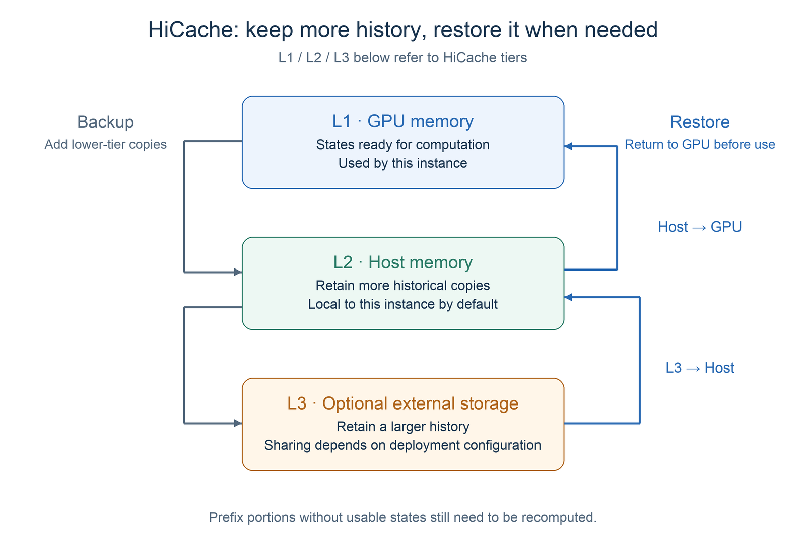
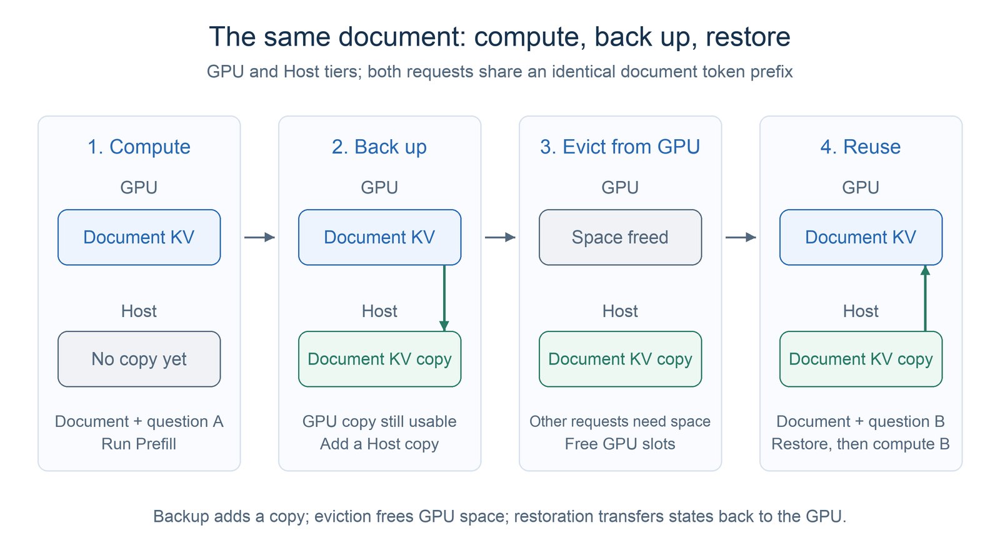
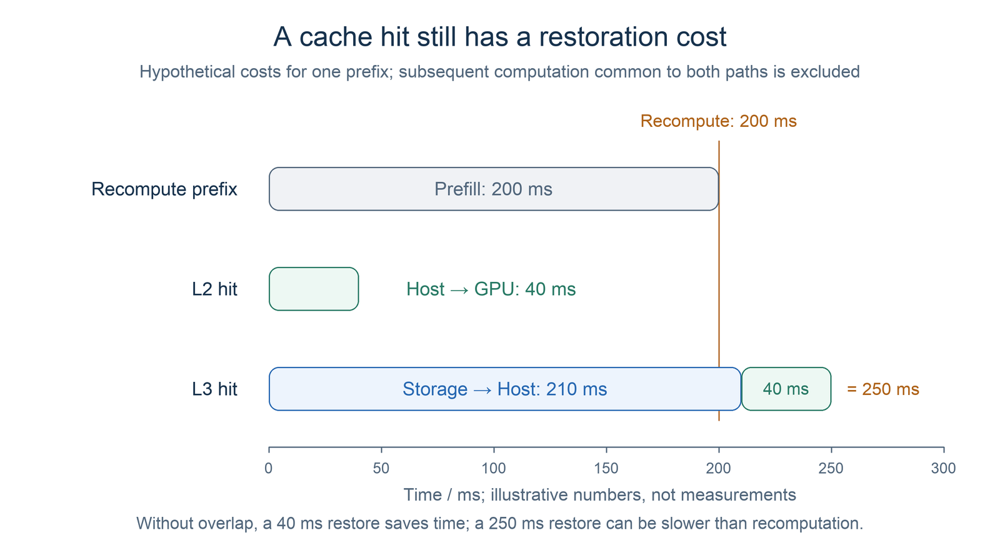
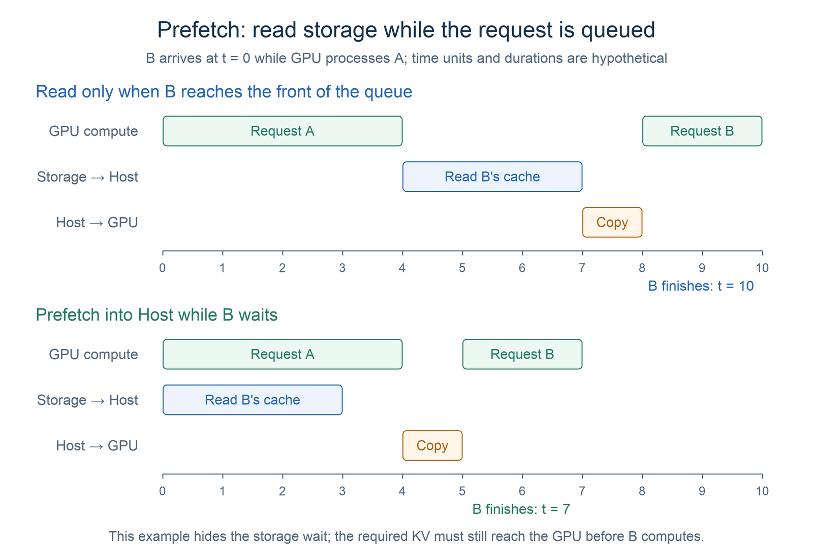
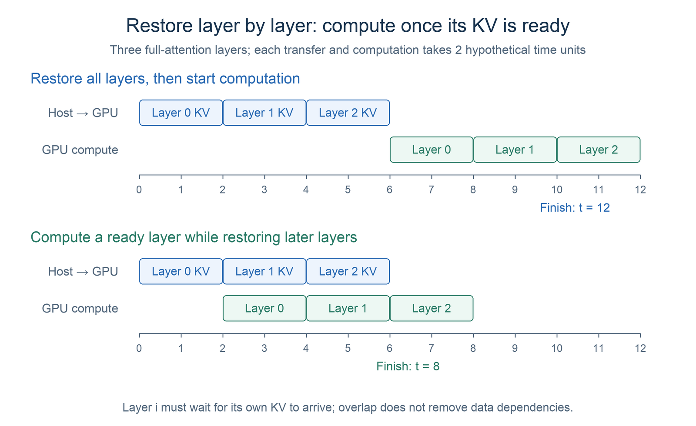

# Chapter 3 Hierarchical Caching

Earlier chapters introduced KV Cache and prefix reuse with RadixAttention: when multiple requests share the same prefix, they can reuse previously computed states and avoid repeating Prefill. GPU memory is limited, however. Long contexts can cause frequent KV Cache eviction and recomputation.

Hierarchical caching addresses this problem: the states have already been computed, but there is no room to keep them. SGLang's HiCache extends prefix caching from GPU memory (L1) to Host memory (L2) and optional external storage (L3), trading data transfers for less repeated computation. Using a document reuse example, this chapter explains the basic workflow and the tradeoffs among capacity, bandwidth, and latency.

## 1 Learning Objectives

After completing this chapter, you will be able to:

1. Explain why hierarchical caching is useful even when prefix caching is already available.
2. Describe what HiCache stores in L1, L2, and L3, and what a hit at each tier means.
3. Trace a prefix's states from computation and backup to restoration and reuse.
4. Compare the costs of restoring and recomputing a prefix, and explain how prefetching and overlapping transfers with computation help.
5. Identify request patterns that are more likely to benefit from HiCache.

## 2 Why Prefix Caching Alone Is Not Enough

Suppose a user uploads a long document and first asks, "What is this document mainly about?" Later, they ask, "What are the limitations of the approach in Section 2?" Both inputs begin with the same document, so the second request can reuse the document prefix's KV and compute only the new question that follows.

Reuse is straightforward if the KV stays on the GPU. Between the two questions, however, the service may process many other requests. To free GPU memory for active requests, the cache manager evicts some prefixes that are not currently in use. If the document's KV exists only on the GPU, eviction removes this opportunity for reuse.

Paged KV Cache improves GPU memory allocation and reclamation; prefix caching avoids repeated computation of the same prefix. Both are important, but neither lets finite GPU memory retain an unlimited history. HiCache builds on them to answer another question: **can we keep historical states somewhere else when the GPU has no room, and read them back when needed?**

## 3 What HiCache's Three Tiers Do

### 3.1 L1, L2, and L3

HiCache defines its tiers by where the data is stored:

| Tier | Location | Main purpose | How a hit is used |
|---|---|---|---|
| L1 | GPU memory | Hold states for current computation and recent reuse | The required KV is already on the GPU and can be used directly |
| L2 | This instance's Host memory | Retain more history that is temporarily absent from the GPU | Transfer the required KV back to the GPU first |
| L3 | An optional external storage backend | Retain a larger history; support reuse across instances when configured as shared storage | Usually read into Host memory first, then transfer to the GPU |

L1 has limited capacity, but its data is already on the GPU. L2 and L3 can provide more space, at the cost of restoring data after a hit. Both transfers and storage access add latency.

<div align="center">
  
  <p><em>Figure 1. Lower tiers retain more history; the required states return to the GPU along the restore path before use.</em></p>
</div>

### 3.2 How Prefix Matching Works Across Tiers

When HiCache receives a new request, it still looks for an identical, continuous token prefix from the beginning of the input. Some of that prefix's KV may be on the GPU, some in Host memory, and some only in L3. Matching across tiers therefore needs to answer two questions: **how far does the prefix match, and where can we obtain the KV for those positions?**

We can break this process into three steps:

1. **Match local L1 and L2 first.** The system walks the local cache tree, comparing tokens segment by segment from the start of the request. Each node records both the tokens in that segment and its copies on the GPU or in Host memory. This stage mainly checks the index; it has not yet transferred Host KV back to the GPU.
2. **Query L3 as needed.** If L3 is enabled, the system generates lookup keys for cache pages in the remaining portion that did not match locally, then queries the storage backend for their KV. Think of each key as a "prefix fingerprint": it combines the current page's tokens with the preceding prefix, keeping states for identical text in different contexts separate. The system queries these pages as needed, without maintaining a global location table for all of L3. See [HiCacheController](https://github.com/sgl-project/sglang/blob/1d019ce1c85e11ff2f425344e66f446b106f6074/python/sglang/srt/managers/cache_controller.py) for the implementation.
3. **Determine how much of the prefix can be reused continuously.** Hits from different tiers must connect without gaps from the start of the request. The system cannot skip a missing segment and resume reuse at a later cached segment. Finding a copy only confirms that there is somewhere to fetch it from; KV Cache contents in L2 and L3 still need to be transferred to the GPU for computation.

For example, suppose a document has a reusable prefix of 1,024 tokens, each cache page holds 256 tokens, and each segment satisfies the reuse conditions:

| Position in the document prefix | Available copy | What must happen before GPU computation |
|---|---|---|
| Tokens 1–512 | L1 | Use directly |
| Tokens 513–768 | L2 | Restore from Host to GPU |
| Tokens 769–1,024 | L3 | Read into Host memory, then restore to GPU |

If all three segments become ready, the full 1,024-token prefix can be reused. If no copy is available for the last segment, only the first 768 tokens can be reused; the remaining document and the new question must still be computed. **A matched prefix can span several tiers, but the prefix actually reused must be continuous, with its required states ready.**

Tokens must match exactly. Text with a similar meaning does not qualify for reuse. Even if the document is identical, a different preceding system prompt or template may change the prefix that can be matched.

This section uses full-attention KV to explain the workflow. Hybrid model architectures also need to check that states such as sliding-window attention (SWA) KV and Mamba recurrent states are complete. See [Unified Radix Cache](https://github.com/sgl-project/sglang/blob/1d019ce1c85e11ff2f425344e66f446b106f6074/python/sglang/srt/mem_cache/unified_radix_cache.py) for the relevant implementation.

## 4 The Lifecycle of a Cached Document

We will continue with the same document and two questions, assuming that the document prefix satisfies the cache reuse conditions.

### 4.1 The First Request: Compute and Keep a Copy

The first request contains "document + question A." No document cache is available, so the system runs Prefill, produces the corresponding KV on the GPU, and then generates the answer.

Depending on the selected cache policy, HiCache can back up prefixes worth retaining to Host memory. When L3 is enabled, it can also write them to storage. Backup adds a copy in a lower tier; the original GPU data remains usable until it needs to be reclaimed.

Backing up every prefix immediately creates more opportunities for future hits, but also consumes transfer bandwidth and Host capacity. The system therefore needs to decide what to keep and when to copy it. If a prefix is evicted before backup finishes, or was not selected for backup, it may still need to be recomputed.

### 4.2 The Second Request: Restore According to the Hit Location

The second request contains "the same document + question B." The system first finds a reusable prefix, then decides how to execute based on whether the data is ready:

1. **L1 hit:** the document prefix's KV is still on the GPU, so it can be reused directly.
2. **L2 hit:** the GPU copy has been evicted, but Host memory retains the states. The system allocates the required GPU slots, transfers the states back, and then computes the new portion.
3. **L3 hit:** local tiers do not retain enough states, but storage has a compatible copy. Read it into Host memory first, then restore it to the GPU.
4. **No usable cache:** recompute the missing portion and create new KV.

A request may have its first portion in L1, the next in L2 or L3, and a remaining portion that needs computation. Reuse applies to a continuous prefix whose states are ready; the whole document does not have to hit the same tier.

<div align="center">
  
  <p><em>Figure 2. An L2 reuse cycle: backup adds a copy, eviction frees GPU space, and a later request restores the document's states.</em></p>
</div>

The saving comes from avoiding repeated forward computation of the reusable prefix. The new question still needs to be computed, and Attention for new tokens still reads the document's KV. **Caching a document does not mean that answering a new question stops using its contents.**

SGLang's [`HiCacheController`](https://github.com/sgl-project/sglang/blob/1d019ce1c85e11ff2f425344e66f446b106f6074/python/sglang/srt/managers/cache_controller.py) organizes backup and restoration between Host and GPU, as well as storage operations. When reading the source, use `write`, `load`, and `prefetch` to follow these actions.

## 5 Performance Tradeoffs

One fact may seem surprising at first, but makes sense once we consider the costs: enabling hierarchical caching does not always make requests faster. As discussed above, it saves time spent recomputing KV Cache for the same prefix, but also adds the cost of moving KV Cache between tiers. We will now examine how to compare these costs and how to reduce them.

### 5.1 Compare Restoration and Recomputation Time

An L1 hit is already on the GPU, while L2 and L3 hits incur restoration costs. A high cache hit rate therefore does not automatically mean low time to first token.

For the same reusable prefix, we can make a rough comparison:

$$
T_{\mathrm{restore}}
\approx T_{\mathrm{storage}\to\mathrm{Host}} + T_{\mathrm{Host}\to\mathrm{GPU}}
$$

An L2 hit does not need the first term; an L3 hit usually includes both. Ignoring overlap and other overhead for now, reuse provides a direct latency benefit only when restoration is faster than recomputing that prefix.

Consider a hypothetical example meant only to illustrate the tradeoff. If recomputing a prefix takes 200ms and restoring it from Host takes 40ms, reuse is worthwhile. If reading it from slower storage and restoring it takes 250ms, direct recomputation may be faster. These numbers are not measurements; actual time depends on cache size, effective bandwidth, storage load, and model computation speed.

<div align="center">
  
  <p><em>Figure 3. Compare restoration and recomputation using the hypothetical numbers above, excluding subsequent computation common to both paths. These are not measured results.</em></p>
</div>

Backup also has a cost. If many prefixes are never used again, the system writes extra data without saving any later computation. Evaluating HiCache therefore requires checking whether reuse actually happens and whether the saved computation covers backup and restoration overhead.

### 5.2 Prefetching: Read While the Request Is Waiting

One way to reduce the wait for data from lower tiers is to start reading earlier. Suppose the GPU is processing request A, while request B has arrived but is still queued. B's document prefix exists only in L3. HiCache can read its cache into Host memory while B waits, overlapping storage access with computation for other requests.

This early read is called **prefetching**. If the data is ready when B's turn arrives, B spends less time waiting for a storage read. Whether prefetching can hide the entire read depends on the length of the queueing window and whether storage finishes reading in time.

<div align="center">
  
  <p><em>Figure 4. Prefetching moves the storage read into the queueing period. Time units and durations are hypothetical; the required KV still needs to be restored to the GPU.</em></p>
</div>

If the read is incomplete when B's turn arrives, the system must decide whether to keep waiting or begin computation:

| Prefetch policy | What happens if the read is incomplete | Main tradeoff |
|---|---|---|
| `best_effort` | Do not wait longer; reuse the ready prefix and recompute the rest | Begin execution sooner, but potentially give up some reuse |
| `wait_complete` | Wait for prefetching to finish before execution | Reuse more of the prefix, at the cost of extra waiting |
| `timeout` | Allow a limited wait for completion, then use the ready prefix | Balance waiting time against recomputation |

No policy is always best. When a long prefix is expensive to recompute, waiting a little longer may be faster overall. With a short prefix or congested storage, waiting may slow the request down. What matters to users is the total request time, rather than the highest possible hit rate.

### 5.3 Restore Layer by Layer: Overlap Transfers with Computation

Besides reading from storage early, restoration from Host to GPU can overlap with model computation. The model executes layer by layer. When processing layer 0, it needs the historical KV required by that layer; it does not have to wait for every layer's KV to arrive first.

Once layer 0's states are ready, the system can compute layer 0 for the new tokens while transferring KV for later layers. Before executing any layer, it must still ensure that the data needed by that layer has reached the GPU.

<div align="center">
  
  <p><em>Figure 5. Layerwise restoration overlaps transfers with computation, but each layer still waits for its own KV. Durations are hypothetical.</em></p>
</div>

This optimization reduces GPU idle time. Its actual effect depends on whether transfers and computation can overlap. For a more detailed visual explanation, see the [HiCache visual course](https://yichizhang.dev/AI-Infra-Visualized/lessons/hicache/). Overlap does not remove data dependencies: computation still waits if the next layer's KV is not ready.

## 6 How to Decide Whether a Workload Fits HiCache

### 6.1 Look for Repeated Prefixes, Then Capacity Pressure

Workloads more likely to benefit include multi-turn conversations that repeatedly include their history, repeated questions about the same long document, and Agents that reuse the same task prefix. They share one feature: a long prefix that has already been computed will be used again.

Also check whether these prefixes are likely to be evicted from the GPU. If hot prefixes can stay in L1, lower tiers may add little benefit. With a large history, long intervals between reuse, and insufficient GPU capacity, L2 or L3 has more opportunity to recover otherwise lost hits.

If requests rarely share prefixes, inputs are short, or the transfer path is already congested, increasing cache capacity may not improve latency. HiCache mainly reduces repeated Prefill. Enabling it alone does not imply faster Decode, nor does it increase the model's maximum context length.

### 6.2 Verify Benefits with Service Metrics

In an environment with model and hardware support, start with the GPU and Host tiers:

```bash
python3 -m sglang.launch_server \
  --model-path Qwen/Qwen3-0.6B \
  --enable-hierarchical-cache
```

This flag enables HiCache; it does not automatically configure shared L3 storage. Check the [HiCache usage documentation](https://github.com/sgl-project/sglang/blob/1d019ce1c85e11ff2f425344e66f446b106f6074/docs/docs/advanced_features/hicache_best_practices.mdx) for your installed version when choosing the Host pool size, backup policy, and storage configuration.

For testing, repeat requests with the same long prefix and insert other traffic between them. Observe whether the prefix can be restored from lower tiers after GPU eviction. When comparing against a baseline with HiCache disabled, keep the model, request distribution, concurrency, and other settings identical.

Focus on TTFT, input throughput, and tail latency. Also inspect the number of tokens actually reused from each tier, Host memory usage, and transfer load. More hits accompanied by better service metrics show that the extra storage capacity has translated into a benefit.

## 7 Summary and Exercises

### 7.1 Summary

HiCache extends prefix caching by retaining historical states in Host memory and optional storage, in addition to the GPU. An L1 hit can be used directly. An L2 or L3 hit must be restored to the GPU. Portions without usable states still need to be recomputed.

Hierarchical caching provides more capacity for future reuse and uses prefetching and layerwise restoration to reduce waiting, but also consumes bandwidth and storage resources. To decide whether it is worthwhile, examine actual repeated prefixes and compare recomputation with restoration costs, then evaluate time to first token and service throughput.

### 7.2 Exercises

1. Why might HiCache still be needed when Paged KV Cache and prefix caching are already available? What problem does each solve?
2. What must happen before execution when the same prefix hits L1, L2, or L3? Is L3 always shared storage?
3. Recomputing a prefix takes 150ms, restoring it from Host takes 30ms, and reading it from storage adds 200ms. Ignoring overlap, do both lower-tier hits improve latency?
4. How does prefetching help while a request is queued? If the read is incomplete when execution is due, how do `best_effort`, `wait_complete`, and `timeout` handle the tradeoff?
5. Why can computation begin once layer 0's KV is ready, without waiting for every layer to be restored? What data dependencies must this overlap respect?
6. After enabling HiCache, the hit rate increases but TTFT tail latency gets worse. What possible causes should you investigate?

## References

- [SGLang: HiCache system design, cache scope, and read/write policies](https://github.com/sgl-project/sglang/blob/1d019ce1c85e11ff2f425344e66f446b106f6074/docs/docs/advanced_features/hicache_design.mdx)
- [SGLang: HiCache usage and configuration](https://github.com/sgl-project/sglang/blob/1d019ce1c85e11ff2f425344e66f446b106f6074/docs/docs/advanced_features/hicache_best_practices.mdx)
- [SGLang: HiCacheController data transfer implementation](https://github.com/sgl-project/sglang/blob/1d019ce1c85e11ff2f425344e66f446b106f6074/python/sglang/srt/managers/cache_controller.py)
- [SGLang: Unified Radix Cache state management implementation](https://github.com/sgl-project/sglang/blob/1d019ce1c85e11ff2f425344e66f446b106f6074/python/sglang/srt/mem_cache/unified_radix_cache.py)
- [AI Infra Visualized: HiCache visual course](https://yichizhang.dev/AI-Infra-Visualized/lessons/hicache/)
