# part1 Introduction to GPU

欢迎来到 zero-to-sglang 课程，这里是课程的第二部分，上节课我们介绍了大模型的推理具体过程，学习了token的生命历程还有KV Cache 等技术，下面我们要介绍的是GPU的架构以及LLM在GPU的执行流程。GPU作为大模型训练和推理的地基，贯穿整个大模型的生命流程，我们有必要学习GPU相关的知识。下面就让我们开始本节课程的学习。

## 一、GPU 架构基础

### 1.1 GPU的起源：图形处理器

在深度学习概念没有火起来之前，GPU在普通人眼中是**游戏显卡**，即图形处理器。下面用一个例子来说明GPU和CPU的区别。

当我们打开游戏里面的3D模型，可以发现3D模型都是由一个一个**小三角形**构成，三角形由三根线构成，为了节省存储的空间，我们只存储三角形的三个顶点坐标，构成线的像素点坐标我们不储存，而是实时计算出来。


由两个点构成一个直线就可以发现，一根线我们只存储**两个端点的信息**，中间的像素点再时时计算渲染。我们可以由两个顶点坐标计算斜率和截距，就可以算出两条线中间的点的位置。虽然都是简单计算，只有大量简单的乘法和加法。但是 CPU 天生时执行复杂逻辑的，只能逐个计算，所以**计算时间非常长**。

人们就想到创造出可以**大量并行计算简单的乘法和加法**的计算单元，就是GPU。CPU和GPU没有优劣之分，只是用来执行不同功能的单元。GPU的计算单元被称作**CUDA核心**。

### 1.2 CPU（中心处理器）和GPU（图形处理器）的区别

CPU是我们最早接触的执行模型。程序按顺序运行，在单线程中逐步执行指令。要支持这种执行模式需要大型控制单元和快速运行能力，因为存在大量分支和条件控制逻辑。因此CPU会将大量芯片面积用于分支预测（下面这张图），虽然**核心数量有限但运行速度极快**。相比之下，GPU则拥有海量**计算单元**（ALU），就是那些绿色小方块。**只有极小部分芯片面积用于控制逻辑，用少量控制逻辑来协调海量并行运算的计算单元**。从概念上看，这体现了CPU和GPU的不同侧重点。

二者的设计目标截然不同，CPU优化延迟，追求**单个任务最快完成**。而**GPU优化吞吐量**，GPU不关心单个任务延迟，只追求所有任务整体最快完成。为此GPU配备大量可快速休眠唤醒的线程，虽然GPU每个任务的延迟较高，但整体完成时间反而领先CPU。这就是它们不同的设计理念和目标。因此，GPU的架构结构不同在于在于GPU会运行大量**流式多处理器**（SM）。

CPU设计初衷是用来最小化单任务延迟，快速响应复杂逻辑，大部分晶体管用于控制逻辑和缓存，核心数量通常有4-64，可以执行乱序执行、分支预测、推测执行等等任务。

GPU的设计初衷是最大化数据吞吐量，批量处理简单计算，大部分晶体管用于算术逻辑单元（ALU），核心多而简，可以达到数万个。优化**延迟**，追求单个任务最快完成。配备大型控制单元、分支预测器，核心数量少（4-32个）但时钟频率极高。


上面这幅图可以看到：**CPU的计算单元**（绿色部分）少，大部分用来**控制（Control）**和**缓存（Cache）**这决定了它可以进行**复杂的逻辑运算**，GPU则不同，他的**控制单元少（黄色部分）**,大部分都是**绿色的计算单元**，这决定了它可以进行**大量并行计算简单的乘法和加法运算**，复杂的逻辑和复杂的计算就不行了。GPU主要就是优化**吞吐量**，追求所有任务整体最快完成。控制逻辑仅占芯片面积的极小部分，计算单元（ALU）占绝大多数。所以我们在使用GPU时还要**CPU的调度**，一个好的GPU要配上好的CPU才能发挥作用。

到了AI时代，深度学习中的**矩阵**将GPU推上神坛。因为AI时代的核心是**神经网络**的计算，其中涉及到大量的**矩阵运算**，矩阵运算的本质是大量的**乘法和加法**，特别适合GPU来做这种**简单又重复**的运算，在2010年左右人们就开始利用GPU来进行AI相关的计算。

### 1.3 A100显卡核心的构成

我们使用A100 来介绍GPU的具体结构


一张英伟达的的显卡剖面图如图，一张显卡由**供电、显卡核心、显存、显示接口和金手指**组成。

我们主要介绍显卡核心：显卡核心由**cuda core、控制单元和缓存单元等构成**。而 CPU 和 GPU 最大的不同就在于，GPU 负责的工作大多是重复性的 3D 建模或者渲染，而流处理器就是负责顶点运算或者像素运算，能动态的分配进行顶点运算和像素运算的流处理器数量，达到资源的高效利用。

**A100**是NVIDIA为数据中心设计的纯计算GPU，没有图形输出能力。

#### 1.3.1 产品形态

**PCIe版本**（常见形态）
**尺寸**为双槽全高，长267mm。**功耗**：250W（40GB版）/300W（80GB版）。**散热**是**被动散热**，无风扇（依赖服务器风道）。**接口**为PCIe 4.0 x16金手指 + NVLink桥接器接口；**重量**约1.4公斤。


####  1.3.2 PCB板级组件

**GA100 GPU核心芯片**

**封装**：巨型BGA封装，尺寸约55mm×55mm。**位置**：板卡正中央，焊在PCB上。542亿个**晶体管**，7nm工艺，面积826mm²。

**HBM2e显存堆栈**（革命性设计）
不同于消费级GPU的GDDR显存颗粒，A100采用**3D堆叠技术**：

#### 1.3.3 GA100 GPU核心架构（芯片内部宏观结构）


NVIDIA Ampere架构是NVIDIA于2020年发布的GPU架构，是其第八代GPU架构。它采用7纳米（nm）制程工艺，集成了高达540亿个晶体管，是当时世界上最大的7纳米芯片。该架构主要面向数据中心、人工智能（AI）、高性能计算（HPC）及专业图形等领域

Ampere架构拓扑如下：

```
┌─────────────────────────────────────────┐
│            GA100 GPU核心                
│                                         
│  ┌─────────┐  ┌─────────┐  ┌─────────┐│ 
│  │  GPC 0  │  │  GPC 1  │  │  GPC 2  ││ 
│  │ (12 TPC)│  │ (12 TPC)│  │ (12 TPC)││ 
│  └─────────┘  └─────────┘  └─────────┘│ 
│                                         
│  ┌─────────┐  ┌─────────┐  ┌─────────┐│ 
│  │  GPC 3  │  │  GPC 4  │  │  GPC 5  ││ 
│  │ (12 TPC)│  │ (12 TPC)│  │ (12 TPC)││ 
│  └─────────┘  └─────────┘  └─────────┘│ 
│                                         
│  ┌─────────┐  ┌─────────┐  ┌─────────┐│ 
│  │  GPC 6  │  │  GPC 7  │  │  GPC 8  ││ 
│  │ (12 TPC)│  │ (12 TPC)│  │ (12 TPC)││ 
│  └─────────┘  └─────────┘  └─────────┘│ 
│                                         
│  HBM2e控制器 ×8  ┌─────────────────┐    
└──────────────────│  PCIe 4.0 ×16    │──┘
                   └─────────────────┘
```

A100有四个层级的架构拓扑，首先是**GPC（图形处理簇）**，一个显卡核心有8个（实际启用7-8个）GPC；每GPC12个**TPC（纹理处理簇）**，共96个TPC;每TPC 2个，共**192个SM**（实际启用108个）**SM（流式多处理器）**；每个SM有64个**CUDA核心**，一共有192 × 64 = **6,912个CUDA核心**。

然后是**Tensor Core**，每个SM有192个（实际启用432个第三代Tensor Core）。

#### 1.3.4 SM（Streaming Multiprocessor，流式多处理器）内部结构

A100的SM是Ampere架构核心，相比消费级GPU有本质增强：

SM是将线程块（Thread Block）映射到物理硬件并完成实际计算的根本单元。当GPU内核（Kernel）启动时，线程块被分配到空闲的SM上，SM负责将其内部的线程束（Warp，32线程）解码并派发至CUDA核心（处理通用运算）或Tensor Core（处理矩阵乘加运算）执行。没有SM的调度，CUDA核心和Tensor Core无法自主运行。


```
┌──────────────────────────────
│              SM（流式多处理器）             
│                                            
│  ┌────────┐ ┌────────┐ ┌────────┐       
│  │CUDA核心│ │CUDA核心│ │CUDA核心│       
│  │  ×64   │ │  ×64   │ │  ×64   │    ← FP32/INT32单元
│  └────────┘ └────────┘ └────────┘       
│                                            
│  ┌──────────────────────────┐            
│  │  第3代Tensor Core ×4     │         ← AI专用加速单元
│  │  支持FP64/TF32/FP16/INT8 │            
│  └──────────────────────────┘            
│                                            
│  ┌──────────────────────────┐            
│  │   共享内存 / L1缓存       │        ← 192KB
│  │        128KB             │            
│  └──────────────────────────┘            
│                                            
│  ┌──────────────────────────┐            
│  │   寄存器文件              │        ← 256KB
│  │        256KB             │            
│  └──────────────────────────┘            
└──────────────────────────────
```

**SM的独特之处**是在于**CUDA核心**，64个/组，共4组 = 256个CUDA核心/SM（实际配置为64个FP32 + 64个INT32），同时还有**第三代Tensor Core**，支持**结构化稀疏**（性能翻倍），并和支持**双精度FP64**（消费级GPU没有）


####  1.3.5 Tensor Core

NVIDIA A100 Tensor Core是其**第三代Tensor Core**技术，是A100 GPU专为**加速AI训练、高性能计算（HPC）和数据分析**而设计的核心计算单元。它通过专用硬件和全新精度格式，在矩阵乘法等核心运算上实现了数量级的性能飞跃。

Tensor Core是专为执行**矩阵乘加运算（FMA）** 而设计的硬件单元，在处理深度学习和科学计算中的核心运算时，效率远超通用CUDA核心。A100支持多种数据精度，特别是引入了创新的**TensorFloat-32 (TF32)** 格式。它能在不改变代码的情况下，以FP32的精度和范围实现接近FP16的运算速度。A100的Tensor Core支持**结构化稀疏**技术。它能利用AI模型中的稀疏性（即大量参数为零），将吞吐量**进一步提高一倍**。


A100 Tensor Core提供了惊人的计算吞吐量，具体性能如下：

| 精度格式 | 计算性能 (Tensor Core加速) | 说明 |
| :--- | :--- | :--- |
| **FP16** | **312 TFLOPS** | 半精度，深度学习的“主力”精度。 |
| **BFloat16** | **312 TFLOPS** | 另一种半精度格式，动态范围更佳。 |
| **TF32** | **156 TFLOPS** | A100特有的精度，FP32精度/范围，FP16速度。 |
| **INT8** | **624 TOPS** | 8位整数，主要用于AI推理，速度极快。 |
| **FP64** | **19.5 TFLOPS** | 双精度，满足科学计算等高精度需求。 |


**硬件组成**：A100 GPU拥有**432个**第三代Tensor Core，分布于**108个**流式多处理器（SM）中。
**工作原理**：Tensor Core采用**Warp-Level**的编程模型。一个Warp（32个线程）协同工作，将数据从显存加载到寄存器，再由Tensor Core执行矩阵运算。
**软件支持**：开发者可以通过**CUDA**、**cuDNN**等深度学习库，以及主流的AI框架（如PyTorch、TensorFlow）来调用Tensor Core。

## 二、 GPU的执行模型

我们简单介绍了A100 GPU的结构，但是我们还不知道GPU是如何执行计算的，下面我们介绍GPU各个部分的是如何执行计算的。

### 2.1 SM流式处理器的执行流程

我们可以将流式多处理器视为一个**原子单元（即最小单元）**。当使用Triton这类工具编程时，操作层级就对应着SM。在每个SM内部，它包含许多**流处理器**（SP），而每个流处理器会**并行执行大量线程**。可以这样理解，SM拥有一套**控制逻辑**，能决定执行内容，比如实现**分支判断**；而SP则负责将相同指令应用于不同数据片段。这样就能实现海量并行计算。在这种架构下，每个**SM是控制粒度的基本单元**，而单个SP能独立完成大量计算。以上一代GPUA100为例，它包含128个SM——这远超大多数CPU的核心数量。每个SM内部都集成有大量SP和专用矩阵乘法单元，这就是其计算模型的基本形态。每个SM能操控其专属组件（如张量核心）进行计算。

**线程调度与执行**

SM同时管理**数千个线程**，决定哪个线程在何时使用哪个计算单元。它不像CPU那样为每个线程保存大量状态，而是轻量级切换，几乎没有开销。

**指令流水线**

SM内部有**4条独立的指令流水线**，每个时钟周期可以同时发射4条不同指令给不同的Warp（线程束）。

**数据缓存与共享**

SM内置**192KB的L1缓存/共享内存**，供本SM内所有CUDA核心快速存取数据，延迟比全局显存低100倍。

### 2.2 执行模型的核心名词详解


在GPU运行中，我们划分三个粒度层级来思考：**块（block）、线程束（warp）和线程（thread）**，这是粒度逐级细化的顺序。块是大型线程组，**每个块会被分配给一个SM处理**。可以把每个SM想象成**独立工作**的单元，而块就是分配给它的**处理单元**。在每个块内部包含**大量线程**，每个线程代表待执行的任务单元。这些线程在执行时会分组运行，这种分组称为线程束。每个线程束由32个连续编号的线程组成，从块中提取出来同步执行。通过这个示意图可以看到：多个块被分配给不同的SM，每个块内包含多个线程束，每个线程束又由大量线程组成。所有这些线程都会在不同数据上执行相同的指令，这就是基本执行模型。


#### 1. Warp（线程束）

Warp的概念源于其工作机制：所有线程步调一致地执行同一指令，但处理各自不同的数据。在A100中，每个SM（流式多处理器）最多可以同时承载64个活跃的Warp。

一个**Warp**是32个线程组成的固定小组，是SM调度的**最小单元**。**Warp像"公交车"**，32个乘客（线程）必须**同站同下**，执行完全相同的指令。如果某个线程需要走不同分支（if-else），全车人要等它，这叫**Warp Divergence（线程束分化）**。

SM同时驻留**64个Warp**，4个Warp调度器每个管理16个Warp；Warp内32线程在**SIMD单元**上同步执行。Warp由SM的SIMT（单指令多线程）单元负责创建、管理和调度。当一个线程块（Thread Block）被分配给SM后，SM会将其中的线程按照连续的、递增的线程ID进行分组

#### 2. Block（线程块）

Bock程序员指定的线程组，映射到**1个SM**上执行。**Block像"施工队"**，队内成员可以**共享工具**（共享内存），可以通过哨子同步。

每个Block独占SM的**共享内存**和**寄存器资源**；Block内所有线程必须**在同一SM内**执行（不能跨SM）；

#### 3. Thread（线程）

线程是**最细粒度的执行单元**，每个线程执行同样的Kernel代码，但操作不同数据。Thread像"流水线上的工人"，每人负责一个数据元素（如向量中的一个数）。

每个线程有**私有寄存器**（通常256个）；线程ID：`threadIdx.x` 决定它处理哪个数据

#### 4. SIMT（单指令多线程）

GPU执行模型，多个线程（Warp）共享同一条指令，但操作不同数据。**SIMT（Single Instruction, Multiple Threads，单指令多线程）** 是NVIDIA GPU（包括A100）采用的**并行计算执行模型**。它由NVIDIA在G80架构中首次引入，是CUDA编程模型能屏蔽硬件细节、让开发者按多线程逻辑编程的理论基础。

SIMT是SM（流式多处理器）**执行指令的根本方式**。当GPU内核启动后，SM内的**Warp调度器**以**线程束（Warp）**为单位（固定32个线程）获取一条指令，然后将该指令**广播**给Warp内的所有活动线程。每个线程在自己的CUDA核心或Tensor Core上，操作**私有寄存器**中存放的**不同数据**，实现“单指令处理多份数据”的并行。

#### 5. 与SIMD（单指令多数据）的本质区别
| 特性 | **SIMT（GPU）** | **SIMD（如CPU的AVX）** |
| :--- | :--- | :--- |
| **执行粒度** | 多线程（每个线程有独立指令地址计数器和寄存器状态） | 向量通道（整个向量共享单一指令地址） |
| **分支处理** | **支持线程级分支**（if/else、循环），可独立执行不同路径 | 所有通道必须统一执行，分支困难 |
| **硬件实现** | 硬件调度器动态管理线程掩码（Mask） | 编译器将数据打包为向量 |

**线程束发散（Warp Divergence）**

尽管SIMT支持分支，但存在显著性能约束。当Warp内32个线程遇到**条件分支**（如`if (threadId % 2 == 0)`）时，部分线程满足条件（活跃），部分不满足（非活跃）。

SM无法让活跃和非活跃线程同时执行不同指令。它只能**先执行活跃线程路径**，通过**掩码（Mask）**屏蔽非活跃线程；然后**切换执行另一路径**，屏蔽上一批活跃线程。

若同一Warp内分支分歧严重，两条路径**串行执行**，性能损失接近一半（甚至更多）。因此，优化SIMT程序的关键在于**尽可能避免同一Warp内的分支分化**。

SIMT模型是**GPU高吞吐量的底层逻辑**,它将硬件上**SIMD式的密集计算**封装为**MIMD（多指令多数据）式的编程灵活性**，使开发者能写出类似CPU的多线程代码，而硬件通过Warp调度、掩码和收敛机制，自动将线程级并行映射为高吞吐量的计算流。这正是A100的SM能高效协同调度CUDA核心与Tensor Core的指令执行基础。


### 2.3 GPU的内存模型


**内存距离SM越近，访问速度越快**。因此存在**极高速的内存类型（如L1缓存和共享内存）**，它们位于SM内部，具有**极快的读写速度**。像**寄存器这类需要频繁读写的元件，就应该放置在L1和共享内存中**。

如图所示，这些绿色区域是SM集群，而**蓝色区域代表紧邻SM的L2缓存**,它们虽然不在SM内部，但物理位置仍然很近，**速度也相当快**（虽然比L1慢一个数量级）。在芯片外部（以这张3090或PCIeA100为例），GPU芯片旁边实际安装了**DRAM内存**，这意味着数据需要实际**离开芯片通过物理连接**进行传输。你可以在这张芯片图上看到边缘的这些黄色连接器。这些是HBM连接器，它们连接到实际GPU外部的DRAM芯片。

你可以从上图左侧看到访问这些存储所需的**速度**，SM内部存储器的访问速度要快很多，大约只需20个时钟周期就能从中获取数据，而访问L2缓存或全局内存则需要200到300个时钟周期。这个**10倍的差距会对性能造成严重影响**。如果某段计算需要访问全局内存，可能意味着你的SM会无工作可做，矩阵乘法全都完成了，任务耗尽，只能空转。这样**利用率就不会高**。这在某种程度上将成为思考内存架构的核心主题，也是理解GPU工作原理的关键。

首先是寄存器，**这是速度极快的存储单元**，用于保存单个数值型数据。本地内存、有共享内存、还有全局内存、他们在内存层次结构中逐级递增，速度也越来越慢。

**代码可以写入全局内存**，也可以写入常量内存（虽然这个不常用）。每个线程都能访问**自己的寄存器和共享内存**，但**跨线程块的信息需要写入全局内存**。这意味着当编写执行任务的线程时，理想情况下它们应该操作相同的小批量数据，这样就不用跨线程。我们可以将这小批量数据加载到共享内存中，所有线程都能高效访问共享内存，执行完毕后任务就完成了。这是最理想的执行模式。反之，**如果线程需要到处访问数据**，就必须访问**全局内存**，速度会非常非常慢。

---

#### 2.3.1 第一层：全局内存（Global Memory）

| 特性 | 参数  说明 |
|------|------------|
| **物理位置** | GPU芯片外的HBM2e显存堆栈 |
| **容量** | A100: 40GB/80GB |
| **带宽** | **2,039 GB/s** (A100) |
| **延迟** | ~500 GPU周期 (~250ns) |
| **编程控制** | **手动管理** (`cudaMalloc`) |
| **可见性** | 所有线程可访问 |

全局内存可以存放模型的所有权重、激活值、梯度（如GPT-3的1750亿参数）；训练数据、中间结果、最终输出，将**数据持久化**；我们通过PCIe从主机内存拷贝数据，是**CPU-GPU传输通道**。

全局内存提供**海量容量**（80GB），能容纳大模型的巨大显存；成本相对低（HBM2e虽贵，但比SRAM便宜100倍）是GPU存储的基础。

---

#### 2.3.2 第二层：L2缓存（二级缓存）

| 特性 | 参数  说明 |
|------|------------|
| **物理位置** | **GPU芯片内，所有SM共享** |
| **容量** | **40MB** (A100) |
| **带宽** | ~3TB/s |
| **延迟** | ~200周期 (~100ns) |
| **编程控制** | **自动管理** (硬件控制) |
| **可见性** | 所有SM所有线程 |


能够为**全局数据加速**，自动缓存全局内存的热点数据（如频繁访问的模型权重）；是**数据共享枢纽**，SM之间通过L2缓存交换数据（比直接走HBM快3倍）；能**数据一致性保证**，所有SM看到的L2数据一致。

能**缓解显存带宽瓶颈**，AI训练90%时间访问同一批权重，L2缓存命中可节省95%的HBM带宽；**硬件自动管理**程序员无需干预，降低编程复杂度。

---

#### 2.3.3 第三层：L1缓存 / 共享内存（Shared Memory）

| 特性 | 参数  说明 |
|------|------------|
| **物理位置** | **每个SM内部** |
| **容量** | **192KB/SM** (A100, 可配置) |
| **带宽** | **1TB/SM** |
| **延迟** | **20-40周期** (~10-20ns) |
| **编程控制** | **完全手动** (`__shared__`) |
| **可见性** | **Block内所有线程可见** |


它是一个**线程协作的仓库**，块(Block)内线程通过共享内存交换数据（如矩阵乘法的分块（Tiling）数据）；可以**手动性能优化**，可将热点数据显式放入共享内存，实现接近寄存器的速度；**L1缓存功能**当不手动使用时，自动作为L1缓存缓存全局内存数据。

L1**速度比L2快5倍**，是GPU性能优化的核心战场；**灵活性**；高程序员可控，实现复杂算法（如规约、扫描、卷积）；有**成本效益**：192KB/SM × 108 SM = **20MB总容量**，比纯SRAM L2廉价。

---

#### 2.3.4 第四层：常量内存（Constant Memory）

| 特性 | 参数  说明 |
|------|------------|
| **物理位置** | 芯片内专用缓存 |
| **容量** | **64KB** (全局常量) |
| **带宽** | 广播机制 (1次读取服务32线程) |
| **延迟** | ~5周期 (命中缓存) |
| **编程控制** | 只读, `__constant__`声明 |
| **可见性** | **全GPU所有线程只读** |

可以存储**广播数据**；同一Warp内所有线程读取同一常量时（如神经网络的学习率），只需1次内存访问；可以存储**配置参数**；存储Kernel调用参数、查找表、常量系数。


它具有**极致能效**；广播机制节省99%带宽；**专用缓存**，不占用L1/L2资源。

---

#### 2.3.6 第六层：寄存器文件（Register File）

| 特性 | 参数  说明 |
|------|------------|
| **物理位置** | **SM内，每个CUDA核心旁** |
| **容量** | **256KB/SM** (A100) |
| **带宽** | **10TB/SM** (理论) |
| **延迟** | **1周期** (零开销) |
| **编程控制** | **完全自动** (编译器分配) |
| **可见性** | **线程私有** |

寄存器文件能做到**零延迟计算**，它存储线程的局部变量、临时结果。并且做到**极致并行**，每个线程255个寄存器，支持深度流水线。

寄存器文件的特点是**速度快**，1周期延迟。但是**昂贵**，寄存器文件的容量少。他的**容量限制决定并行度**，寄存器用量越少，SM能驻留的Warp越多。

---

#### 2.3.7 GPU内的内存分这么多层的原因

**1. 速度和容量不可兼得**

| 内存类型 | 速度 | 容量 | 成本($/GB)（估计） |
|----------|------|------|------------|
| 寄存器 | 1周期 | 256KB/SM | $1,000,000 |
| 共享内存 | 20周期 | 192KB/SM | $100,000 |
| L2缓存 | 200周期 | 40MB | $10,000 |
| HBM2e显存 | 500周期 | 80GB | $100 |

如果只用寄存器，8万块不够造1张卡；如果只用显存，算力浪费90%。分层是**唯一经济可行方案**。这是速度容量和成本的妥协。

**2. 通用性和专用性取舍**

全局内存是一个**通用仓库**，它什么都存，但速度慢。而共享内存是**专用仓库（共享内存）**，程序员往往精确控制，速度极快。L1L2则是**自动缓存**，由硬件智能预测，无需编程。

**3. 局部性原理和并行计算**

刚访问的数据很可能再次访问（如循环中的权重），这样放在全局内存的开销就很大。除此之外还有**空间局部性**，相邻数据很可能一起访问（如矩阵的同行元素）

**GPU的解决方案**是划分层级：**L2缓存**利用时间局部性，缓存重复访问的权重；**共享内存**利用空间局部性，手动加载分块（Tiling）数据；**Warp**利用常量内存的广播特性，1次读取服务32线程。后面我们还会介绍。

---

#### 2.3.8 GPU内存和CPU内存的本质区别

下面这个表格就说明了GPU和CPU的区别：

| 特性 | GPU (A100) | CPU (Xeon) |
|------|------------|------------|
| **主存带宽** | 2TB/s | 100GB/s |
| **缓存控制** | 共享内存**手动控制** | 缓存完全自动 |
| **线程寄存器** | 255个/线程 | 16个/线程 (x86) |
| **延迟容忍** | 通过Warp切换**隐藏延迟** | 降低延迟至上 |
| **内存模型** | **共享内存显式同步** | 缓存一致性协议 |

**CPU和GPU的本质区别**是GPU内存系统是**为吞吐量优化**，容忍高延迟；CPU内存系统是**为延迟优化**，降低延迟。这导致GPU需要更多层级和手动控制。


### 2.4 GPU执行计算的具体流程

前面我们拆解了SM结构、线程束、内存层级等“静态部件”，现在把它们串联成一条**动态流水线**。以A100上运行一个简单的向量加法Kernel为例，从CPU发起调用到GPU完成计算，完整的执行流程如下：

#### 步骤0：主机端准备与Kernel启动（CPU侧）

**数据准备**：

CPU在主机内存中分配输入向量`a`、`b`和输出`c`，并通过`cudaMemcpy`将数据拷贝到GPU全局内存（HBM2e）。

**配置Grid和Block**：

程序员在Kernel启动配置中指定网格大小（例如`gridDim = (N/256, 1, 1)`）和块大小（例如`blockDim = (256, 1, 1)`）。这些配置通过CUDA运行时API传递给GPU驱动。

**启动Kernel**：

CPU执行`kernel<<<grid, block>>>(args)`，驱动将Kernel代码、参数、网格/块维度打包成**命令缓冲区**，通过PCIe推送到GPU的**前端引擎**（Front-End Engine）。

#### 步骤1：GPU前端接收任务，分发Block到SM

**工作分发器（GigaThread Engine）**：

GPU的前端硬件解析命令，根据`gridDim`生成所有Block的元数据（每个Block分配一个唯一的`blockIdx`）。

**分发策略**：

分发器查看所有SM的空闲资源（剩余寄存器、共享内存、可用Warp槽位），按**轮询或负载均衡**算法，将Block逐一指派给不同的SM。**一个Block固定驻留在单个SM上，直到执行完毕**；一个SM可以同时承载多个Block（A100每个SM最多支持32个并发Block，取决于资源占用）。

**资源预留**：

被选中的SM为该Block预留所需资源：
**寄存器文件**：

根据编译器估算的每线程寄存器用量（例如每个线程使用32个寄存器），为Block内所有线程预留寄存器。

**共享内存**：
  
若Kernel声明了`__shared__`数组，SM从192KB L1/Shared总容量中划分出指定大小的专属共享内存块。

**Warp槽位**：每个SM最多64个Warp，Block被分配后，其内部的Warp会占占据槽位直到Block结束。

---

#### 步骤2：SM内部——线程划分与Warp形成

**线程ID映射**：

SM根据`blockDim`和`threadIdx`，将Block内的所有线程（本例256个）按**连续递增的threadIdx.x**分组。由于每32个连续线程形成一个Warp，因此该Block内会形成`256/32 = 8`个Warp（Warp ID 0~7）。

**Warp元数据初始化**：

每个Warp拥有独立的**指令地址计数器（PC）**、**线程掩码（Active Mask）**（初始全1，表示所有线程活跃）和**状态寄存器**（如条件标志）。注意：Warp内的32个线程共享同一个PC，但每个线程拥有私有寄存器堆。

#### 步骤3：Warp调度与指令发射（核心循环）

这是SM执行Kernel的主体阶段，重复执行直到所有Warp完成指令。

**就绪Warp选择**：

SM内有**4个独立的Warp调度器**，每个调度器管理16个Warp（A100具体分配：64个Warp被均分给4个调度器）。每个调度器在每个时钟周期内，从自己管理的16个Warp中挑选一个**已就绪**（即所有依赖已满足、指令缓存命中、无需等待内存）的Warp。

**双发射机制**：

A100的每个调度器每个时钟周期可以**发射两条独立的指令**给不同的执行单元（只要它们不冲突）。例如，同时发射一条FMA到CUDA核心和一条LOAD到加载/存储单元。因此，整个SM每个周期最多发射`4调度器 × 2 = 8`条指令（理论峰值）。

**指令广播**：

选中的Warp的当前指令被广播给该Warp内的所有32个线程。这些线程在自己的执行单元（CUDA核心或Tensor Core等）上操作**私有寄存器中的数据**，实现SIMT。

#### 步骤4：指令执行与内存访问

指令类型不同，执行单元和访存路径各异：

**算术指令（如FADD, FMAD）**：

在CUDA核心（每个SM有64个FP32核心、64个INT核心等）上执行。操作数来自寄存器，结果写回寄存器，耗时通常1~4个周期（流水线深度隐藏）。

**矩阵乘加（如MMA指令）**：

分流到**Tensor Core**（每个SM有4个第三代Tensor Core），每时钟周期可完成`4×4×4`矩阵乘加（混合精度），数据来自寄存器或共享内存。

**加载/存储指令（LD/ST）**：

访问全局内存时，请求首先经过SM内的**L1缓存**（若配置为缓存模式）或直接访问共享内存（若为手动`__shared__`）。若L1未命中，则请求发送到L2缓存（40MB，所有SM共享），再未命中则最终穿透到HBM2e全局内存（延迟~500周期）。**关键点**：访存指令发出后，Warp会进入**停滞状态**（Stall），调度器立即切换到其他就绪Warp，利用**Warp级并发隐藏延迟**——这就是GPU容忍高延迟的核心机制。

**常量内存访问**：

若指令读取`__constant__`，专用常量缓存会将该值广播给Warp所有线程（若同一Warp访问同一地址），一次服务32线程。

#### 步骤5：同步与屏障处理

**Block内同步**：

当遇到`__syncthreads()`时，Warp调度器会强制该Block内所有Warp在此处等待。SM会记录到达屏障的Warp数量，直到同一Block的所有Warp都抵达后，才允许它们继续执行后续指令。此时SM仍可调度其他Block的Warp，避免空闲。

**全局同步**：

Kernel结束前，所有Block隐式同步（由硬件保证），确保所有SM上的Block都完成后再向主机报告。


#### 步骤6：Block完成与资源释放
- 当一个Block内的所有Warp都执行完最后一条指令（通常隐式`return`），SM释放该Block占用的所有资源：
  - 寄存器文件中的占用标记清零。
  - 共享内存清空（可被下一个Block复用）。
  - Warp槽位腾出。
- 若Grid中还有未分配的Block，工作分发器会继续将新的Block分配到已释放资源的SM上，形成**持续的流水线吞吐**。

---

#### 步骤7：Kernel完成与结果回传

所有Block执行完毕后，GPU向CPU发送**中断或信号**，CUDA运行时判定Kernel完成。CPU调用`cudaMemcpy`将结果从全局内存拷回主机，程序继续。


#### 整个流程的并发示意图（时间线视角）

| 时刻 | SM0动作 | SM1动作 | ... |
|------|---------|---------|-----|
| T0   | 接收Block0，划分Warp0~7 | 接收Block1，划分Warp0~7 | ... |
| T1~T4| Warp0执行指令A（访存停滞）→ 切换Warp1执行指令B | Warp2执行算术指令 | ... |
| T5   | Warp0访存完成，重新就绪，继续执行 | Warp3执行同步等待 | ... |
| ...  | 多个Warp交错，Block0完成 | Block1继续 | ... |


#### 关键优化点总结（与流程强相关）

- **Occupancy（驻留率）**：每个SM能同时驻留的Warp数量取决于寄存器/共享内存用量。寄存器用量越少，SM可容纳更多Block/Warp，提供更多“备胎”来隐藏访存延迟。
- **合并访问（Coalescing）**：Warp内线程访问全局内存时，如果地址连续对齐，硬件会将多次请求合并为一次突发传输，大幅减少延迟。这是流程中访存阶段的重要优化。
- **指令级并行（ILP）**：A100的双发射机制要求编译器尽可能交织不同执行单元的指令，避免调度器每周期只能发一条。

至此，你已理解GPU从Kernel调用到完成计算的完整动态流程。结合之前的内存层级与执行模型，即可全面把握A100的工作机理。

## 三、LLM 推理在 GPU 上的执行流程

LLM在GPU上的推理，其核心是**自回归**地逐个生成token，整个过程可清晰地分为 **预处理** 、**Prefill（预填充）** 和**Decode（解码）** 三个阶段。这与你之前学习的GPU执行模型紧密相关，且每个阶段对GPU资源的需求截然不同。

下面，我们以单卡A100运行Llama类模型为例，逐步拆解这个过程。

### 3.1 预处理：CPU的准备工作

在GPU真正开始计算前，CPU需要完成一系列准备工作。

**加载模型**：将模型权重（Weights）和配置文件从硬盘加载到CPU内存，再传输至GPU显存（HBM）。这是**一次性的冷启动开销**。

**分词 (Tokenize)**：将用户的输入提示词（Prompt）按字典切分成模型能理解的整数ID列表（Token IDs）。

**数据传递**：将Token IDs等必要数据通过PCIe总线从CPU内存拷贝到GPU显存。

### 3.2 Prefill阶段：首次并行计算（Compute-Bound）

这是处理用户输入的阶段。GPU接收到Token IDs后，会计算它们对应的向量表示（Embedding），然后送入模型的第一层开始计算。

**计算特征**：输入的所有token（如512个）会作为**一个巨大的矩阵**被并行处理。矩阵乘法（GEMM）等运算占主导，**算术强度极高**，能有效利用GPU的Tensor Core。

**GPU执行（以Q×K^T计算为例）**：
1.  **任务拆分**：CPU将大的矩阵乘法任务拆分成无数个`4×4`的小矩阵乘法。

2.  **SM调度**：GPU的工作分发器将这些小任务分配给各个SM。

3.  **Tensor Core加速**：每个SM内的**Tensor Core**以极高效率执行这些`4×4`矩阵乘加运算。这与你笔记中SM调度Warp的原理一致，但执行单元是专用的Tensor Core。

4.  **KV Cache生成**：在每一层Transformer计算后，都会产生该层输入的Key (K) 和 Value (V) 向量。系统会**将这些K/V向量缓存到GPU的HBM显存中**，即**KV Cache**。这是后续Decode阶段加速的关键。

**结果**：Prefill阶段结束时，模型会生成**第一个输出token**，并已为输入的所有token保存好了完整的KV Cache。

在这个阶段，GPU算力是瓶颈，因此被称为**计算密集型（Compute-Bound）** 任务。

### 3.3 Decode阶段：逐token生成（Memory-Bound）

这是模型“说话”的阶段。每生成一个新token，都需要依赖之前所有token的信息。

**计算特征**：此阶段每次只处理**一个新token的向量**。主要的运算是矩阵-向量乘法（GEMV），计算量远小于Prefill阶段。

**瓶颈转移**：此时，**从显存（HBM）中读取整个模型的权重和庞大的KV Cache成为了性能瓶颈**。GPU的计算单元常常因等待数据而空闲。

**GPU执行（以生成第N+1个token为例）**：

1.  **读取KV Cache**：对于当前要生成的新token，其Query (Q) 向量需要和**之前所有token的K向量**计算注意力。因此，SM需要从HBM中读取**整个序列的KV Cache**。
2.  **加载模型权重**：每层计算时，都需要从HBM加载该层全部的模型权重。
3.  **执行计算**：权重和K/V数据加载到SM的缓存和寄存器后，由CUDA核心和Tensor Core完成计算。
4.  **更新KV Cache**：计算产生的新K/V向量被追加写入显存中的KV Cache。
5.  **输出token**：最终结果向量被映射回一个具体的token ID，并通过CPU返回给用户。

**循环**：重复上述步骤，直到生成终止符或达到最大长度。

Decode阶段是**内存密集型（Memory-Bound）** 任务，优化重点在于减少显存访问量和提高访问效率。

### 3.4 关键优化：如何提升GPU效率？

为了应对Decode阶段的显存瓶颈，现代推理系统引入了多种优化技术。

**Continuous Batching（连续批处理）**：传统的静态批处理（Static Batching）要求所有请求同时开始和结束，效率低下。Continuous Batching将调度粒度从**请求（Request）级别下沉到Token级别**，每生成一个token后，就动态决定下一个token由哪些请求生成。这能最大程度填满GPU的算力，显著提高吞吐量。

**PagedAttention（分页注意力）与KV Cache管理**：KV Cache会随着序列长度增长而迅速占满显存。PagedAttention灵感来源于操作系统虚拟内存，将每个请求的KV Cache存储在**不连续的内存块（Block）** 中。系统通过`block_table`记录每个token的KV值实际存储位置。这解决了显存碎片问题，并支持超长序列。

**模型量化与内存优化**：
**权重量化**：将模型权重从FP16/BF16压缩为INT8、INT4甚至FP8。例如，DeepSeek V3.2在FP8下权重的显存占用可低至83GB。
**KV Cache量化**：对KV Cache进行更低精度的量化，可大幅降低其显存占用。

**内存层次结构的利用**：
**算子融合**：将多个连续操作（如`kernel` + `bias` + `activation`）融合成一个CUDA Kernel，减少对全局内存的读写次数。
**FlashAttention**：这是一种IO感知的精确注意力算法，通过分块计算，**充分利用SM内部的共享内存（Shared Memory）** 来避免频繁读写HBM，显著加速注意力计算。

### 3.4 总结

| 阶段 | 核心任务 | 计算类型 | GPU瓶颈 | 关键优化 |
| :--- | :--- | :--- | :--- | :--- |
| **预处理** | 加载模型、分词 | CPU任务 | PCIe传输 | 模型加载一次，复用 |
| **Prefill** | 处理输入prompt | **计算密集型** | Tensor Core算力 | 最大化并行度，利用好矩阵乘法 |
| **Decode** | 逐token生成 | **内存密集型** | 显存带宽 (HBM) | KV Cache、量化、Continuous Batching |


## 四、从 GPU 硬件理解推理瓶颈

### 4.1 我们希望矩阵运算又快又好

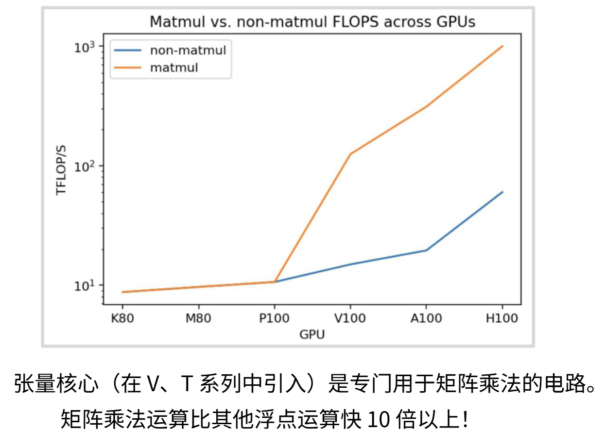

从上图可以看出GPU的世系从P100开始，蓝色的非矩阵运算和黄色的矩阵运算就开始分道扬镳，展现了巨大的差异，这主要原因是GPU厂商特意为矩阵运算优化的张量核心（tensor core）是专门用于矩阵乘法的电路。

### 4.2 计算与内存扩展不平衡

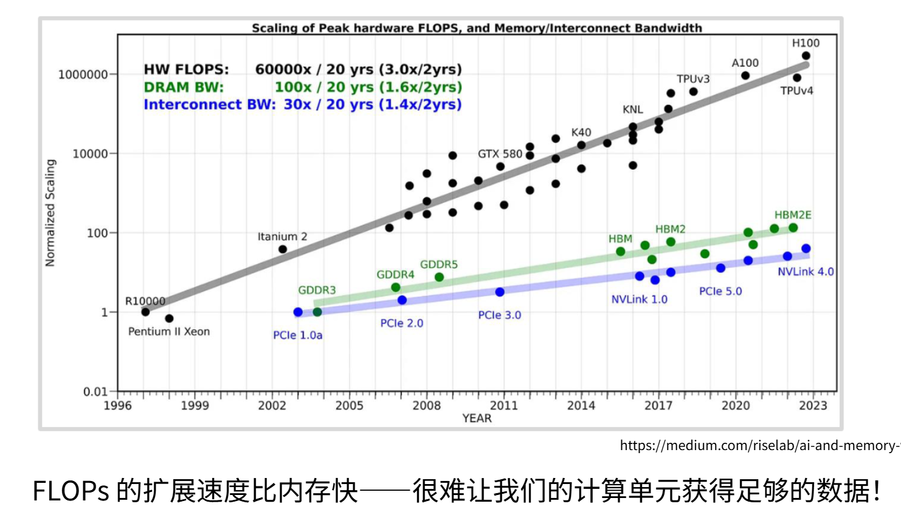

1980-2000年遵循**登纳德缩放定律**，即晶体管缩小，频率提升，功耗下降的趋势发展，但是**现状**是单线程性能**2000年后趋于平缓**，无法依靠频率提升。**现代扩展方式**是**并行扩展**（增加SM数量），从K20到H100，整数运算性能呈**超指数增长**（1-10万倍提升）。

但是其中的**核心矛盾**还没有解决---**内存扩展速度远低于计算扩展**。计算性能（灰线）是10万倍提升；内存带宽（绿线）大约100倍提升（GDDR-HBM2E）；互联带宽（蓝线）增长最缓慢。


这是一个屋顶线模型，横轴是**操作强度（Operational Intensity）**，表示计算与数据移动的比率。当操作强度高时，意味着计算设备在进行大量计算而数据移动相对较少；当操作强度低时，意味着数据移动占主导。纵轴是**吞吐量（Throughput）**，表示计算设备每秒可以完成的浮点运算次数。

不同颜色的线代表不同的内存结构：

1. **GPU registers（GPU寄存器，红线）**：提供最高的吞吐量，因为寄存器访问速度非常快，但容量有限。
2. **GPU shared memory（GPU共享内存，橙线）**：速度次之，适用于需要在多个线程间共享数据的场景。
3. **GPU main memory（GPU主内存，黄线）**：速度较慢，但容量更大，适用于存储大量数据。
4. **CPU main memory（CPU主内存，绿线）**：速度更慢，因为CPU内存访问速度通常低于GPU内存。

它们到达的屋顶（内存墙）

1. **GPU ALU throughput**：表示GPU的算术逻辑单元在理想情况下的最大吞吐量。
2. **CPU ALU throughput**：表示CPU的算术逻辑单元在理想情况下的最大吞吐量。

图表显示，随着**操作强度**的增加，不同内存层次的吞吐量也会增加，直到达到某个**上限**。这个上限是由**内存层次的带宽和延迟特性**决定的。例如，GPU寄存器由于其**高速访问特性**，可以在较低操作强度下达到高吞吐量，但**容量有限**。而CPU主内存由于访问速度较慢，即使在高操作强度下，吞吐量也相对较低。

现在就可以看到**未来趋势**，**内存墙问题将持续恶化**，算法设计必须**以内存为中心**进行设计，不能浪费一丝一毫宝贵的内存，并且我们必须理解GPU内存的内存结构变化，使得计算快速进行不浪费内存。

当我们考察吞吐量或利用率时，会发现存在两种状态，位于**曲线左侧的区域属于内存受限状态**，而右侧区域则属于**吞吐量受限状态**。从某种角度理解，右侧区域意味着计算单元完全满载运行，所有矩阵乘法单元时刻保持运算状态；而对角线区域则存在某种内存瓶颈，此时计算能力受限于计算强度（即每字节浮点运算次数）。因此我们需要避开左侧的内存受限区域，力求处于**右侧区域以实现计算单元的完全利用率**，总之关键在于避免不必要的内存访问，尽可能减少对低速全局内存的访问频次。

### 4.3 瓶颈的数学本质：推理踩在屋顶线左侧

屋顶线模型横轴是**操作强度（Ops/Byte）**，即“每读取1字节内存，能做多少次计算”。

**Prefill阶段**：处理的是大批量矩阵乘法（GEMM），操作强度极高（> 100 Ops/Byte）。它落在屋顶线**右侧的“计算受限”区域**，Tensor Core满载运行，瓶颈是算力。

**Decode阶段**：每次只生成1个token，本质是**矩阵-向量乘法（GEMV）**。读取整个模型权重（比如Llama 3 70B约140GB FP16），只做极少量的乘加运算。**操作强度极低（通常 < 1 Ops/Byte）**，导致它落在在屋顶线**左侧的“内存受限”区域**。

LLM推理（尤其是长文本）的硬件瓶颈，**不是GPU的算力（FLOPS）不够，而是显存带宽（HBM Bandwidth）严重不足**。

### 4.4 硬件层面的三个问题

从A100的物理结构看，带宽瓶颈在以下三个环节层层加码：

#### 4.4.1 权重加载的显存墙

**数据流**：模型权重存储在HBM（全局内存）中。每次生成一个token，SM必须将整个模型的权重（例如70B模型约140GB）从HBM经过**2048-bit显存总线**搬运到L2缓存，再喂给SM。

**物理限制**：A100的HBM带宽约为**2 TB/s**。理论上，读取140GB权重只需70ms。但加上SM计算时间，实际每秒只能生成约15-20个token（受限于`带宽/模型大小`的物理极限，即**内存带宽墙**）。你笔记中“内存扩展速度远低于计算扩展”在此处体现得淋漓尽致。

#### 4.4.2 KV Cache搬运的缓存抖动

**数据流**：当前Token的Q向量，需要和序列中所有历史Token的K向量做点积。这需要将**整个KV Cache**从HBM读入SM。

**硬件冲突**：KV Cache会挤占L2缓存（A100仅40MB）。当序列长度超过数千Token时，KV Cache远超L2容量，导致**L2 Cache频繁Miss**。数据不得不从慢速的HBM读取（~500周期），而你笔记中L1/L2的10倍速度优势在此失效，SM陷入漫长的**内存停滞（Memory Stall）**。

#### 4.4.3 Warp调度器的空转

结合之前学的SM调度，当Warp因等待HBM数据而停滞时，SM调度器会切换到其他Warp来隐藏延迟（延迟隐藏）。

**致命问题**：Decode阶段显存带宽已被权重和KV Cache占满，所有Warp都在等待同一个慢速HBM端口。此时SM内**没有新的就绪Warp可供切换**，调度器只能空转。你笔记中提到的“64个活跃Warp”无法发挥并行优势，因为**并行度被显存带宽锁死**，而非被计算单元锁死。

---

#### 4.4.4 硬件限制带来的不可能三角

基于上述物理瓶颈，GPU硬件给LLM推理设定了残酷的物理天花板：

| 硬件维度 | 对推理的限制 | 实例（A100 80GB） |
| :--| :--| :--|
| **显存容量（80GB）** | 决定能装下多大模型（限制参数量） | 70B FP16（约140GB）无法单卡加载，必须量化或拆分 |
| **显存带宽（2TB/s）** | **直接决定生成速度（限制吞吐量）** | 理论最大输出速度 ≈ `2TB/s ÷ 模型大小(GB)`。对于70B量化版（35GB），物理极限约 57 tokens/s，实际因KV Cache开销更低 |
| **L2/SRAM容量（40MB）** | 决定有效带宽（限制Batch Size和上下文长度） | Batch Size增大，权重重用率提升，但KV Cache暴增，L2迅速溢出，实际带宽急剧下降 |

---

#### 4.4.5 硬件视角的解决办法

既然瓶颈在“搬数据”，所有硬件级优化都围绕你笔记中提到的“以内存为中心”展开：

**对抗带宽不足——量化（压缩数据量）**：将FP16权重量化为INT4或FP8。这直接降低了横轴上的**字节数**，将操作强度（Ops/Byte）拉高，把模型从屋顶线左侧“拽”向右侧，让有限的HBM带宽能搬运更多参数。

**对抗L2抖动——FlashAttention / PagedAttention**：核心原理是利用SM内部的**共享内存** 作为高速缓存。将大矩阵切分成适配共享内存大小的“瓦片（Tiles）”，避免反复读写HBM。这在硬件上相当于“手动”管理L1缓存，将HBM访问次数从 `O(N^2)` 降为 `O(N)`。

**对抗调度停滞——Continuous Batching（连续批处理）**：当单个请求的Warp在等HBM数据时，硬件调度器立即插入另一个请求的Warp。只要Batch Size足够大，就能让HBM总线始终处于满载传输状态，**用带宽利用率换取计算利用率**。

---

从GPU硬件图来看，LLM推理的瓶颈不在黄色的矩阵运算单元（Tensor Core），而在连接芯片与HBM的**绿色内存总线**上。推理引擎的终极优化目标，就是**让昂贵的HBM带宽每字节都物尽其用，让SM的Tensor Core不必干等**。你笔记中“避免不必要的内存访问”正是CUDA编程和推理框架最核心的KPI。

## 五、优化 GPU 使用策略与实践

### 5.1  架构上的优化-TPU架构（Tensor Processing Unit）

**TPU**是Google自2015年起自主研发的ASIC芯片（专用集成电路），专为神经网络计算而生。如果说GPU是"图形计算王者转职AI"，那TPU就是"生来只为AI"的纯粹战士。TPU从电路设计第一天起，只干一件事：那就是加速张量（Tensor）运算。

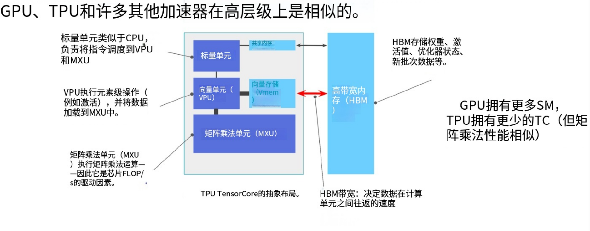

#### TPU与GPU的相似性

TPU内部具有**张量核心（Tensor Core）**，对应GPU的SM，是独立原子单元；TPU的**内部结构**包含标量单元（控制逻辑，类似CPU）、矢量单元（逐项向量运算）、**MXU（矩阵乘法单元）**：占芯片最大面积，专用于矩阵乘、矢量内存 + SM内存（片上高速存储）、 HBM（芯片外高带宽内存）。

TPU和GPU的**本质区别**是TPU**仅优化矩阵乘法**，不尝试执行通用计算，架构更简洁。TPU没有warp，只有块，只是矩阵乘法和非矩阵乘法的平衡。

**所谓的张量核心（tensorcore），可以将其类比为SM（流式多处理器**）。每个张量核心都是能处理数据的**独立原子单元**。它包含**标量单元（本质是控制单元）**，也能执行类似**CPU的任意操作**；还有能处理向量的**矢量单元**，适合进行逐项向量运算；芯片最大部分是专门用于矩阵乘法的**硬件模块MXU**；同时配备极快的矢量内存和SM内存（这些都是芯片内部/张量核心内存）。

此外还有位于芯片外部的**高带宽内存**。它与SM的相似之在于都是外部慢速内存，内部高速内存；以及专门的矩阵乘法硬件。核心结构高度一致，区别在于加速器互联方式。张量核心在某些方面非常简单，因为它们专为矩阵乘法优化。与GPU不同，**张量核心除了矩阵运算不尝试执行其他任务，因此架构上更为简洁**，但概念上是相通的。

张量核心之所以被称为张量处理器，**是因为它能处理任意维度的张量**。它确实能操作任意张量，它可以进行索引操作。MXU执行的核心运算是矩阵乘法，因此它始终像是针对张量进行批量矩阵乘法的操作。它能处理张量，但实际执行的始终是矩阵乘法，而非更复杂的张量运算。

GPU之所以如此成功，关键在于其卓越的**可扩展性**。只需增加**流式多处理器数量就能提升算力**，无需担忧提高时钟频率带来的散热问题。编程方面，CUDA看似复杂，但由于其编程模型设计，实际并没有那么可怕，因为每个流式多处理器内线程会对不同数据**执行相同指令**，这种概念易于理解。特别是在处理矩阵简单运算时，这种简洁模型优势尽显。此外，这些线程都非常轻量级，可随时暂停或启动，这使得GPU能在每个流式多处理器内实现极高的利用率。

### 5.2 使用策略上的优化

#### 5.2.1 避免串行执行

下面是一个简单的**分支预测**

```c
// 代码示例
if (x < 4) {
    A; // x < 4 执行>
    B;
} else {
    X;  // x > 4 执行
    Y;
}
Z; // 无论X等于多少执行
```

GPU采用SIMT（单指令多线程）执行架构，**同一线程束（Warp）内的所有线程必须同步执行相同指令**（仅操作数据不同）。现代GPU中，一个Warp通常包含32个线程（NVIDIA）或64个线程（AMD）。

当Warp内的线程遇到条件分支时，若部分线程满足`x < 4`走`if`路径，另一部分满足`x >= 4`走`else`路径，便发生了**分支发散（Branch Divergence）**。此时GPU采用**掩码屏蔽机制**串行化处理：先执行`if`分支，走`else`路径的线程被临时屏蔽；待`if`完成后，再执行`else`分支，此时`if`线程被屏蔽。**两条路径的指令都会被执行**，只是各自只有部分线程生效。这导致该Warp的执行时间近似等于两条路径耗时之和，**计算资源利用率下降**。

因此，核心优化原则是：**避免同一线程束内的线程发散**，要尽量避免条件分支。若一个Warp内所有线程都走同一路径（如线程`x`均小于4），则分支开销几乎为零。此外，发散不仅延长执行时间，还可能破坏内存访问的合并性，进一步降低带宽效率。

#### 5.2.2 低精度可以提升性能

**精度提升GPU速度**的本质是用**精度**换取更快的**计算**和"省得多"的**带宽**。这背后是硬件电路简化、存储数据量减少、专用加速单元三重优化叠加。最明显的是计算数据和权重等所有元素的比特数减少时，需要移动的比特量就会大幅降低。即便从全局内存访问这些比特，其影响也会变得微乎其微。

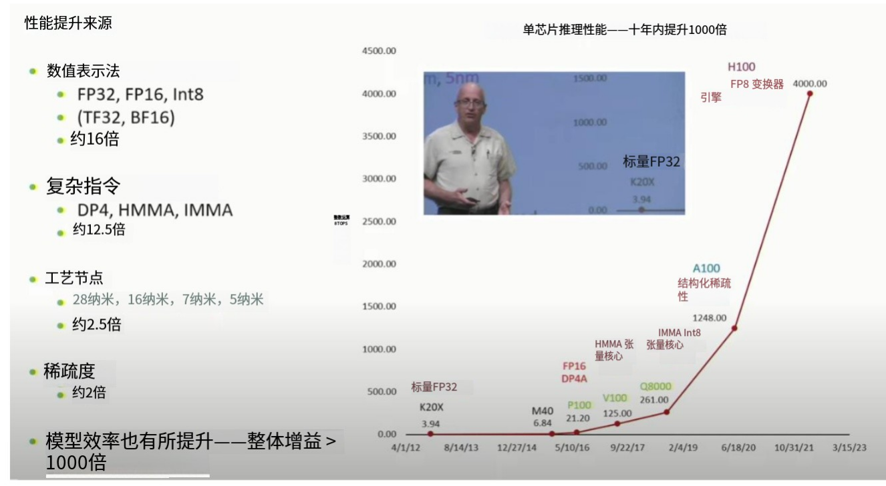

##### 一、常见的低精度格式

| 精度类型 | 位数 | 表示范围 | 典型场景 | 速度提升 |
|----------|------|----------|----------|----------|
| **FP32** | 32位 | 3.4×10³⁸ | 传统训练，精度敏感 | 基准 |
| **FP16** | 16位 | 6.5×10⁴ | 通用训练/推理 | **2-4倍** |
| **BF16** | 16位 | 3.8×10³⁸ | AI训练首选 | **2-4倍** |
| **TF32** | 19位 | 3.4×10³⁸ | A100+默认格式 | **5-10倍** |
| **INT8** | 8位 | 2⁸ ≈ 256 | 量化推理 | **8-16倍** |
| **INT4** | 4位 | 2⁴ = 16 | 极致推理 | **16-32倍** |
| **FP8** | 8位 | 动态范围 | Hopper/Blackwell | **10-20倍** |

---

##### 二、 低精度提速机制一：硬件因素

我们知道浮点运算器的复杂度与位宽平方成正比。也就是位数越大的浮点运算器的体积和复杂程度越大。FP16的乘法器晶体管数量仅为FP32的**1/4**。代表着能在同样面积里放更多低精度的浮点运算器。而更多的计算单元意味着计算能力更强。

FP16数据只占FP32一半的寄存器空间，同样256KB寄存器文件可存**两倍数据**，同时16位数据总线带宽需求减半，同样带宽可传**两倍数据**，并且FP16乘法器延迟更低，频率可更高。

##### 三、低精度提速机制二：内存带宽节省（数据量减少50%）

我们知道低精度下，同样参数量的模型文件，低精度下的占用的内存就是会比高精度下的低。比如**GPT-3 175B**参数，FP32 = **700GB**；BF16 = **350GB**；**激活值**，每层激活缓存，FP32 = 16GB；FP16 = **8GB**；**梯度**，反向传播梯度，FP32 = 16GB；FP16 = **8GB**。可以看出低精度下训练占用的内存会比高精度下的低得多。

我们可以进行简单的**带宽计算**，假设HBM2e带宽2TB/s，那么**FP32**下每秒传输500亿个参数；**BF16**下每秒传输**1000亿个参数**（翻倍）。

所以低精度下加载权重时间**成倍减小**；缓存命中率提升（同样缓存容量，存的数据更多），显存可容纳更大模型（350GB的LLaMA-65B在80GB显存上用BF16可跑）。

##### 低精度提速机制三：Tensor Core专用加速

Tensor Core是NVIDIA为低精度矩阵乘设计的**专用电路**，它不是缩小版FP32，而是**重构版矩阵引擎**。

**Ampere架构Tensor Core性能**：

| 精度 | 峰值算力 | 相对FP32 CUDA核心 |
|------|----------|-------------------|
| FP32 | 19.5 TFLOPS | 1× (基准) |
| TF32 | 156 TFLOPS | **8×** |
| FP16 | 312 TFLOPS | **16×** |
| BF16 | 312 TFLOPS | **16×** |
| INT8 | 624 TOPS | **32×** |

加速的原理：

**脉动阵列（Systolic Array）**：数据在阵列中流动，每个周期每个单元完成1次乘加，32×32阵列每周期完成1024次运算
**权重静止**：矩阵权重预加载到阵列寄存器，减少数据搬运
**累加器优化**：FP32累加器保证精度，输入输出用低精度

#### 提速机制四：并行度提升（同样芯片面积，计算单元翻倍）

**芯片面积优化**，之前提到过精度越高的运算单元复杂度越大，**1个FP32 CUDA核心**面积约0.1 mm²；**1个FP16 CUDA核心**面积约0.05 mm²（节省50%）；**1个INT8 CUDA核心**面积约0.025 mm²（节省75%）。

同时还有独特的**架构设计**，A100的SM中，Tensor Core复用寄存器文件，**FP32模式**64个CUDA核心活跃，每周期64次FMA；**FP16模式**：64个CUDA核心 + **4个Tensor Core活跃**，每周期64次FMA + **1024次矩阵运算**。

同样芯片面积，低精度可集成**4倍计算单元**，实现**4倍吞吐量**。

---

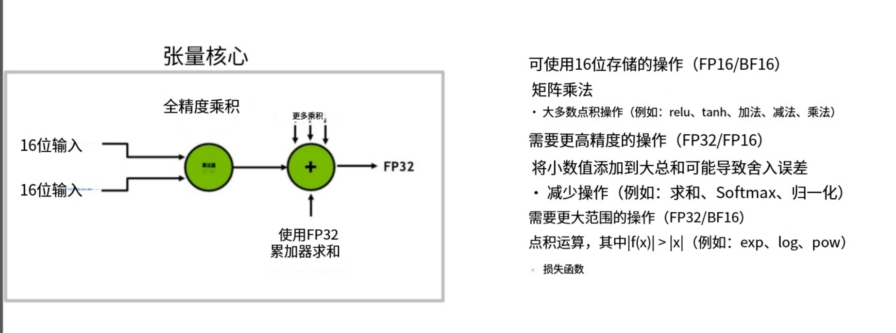

关键在于并非所有网络组件和训练算法**都适合低精度处理**。以矩阵乘法为例，混合精度矩阵乘法通常将输入设为16位低精度，但乘法运算会保持**全32位精度**。这是因为在**累加部分和**时，**中间计算需要高精度保障**，因此采用FP32累加器。张量核心最终输出FP32结果，可按需降回16位。由此可见输入数据可采用16位存储，但累加等操作需32位精度；某些运算（如指数函数）需要更大动态范围，可能适合bf16格式。要确保低精度训练时模型稳定性，需要大量精细的工程优化。但若能实现，当内存成为瓶颈时，从32位转为16位可直接使吞吐量翻倍。

#### 5.2.3 算子融合（Operator Fusion）

算子融合通过**消除中间结果内存读写和减少Kernel启动开销**，实现2-5倍速度提升。


我们可以将**GPU计算单元**视为工厂，输入方形部件输出三角部件。**若计算能力增强但内存传输带宽有限**（好比传送带容量固定），新增的工厂设备将无法充分利用，整体性能仍受限于**内存到计算的传输速率**。

想象左边这张图的左侧是**内存区域**，右侧是**计算单元**。进行运算时，我们从一个方形数据开始，把方形数据从内存搬运到计算单元，执行某些操作后将其转为三角形，再把三角形移回内存。接着发现又需要这些三角形数据，于是重新将它们送入计算单元，三角形变成圆形，如此循环往复。数据在计算单元和内存之间来回传输，如果在GPU上直接进行简单运算，并立即将结果写回全局内存，最终就会形成这种模式。如果统计单块数据的往返次数，这种方式的**效率极其低下，会产生巨大的内存开销**。

现在观察**右侧**的计算流程：我们发现这些运算之间不存在**依赖关系**,所以将方形直接转为三角形再转为圆形，最后变成矩形再传回**内存**。我们让所有数据始终驻留在计算单元内。

这其实就是**融合核函数**的思维模型，当一系列运算需要按顺序处理同一数据时，与其每次都将中间结果写回存储，不如尽可能在单个计算单元完成所有操作，直到**必须传回内存时才进行传输**。这就是**核融合的核心思想**。


假设我们编写了一个神经网络模块，输入 $x$ 后同时输出 $\sin^2 x$ 和 $\cos^2 x$ 。代码很简单，但在PyTorch中运行时会生成这样的计算图：首先载入$x$，启动CUDA核函数计算$\sin x$，再启动另一个计算 $\cos x$ ，接着计算 $\sin^2 x$ 和 $\cos^2 x$ ，最后计算 $\sin^2 x + \cos^2 x$ 。为了完成这些运算，数据需要在内存和计算单元间反复传输，这正是上图展示的左侧低效模式。

但是我们发现这五个运算其实没有复杂依赖，仅需**少量内存**，完全可以将它们**融合成单个运算**，在GPU单线程上完成所有处理，无需将**数据写回全局内存**。

**本质**上算子融合是将多个连续操作**合并为单个CUDA核函数**，避免中间结果写回全局内存，


#### 5.2.4 重计算（Recomputation）

**重计算的核心思想是通过增加计算量来避免内存访问。**

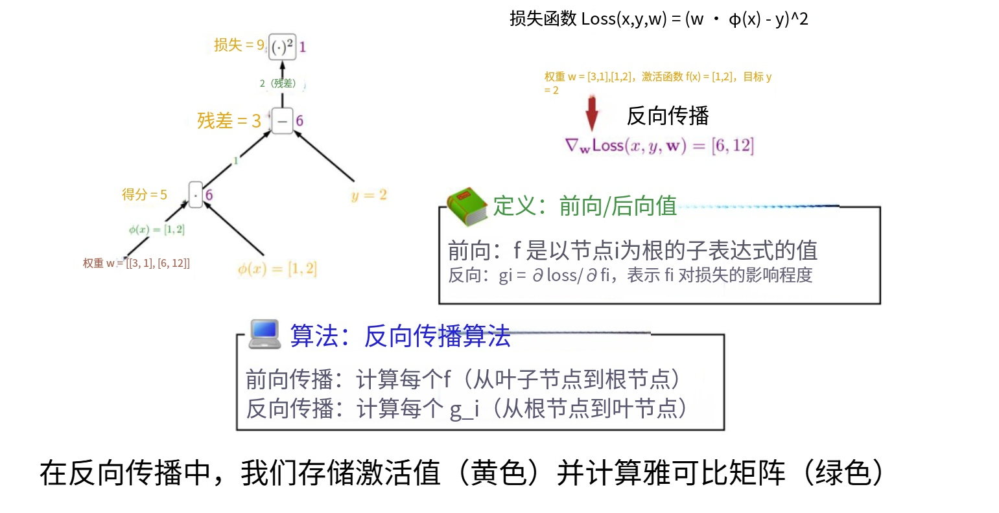

我们获取最底层的输入数据（黄色节点），然后我们向上传播激活值。这些也是树上的黄色数值。接着我们反向计算雅可比矩阵。这些是边上的绿色数值。为了计算梯度，我将进行反向传播，需要进行乘法运算。我们会将雅可比矩阵和激活值结合，反向传播梯度。仔细想想，前向传播后的那些黄色数值必须被存储起来。它们被存储后，需要从我们存放的全局内存中提取，并送入计算单元。

从机制上来说，这个过程是必然发生的。但这可能会导致海量的内存输入输出操作。但是能够避免这种情况。

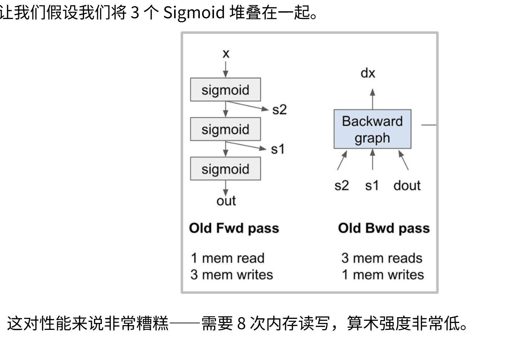

假如我们将三个 $sigmoid$ 函数层层堆叠。这是**前向计算图**。计算 $sigmoid$ 函数，并存储S1和S2这两个 $sigmoid$ 的激活值，最终得到输出结果，这就是我们的**前向传播过程**。但**反向传播过程**就显得有些棘手。当构建反向计算图时，我们需要调用**S1和S2**，接收从**输出端反传的梯度**，然后将其推入这个反向计算过程，最终得到 $x$ 的梯度。为了完成反向传播，需要执行**三次内存读取和一次内存写入**。而在前向传播中，需要读取一次 $x$ ，并对S1、S2和输出结果进行三次内存写入。它涉及相当数量的**内存读写操作**，总共需要**执行八次**。

**而重计算的核心思想就是**：不存储那些激活值也不会将它们放入内存，而是在反向传播过程中**动态重新计算**。在新的前向传播过程中，**不存储S1和S2**：输入 $x$，计算 $sigmoid$ 函数，直接获得输出。现在只需要一次 $x$ 的内存读取（即输入）和一次输出的内存写入。在反向传播时，由于没有现成的激活值，我们将同时获取来自上层的反向信号 $D_{out}$ 和输入 $x$ 进行计算，这需要两次内存读取。**然后在流处理器本地内存中动态计算每个 $sigmoid$ 函数，将其融入反向计算图**。

总的来说，这次的重计算不储存s1 和 s2，在反向传播中重新计算。这是**计算的时间成本和内存的写入和读取的内存和时间成本的考量**，**重计算适用于计算成本比读写成本小的场景**。

通过在本地内存中实时重算S1、S2和输出值，避免了**全局内存读取操作**，最后只需一次dx的内存写入。在完成相同计算的前提下，现在只需要5/8的内存访问量。付出的代价是**必须重新计算这三个sigmoid函数**。但如果**计算单元原本就因为内存瓶颈而处于闲置状态**，这就非常合算，用**过剩的计算能力换取紧缺的内存带宽**。

#### 5.2.5 内存合并（Memory Coalescing）

GPU中的**慢速内存**（即全局内存/DRAM）实际上极其缓慢。为了**提升速度，硬件层面会进行特定优化**。

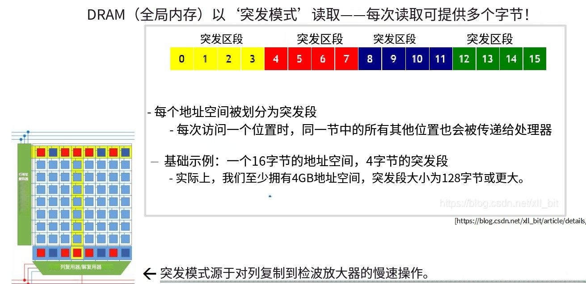

其中一项DRAM硬件优化是：当读取某个内存值时，实际获得的**不仅是目标值，而是整块内存数据**，**被称为突发模式**。假设读取大内存块的第一个值，内存不仅会返回0，还**会同时返回0123这四个值**。

每个地址空间都被划分为突发段，系统会直接返回整个突发段而非仅目标数据。当寻址内存时，数据传输到放大器是最耗时的步骤。而突发段作用是**一旦完成这个步骤，就能免费获取大量字节数据**。突发段设计正是为了优化耗时的数据迁移过程。**如果内存访问模式得当，就能显著加速内存访问**。比如要读取整个数据块，若采用随机访问，需要执行与查询长度相当的次数；但若先读取首值，就能立即获取整个突发段；接着读取第4个值，又能立即获得第二个突发段。**通过精心设计内存访问策略，仅从每个突发段提取所需数据，理论上可实现四倍吞吐量**，这就是内存合并技术。

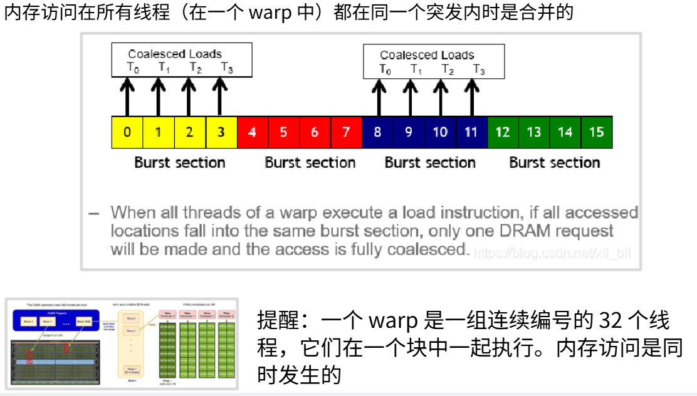

当线程束中的**所有线程都位于同一突发段**时，智能硬件和编程模型会将这些查询聚合**不再分别查询0123**，而是通过单次查询0即可从突发模式DRAM中同时读取所有四个值。**注意线程束包含32个有序线程**，这些线程的内存访问是同步进行的。通过优化可以一次性获取全部4字节数据，使**内存吞吐量提升四倍**。

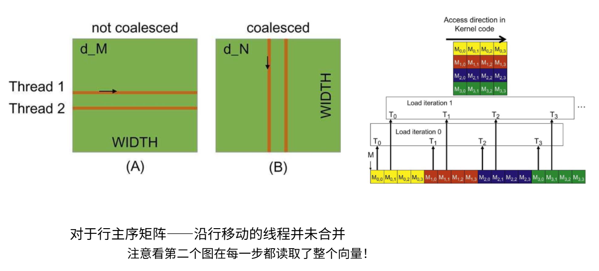

以矩阵乘法为例，假设有两种矩阵读取方式：按行遍历（每个线程处理一行）或按列遍历（每个线程处理一列）。实际上**左侧按列遍历的模式会非常缓慢**，因为**内存访问无法合并**；而右侧按行遍历时，线程内存访问地址连续，可以**实现内存合并**。

右侧是一个矩阵和矩阵在内存中的位置,以矩阵乘法为例，假设矩阵采用 row-major 方式存储。考虑两种线程访问模式：

**1）每个线程负责矩阵的一整行**；
**2）每个线程负责矩阵的一整列**。

当每个线程处理一行时，同一个 warp 内的线程会访问彼此相距较远的内存地址，这种访问模式无法实现内存合并（coalescing），因此内存带宽利用率很低，性能较差。相反，**当每个线程处理一列、并且在同一时间步访问同一行的不同列元素时**，warp 内线程访问的是连续的内存地址，可以实现完全的内存合并，从而显著提升访问效率。

从内存布局角度看，如果一组线程从左向右访问矩阵中同一行的连续元素，那么这些访问都落在同一个或相邻的内存块段中，只需一次或少量内存事务即可完成数据加载。**但如果线程访问的地址分散在多个不连续的内存块段中，则每个访问都可能触发独立的内存事务，导致实际内存访问速度远低于理论带宽。**

这种内存访问顺序的差异属于非常底层的优化细节，但在 GPU 程序中却至关重要；一旦遍历顺序设计不当，性能往往会出现数量级的下降。

#### 5.2.6 分块（瓦片）（Tiling）

**分块的核心思想是通过分组内存访问来减少全局内存的访问量**。

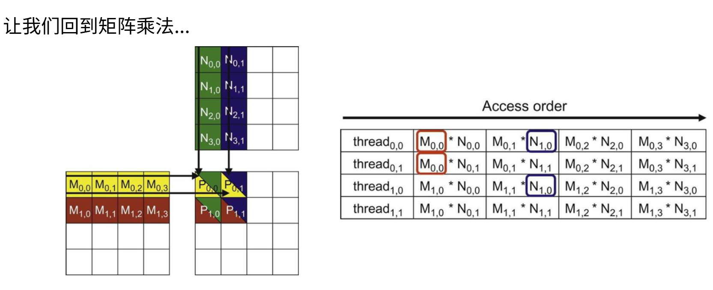

通过矩阵乘法的例子来解释，**原始的矩阵乘法算法严重问题**，从这个简单的矩阵乘法算法开始：左侧是 $M$ 矩阵，上方是 $N$ 矩阵。计算矩阵乘积时需要遍历 $M$ 的行和 $N$ 的列，进行内积运算后结果存入 $P$ 矩阵。这里标出了**每个线程对应的输出存储位置及其元素访问顺序**。

**这里的内存访问是非合并的**,行矩阵的**访问顺序是不连续**，且存在**重复**的内存访问。例如 $M_{0,0}$ 被首个线程访问后又被其他线程访问， $N_{1,0}$ 也在不同线程中被重复读取。这些值会从全局内存被多个线程反复读取，可能导致严重性能下降。可以从右侧的表格中看出。

问题在于能否避免过多的全局内存读写，理想方案是用一段时间将数据块从全局内存加载到高速的共享内存，在共享内存中完成大量计算，最后再处理下一数据块。这样能最小化全局内存访问。

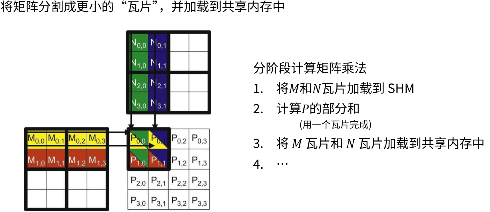

在矩阵乘法中我们将 $M$ 和 $N$ **矩阵划分成多个分块**（例如**2x2的子矩阵**），首先加载左上角的 $M_{0,0}$ 分块和 $N_{0,0}$ 分块到**共享内存**（都是2*2的小矩阵），这样就能计算部分求和结果。当处理完这两个数据块后就可以在这里加载**新的数据块**，然后利用已加载到共享内存中的 $M_{0,2}$ 块和 $N_{2,0}$ 块重复计算过程，再将部分和累加到 $P$ 中。通过有效整合并减少了全局内存访问量,一次性将尽可能多的数据加载到共享内存，在单个数据块上执行所有子矩阵运算，然后再处理下一个数据块。

另一个优势是由于加载的是**完整数据块**，我们可以**按任意顺序（例如列优先或行优先）遍历这些子矩阵**，从而在从全局内存加载数据块到共享内存时实现**内存访问的合并**。采用分块访问策略能带来全方位的性能提升。

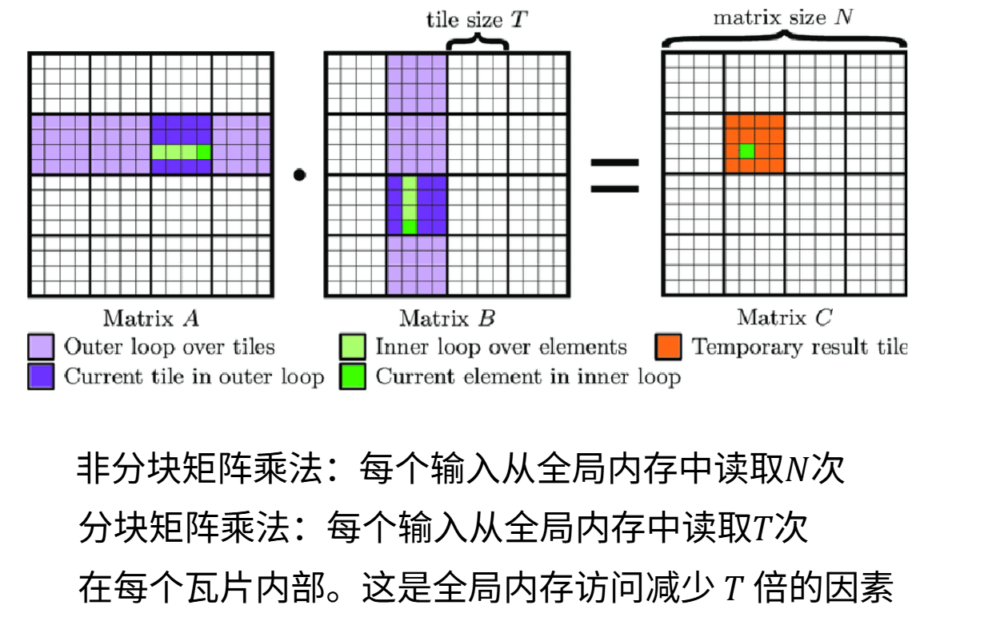

现在我们可以进行分块计算的数学分析。假设有矩阵 $A$ 、 $B$ 和 $C$，这三个 $N×N$ 的方阵，数据块尺寸为 $T$ 。对于N×N矩阵乘法，若采用非分块方式逐行逐列计算，每个输入元素每次处理时都需要从**全局内存读取**，即每个元素会被读取 $N$ 次。而采用分块计算时，全局内存读取以**数据块**为单位进行，每个输入元素从全局内存读取次数降为 $N/T$ 次，同时在每个数据块内部进行 $T$ 次读取。虽**然矩阵乘法运算的总读取次数无法减少，但通过将读取操作转移到高速共享内存，我们实现了 $T$ 次共享内存读取与 $N/T$ 次全局内存读取的配合。当共享内存能存储较大数据块时，这将使全局内存数据读取量减少 $T$ 倍**。

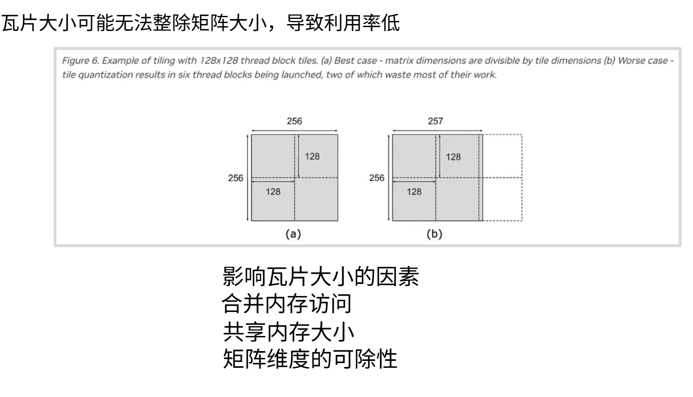

分块策略非常复杂，这是导致GPU和矩阵乘法性能表现令人困惑的根源之一。假设采用128这个规整的分块尺寸，当处理256尺寸的完整矩阵时效果很好，一个2x2的分块数据加载很顺畅。假设在列方向使用257大小的分块，那么需要**六个分块才能覆盖这个矩阵，而右侧的两个分块里面没有数据**。问题在于每个分块都会被分配给一个**流多处理器（SM）**，每个分块对应一个线程块，**线程会在各自分块（Tiling）内执行运算**。所以右侧那两个分块几乎不会执行什么计算，对应的SM基本上会处于闲置状态。

如果遇到计算瓶颈，我们希望更均衡地在SM之间分配负载，因此必须**优化分块尺寸**来避免这类情况。但是确定分块尺寸涉及很多复杂因素。必须实现内存访问的合并不能超过共享内存容量，所以分块不能太大；还要对矩阵维度进行划分，最好能均匀或接近均匀地分割，避免出现这种SM利用率极低的情况。

另一个非常深入细节的复杂问题是**分块划分与突发传输区段**的交互。假设矩阵布局很规整，每个**突发传输区段**都能与分块完美对齐。读取这个分块只需要获取**四个不同的突发传输区段，就能载入整个分块**。但如果在末尾增加一个元素，矩阵布局就会导致**突发传输区段错位**。

比如上图，加载分块时，第一行还能作为一个完整的突发传输区段载入，但第二行就分散在两个不同的突发传输区段里，需要**两次读取**才能获取，依此类推。仅仅因为**末尾多了一个元素**，就导致内存访问量翻倍——这是突发传输区段与对齐布局发生偏移造成的。本质上，如果分块或**矩阵尺寸不是突发传输区段的整数倍**，就容易出现这种行与突发传输区段不对齐的情况，导致内存访问量**翻倍**。解决方法是通过**填充**（padding）使矩阵尺寸变得规整，让突发传输区段与分块尺寸重新对齐。虽然这些内容非常底层，但要想充分压榨矩阵乘法的性能，就必须考虑这些细节。如果忽略这些，实际运行时就可能遭遇性能陷阱。

---

### 5.3 Flash Attention


#### H100对FP8的低精度支持和混合精度

H100的第四代Tensor Core在**FP8精度下的理论吞吐量是FP16的两倍**（例如H100 SXM的FP8峰值约为1979 TFLOPS，而FP16为989TFLOPS）。V3原生支持FP8输入，但在注意力计算中必须解决 **数值稳定性** 问题，因为 softmax 对精度敏感。

因此 V3 采用**混合精度策略**就可以提升性能：

矩阵乘法 $QK^T$ 使用FP8执行，充分利用Tensor Core的高吞吐，**累加器** 保持FP 16或BF 16精度，避免FP8累加时的精度损失。**Softmax 计算**提升到FP32进行，保证指数运算的数值稳定性（softmax 中的指数和除法极易在低精度下溢出）。同时输出 $PV$ 可选择性转换为FP8，以适应后续层。

此外，V3 实现了 **动态缩放因子** 管理。由于 FP8 的表示范围有限（E4M3 约 -448 到 448，E5M2 约 -57344 到 57344），在计算 $QK^T$ 前需要根据输入范围确定缩放因子，防止溢出。V3 按块（tile）动态计算缩放因子，并在流水线中传递，确保 FP8 计算的精度与 FP16 相当。

#### 块布局与寄存器优化

H100 的每个 SM 拥有 256KB 共享内存（比 A100 的 192KB 更大），且寄存器文件也更为充裕。V3 重新调整了分块大小 $B_r$（ $Q$ 块行数）和 $B_c$（ $K, V$ 块行数），使其更好地适配 H100 的 WGMMA 指令粒度（WGMMA 要求矩阵维度为 64 的倍数）以及共享内存容量。典型配置下（序列长度 8192，头维度 128），$B_r$ 设为 128， $B_c$ 设为 64，使得每个 warpgroup 负责的矩阵乘法恰好与共享内存的 bank 对齐。

更重要的是，V3 对寄存器使用进行了精细控制，**避免寄存器溢出**（register spilling）到本地内存（L1缓存）。通过将中间统计量（ $m_i, l_i, O_i$ 的部分累加）尽量驻留在寄存器中，V3减少了不必要的内存访问，进一步提升了流水线效率。

**性能表现上计算效率和速度、长序列能力都有提升**

- **计算效率**：在 H100 SXM 上，使用 FP8 时，V3 的 TFLOPS 利用率可达 **75%~80%**，接近理论峰值。这意味着注意力计算几乎不再受内存带宽限制，而是完全由计算能力驱动。
- **速度提升**：相比 V2 在 H100 上的 FP16 实现，V3 的 FP8 版本速度提升约 **1.5~2 倍**；即使在相同 FP16 精度下，V3 的异步优化也能带来约 **1.3 倍** 的加速。
- **长序列能力**：在 128k 甚至 1M 长度的序列上，V3 仍能保持极高的吞吐，使得超长上下文模型的训练和推理成本大幅降低。单卡 H100 80GB 可稳定训练 256k 长度的模型。

FlashAttention V3是算法与硬件深度协同设计的典范。它通过**异步WGMMA流水线**解耦了数据加载与计算，利用**FP8混合精度**释放了H100的低精度算力，并通过精细的**块布局与寄存器优化**消除了内存瓶颈。这一系列改进使得注意力计算不再是Transformer长上下文扩展的阻碍，而是成为能够充分利用硬件极限的“高性能组件”。V3的诞生，直接支撑了当前工业界100k~1M上下文窗口的大语言模型的工程实现。


>总结，对于FlashAttention的发展：
>- V1 解决的是IO瓶颈；
>- V2 解决的是并行调度与GPU利用率问题；
>- V3 解决的是计算与访存重叠（SM工作效率）问题。
>
>一句话概括也就是，从“减少内存带宽瓶颈” → “提升并行调度与GPU利用率” → “实现计算与访存重叠，让SM始终忙碌”。


---

### 5.4 PagedAttention

<div align="center">

   <p>图6.26 传统KV Cache分布</p>
 </div>
 
**在传统的KV Cache管理方式中，通常为每个请求序列预先分配一段逻辑上连续的缓存空间，用于存储其历史生成的Key/Value状态**。然而，由于实际生成长度难以精确预测，这种静态预分配策略会带来显存利用率问题。当预留空间大于实际生成长度时，会产生`内部碎片`（internal fragmentation），即已分配但未被使用的显存空间；同时，由于不同请求的生命周期不一致，释放时间存在差异，显存中可能形成多个零散的空闲块，这个时候尽管总空闲容量充足，但由于无法提供足够大的连续缓存块来满足新序列的分配需求，从而产生`外部碎片`（external fragmentation）。

<div align="center">

   <p>图6.27 显存占用分析</p>
 </div>

上述碎片问题会显著降低GPU高带宽显存（HBM）的整体利用效率。为**从系统层面缓解这问刚才提到的问题**，根据操作系统分页机制（paging），PagedAttention将KV Cache拆分为固定大小的页面（pages），并通过页表进行间接地址映射，使逻辑连续的KV存储不再依赖物理连续内存，从而有效减少碎片并提升显存利用率。

### 5.5 PagedAttention 原理分析

在标准的自回归（AR）推理过程中，**每个新生成的 token 都会产生对应的 K 和 V，并按时间顺序追加至 KV cache**。逻辑顺序严格对应时间顺序，而物理存储顺序则取决于具体的实现策略。为了**保证高效的 GPU 访问与 CUDA kernel 的访存模式（如 memory coalescing）**，传统实现通常将 KV cache 组织为连续内存张量，并依据预设的最大序列长度上界进行显存预分配。然而，**由于不同请求的实际生成长度存在显著差异，且 GPU 显存分配器难以支持低代价的动态扩容与内存重排**，这种基于最大长度的连续预分配策略容易产生内部碎片与外部碎片。

不妨通过一个例子来说明标准 AR 中连续物理内存带来的问题。假设每次请求都按最大长度 2048 个 token 预留连续的 KV cache 物理空间：

$$
[ K_1 | K_2 | K_3 | ... | K_{2048} ]
$$

如果同时存在多个长度各异的请求，比如请求 A 实际生成 128 个 token，请求 B 生成 1024 个 token，请求 C 生成 300 个 token：

```
请求A：128 token
请求B：1024 token
请求C：300 token
```

那么问题就显现出来了。**内部碎片**体现在：每个请求都提前占用了 2048 长度的连续物理空间，但实际使用量远小于此，造成大量剩余空间被浪费（例如请求 C 浪费了 1700 多个 token 的容量）。**外部碎片**则表现为：显存中散落着许多小块空闲空间，却**没有一整块连续区域能够被利用**，这在 GPU 上尤为严重，导致碎片化的空闲内存无法再分配给新的请求。

vLLM 提出的 **PagedAttention** 正是为了解决上述问题——它将“静态连续存储”转变为“动态分页管理”。 **核心思路是将 KV cache 切分为固定大小的块（Page）** ，例如每个 Page 包含 16 个 token 的 KV 存储。通过一个页表（Block Table），PagedAttention **将逻辑上连续的 token 对应的 KV 映射到物理上未必连续的存储块中，从而最大化利用显存空间**。例如，三个逻辑连续的 token 段（1–16、17–32、33–48）可以通过页表分别映射到物理地址的 Block7、Block2 和 Block19，物理上不必相邻。

**为什么这样就不需要连续的物理空间呢**？因为在 Attention 计算时，系统会依据页表逐块读取 KV：**每处理一个 block，先查页表找到对应的物理 block，再执行读取操作**。只要页表维护了正确的映射关系，即使物理地址不连续，读取的顺序逻辑依然是正确的。整个流程可以简化为：

```
for each block:
    查页表
    找到对应物理 block
    读取
```

更重要的是，这个内存分配过程是**按需动态进行**的——随着请求实际生成的 token 数量增长，逐步为其分配新的 page，而非预先圈定一整块空间。

PagedAttention 将显存管理从**以请求为单位的静态圈地转变为以 token 为单位的动态确权**。通过物理地址的非连续映射，它彻底解决了标准 AR 中因预留最大长度而导致的严重内部碎片问题。仍以 300 tokens 的请求为例，每个 Page = 16 tokens 时：

- 所需 Page 数量为 \(300 / 16 = 18.75\)，向上取整需要 **19 个 Page**。
- 实际分配的物理空间为 \(19 \times 16 = 304\) 个 token 容量。
- 浪费仅为 \(304 - 300 = 4\) 个 token。

相比之下，标准 AR 预留 2048 长度会浪费 \(2048 - 300 = 1748\) 个 token。vLLM 将显存浪费从 1700+ token 降至个位数，使同一块 GPU 上的并发能力（throughput）获得了数量级的提升。

用一个简单的用餐类比可以帮助理解：**标准 AR 像是“按次收费的满汉全席”**，不管吃多少，都必须按 2048 道菜的规模占位，吃 300 道就走，剩下 1748 道只能倒掉（显存被强占且无法复用）。而 **PagedAttention 则是“按需取餐的自助餐”**，每 16 个 token 是一盘菜，吃完一盘再取下一盘，空出来的餐盘可以立即让给其他用餐者（显存可动态回收复用）。

因此，传统 AR 的浪费规模为 \(O(\text{max\_seq\_len})\)，而 PagedAttention 的浪费仅控制在 \(O(\text{page\_size})\) 级别，显存利用率与并发能力由此得到显著提升。

总结来看，PagedAttention 的工作原理可以概括为：

```
虚拟地址 -> 页表 -> 物理地址
```

在 vLLM 的源码层面，其映射逻辑可以表达为：

```
请求 ID + Token 偏移量 -> 逻辑块索引 -> Block Table 检索 -> 物理内存基址 -> 偏移读取
```

### 5.6 FlashAttention 与 PagedAttention 的对比

尽管 PagedAttention 与 FlashAttention 在表面上都致力于提升大模型的推理性能，但二者的优化维度有着本质上的不同。

**FlashAttention 主要聚焦于单次前向计算中的 IO 复杂度**，属于算子级的微观优化。它通过分块计算（tiling）与在线 Softmax（log-sum-exp streaming）技术，避免了显式构建完整的 \(QK^T\) 中间矩阵，从而显著减少 HBM 与 SRAM 之间的数据往返次数，降低内存带宽压力与访问延迟。简单来说，FlashAttention 解决的是 **“算得更快”** 的问题。

**PagedAttention 则着眼于整个生成生命周期中的显存管理效率**，属于系统级的宏观设计。它并不改变 Attention 的数学计算公式，而是将 KV Cache 组织为固定大小的物理块（page），并通过逻辑 block table 实现逻辑顺序与物理顺序的解耦。这种分页结构有效缓解了显存碎片问题，支持动态批处理与长上下文推理，从而提升显存利用率与并发吞吐能力。PagedAttention 解决的是 **“存得更高效”** 的问题。

从几个关键维度来看，二者的差异更为清晰。在优化目标上，FlashAttention **专注于单次 forward 的 IO 复杂度**，而 PagedAttention **致力于整个生成生命周期的内存管理**。在时间尺度上，前者是 micro-level（算子级）的优化，后者是 macro-level（系统级）的优化。在影响对象上，FlashAttention 作用于 attention kernel 本身，PagedAttention 则管理 KV Cache 的生命周期。此外，FlashAttention 对训练和推理均有影响，而 PagedAttention 基本仅适用于推理场景；FlashAttention 不依赖 decoder-only 架构，PagedAttention 则对此有强依赖。

在实际的推理框架（如 vLLM）中，二者通常**协同使用**，以**同时优化单请求延迟与整体吞吐量**。但值得注意的是，PagedAttention 通过间接寻址引入了 KV cache 的非连续物理布局，这可能破坏 FlashAttention 对连续内存访问与 memory coalescing 的假设。因此，在联合使用时，FlashAttention kernel 通常需要以 page 为最小 streaming 计算单元进行适配，或者确保 block_size 与 tile_size 相近，以维持共享内存利用率和访存效率。

---

## 六、总结与测试题

### 6.1 课程总结

本节课围绕 **GPU 硬件架构** 与 **大语言模型推理在 GPU 上的执行流程** 两大主线展开，核心内容可归纳为：

#### 1. **GPU 的诞生与设计哲学**：

GPU 从图形处理器演进为 AI 加速器，其本质是以**大量简单计算单元（CUDA 核心）** 和**极少控制逻辑**换取**极高的数据吞吐量**，与 CPU 的“低延迟、复杂逻辑”设计目标形成鲜明对比。

#### 2. **A100 GPU 的层次化架构**：

从芯片全局（GPC → TPC → SM）到 SM 内部（CUDA 核心、Tensor Core、共享内存、寄存器文件），理解每个层级的作用和数据流动路径。其中 **SM** 是执行的基本原子单元，**Tensor Core** 是加速矩阵乘法的专用电路。

#### 3. **GPU 执行模型**：

以 **SIMT（单指令多线程）** 为核心，线程以 **Warp（32 线程）** 为调度单元，Block 映射到 SM，Thread 执行具体运算。关键概念包括 **Warp Divergence（分支发散）**、**内存合并访问**、**Warp 切换隐藏延迟**。

#### 4. **GPU 内存层次与瓶颈**：
全局内存（HBM）带宽～2TB/s 但延迟高，L2 缓存（40MB）次之，共享内存（192KB/SM）和寄存器（256KB/SM）速度极快但容量小。**内存带宽增长远落后于算力增长**，这构成了“内存墙”，也是 LLM 推理的主要瓶颈。

#### 5. **LLM 推理的两阶段**：

**Prefill（预填充）**：处理输入提示，批量矩阵乘法（GEMM），**计算密集型**，Tensor Core 满载。
**Decode（解码）**：逐 token 生成，矩阵-向量乘法（GEMV），**内存密集型**，HBM 带宽是瓶颈。

#### 6. **硬件视角的优化策略**：

**低精度量化**（FP8/INT8/INT4）直接减少数据搬运量，同时 Tensor Core 提供数倍加速。
**算子融合**减少中间结果的内存读写，**重计算**用算力换带宽，**分块（Tiling）** 利用共享内存降低全局内存访问。

**FlashAttention** 通过 IO 感知的 tiling 和在线 softmax 减少 HBM 访问，V3 版本进一步用异步流水线和 FP8 压榨硬件极限。

**PagedAttention** 将 KV Cache 分页管理，消除内部/外部碎片，大幅提升显存利用率和并发吞吐。

#### 7. **理解瓶颈的屋顶线模型**：

操作强度（Ops/Byte）决定任务处于“计算受限”还是“内存受限”区域。Decode 阶段操作强度极低，落在内存受限区，优化必须围绕**减少字节搬运**展开。

---

### 6.2 测试题

1. **假设你在单卡 A100（80GB HBM，2TB/s 带宽）上部署一个 70B 参数的 Llama 类模型（FP16 格式，模型权重约 140GB）。**  

- （a）直接加载 FP16 模型会遇到什么问题？  

- （b）要想将这个模型使用单卡推理，我们可以使用什么技术

- （c）你还可以采用哪些系统级或算法级优化来进一步提升吞吐量？列出至少两种并简要说明原理。


2. 请简述 CPU 与 GPU 在架构设计上的本质区别，并说明为何 GPU 适合深度学习中的矩阵运算。

3. 描述 LLM 推理的 Prefill 和 Decode 两个阶段在计算类型、瓶颈资源以及典型优化手段上的不同。

4. 解释什么是“屋顶线模型”，并说明为什么 Decode 阶段落在“内存受限”区域。结合至少两种优化策略，说明如何将 Decode 阶段向屋顶线右侧移动。

## 参考资料

- [https://datawhalechina.github.io/diy-llm/chapter6/chapter6_GPU和GPU相关的优化.html](https://datawhalechina.github.io/diy-llm/chapter6/chapter6_%E7%AC%AC%E5%85%AD%E7%AB%A0GPU%E5%92%8CGPU%E7%9B%B8%E5%85%B3%E7%9A%84%E4%BC%98%E5%8C%96.html)
- [https://cs336.stanford.edu/](https://cs336.stanford.edu/)
- [FlashAttention原理](https://arxiv.org/pdf/2205.14135)
- [PagedAttention原理](https://arxiv.org/pdf/2309.06180)
- [(https://images.nvidia.com/aem-dam/en-zz/Solutions/data-center/nvidia-ampere-architecture-whitepaper.pdf](https://images.nvidia.com/aem-dam/en-zz/Solutions/data-center/nvidia-ampere-architecture-whitepaper.pdf)