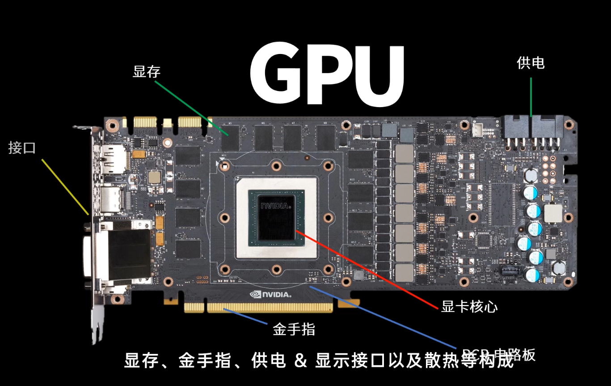
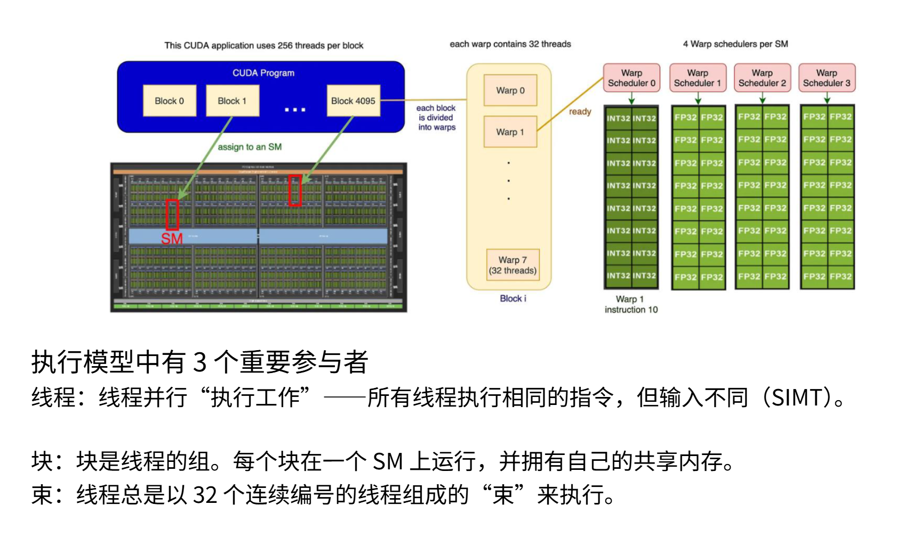
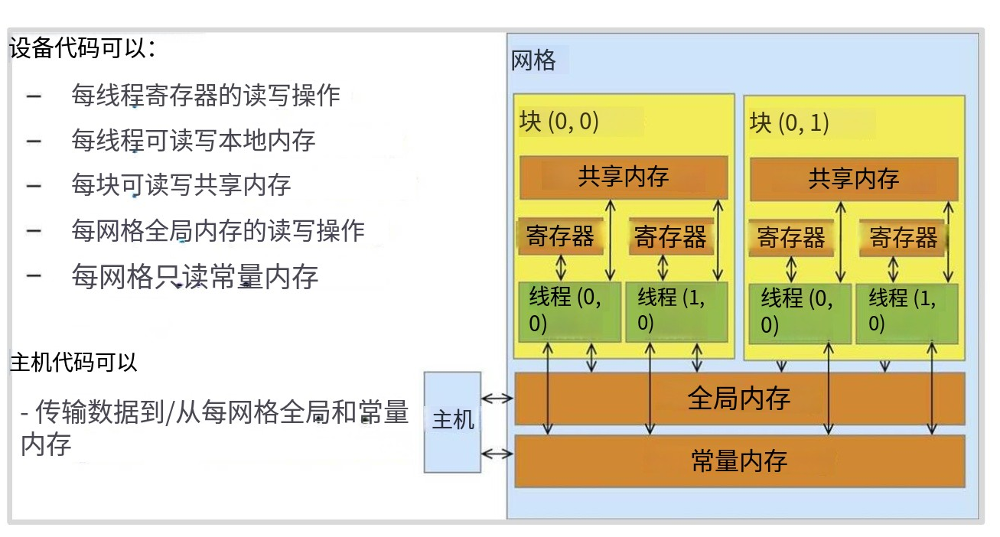
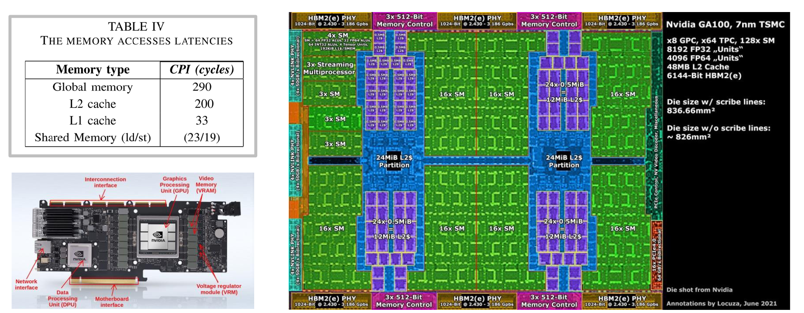

# part1 Introduction to GPU

欢迎来到 zero-to-sglang 课程，这里是课程的第二部分，上节课我们介绍了大模型的推理具体过程，学习了token的生命历程还有KV Cache 等技术，下面我们要介绍的是GPU的架构以及LLM在GPU的执行流程。GPU作为大模型训练和推理的地基，贯穿整个大模型的生命流程，我们有必要学习GPU相关的知识。下面就让我们开始本节课程的学习。

## 一、GPU 架构基础

### 1.1 GPU的起源：图形处理器

在深度学习概念没有火起来之前，GPU在普通人眼中是**游戏显卡**，即图形处理器。下面用一个例子来说明GPU和CPU的区别。

当我们打开游戏里面的3D模型，可以发现3D模型都是由一个一个**小三角形**构成，三角形由三根线构成，为了节省存储的空间，我们只存储三角形的三个顶点坐标，构成线的像素点坐标我们不储存，而是实时计算出来。


由两个点构成一个直线就可以发现，一根线我们只存储**两个端点的信息**，中间的像素点再时时计算渲染。我们可以由两个顶点坐标计算斜率和截距，就可以算出两条线中间的点的位置。虽然都是简单计算，只有大量简单的乘法和加法。但是 CPU 天生时执行复杂逻辑的，只能逐个计算，所以**计算时间非常长**。

人们就想到创造出可以**大量并行计算简单的乘法和加法**的计算单元，就是GPU。CPU和GPU没有优劣之分，只是用来执行不同功能的单元。GPU的计算单元被称作**CUDA核心**。


#### 1. 图形显示的萌芽（1980年代前）

**没有GPU的时代**，电脑显示图形全靠CPU计算，**1981年**：IBM PC配备的CGA显示卡只能显示16色，像个"电子相框"，所有计算都由CPU完成，**1987年**：IBM推出VGA标准，能显示256色，但依然是纯"显示"功能，没有计算能力。

**关键**在于1985年ATi公司成立，开始用ASIC技术做图形芯片。1992年ATi的Mach32图形卡首次集成**图形加速**功能，这是GPU的起始点。

#### 2. 3D加速卡混战（1990年代）

90年代是图形加速器的黄金时代，但还没有GPU这个正式名称。

**里程碑事件**在**1994年**3DLabs发布Glint300SX，**第一颗PC用3D加速芯片**诞生；**1996年**，3dfx的Voodoo芯片让普通PC能跑3D游戏，开启消费级3D时代；**1997年**富士通发布个人电脑首款3D几何处理器，三菱推出支持**变换和光照(T&L)** 的芯片。

但是各家标准混乱，互不兼容；只能处理特定3D任务，功能专一；当时叫3D加速卡，还没GPU概念。

#### 3. GPU正式诞生：NVIDIA（1999-2006）

**1999年**，NVIDIA发布GeForce 256，**首次提出"GPU"（图形处理器）概念**。这个名字区分了传统CPU，宣告：**显卡有了自己的大脑**。

GeForce 256具有革命性，**硬件T&L技术**上，将把**3D**图形的坐标变换、光照计算从CPU解放出来，变成了GPU专职。实现了**单芯片集成**，整合三角形构成、裁剪、纹理、渲染功能，并且是实现**性能飞跃**：让CPU的3D计算负担减轻80%以上。

在2000年市场大洗牌，2000年后，3dfx、Matrox等老厂商逐渐退出，只剩NVIDIA GeForce和ATI Radeon双雄争霸（ATI 2006年被AMD收购）。

#### 4.可编程时代：（2001-2012）

第一阶段：固定管线 Shader（2001-2006）

**2001年**，微软DirectX 8引入**顶点着色器**和**像素着色器**，GPU可以跑简单程序了。以前GPU是固定流水线上的"拧螺丝工人"，现在变成了能执行简单指令的"小机器人"。

第二阶段：统一渲染架构（2006-2012）

**2006年**，NVIDIA发布GeForce 8800 GTX（G80核心），**首个统一渲染架构GPU**。原来顶点着色器和像素着色器是分开的"专科医生"，现在变成了通用的"全科医生"。计算资源可以动态分配，利用率从50%提升到90%+；同时发布**CUDA**技术，让GPU能跑C语言程序。


| 架构  年份 | 核心技术 | 代表产品 |
|------------|----------|----------|
| Tesla (2006) | 引入CUDA，开启GPGPU | GTX 280 |
| Fermi (2010) | 支持双精度计算、ECC纠错 | GTX 480 |
| Kepler (2012) | 动态并行、高能效 | GTX 680 |

#### 6. 通用计算时代：GPU变身"超算核心"（2012-2018）

**2012年**是转折点：AI研究人员用GPU训练深度神经网络，让AlexNet图像识别准确率震惊世界。从此GPU从游戏显卡升级为AI发动机。

英伟达构建了**NVIDIA CUDA生态**，让程序员轻松调用GPU算力。

#### 1.1 CPU（中心处理器）和GPU（图形处理器）的区别

CPU是我们最早接触的执行模型。程序按顺序运行，在单线程中逐步执行指令。要支持这种执行模式需要大型控制单元和快速运行能力，因为存在大量分支和条件控制逻辑。因此CPU会将大量芯片面积用于分支预测（下面这张图），虽然**核心数量有限但运行速度极快**。相比之下，GPU则拥有海量**计算单元**（ALU），就是那些绿色小方块。**只有极小部分芯片面积用于控制逻辑，用少量控制逻辑来协调海量并行运算的计算单元**。从概念上看，这体现了CPU和GPU的不同侧重点。

二者的设计目标截然不同，CPU优化延迟，追求**单个任务最快完成**。而**GPU优化吞吐量**，GPU不关心单个任务延迟，只追求所有任务整体最快完成。为此GPU配备大量可快速休眠唤醒的线程，虽然GPU每个任务的延迟较高，但整体完成时间反而领先CPU。这就是它们不同的设计理念和目标。因此，GPU的架构结构不同在于在于GPU会运行大量**流式多处理器**（SM）。

CPU设计初衷是用来最小化单任务延迟，快速响应复杂逻辑，大部分晶体管用于控制逻辑和缓存，核心数量通常有4-64，可以执行乱序执行、分支预测、推测执行等等任务。

GPU的设计初衷是最大化数据吞吐量，批量处理简单计算，大部分晶体管用于算术逻辑单元（ALU），核心多而简，可以达到数万个。优化**延迟**，追求单个任务最快完成。配备大型控制单元、分支预测器，核心数量少（4-32个）但时钟频率极高。


上面这幅图可以看到：**CPU的计算单元**（绿色部分）少，大部分用来**控制（Control）**和**缓存（Cache）**这决定了它可以进行**复杂的逻辑运算**，GPU则不同，他的**控制单元少（黄色部分）**,大部分都是**绿色的计算单元**，这决定了它可以进行**大量并行计算简单的乘法和加法运算**，复杂的逻辑和复杂的计算就不行了。GPU主要就是优化**吞吐量**，追求所有任务整体最快完成。控制逻辑仅占芯片面积的极小部分，计算单元（ALU）占绝大多数。所以我们在使用GPU时还要**CPU的调度**，一个好的GPU要配上好的CPU才能发挥作用。

到了AI时代，深度学习中的**矩阵**将GPU推上神坛。因为AI时代的核心是**神经网络**的计算，其中涉及到大量的**矩阵运算**，矩阵运算的本质是大量的**乘法和加法**，特别适合GPU来做这种**简单又重复**的运算，在2010年左右人们就开始利用GPU来进行AI相关的计算。

### 1.3 A100显卡核心的构成

我们使用A100 来介绍GPU的具体结构



一张英伟达的的显卡剖面图如图，一张显卡由**供电、显卡核心、显存、显示接口和金手指**组成。

我们主要介绍显卡核心：显卡核心由**cuda core、控制单元和缓存单元等构成**。而 CPU 和 GPU 最大的不同就在于，GPU 负责的工作大多是重复性的 3D 建模或者渲染，而流处理器就是负责顶点运算或者像素运算，能动态的分配进行顶点运算和像素运算的流处理器数量，达到资源的高效利用。

**A100**是NVIDIA为数据中心设计的纯计算GPU，没有图形输出能力。

#### 1.3.1 产品形态

**PCIe版本**（常见形态）
**尺寸**为双槽全高，长267mm。**功耗**：250W（40GB版）/300W（80GB版）。**散热**是**被动散热**，无风扇（依赖服务器风道）。**接口**为PCIe 4.0 x16金手指 + NVLink桥接器接口；**重量**约1.4公斤。


####  1.3.2 PCB板级组件

**GA100 GPU核心芯片**

**封装**：巨型BGA封装，尺寸约55mm×55mm。**位置**：板卡正中央，焊在PCB上。542亿个**晶体管**，7nm工艺，面积826mm²。

**HBM2e显存堆栈**（革命性设计）
不同于消费级GPU的GDDR显存颗粒，A100采用**3D堆叠技术**：

#### 1.3.3 GA100 GPU核心架构（芯片内部宏观结构）


NVIDIA Ampere架构是NVIDIA于2020年发布的GPU架构，是其第八代GPU架构。它采用7纳米（nm）制程工艺，集成了高达540亿个晶体管，是当时世界上最大的7纳米芯片。该架构主要面向数据中心、人工智能（AI）、高性能计算（HPC）及专业图形等领域

Ampere架构拓扑如下：

```
┌─────────────────────────────────────────┐
│            GA100 GPU核心                
│                                         
│  ┌─────────┐  ┌─────────┐  ┌─────────┐│ 
│  │  GPC 0  │  │  GPC 1  │  │  GPC 2  ││ 
│  │ (12 TPC)│  │ (12 TPC)│  │ (12 TPC)││ 
│  └─────────┘  └─────────┘  └─────────┘│ 
│                                         
│  ┌─────────┐  ┌─────────┐  ┌─────────┐│ 
│  │  GPC 3  │  │  GPC 4  │  │  GPC 5  ││ 
│  │ (12 TPC)│  │ (12 TPC)│  │ (12 TPC)││ 
│  └─────────┘  └─────────┘  └─────────┘│ 
│                                         
│  ┌─────────┐  ┌─────────┐  ┌─────────┐│ 
│  │  GPC 6  │  │  GPC 7  │  │  GPC 8  ││ 
│  │ (12 TPC)│  │ (12 TPC)│  │ (12 TPC)││ 
│  └─────────┘  └─────────┘  └─────────┘│ 
│                                         
│  HBM2e控制器 ×8  ┌─────────────────┐    
└──────────────────│  PCIe 4.0 ×16    │──┘
                   └─────────────────┘
```

A100有四个层级的架构拓扑，首先是**GPC（图形处理簇）**，一个显卡核心有8个（实际启用7-8个）GPC；每GPC12个**TPC（纹理处理簇）**，共96个TPC;每TPC 2个，共**192个SM**（实际启用108个）**SM（流式多处理器）**；每个SM有64个**CUDA核心**，一共有192 × 64 = **6,912个CUDA核心**。

然后是**Tensor Core**，每个SM有192个（实际启用432个第三代Tensor Core）。

#### 1.3.4 SM（Streaming Multiprocessor，流式多处理器）内部结构

A100的SM是Ampere架构核心，相比消费级GPU有本质增强：

SM是将线程块（Thread Block）映射到物理硬件并完成实际计算的根本单元。当GPU内核（Kernel）启动时，线程块被分配到空闲的SM上，SM负责将其内部的线程束（Warp，32线程）解码并派发至CUDA核心（处理通用运算）或Tensor Core（处理矩阵乘加运算）执行。没有SM的调度，CUDA核心和Tensor Core无法自主运行。


```
┌──────────────────────────────
│              SM（流式多处理器）             
│                                            
│  ┌────────┐ ┌────────┐ ┌────────┐       
│  │CUDA核心│ │CUDA核心│ │CUDA核心│       
│  │  ×64   │ │  ×64   │ │  ×64   │    ← FP32/INT32单元
│  └────────┘ └────────┘ └────────┘       
│                                            
│  ┌──────────────────────────┐            
│  │  第3代Tensor Core ×4     │         ← AI专用加速单元
│  │  支持FP64/TF32/FP16/INT8 │            
│  └──────────────────────────┘            
│                                            
│  ┌──────────────────────────┐            
│  │   共享内存 / L1缓存       │        ← 192KB
│  │        128KB             │            
│  └──────────────────────────┘            
│                                            
│  ┌──────────────────────────┐            
│  │   寄存器文件              │        ← 256KB
│  │        256KB             │            
│  └──────────────────────────┘            
└──────────────────────────────
```

**SM的独特之处**是在于**CUDA核心**，64个/组，共4组 = 256个CUDA核心/SM（实际配置为64个FP32 + 64个INT32），同时还有**第三代Tensor Core**，支持**结构化稀疏**（性能翻倍），并和支持**双精度FP64**（消费级GPU没有）


####  1.3.5 Tensor Core

NVIDIA A100 Tensor Core是其**第三代Tensor Core**技术，是A100 GPU专为**加速AI训练、高性能计算（HPC）和数据分析**而设计的核心计算单元。它通过专用硬件和全新精度格式，在矩阵乘法等核心运算上实现了数量级的性能飞跃。

Tensor Core是专为执行**矩阵乘加运算（FMA）** 而设计的硬件单元，在处理深度学习和科学计算中的核心运算时，效率远超通用CUDA核心。A100支持多种数据精度，特别是引入了创新的**TensorFloat-32 (TF32)** 格式。它能在不改变代码的情况下，以FP32的精度和范围实现接近FP16的运算速度。A100的Tensor Core支持**结构化稀疏**技术。它能利用AI模型中的稀疏性（即大量参数为零），将吞吐量**进一步提高一倍**。


A100 Tensor Core提供了惊人的计算吞吐量，具体性能如下：

| 精度格式 | 计算性能 (Tensor Core加速) | 说明 |
| :--- | :--- | :--- |
| **FP16** | **312 TFLOPS** | 半精度，深度学习的“主力”精度。 |
| **BFloat16** | **312 TFLOPS** | 另一种半精度格式，动态范围更佳。 |
| **TF32** | **156 TFLOPS** | A100特有的精度，FP32精度/范围，FP16速度。 |
| **INT8** | **624 TOPS** | 8位整数，主要用于AI推理，速度极快。 |
| **FP64** | **19.5 TFLOPS** | 双精度，满足科学计算等高精度需求。 |


**硬件组成**：A100 GPU拥有**432个**第三代Tensor Core，分布于**108个**流式多处理器（SM）中。
**工作原理**：Tensor Core采用**Warp-Level**的编程模型。一个Warp（32个线程）协同工作，将数据从显存加载到寄存器，再由Tensor Core执行矩阵运算。
**软件支持**：开发者可以通过**CUDA**、**cuDNN**等深度学习库，以及主流的AI框架（如PyTorch、TensorFlow）来调用Tensor Core。

## 二、 GPU的执行模型

我们简单介绍了A100 GPU的结构，但是我们还不知道GPU是如何执行计算的，下面我们介绍GPU各个部分的是如何执行计算的。

### 2.1 SM流式处理器的执行流程

我们可以将流式多处理器视为一个**原子单元（即最小单元）**。当使用Triton这类工具编程时，操作层级就对应着SM。在每个SM内部，它包含许多**流处理器**（SP），而每个流处理器会**并行执行大量线程**。可以这样理解，SM拥有一套**控制逻辑**，能决定执行内容，比如实现**分支判断**；而SP则负责将相同指令应用于不同数据片段。这样就能实现海量并行计算。在这种架构下，每个**SM是控制粒度的基本单元**，而单个SP能独立完成大量计算。以上一代GPUA100为例，它包含128个SM——这远超大多数CPU的核心数量。每个SM内部都集成有大量SP和专用矩阵乘法单元，这就是其计算模型的基本形态。每个SM能操控其专属组件（如张量核心）进行计算。

**线程调度与执行**

SM同时管理**数千个线程**，决定哪个线程在何时使用哪个计算单元。它不像CPU那样为每个线程保存大量状态，而是轻量级切换，几乎没有开销。

**指令流水线**

SM内部有**4条独立的指令流水线**，每个时钟周期可以同时发射4条不同指令给不同的Warp（线程束）。

**数据缓存与共享**

SM内置**192KB的L1缓存/共享内存**，供本SM内所有CUDA核心快速存取数据，延迟比全局显存低100倍。

### 2.2 执行模型的核心名词详解



在GPU运行中，我们划分三个粒度层级来思考：**块（block）、线程束（warp）和线程（thread）**，这是粒度逐级细化的顺序。块是大型线程组，**每个块会被分配给一个SM处理**。可以把每个SM想象成**独立工作**的单元，而块就是分配给它的**处理单元**。在每个块内部包含**大量线程**，每个线程代表待执行的任务单元。这些线程在执行时会分组运行，这种分组称为线程束。每个线程束由32个连续编号的线程组成，从块中提取出来同步执行。通过这个示意图可以看到：多个块被分配给不同的SM，每个块内包含多个线程束，每个线程束又由大量线程组成。所有这些线程都会在不同数据上执行相同的指令，这就是基本执行模型。



#### 1. Warp（线程束）

Warp的概念源于其工作机制：所有线程步调一致地执行同一指令，但处理各自不同的数据。在A100中，每个SM（流式多处理器）最多可以同时承载64个活跃的Warp。

一个**Warp**是32个线程组成的固定小组，是SM调度的**最小单元**。**Warp像"公交车"**，32个乘客（线程）必须**同站同下**，执行完全相同的指令。如果某个线程需要走不同分支（if-else），全车人要等它，这叫**Warp Divergence（线程束分化）**。

SM同时驻留**64个Warp**，4个Warp调度器每个管理16个Warp；Warp内32线程在**SIMD单元**上同步执行。Warp由SM的SIMT（单指令多线程）单元负责创建、管理和调度。当一个线程块（Thread Block）被分配给SM后，SM会将其中的线程按照连续的、递增的线程ID进行分组

#### 2. Block（线程块）

Bock程序员指定的线程组，映射到**1个SM**上执行。**Block像"施工队"**，队内成员可以**共享工具**（共享内存），可以通过哨子同步。

每个Block独占SM的**共享内存**和**寄存器资源**；Block内所有线程必须**在同一SM内**执行（不能跨SM）；

#### 3. Thread（线程）

线程是**最细粒度的执行单元**，每个线程执行同样的Kernel代码，但操作不同数据。Thread像"流水线上的工人"，每人负责一个数据元素（如向量中的一个数）。

每个线程有**私有寄存器**（通常256个）；线程ID：`threadIdx.x` 决定它处理哪个数据

#### 4. SIMT（单指令多线程）

GPU执行模型，多个线程（Warp）共享同一条指令，但操作不同数据。**SIMT（Single Instruction, Multiple Threads，单指令多线程）** 是NVIDIA GPU（包括A100）采用的**并行计算执行模型**。它由NVIDIA在G80架构中首次引入，是CUDA编程模型能屏蔽硬件细节、让开发者按多线程逻辑编程的理论基础。

SIMT是SM（流式多处理器）**执行指令的根本方式**。当GPU内核启动后，SM内的**Warp调度器**以**线程束（Warp）**为单位（固定32个线程）获取一条指令，然后将该指令**广播**给Warp内的所有活动线程。每个线程在自己的CUDA核心或Tensor Core上，操作**私有寄存器**中存放的**不同数据**，实现“单指令处理多份数据”的并行。

#### 5. 与SIMD（单指令多数据）的本质区别
| 特性 | **SIMT（GPU）** | **SIMD（如CPU的AVX）** |
| :--- | :--- | :--- |
| **执行粒度** | 多线程（每个线程有独立指令地址计数器和寄存器状态） | 向量通道（整个向量共享单一指令地址） |
| **分支处理** | **支持线程级分支**（if/else、循环），可独立执行不同路径 | 所有通道必须统一执行，分支困难 |
| **硬件实现** | 硬件调度器动态管理线程掩码（Mask） | 编译器将数据打包为向量 |

**线程束发散（Warp Divergence）**

尽管SIMT支持分支，但存在显著性能约束。当Warp内32个线程遇到**条件分支**（如`if (threadId % 2 == 0)`）时，部分线程满足条件（活跃），部分不满足（非活跃）。

SM无法让活跃和非活跃线程同时执行不同指令。它只能**先执行活跃线程路径**，通过**掩码（Mask）**屏蔽非活跃线程；然后**切换执行另一路径**，屏蔽上一批活跃线程。

若同一Warp内分支分歧严重，两条路径**串行执行**，性能损失接近一半（甚至更多）。因此，优化SIMT程序的关键在于**尽可能避免同一Warp内的分支分化**。

SIMT模型是**GPU高吞吐量的底层逻辑**,它将硬件上**SIMD式的密集计算**封装为**MIMD（多指令多数据）式的编程灵活性**，使开发者能写出类似CPU的多线程代码，而硬件通过Warp调度、掩码和收敛机制，自动将线程级并行映射为高吞吐量的计算流。这正是A100的SM能高效协同调度CUDA核心与Tensor Core的指令执行基础。


### 2.3 GPU的内存模型




**内存距离SM越近，访问速度越快**。因此存在**极高速的内存类型（如L1缓存和共享内存）**，它们位于SM内部，具有**极快的读写速度**。像**寄存器这类需要频繁读写的元件，就应该放置在L1和共享内存中**。

如图所示，这些绿色区域是SM集群，而**蓝色区域代表紧邻SM的L2缓存**,它们虽然不在SM内部，但物理位置仍然很近，**速度也相当快**（虽然比L1慢一个数量级）。在芯片外部（以这张3090或PCIeA100为例），GPU芯片旁边实际安装了**DRAM内存**，这意味着数据需要实际**离开芯片通过物理连接**进行传输。你可以在这张芯片图上看到边缘的这些黄色连接器。这些是HBM连接器，它们连接到实际GPU外部的DRAM芯片。

你可以从上图左侧看到访问这些存储所需的**速度**，SM内部存储器的访问速度要快很多，大约只需20个时钟周期就能从中获取数据，而访问L2缓存或全局内存则需要200到300个时钟周期。这个**10倍的差距会对性能造成严重影响**。如果某段计算需要访问全局内存，可能意味着你的SM会无工作可做，矩阵乘法全都完成了，任务耗尽，只能空转。这样**利用率就不会高**。这在某种程度上将成为思考内存架构的核心主题，也是理解GPU工作原理的关键。

首先是寄存器，**这是速度极快的存储单元**，用于保存单个数值型数据。本地内存、有共享内存、还有全局内存、他们在内存层次结构中逐级递增，速度也越来越慢。

**代码可以写入全局内存**，也可以写入常量内存（虽然这个不常用）。每个线程都能访问**自己的寄存器和共享内存**，但**跨线程块的信息需要写入全局内存**。这意味着当编写执行任务的线程时，理想情况下它们应该操作相同的小批量数据，这样就不用跨线程。我们可以将这小批量数据加载到共享内存中，所有线程都能高效访问共享内存，执行完毕后任务就完成了。这是最理想的执行模式。反之，**如果线程需要到处访问数据**，就必须访问**全局内存**，速度会非常非常慢。

---

#### 2.3.1 第一层：全局内存（Global Memory）

| 特性 | 参数  说明 |
|------|------------|
| **物理位置** | GPU芯片外的HBM2e显存堆栈 |
| **容量** | A100: 40GB/80GB |
| **带宽** | **2,039 GB/s** (A100) |
| **延迟** | ~500 GPU周期 (~250ns) |
| **编程控制** | **手动管理** (`cudaMalloc`) |
| **可见性** | 所有线程可访问 |

全局内存可以存放模型的所有权重、激活值、梯度（如GPT-3的1750亿参数）；训练数据、中间结果、最终输出，将**数据持久化**；我们通过PCIe从主机内存拷贝数据，是**CPU-GPU传输通道**。

全局内存提供**海量容量**（80GB），能容纳大模型的巨大显存；成本相对低（HBM2e虽贵，但比SRAM便宜100倍）是GPU存储的基础。

---

#### 2.3.2 第二层：L2缓存（二级缓存）

| 特性 | 参数  说明 |
|------|------------|
| **物理位置** | **GPU芯片内，所有SM共享** |
| **容量** | **40MB** (A100) |
| **带宽** | ~3TB/s |
| **延迟** | ~200周期 (~100ns) |
| **编程控制** | **自动管理** (硬件控制) |
| **可见性** | 所有SM所有线程 |


能够为**全局数据加速**，自动缓存全局内存的热点数据（如频繁访问的模型权重）；是**数据共享枢纽**，SM之间通过L2缓存交换数据（比直接走HBM快3倍）；能**数据一致性保证**，所有SM看到的L2数据一致。

能**缓解显存带宽瓶颈**，AI训练90%时间访问同一批权重，L2缓存命中可节省95%的HBM带宽；**硬件自动管理**程序员无需干预，降低编程复杂度。

---

#### 2.3.3 第三层：L1缓存 / 共享内存（Shared Memory）

| 特性 | 参数  说明 |
|------|------------|
| **物理位置** | **每个SM内部** |
| **容量** | **192KB/SM** (A100, 可配置) |
| **带宽** | **1TB/SM** |
| **延迟** | **20-40周期** (~10-20ns) |
| **编程控制** | **完全手动** (`__shared__`) |
| **可见性** | **Block内所有线程可见** |


它是一个**线程协作的仓库**，块(Block)内线程通过共享内存交换数据（如矩阵乘法的分块（Tiling）数据）；可以**手动性能优化**，可将热点数据显式放入共享内存，实现接近寄存器的速度；**L1缓存功能**当不手动使用时，自动作为L1缓存缓存全局内存数据。

L1**速度比L2快5倍**，是GPU性能优化的核心战场；**灵活性**；高程序员可控，实现复杂算法（如规约、扫描、卷积）；有**成本效益**：192KB/SM × 108 SM = **20MB总容量**，比纯SRAM L2廉价。

---

#### 2.3.4 第四层：常量内存（Constant Memory）

| 特性 | 参数  说明 |
|------|------------|
| **物理位置** | 芯片内专用缓存 |
| **容量** | **64KB** (全局常量) |
| **带宽** | 广播机制 (1次读取服务32线程) |
| **延迟** | ~5周期 (命中缓存) |
| **编程控制** | 只读, `__constant__`声明 |
| **可见性** | **全GPU所有线程只读** |

可以存储**广播数据**；同一Warp内所有线程读取同一常量时（如神经网络的学习率），只需1次内存访问；可以存储**配置参数**；存储Kernel调用参数、查找表、常量系数。


它具有**极致能效**；广播机制节省99%带宽；**专用缓存**，不占用L1/L2资源。

---

#### 2.3.6 第六层：寄存器文件（Register File）

| 特性 | 参数  说明 |
|------|------------|
| **物理位置** | **SM内，每个CUDA核心旁** |
| **容量** | **256KB/SM** (A100) |
| **带宽** | **10TB/SM** (理论) |
| **延迟** | **1周期** (零开销) |
| **编程控制** | **完全自动** (编译器分配) |
| **可见性** | **线程私有** |

寄存器文件能做到**零延迟计算**，它存储线程的局部变量、临时结果。并且做到**极致并行**，每个线程255个寄存器，支持深度流水线。

寄存器文件的特点是**速度快**，1周期延迟。但是**昂贵**，寄存器文件的容量少。他的**容量限制决定并行度**，寄存器用量越少，SM能驻留的Warp越多。

---

#### 2.3.7 GPU内的内存分这么多层的原因

**1. 速度和容量不可兼得**

| 内存类型 | 速度 | 容量 | 成本($/GB)（估计） |
|----------|------|------|------------|
| 寄存器 | 1周期 | 256KB/SM | $1,000,000 |
| 共享内存 | 20周期 | 192KB/SM | $100,000 |
| L2缓存 | 200周期 | 40MB | $10,000 |
| HBM2e显存 | 500周期 | 80GB | $100 |

如果只用寄存器，8万块不够造1张卡；如果只用显存，算力浪费90%。分层是**唯一经济可行方案**。这是速度容量和成本的妥协。

**2. 通用性和专用性取舍**

全局内存是一个**通用仓库**，它什么都存，但速度慢。而共享内存是**专用仓库（共享内存）**，程序员往往精确控制，速度极快。L1L2则是**自动缓存**，由硬件智能预测，无需编程。

**3. 局部性原理和并行计算**

刚访问的数据很可能再次访问（如循环中的权重），这样放在全局内存的开销就很大。除此之外还有**空间局部性**，相邻数据很可能一起访问（如矩阵的同行元素）

**GPU的解决方案**是划分层级：**L2缓存**利用时间局部性，缓存重复访问的权重；**共享内存**利用空间局部性，手动加载分块（Tiling）数据；**Warp**利用常量内存的广播特性，1次读取服务32线程。后面我们还会介绍。

---

#### 2.3.8 GPU内存和CPU内存的本质区别

下面这个表格就说明了GPU和CPU的区别：

| 特性 | GPU (A100) | CPU (Xeon) |
|------|------------|------------|
| **主存带宽** | 2TB/s | 100GB/s |
| **缓存控制** | 共享内存**手动控制** | 缓存完全自动 |
| **线程寄存器** | 255个/线程 | 16个/线程 (x86) |
| **延迟容忍** | 通过Warp切换**隐藏延迟** | 降低延迟至上 |
| **内存模型** | **共享内存显式同步** | 缓存一致性协议 |

**CPU和GPU的本质区别**是GPU内存系统是**为吞吐量优化**，容忍高延迟；CPU内存系统是**为延迟优化**，降低延迟。这导致GPU需要更多层级和手动控制。


## 三、LLM 推理在 GPU 上的执行流程

LLM在GPU上的推理，其核心是**自回归**地逐个生成token，整个过程可清晰地分为 **预处理** 、**Prefill（预填充）** 和**Decode（解码）** 三个阶段。这与你之前学习的GPU执行模型紧密相关，且每个阶段对GPU资源的需求截然不同。

下面，我们以单卡A100运行Llama类模型为例，逐步拆解这个过程。

### 3.1 预处理：CPU的准备工作

在GPU真正开始计算前，CPU需要完成一系列准备工作。

**加载模型**：将模型权重（Weights）和配置文件从硬盘加载到CPU内存，再传输至GPU显存（HBM）。这是**一次性的冷启动开销**。

**分词 (Tokenize)**：将用户的输入提示词（Prompt）按字典切分成模型能理解的整数ID列表（Token IDs）。

**数据传递**：将Token IDs等必要数据通过PCIe总线从CPU内存拷贝到GPU显存。

### 3.2 Prefill阶段：首次并行计算（Compute-Bound）

这是处理用户输入的阶段。GPU接收到Token IDs后，会计算它们对应的向量表示（Embedding），然后送入模型的第一层开始计算。

**计算特征**：输入的所有token（如512个）会作为**一个巨大的矩阵**被并行处理。矩阵乘法（GEMM）等运算占主导，**算术强度极高**，能有效利用GPU的Tensor Core。

**GPU执行（以Q×K^T计算为例）**：
1.  **任务拆分**：CPU将大的矩阵乘法任务拆分成无数个`4×4`的小矩阵乘法。

2.  **SM调度**：GPU的工作分发器将这些小任务分配给各个SM。

3.  **Tensor Core加速**：每个SM内的**Tensor Core**以极高效率执行这些`4×4`矩阵乘加运算。这与你笔记中SM调度Warp的原理一致，但执行单元是专用的Tensor Core。

4.  **KV Cache生成**：在每一层Transformer计算后，都会产生该层输入的Key (K) 和 Value (V) 向量。系统会**将这些K/V向量缓存到GPU的HBM显存中**，即**KV Cache**。这是后续Decode阶段加速的关键。

**结果**：Prefill阶段结束时，模型会生成**第一个输出token**，并已为输入的所有token保存好了完整的KV Cache。

在这个阶段，GPU算力是瓶颈，因此被称为**计算密集型（Compute-Bound）** 任务。

### 3.3 Decode阶段：逐token生成（Memory-Bound）

这是模型“说话”的阶段。每生成一个新token，都需要依赖之前所有token的信息。

**计算特征**：此阶段每次只处理**一个新token的向量**。主要的运算是矩阵-向量乘法（GEMV），计算量远小于Prefill阶段。

**瓶颈转移**：此时，**从显存（HBM）中读取整个模型的权重和庞大的KV Cache成为了性能瓶颈**。GPU的计算单元常常因等待数据而空闲。

**GPU执行（以生成第N+1个token为例）**：

1.  **读取KV Cache**：对于当前要生成的新token，其Query (Q) 向量需要和**之前所有token的K向量**计算注意力。因此，SM需要从HBM中读取**整个序列的KV Cache**。
2.  **加载模型权重**：每层计算时，都需要从HBM加载该层全部的模型权重。
3.  **执行计算**：权重和K/V数据加载到SM的缓存和寄存器后，由CUDA核心和Tensor Core完成计算。
4.  **更新KV Cache**：计算产生的新K/V向量被追加写入显存中的KV Cache。
5.  **输出token**：最终结果向量被映射回一个具体的token ID，并通过CPU返回给用户。

**循环**：重复上述步骤，直到生成终止符或达到最大长度。

Decode阶段是**内存密集型（Memory-Bound）** 任务，优化重点在于减少显存访问量和提高访问效率。

### 3.4 关键优化：如何提升GPU效率？

为了应对Decode阶段的显存瓶颈，现代推理系统引入了多种优化技术。

**Continuous Batching（连续批处理）**：传统的静态批处理（Static Batching）要求所有请求同时开始和结束，效率低下。Continuous Batching将调度粒度从**请求（Request）级别下沉到Token级别**，每生成一个token后，就动态决定下一个token由哪些请求生成。这能最大程度填满GPU的算力，显著提高吞吐量。

**PagedAttention（分页注意力）与KV Cache管理**：KV Cache会随着序列长度增长而迅速占满显存。PagedAttention灵感来源于操作系统虚拟内存，将每个请求的KV Cache存储在**不连续的内存块（Block）** 中。系统通过`block_table`记录每个token的KV值实际存储位置。这解决了显存碎片问题，并支持超长序列。

**模型量化与内存优化**：
**权重量化**：将模型权重从FP16/BF16压缩为INT8、INT4甚至FP8。例如，DeepSeek V3.2在FP8下权重的显存占用可低至83GB。
**KV Cache量化**：对KV Cache进行更低精度的量化，可大幅降低其显存占用。

**内存层次结构的利用**：
**算子融合**：将多个连续操作（如`kernel` + `bias` + `activation`）融合成一个CUDA Kernel，减少对全局内存的读写次数。
**FlashAttention**：这是一种IO感知的精确注意力算法，通过分块计算，**充分利用SM内部的共享内存（Shared Memory）** 来避免频繁读写HBM，显著加速注意力计算。

### 3.4 总结

| 阶段 | 核心任务 | 计算类型 | GPU瓶颈 | 关键优化 |
| :--- | :--- | :--- | :--- | :--- |
| **预处理** | 加载模型、分词 | CPU任务 | PCIe传输 | 模型加载一次，复用 |
| **Prefill** | 处理输入prompt | **计算密集型** | Tensor Core算力 | 最大化并行度，利用好矩阵乘法 |
| **Decode** | 逐token生成 | **内存密集型** | 显存带宽 (HBM) | KV Cache、量化、Continuous Batching |

## 六、总结与测试题

### 6.1 课程总结

本节课围绕 **GPU 硬件架构** 与 **大语言模型推理在 GPU 上的执行流程** 两大主线展开，核心内容可归纳为：

#### 1. **GPU 的诞生与设计哲学**：

GPU 从图形处理器演进为 AI 加速器，其本质是以**大量简单计算单元（CUDA 核心）** 和**极少控制逻辑**换取**极高的数据吞吐量**，与 CPU 的“低延迟、复杂逻辑”设计目标形成鲜明对比。

#### 2. **A100 GPU 的层次化架构**：

从芯片全局（GPC → TPC → SM）到 SM 内部（CUDA 核心、Tensor Core、共享内存、寄存器文件），理解每个层级的作用和数据流动路径。其中 **SM** 是执行的基本原子单元，**Tensor Core** 是加速矩阵乘法的专用电路。

#### 3. **GPU 执行模型**：

以 **SIMT（单指令多线程）** 为核心，线程以 **Warp（32 线程）** 为调度单元，Block 映射到 SM，Thread 执行具体运算。关键概念包括 **Warp Divergence（分支发散）**、**内存合并访问**、**Warp 切换隐藏延迟**。

#### 4. **GPU 内存层次与瓶颈**：
全局内存（HBM）带宽～2TB/s 但延迟高，L2 缓存（40MB）次之，共享内存（192KB/SM）和寄存器（256KB/SM）速度极快但容量小。**内存带宽增长远落后于算力增长**，这构成了“内存墙”，也是 LLM 推理的主要瓶颈。

#### 5. **LLM 推理的两阶段**：

**Prefill（预填充）**：处理输入提示，批量矩阵乘法（GEMM），**计算密集型**，Tensor Core 满载。
**Decode（解码）**：逐 token 生成，矩阵-向量乘法（GEMV），**内存密集型**，HBM 带宽是瓶颈。

#### 6. **硬件视角的优化策略**：

**低精度量化**（FP8/INT8/INT4）直接减少数据搬运量，同时 Tensor Core 提供数倍加速。
**算子融合**减少中间结果的内存读写，**重计算**用算力换带宽，**分块（Tiling）** 利用共享内存降低全局内存访问。

**FlashAttention** 通过 IO 感知的 tiling 和在线 softmax 减少 HBM 访问，V3 版本进一步用异步流水线和 FP8 压榨硬件极限。

**PagedAttention** 将 KV Cache 分页管理，消除内部/外部碎片，大幅提升显存利用率和并发吞吐。

#### 7. **理解瓶颈的屋顶线模型**：

操作强度（Ops/Byte）决定任务处于“计算受限”还是“内存受限”区域。Decode 阶段操作强度极低，落在内存受限区，优化必须围绕**减少字节搬运**展开。

---

### 6.2 测试题

1. **假设你在单卡 A100（80GB HBM，2TB/s 带宽）上部署一个 70B 参数的 Llama 类模型（FP16 格式，模型权重约 140GB）。**  

- （a）直接加载 FP16 模型会遇到什么问题？  

- （b）要想将这个模型使用单卡推理，我们可以使用什么技术

- （c）你还可以采用哪些系统级或算法级优化来进一步提升吞吐量？列出至少两种并简要说明原理。


2. 请简述 CPU 与 GPU 在架构设计上的本质区别，并说明为何 GPU 适合深度学习中的矩阵运算。

3. 描述 LLM 推理的 Prefill 和 Decode 两个阶段在计算类型、瓶颈资源以及典型优化手段上的不同。

4. 解释什么是“屋顶线模型”，并说明为什么 Decode 阶段落在“内存受限”区域。结合至少两种优化策略，说明如何将 Decode 阶段向屋顶线右侧移动。

## 参考资料

- [https://datawhalechina.github.io/diy-llm/chapter6/chapter6_GPU和GPU相关的优化.html](https://datawhalechina.github.io/diy-llm/chapter6/chapter6_%E7%AC%AC%E5%85%AD%E7%AB%A0GPU%E5%92%8CGPU%E7%9B%B8%E5%85%B3%E7%9A%84%E4%BC%98%E5%8C%96.html)
- [https://cs336.stanford.edu/](https://cs336.stanford.edu/)
- [FlashAttention原理](https://arxiv.org/pdf/2205.14135)
- [PagedAttention原理](https://arxiv.org/pdf/2309.06180)
- [(https://images.nvidia.com/aem-dam/en-zz/Solutions/data-center/nvidia-ampere-architecture-whitepaper.pdf](https://images.nvidia.com/aem-dam/en-zz/Solutions/data-center/nvidia-ampere-architecture-whitepaper.pdf)