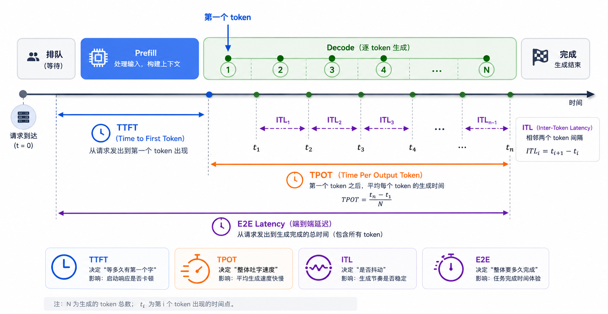
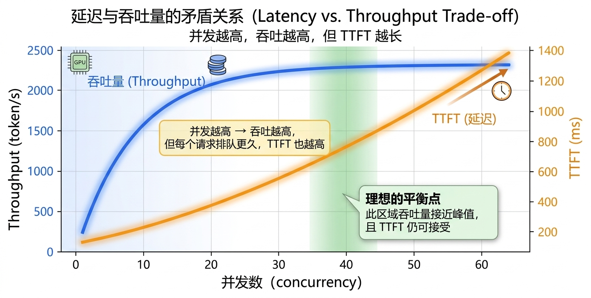
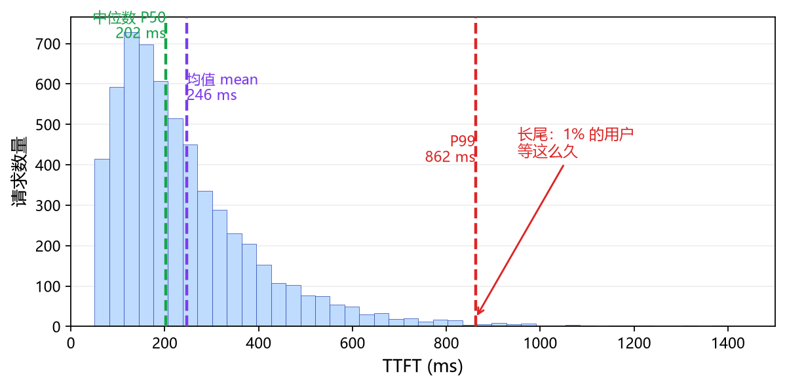
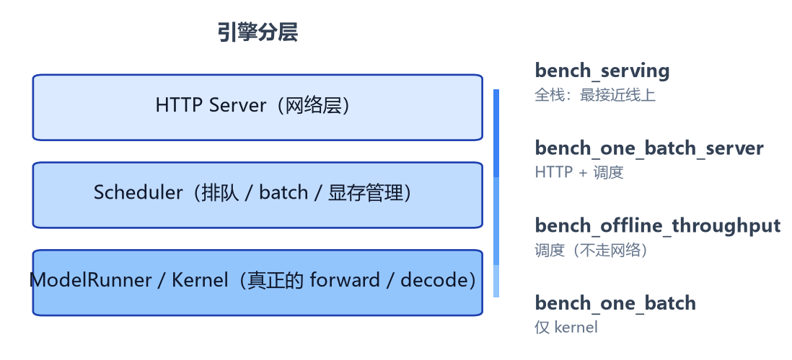

# 5. Introduction to Benchmark

> 📌 **本章速览**
>
> - benchmark = 一套可复现、可对比的测试，核心是「可比性」
> - 延迟类（TTFT / TPOT / ITL / E2E）看单个请求快不快，吞吐类（Throughput / Goodput）看系统能扛多少活
> - 延迟和吞吐是反着的：并发越高，吞吐越高，延迟也越高
> - 永远看分布，不只看平均；中位数 + P99 才是用户真实体感
> - 工具用对：线上用 `bench_serving`，最大吞吐用 `bench_offline_throughput`，kernel 级用 `bench_one_batch`

> 📚 **前置知识**
>
> 本章假设你读过 [第 2 章（prefill / decode、compute-bound vs memory-bound）](docs/part1/第2章_推理入门.md) 和 [第 4 章（KV Cache）](docs/part1/第4章_KVCache.md)。没读也不影响，看不懂术语时翻一下即可。

> 🗺️ **本章目录**
>
> 1. benchmark 是什么，为什么需要它
> 2. 延迟和吞吐
> 3. 几个容易被忽略的概念
> 4. 怎么设计一次 benchmark
> 5. 工具
> 6. 怎么读结果
> 7. 前沿：从吞吐到 goodput
> 8. 总结

---

## 一、benchmark 是什么，为什么需要它

benchmark 就是一套可复现、可对比的测试。它干三件事。

- 第一件，**验证优化**。你优化了一段代码，自测感觉快了 10%，这不算数。得用同一份请求集，优化前后各跑一遍，用具体数字进行对比。第 0 章讲过，profile 之后改，改完再 profile，benchmark 就是那个 profile 的手段。

- 第二件，**横向对比**。两个引擎、两个模型、两块卡，谁好谁坏，只有在同等条件下跑同一份负载才有结论。

- 第三件，**容量规划**。一张卡到底能扛多少并发，TTFT 还能不能守住，上线前得测清楚，不能等用户来告诉你。

三件事有个共同前提：**可比性**。同一份测试，换个条件数字就变了。所以 benchmark 的核心从来不是跑一次拿个分数，而是让两次测试之间，除了你想比较的那个变量，其他全部一致。

> 💡 **记住这句话**：benchmark 的价值不在数字本身，在能不能让两次比较公平。

## 二、延迟和吞吐

指标分两大类。一类看单个请求快不快，叫**延迟**；一类看整个系统能扛多少活，叫**吞吐**。两套指标不互通，不能互相替代。

### 2.1 延迟：用户体感

延迟里有四个常客，关系上一个时间轴：



- **TTFT（Time to First Token）**：从请求发出到第一个 token 出来的时间。这段时间里请求可能先排队，然后跑 prefill，再跑第一个 decode step。用户发完消息就盯着屏幕等第一个字，所以 TTFT 决定的是卡不卡。TTFT 高，用户的感受是发了半天没动静。
- **TPOT（Time Per Output Token）**：第一个 token 之后，平均每个 token 的生成时间。它基本由 decode 阶段决定，决定的是吐字快不快。TTFT 短但 TPOT 长，就是常见的开始有反应、但一个字一个字往外蹦。
- **ITL（Inter-Token Latency）**：相邻两个 token 之间的间隔。它和 TPOT 说的是同一件事，只是口径不同：TPOT 是总生成时间除以 token 数，一个平均值；ITL 可以逐个看，容易看出有没有抖动。抖动意味着有的 token 快、有的卡一下，平均下来看不出来，逐一看就露馅。
- **E2E Latency（端到端延迟）**：整个请求从发出到完成的总时间。

四者的关系用一个具体例子说清楚。假设一个请求：输入 1000 个 token，要生成 200 个 token。跑起来之后 TTFT 是 250ms，TPOT 是 25ms。那么：

```
E2E 延迟 ≈ TTFT + TPOT × (200 - 1)
         = 250ms + 25ms × 199
         ≈ 5.2s
```

看出来没有：5.2 秒里 prefill 只占了 250ms，剩下的几乎全是 decode。所以对**长输出**场景，TPOT 才是大头，优化 TTFT 帮助有限。反过来，**短输出、长输入**的场景（比如文档问答），TTFT 才是重点。这正好对应第 2 章讲的 compute-bound 和 memory-bound。

把 TPOT 换算成吐字速度更直观：25ms 一个 token，就是每秒 40 个 token。行业里常拿 100ms/token 当个分界，也就是每秒 10 个 token，大约相当于每分钟 450 个英文单词的阅读量级。低于这个速度，人会明显觉得慢。

关于人的感知，交互设计领域有个经典的经验值：响应时间在 0.1 秒以内，人感觉是瞬时的；1 秒以内，人会觉得流畅，不会分心；到 10 秒，人就等不住、走神了。套到推理服务上就是：TTFT 尽量压进几百毫秒，整个请求别让人等超过 10 秒。这不是硬指标，但能帮你判断某个数字到底算不算快。

> 💡 **记住**：TTFT 看 prefill 决定卡不卡，TPOT 看 decode 决定吐字快不快，E2E 看整体耗时。三个指标各管各的，别混。

### 2.2 吞吐：系统效率

吞吐里有两个：

- **Throughput**：单位时间的产出，token/s 或者请求/s，衡量系统整体效率。
- **Goodput（有效吞吐）**：在满足延迟要求前提下的吞吐。比如你要求 TTFT 不超过 500ms，超过这条线的请求都不算数，剩下的才计入 goodput。裸吞吐能靠堆并发硬拉上去，但用户已经跑光了，这种吞吐没意义，goodput 才有意义。Goodput 这个说法在 2024 年的 [DistServe（OSDI 2024）](https://arxiv.org/abs/2401.09670) 那篇论文里正式提出来，用来同时优化延迟和吞吐。

> 💡 **新一点的指标**：现在大家更愿意用 **goodput** 替代裸 throughput。吞吐高不一定有用，满足延迟 SLA（Service Level Agreement，服务要守的硬指标）的吞吐才有用。

### 2.3 延迟和吞吐是反着来的

这里有个矛盾：延迟和吞吐是反着来的。并发越高、batch 越大，GPU 吃得越饱，吞吐越高，但每个请求排队更久，TTFT 更差。两个指标要一起看，只看一个就会被骗。



图里左边蓝线是吞吐，右边橙线是 TTFT。蓝线前期涨得快、后期趋近平缓（GPU 吃满了），橙线一路往上爬。两条线一对比就能看出「不是并发越大越好」。你需要找一个 TTFT 还没爆、但吞吐已经接近峰值的甜点。

不同场景对指标的敏感度不一样，正好接上第 2 章的场景分类：

| 场景 | 最关心的指标 |
|------|-------------|
| 对话 / 聊天 | TTFT，用户等第一个字 |
| 长文生成 / 写作 | TPOT，用户盯着吐字速度 |
| 离线批处理 / 跑评测 | 吞吐，不在乎单条延迟 |
| 实时语音 / Agent 多步推理 | TTFT + 尾延迟 P99 |

## 三、几个容易被忽略的概念

### 3.1 百分位数和尾延迟

平均延迟会骗你。来看一张直方图：



中位数 P50 只有 202ms，意思是一半的请求快过这个。均值被长尾拉到 246ms，还算正常。但 P99 直接到了 862ms，是中位数的四倍多，1% 的用户要等这么久。

把这件事记住：

> ⚠️ **坑**：平均值好看不代表用户体感好。P50 和 P99 差一个数量级才是常态，看不见 P99 就不算真的看过结果。

SGLang 的 benchmark 工具默认就报 mean、median、P90、P95、P99 这几档，不报 P50，因为 median 就是 P50。

### 3.2 并发和请求速率是两回事

跑压测有两种姿势，经常被混为一谈。

一种是一股脑把 N 个请求同时砸进去，叫**固定并发**或**全量并发**。另一种是模拟真实流量，按某个速率（比如每秒 50 个请求）持续往里送，请求到达时间服从**泊松分布**，叫**按请求速率压测**。真实用户不会同一秒一起发消息，所以后者更接近线上。

`bench_serving` 用 `--request-rate` 这个参数区分这两者：不设就是无穷大，所有请求在 0 时刻全部发出；设成一个有限的数字，它就按泊松过程合成到达时间。想看服务在稳定负载下的表现，就用有限的 request-rate；想看极限吞吐，就用无穷大。

### 3.3 稳态和预热

服务刚启动那会儿不是真实水平。CUDA Graph 还没 capture，缓存是冷的，内存池刚建好，第一批请求的延迟会明显偏高。如果这时候就开始统计，测到的是冷启动，既不是最好也不是稳态。

所以要先预热，跑一批请求把系统喂到稳定，再开始计时。`bench_serving` 里的 `--num-prompts` 别设太小，官方建议至少是 `--max-concurrency` 的 5 倍，否则测到的大半还是预热阶段。

### 3.4 输出长度决定一切

benchmark 的结果高度依赖你用了什么长度的请求。短输出的场景，TTFT 主导，吞吐能跑到很高；长输出的场景，decode 主导，吞吐掉下来，延迟涨上去。如果两个引擎一个测的是 32 个 token 的输出、另一个测的是 512 个，比较结果没有任何意义。

所以对比之前，先确认输入输出长度的分布一致。

### 3.5 MBU 和 MFU

第 2 章讲过 compute-bound 和 memory-bound。Benchmark 里有两个对应的指标，能帮你确认瓶颈到底在哪。

- **MFU（Model FLOPs Utilization）**：实际浮点吞吐除以硬件峰值，衡量 compute-bound 场景下 GPU 用得多满。
- **MBU（Model Bandwidth Utilization）**：实际访存带宽除以峰值带宽，衡量 memory-bound 场景。decode 是 memory-bound，所以看 decode 的 MBU 更实在：实际带宽可以用「参数量 + KV Cache 大小」除以 TPOT 估算。MBU 高说明 decode 阶段把显存带宽吃得够满，MBU 低说明还有优化的空间。

这两个指标不常出现在默认输出里，但值得知道，尤其后面 Part II 优化 mini-sglang 时会用上。

### 3.6 分词器的坑

token/s 这个指标跨模型比较时要小心。同样一段中文，Llama 的分词器和 GPT 系的分词器切出来的 token 数不一样，可能差百分之十几。所以「模型 A 每秒生成 100 token、模型 B 每秒 90 token」不直接等于 A 吐字更快，可能只是 A 的 token 更短。跨模型对比时，要么用同一套分词器数 token，要么换算成字数，否则就是在拿苹果比橘子。

> ⚠️ **坑**：跨模型比 token/s，几乎都是在拿苹果比橘子。

## 四、怎么设计一次 benchmark

设计要固定四样东西，缺一样结果就没法比。

1. **工作负载**：输入输出长度是多少，分布什么样。真实业务的 prompt 长度不是均匀的，最好用贴近真实分布的数据集，而不是随便生成一堆等长句子。
2. **并发或请求速率**：同时多少请求在跑，或者按什么速率送请求，这直接决定排队和 batch 形态。
3. **硬件和模型**：同型号卡、同模型、同精度（FP16 还是 FP8）、同量化方式，任何一样不一样，对比就作废。这里还有个现实的坑：不同云厂商的「同一块 A100 集群」性能可能差出两倍，因为互联带宽不一样。
4. **预热**：先跑一批请求让系统进入稳态，再统计。

数据集的选择。`bench_serving` 支持不少现成的：

- **sharegpt**（默认）：真实对话数据，接近聊天场景，最常用。
- **random**：随机生成固定长度的请求，适合测纯性能上限，不反映真实场景。
- **generated-shared-prefix**：带共享前缀的请求，专门测前缀缓存（比如 SGLang 的 [RadixAttention](https://arxiv.org/abs/2312.07104)）。
- **agentic-trace**：多轮、带工具调用的 trace，测 Agent 场景。
- **longbench_v2、speed-bench**：长文本和速度基准。

选哪个取决于你想模拟什么场景。测聊天服务用 sharegpt，测前缀缓存用 generated-shared-prefix，别拿 random 冒充真实流量。

一份公平的 benchmark 检查清单：

- [ ] 工作负载（输入 / 输出长度分布）双方一致
- [ ] 并发或请求速率双方一致
- [ ] 同型号硬件、同模型、同精度、同量化方式
- [ ] 预热充分，进入稳态
- [ ] 报告分位数（至少 P50 / P90 / P99），不只报平均
- [ ] 报告吞吐的同时报告 TTFT，不能只看一头

## 五、工具

### 5.1 SGLang 的四个工具

SGLang 官方给了四个 benchmark 工具，按离真实线上服务有多近来排序：



| 工具 | 走 HTTP | 走调度器 | 用途 |
|------|--------|---------|------|
| `bench_serving` | 是 | 是 | 最接近线上，报 TTFT / TPOT / ITL / 吞吐和分位数 |
| `bench_one_batch_server` | 是 | 是 | 单 batch 端到端延迟，含 HTTP 和调度开销 |
| `bench_offline_throughput` | 否 | 是 | 去掉网络开销，测最大吞吐 |
| `bench_one_batch` | 否 | 否 | 直接调 kernel，绕过调度器，做单 batch 的 kernel 级分析 |

绝大多数时候用 `bench_serving` 就够了。另外 `bench_serving` 的 `--backend` 参数支持 sglang、vllm、lmdeploy、trt 等，意味着你可以用同一个脚本、同一份负载，去压不同的引擎，天然公平，适合做横向对比。

### 5.2 bench_serving 命令

一个典型的命令：

```bash
python -m sglang.bench_serving \
    --backend sglang \
    --max-concurrency 16 \
    --num-prompts 200 \
    --dataset-name sharegpt \
    --request-rate inf
```

几个值得注意的参数：

- `--backend`：sglang、vllm、lmdeploy、trt 等，跨引擎对比就用这个切换。
- `--max-concurrency`：最大并发数，cap 住同时在飞的请求。
- `--num-prompts`：总请求数，至少 5 × `--max-concurrency` 才算稳态。
- `--request-rate`：每秒多少请求，不设就是 inf（全部 0 时刻发出），设了就走泊松。
- `--dataset-name`：见上面数据集列表。
- `--random-input-len` / `--random-output-len`：用 random 数据集时的输入 / 输出长度。
- `--load-format dummy`：用假权重跑，适合先验证流程。
- `--json-model-override-args`：把层数改少，测小模型配置。

### 5.3 输出长什么样

跑完会打一张结果表。下面是示意（数字是示例，量级参考）：

```
Backend:                         sglang
Max concurrency:                 16
Successful requests:             200
Request throughput (req/s):      7.2
Output token throughput (tok/s): 1860.5

------------ Time to First Token ------------
Mean TTFT (ms):                  312.4
Median TTFT (ms):                288.1
P90 TTFT (ms):                   458.7
P99 TTFT (ms):                   901.2

------ Time per Output Token (TPOT) --------
Mean TPOT (ms):                  24.8
Median TPOT (ms):                23.9
P90 TPOT (ms):                   31.5
P99 TPOT (ms):                   52.3

------------- End-to-End Latency ------------
Mean E2E Latency (ms):           1890.2
Median E2E Latency (ms):         1720.6
P90 E2E Latency (ms):            2630.1
P99 E2E Latency (ms):            4100.8
```

读这张表，重点看三处。

**先看 mean 和 median 差得多不多**。这个例子里 TTFT 的 mean 312ms 比 median 288ms 高一点，说明有些请求的 prefill 偏慢，把平均值拉上去了，但不算离谱。

**再看 P99**。TTFT 的 P99 到 901ms，是 median 的三倍多，说明有长尾，1% 的用户要等快 1 秒。如果业务要求 TTFT 守 500ms，那这条线已经破了，goodput 要打折。

**最后看吞吐**。输出吞吐 1860 token/s，配合 16 的并发，单请求平均吐字 1860/16 约 116 token/s，跟前面 TPOT 25ms 对上。如果换成更高的并发再跑一遍，吞吐会涨，但 TTFT 也会跟着涨，两条线一起看才能判断这个配置值不值。

### 5.4 其他工具

圈子里常用的还有：

- **vLLM `benchmark_serving`**：vLLM 官方，接口和 SGLang 接近，跨引擎对比时直接用。
- **LLMPerf**（Anyscale / Ray 团队）：偏学术和工程实测，业界用得多。
- **NVIDIA GenAI-Perf**：NVIDA 官方，支持 Triton / TensorRT-LLM 等自家后端。
- **MLPerf Inference**：行业级标准 benchmark，但更新慢，覆盖模型有限。

原理都差不多，学会一个其余的都能上手。

## 六、怎么读结果

读结果记住一句话：**先看延迟能不能满足你的业务要求，再看吞吐。顺序反了容易自嗨。**

展开成三条：

1. **先定延迟 SLA**。你的场景 TTFT 必须低于多少，TPOT 必须低于多少，先把线画出来。没有这条线，数字就是数字，说不上好坏。
2. **看分布，别只看平均值**。中位数加 P99 一起看，尾延迟才是用户体感。
3. **对比时核对条件**。模型、精度、硬件、并发、prompt 集、输出长度，只要有一项不一样，对比就站不住脚。

### 一个真实世界的例子

vLLM 2023 年发 PagedAttention 论文时，宣称相对 HuggingFace Transformers 吞吐最多提升 24 倍。这个数字是真的，但条件很具体：LLaMA-7B、batch=1、特定的 prompt 长度、特定的硬件。换个 batch 策略、换个 prompt 长度，倍数会变。

看 benchmark 数字时刻记住：

- 谁测的、在什么硬件上、用什么 prompt 集
- 是只报平均还是报了 P99
- 是不是只比吞吐不比延迟

> ⚠️ **坑**：孤零零一句「比某某快 24 倍」基本都是营销话术。看条件。

### 常见误区

全是真实场景反复出现的：

1. **只看吞吐不看延迟**。吞吐能靠堆并发拉上去，但每个请求的 TTFT 已经爆了，用户全跑了。
2. **只看平均不看尾延迟**。P50 和 P99 差一个数量级，用户骂的就是那个 P99。
3. **没预热，prompt 太少**。测到的是冷启动，数字既不是最好也不是稳态。
4. **拿 `bench_one_batch` 的数字当线上性能**。那工具绕过了调度器，不排队、不抢 batch，数字虚高，只能用来做 kernel 级分析。
5. **拿不同长度的负载比**。一个测 32 token 输出、一个测 512 token，比出来的「吞吐差」其实是长度差。
6. **跨模型比 token/s 不看分词器**。token 长短不一样，直接比是拿苹果比橘子。
7. **只看 token/s 不看 goodput**。满足不了 SLA 的吞吐没有意义。
8. **只测一台机器就下结论**。多卡 / 多机时，互联带宽和拓扑会让结果天差地别。
9. **不固定随机种子**。某些 backend 的 kernel 走 branch 不一样，结果就跑偏了。

说回第 0 章那句 profile 永远是第一步。benchmark 本质就是 profile 的一种，不是攒个好看数字，是要回答那个问题：我优化的这段到底占多少时间，改完真的快了吗。后面 Part II 手搓 mini-sglang，每一步优化都会用这套方法验证。现在把指标和工具搞明白，后面会一直用得上。

## 七、前沿：从吞吐到 goodput

行业最近几年 benchmark 的关注点从「吞吐」慢慢移到了「goodput」，原因很简单：堆并发能拉吞吐，但用户跑光了，再高的吞吐也没用。代表工作：

- **DistServe（OSDI 2024）** 把 prefill 和 decode 拆到不同 worker 上，分别按各自的最优配置跑，再用 goodput 统一度量（arXiv:2401.09670）。
- **Splitwise（ISCA 2024）** 类似思路，更早提出 prefill / decode 分离（arXiv:2311.18677）。
- **Sarathi-Serve**（arXiv:2403.02310）提出 splitwise + chunked prefill，在单卡上也能拿到好的 goodput。
- **ServingLLM Survey**（arXiv:2407.10991）系统综述了这些工作，把 goodput 列为现代 LLM 服务的核心指标。

这件事直接影响怎么跑 benchmark：prefill 和 decode 瓶颈不一样，混在一起测会互相掩盖。现代 benchmark 工具（比如 SGLang 的 bench_serving）已经支持分别 profile prefill 和 decode 端。Part III 第 5 章会专门讲 Prefill-Decode 分离，到时候 benchmark 方法论会再展开。

另外一个前沿趋势是用 **LLM 本身当 judge** 来评估服务质量（response 质量），但那是**质量 benchmark**，不是性能 benchmark。本章只讲性能，别混了。

## 八、总结

三点记牢：

1. 延迟（TTFT / TPOT / ITL）和吞吐是两个维度，永远一起看，先看延迟是否满足 SLA。
2. benchmark 的价值在可比性，条件不一致的结果没有意义。
3. 工具用对：线上用 `bench_serving`，最大吞吐用 `bench_offline_throughput`，kernel 级用 `bench_one_batch`。

### 测试题

1. TTFT 主要反映的是 prefill 还是 decode 的开销？为什么长输出场景里 TPOT 比 TTFT 更值得优化？
2. 为什么只比吞吐、不比延迟，会得出错误的结论？
3. 一个聊天场景，用户抱怨发出去半天没反应，但一开始出字就很快。哪个指标出了问题，往哪个方向优化？
4. mean 和 median 差很多，说明什么？P99 很高，又说明什么？
5. 两个模型都号称每秒 100 token，为什么不能直接说它们一样快？
6. 看到一句「vLLM 比某某快 24 倍」的宣传，你会问哪几个问题来验证这个数字？
7. 要对比两个推理引擎的线上表现，列一份公平 benchmark 的检查清单。

### 动手练一道

装好环境后，用 sharegpt 数据集、并发 16 跑一遍 `bench_serving`，然后把 `--max-concurrency` 改成 64 再跑一遍，对比两次的 TTFT 和吞吐，画出延迟-吞吐权衡曲线，亲眼看一眼那个甜点长什么样。

### 参考资料

**论文**

- Kwon et al. *Efficient Memory Management for Large Language Model Serving with PagedAttention.* SOSP 2023. [arXiv:2309.06180](https://arxiv.org/abs/2309.06180)
- Yu et al. *Orca: A Distributed Serving System for Transformer-Based Generative Models.* OSDI 2022.
- Zheng et al. *SGLang: Efficient Execution of Structured Language Model Programs.* NeurIPS 2024. [arXiv:2312.07104](https://arxiv.org/abs/2312.07104)
- Zhong et al. *DistServe: Disaggregating Prefill and Decoding for Goodput-optimized Large Language Model Serving.* OSDI 2024. [arXiv:2401.09670](https://arxiv.org/abs/2401.09670)
- Patel et al. *Splitwise: Efficient Generative LLM Inference Using Phase Splitting.* ISCA 2024. [arXiv:2311.18677](https://arxiv.org/abs/2311.18677)
- Agrawal et al. *Sarathi-Serve: Low-Latency and High-Throughput LLM Inference.* [arXiv:2403.02310](https://arxiv.org/abs/2403.02310)
- Dao et al. *FlashAttention: Fast and Memory-Efficient Exact Attention with IO-Awareness.* NeurIPS 2022. [arXiv:2205.14135](https://arxiv.org/abs/2205.14135)
- Miao et al. *Towards Optimal Customized Architecture for Heterogeneous Serving via LLM Survey.* arXiv 2024. [arXiv:2407.10991](https://arxiv.org/abs/2407.10991)（ServingLLM 综述，把 goodput 系统化）

**工具与文档**

- SGLang 官方文档 Benchmark and Profiling：https://docs.sglang.io/docs/developer_guide/benchmark_and_profiling
- SGLang `bench_serving` 源码（参数与输出格式）：https://github.com/sgl-project/sglang/blob/main/python/sglang/benchmark/serving.py
- LLMPerf（Anyscale / Ray 团队）：https://github.com/ray-project/llmperf
- NVIDIA GenAI-Perf：https://github.com/triton-inference-server/perf_analyzer
- MLPerf Inference：https://mlcommons.org/benchmarks/inference/

**博客**

- Databricks：*LLM Inference Performance Engineering: Best Practices.* https://www.databricks.com/blog/llm-inference-performance-engineering-best-practices （MBU 公式、TPOT 换算、tokenization 差异等都来自这篇）
- Nielsen Norman Group：*Response Times: The 3 Important Limits.* https://www.nngroup.com/articles/response-times-3-important-limits/
